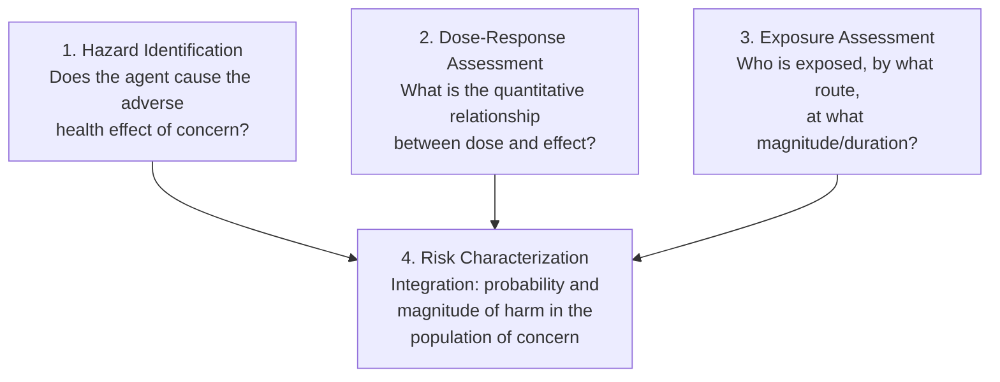
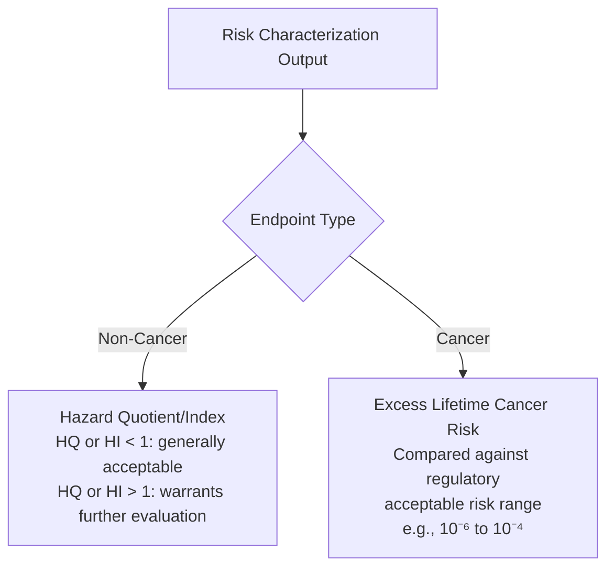

## Human Health Risk Assessment

### Definition and Purpose

Human Health Risk Assessment (HHRA) is the structured, systematic process of characterizing the nature and magnitude of health risks to human populations from exposure to environmental hazards, integrating toxicological dose-response data, exposure science, and epidemiological evidence into a quantitative or semi-quantitative estimate of risk used to inform regulatory decisions, remediation standards, and public health policy.

### The Four-Step Risk Assessment Framework (US EPA / National Research Council Paradigm)

Formalized in the 1983 National Research Council "Red Book" and widely adopted internationally as the standard organizing structure for human health risk assessment:

**Key Points**

- This framework deliberately separates the scientific/technical components (hazard identification, dose-response, exposure assessment) from risk characterization, and both are formally distinguished from risk management (the subsequent policy decision-making process informed by, but conceptually separate from, the risk assessment itself) — a separation intended to keep the scientific risk assessment process transparent and distinct from the value-laden policy tradeoffs involved in risk management decisions.

### Step 1: Hazard Identification

Determines whether a substance or agent is capable of causing a specific adverse health effect, and under what conditions, based on available toxicological (animal, in vitro, mechanistic) and epidemiological evidence.

**Weight-of-Evidence Approach**: Since no single study is typically definitive, hazard identification synthesizes multiple evidence streams — animal bioassay data, mechanistic/mode-of-action data, structure-activity relationships, and human epidemiological data where available — into an overall hazard characterization.

**Standardized Classification Systems**:

- **IARC (International Agency for Research on Cancer) Carcinogen Classifications**: Group 1 (carcinogenic to humans), Group 2A (probably carcinogenic to humans), Group 2B (possibly carcinogenic to humans), Group 3 (not classifiable), with a discontinued Group 4 (probably not carcinogenic) category
- **US EPA Cancer Guidelines descriptors**: Similar framework using descriptors such as "carcinogenic to humans," "likely to be carcinogenic to humans," "suggestive evidence," "inadequate information," and "not likely to be carcinogenic to humans"

**Key Points**

- IARC classifications specifically reflect the strength/weight of evidence that an agent can cause cancer under some exposure circumstance, and explicitly do NOT indicate the magnitude of risk at typical or real-world exposure levels — a frequently misunderstood distinction, since a Group 1 classification means the evidence for carcinogenic hazard is strong, not necessarily that typical exposure levels pose substantial risk. This distinction between hazard identification (can it cause harm) and risk characterization (how much harm, at what exposure) is fundamental to correctly interpreting these classifications.

### Step 2: Dose-Response Assessment

Quantifies the relationship between administered/exposure dose and the probability or severity of the adverse effect, drawing on toxicological dose-response principles (NOAEL, LOAEL, benchmark dose modeling) to derive quantitative toxicity values used in risk calculation.

**Non-Cancer Toxicity Values**:

$$\text{Reference Dose (RfD)} = \frac{\text{NOAEL or Benchmark Dose}}{\text{Composite Uncertainty Factor}}$$

Expressed typically in mg/kg-body weight/day, representing an estimated daily oral exposure considered to be without appreciable risk of adverse effects over a lifetime.

**Reference Concentration (RfC)**: Analogous inhalation-route toxicity value, expressed as an airborne concentration.

**Cancer Toxicity Values**:

$$\text{Slope Factor (SF)} = \frac{\text{Excess lifetime cancer risk}}{\text{Dose (mg/kg-day)}}$$

Derived typically from linear extrapolation (consistent with the LNT model applied to genotoxic carcinogens) from the observed dose-response range down to low environmental exposure levels, used to estimate excess cancer risk at a given exposure dose.

$$\text{Excess Lifetime Cancer Risk} = \text{Dose} \times \text{Slope Factor}$$

### Step 3: Exposure Assessment

Characterizes the exposed population, exposure pathways/routes, exposure frequency and duration, and exposure magnitude, integrating environmental concentration data with human behavior/activity pattern assumptions.

**Standard Exposure Equation (Chronic Daily Intake)**:

$$\text{CDI} = \frac{C \times IR \times EF \times ED}{BW \times AT}$$

Where:

- $C$ = contaminant concentration in the exposure medium
- $IR$ = intake rate (e.g., water consumption rate, food consumption rate, inhalation rate)
- $EF$ = exposure frequency (days/year)
- $ED$ = exposure duration (years)
- $BW$ = body weight
- $AT$ = averaging time (for non-cancer effects, typically equal to exposure duration; for cancer effects, typically averaged over a full assumed lifetime, e.g., 70 years, reflecting the LNT model's assumption that cancer risk should be averaged across the entire lifetime regardless of the actual exposure period)

**Key Points**

- The distinction in averaging time between cancer and non-cancer risk calculations is a frequently misunderstood but important technical detail: non-cancer risk is evaluated against exposure occurring during the actual exposure period (since non-cancer effects are generally assumed to require ongoing/threshold exposure), while cancer risk from even a shorter exposure duration is conventionally averaged across an entire assumed lifetime (reflecting the LNT assumption that any dose contributes some incremental lifetime risk regardless of when during life it occurred).

**Exposure Assumptions and Receptor Scenarios**: Risk assessments typically define specific exposure scenarios (e.g., residential, occupational, recreational) with standardized or site-specific assumptions for intake rates, exposure frequency, and duration, often distinguishing between:

- **Central tendency exposure (CTE)**: Represents typical/average exposure conditions
- **Reasonable maximum exposure (RME)**: Represents a conservative, higher-end but still plausible exposure scenario, intentionally designed to be protective of more highly exposed individuals within a population rather than representing an impossible worst-case

### Step 4: Risk Characterization

Integrates dose-response and exposure assessment outputs into quantitative risk estimates, distinguishing methodology for non-cancer versus cancer endpoints.

**Non-Cancer Risk: The Hazard Quotient**

$$\text{Hazard Quotient (HQ)} = \frac{\text{Exposure (CDI)}}{\text{RfD (or RfC)}}$$

An HQ below 1 is generally interpreted as indicating exposure is below a level expected to cause appreciable adverse effects (given the built-in uncertainty factors in RfD derivation); an HQ above 1 does not necessarily indicate that adverse effects will occur, but indicates the exposure exceeds the level considered protective with the standard built-in margin of safety, warranting further evaluation.

**Hazard Index (HI)**: For multiple substances affecting the same target organ/system via a common mechanism, individual HQs are summed to assess potential cumulative/additive non-cancer risk:

$$\text{Hazard Index (HI)} = \sum \text{HQ}_i$$

**Cancer Risk**

$$\text{Excess Lifetime Cancer Risk} = \text{CDI} \times \text{Slope Factor}$$

Regulatory agencies commonly apply an acceptable/target excess lifetime cancer risk range for site remediation and regulatory decision-making, frequently cited in the range of $10^{-6}$ to $10^{-4}$ (one in a million to one in ten thousand excess cancer cases) depending on jurisdiction and specific regulatory program — representing a risk management policy judgment about acceptable residual risk rather than a scientifically derived "safe" threshold per se, since the underlying LNT model assumes no exposure level is entirely risk-free. [Unverified — specific acceptable risk range figures and their application vary meaningfully by jurisdiction, regulatory program, and site-specific context; verify against the specific regulatory framework being applied for precise figures]

### Uncertainty and Variability in Risk Assessment

**Uncertainty**: Reflects lack of knowledge or imprecision in the risk assessment process itself (e.g., limited toxicological data requiring extrapolation, measurement error, model assumptions) — theoretically reducible with additional data or improved methods.

**Variability**: Reflects genuine, inherent heterogeneity in the population or system being assessed (e.g., natural variation in individual body weight, intake rates, or susceptibility) — not reducible by additional data, but can be more precisely characterized and quantified.

**Sensitivity Analysis**: A standard technique for identifying which input parameters most strongly influence the final risk estimate, helping prioritize where additional data collection or more precise characterization would most improve the reliability of the assessment.

**Probabilistic (Monte Carlo) Risk Assessment**: An alternative to standard deterministic (point-estimate) risk assessment, using probability distributions for key input parameters (rather than single point values) to generate a full distribution of possible risk estimates rather than a single number, providing a more complete characterization of the uncertainty and variability inherent in the assessment, and increasingly used as a supplementary or advanced approach in regulatory risk assessment practice. [Inference — probabilistic risk assessment methodology is well-established and documented in EPA guidance as a recognized advanced approach; its degree of routine adoption relative to deterministic point-estimate methods varies by regulatory program and jurisdiction]

**Key Points**

- Distinguishing uncertainty from variability is methodologically important because they call for different responses: uncertainty is addressed by improving data quality/quantity or refining models, while variability is addressed by appropriately characterizing the distribution of exposure/susceptibility across the population (e.g., through percentile-based exposure assumptions) rather than attempting to "reduce" it, since it reflects genuine biological/behavioral diversity rather than a knowledge gap.

### Vulnerable and Susceptible Populations

Risk assessment increasingly incorporates specific consideration of populations with heightened susceptibility or exposure, recognizing that default adult-based assumptions may not be protective for all population subgroups:

- **Children**: Higher intake rates relative to body weight (e.g., higher food/water/air consumption per kg body weight), ongoing developmental processes creating windows of heightened vulnerability, and behavioral factors (hand-to-mouth activity, time spent outdoors/on the ground) that can increase certain exposure pathways
- **Pregnant individuals and developing fetuses**: Critical windows of developmental susceptibility, and the capacity of certain substances to cross the placental barrier
- **Elderly populations**: Potentially reduced physiological reserve/compensatory capacity and higher prevalence of pre-existing conditions that may increase susceptibility to certain exposures
- **Populations with pre-existing health conditions**: E.g., individuals with pre-existing respiratory disease may experience health effects from air pollution exposure at lower thresholds than the general population
- **Occupationally exposed populations**: Generally experience higher-magnitude exposures than the general population, warranting distinct occupational exposure limit frameworks (though occupational standards are typically set with different underlying risk tolerance assumptions than general population environmental standards, reflecting the voluntary and compensated nature of occupational exposure)

**Cumulative Risk Assessment**: An evolving methodological area addressing the reality that vulnerable populations often experience combined chemical exposures alongside non-chemical stressors (socioeconomic stress, inadequate healthcare access, other environmental burdens), which may interact to increase overall population vulnerability beyond what chemical-specific risk assessment alone would predict — an area of active methodological development in environmental justice-informed risk assessment approaches. [Inference — cumulative risk assessment incorporating non-chemical stressors is a documented and actively developing area within EPA and broader risk assessment methodology literature, reflecting ongoing evolution in the field rather than a single settled standard methodology]

### Ecological Risk Assessment (Brief Distinction)

While this entry focuses on human health risk assessment, it is worth distinguishing it from Ecological Risk Assessment (ERA), which follows a broadly parallel but methodologically distinct framework applied to non-human receptors (wildlife populations, ecological communities), using different endpoints (population/community-level effects rather than individual human health outcomes) and different exposure/effects assessment tools (e.g., Species Sensitivity Distributions, discussed under toxicology principles).

### Risk Communication

An often under-emphasized but critical component of the overall risk assessment/management process: translating quantitative risk findings into information that is accurate, appropriately contextualized, and genuinely useful for affected communities and decision-makers, addressing common challenges such as public difficulty interpreting small probabilistic risk figures (e.g., $10^{-6}$ risk) and the tendency for risk perception to be influenced by factors beyond the quantitative magnitude alone (e.g., voluntariness of exposure, familiarity, perceived control) — a well-documented phenomenon in risk perception research distinct from the technical risk assessment calculation itself.

### Regulatory Application Examples

**Superfund/Contaminated Site Remediation**: HHRA is the standard methodological basis for determining site-specific cleanup levels under frameworks such as the US EPA Superfund program, where calculated risk estimates (HQ/HI for non-cancer, excess lifetime cancer risk for carcinogens) are compared against regulatory acceptable risk ranges to determine whether remediation is required and to what residual contamination level.

**Ambient Air Quality and Water Quality Standard-Setting**: Regulatory exposure limits (e.g., National Ambient Air Quality Standards, Maximum Contaminant Levels for drinking water) are derived using HHRA methodology, integrating toxicity values with population exposure assumptions to establish concentration limits intended to be protective of public health, generally incorporating margins of safety for sensitive subpopulations.

**Chemical Registration and Regulation**: New and existing chemical evaluation frameworks (e.g., under TSCA in the US, REACH in the EU) apply HHRA methodology to evaluate and restrict chemicals based on characterized risk to human health.

### Conclusion

Human Health Risk Assessment provides the standardized methodological bridge between toxicological and epidemiological science and regulatory/public health decision-making, formalized through the four-step hazard identification, dose-response assessment, exposure assessment, and risk characterization framework. Its outputs — hazard quotients/indices for non-cancer effects and excess lifetime cancer risk estimates for carcinogens — translate complex, multi-source scientific evidence into standardized metrics that regulatory bodies can consistently apply across diverse chemical and site-specific contexts. The framework's built-in conservatism (uncertainty factors, reasonable maximum exposure assumptions, linear low-dose cancer extrapolation) reflects a deliberate risk management policy choice to be protective of vulnerable populations under scientific uncertainty, though this same conservatism means individual risk estimates should be interpreted as protective regulatory benchmarks rather than precise predictions of actual individual harm. Ongoing methodological evolution — particularly toward probabilistic risk assessment, cumulative risk assessment incorporating non-chemical stressors, and more precise treatment of susceptible population variability — reflects the field's continuing effort to more accurately characterize real-world risk heterogeneity beyond the traditional deterministic, single-chemical assessment paradigm.

**Related Topics**

- Principles of Environmental Toxicology (dose-response foundation)
- Routes of Exposure and Dose-Response Relationships (exposure assessment foundation)
- Environmental Epidemiology (hazard identification evidence source)
- Ecological Risk Assessment and Species Sensitivity Distributions
- Environmental Justice and cumulative risk assessment
- Superfund/contaminated site remediation frameworks
- Regulatory chemical evaluation (TSCA, REACH)