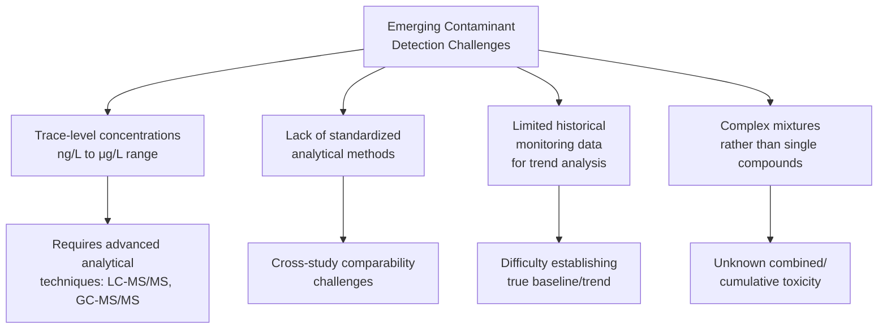

## Emerging Contaminants and Health Effects

### Definition and Scope

Emerging contaminants (also termed "contaminants of emerging concern," CECs) are substances newly identified, newly regulated, or increasingly detected in the environment due to improved analytical detection capability, changing use patterns, or evolving scientific understanding of their health/ecological effects — as distinct from "legacy" contaminants (e.g., lead, DDT, PCBs) that have been studied and regulated for decades. The category is inherently dynamic: a contaminant's "emerging" status typically reflects the current state of scientific and regulatory attention rather than a fixed chemical property, and substances migrate out of this category over time as evidence and regulation mature.

### Major Categories of Emerging Contaminants

#### Per- and Polyfluoroalkyl Substances (PFAS)

**Chemistry**: A large class (comprising thousands of individual compounds) characterized by carbon-fluorine bonds, among the strongest bonds in organic chemistry, conferring exceptional environmental persistence — the basis for the common descriptor "forever chemicals."

**Uses**: Non-stick cookware coatings, water/stain-resistant textile treatments, firefighting foams (aqueous film-forming foam, AFFF), food packaging, industrial surfactants.

**Key Compounds**: PFOA (perfluorooctanoic acid) and PFOS (perfluorooctane sulfonic acid) are the most extensively studied and regulated, alongside newer-generation replacement compounds such as GenX (HFPO-DA), developed partly in response to phase-outs of PFOA/PFOS but themselves now subject to ongoing health and regulatory evaluation.

**Health Effects**: Associated in the epidemiological and toxicological literature with immune system effects (including reduced vaccine antibody response), developmental effects, liver effects, elevated cholesterol, and some cancers (notably kidney and testicular cancer for specific compounds), based on a combination of occupational cohort studies, community exposure studies (e.g., the C8 Health Project following the Mid-Ohio Valley PFOA exposure), and toxicological data.

**Regulatory Status (US, current as of mid-2026)**: This is an actively evolving regulatory area requiring careful attention to current status rather than treating any single figure as fixed.

I'll present the verified current regulatory timeline directly, since this area has changed significantly and repeatedly over the past two years.

In April 2024, the US EPA finalized the first-ever federal drinking water standards for PFAS, setting legally enforceable Maximum Contaminant Levels (MCLs) of 4 parts per trillion (ppt) each for PFOA and PFOS, 10 ppt each for PFHxS, PFNA, and HFPO-DA (GenX), and a Hazard Index of 1 for combinations of PFHxS, PFNA, HFPO-DA, and PFBS — the first time EPA had used a Hazard Index as a regulatory drinking water standard. However, this regulation has since been substantially revised: in May 2025, EPA announced it would retain the PFOA and PFOS MCLs but move to rescind the MCLs and Hazard Index standard for PFHxS, PFNA, HFPO-DA, and PFBS, while also extending the compliance deadline for utilities from 2029 to 2031. As of May 2026, EPA has formally proposed two rules reflecting this approach — one rescinding the PFHxS/PFNA/HFPO-DA/Hazard Index standards, and one extending PFOA/PFOS compliance deadlines to 2031 — with public comment periods and a hearing scheduled through July 2026, meaning this regulatory picture remains actively in flux and litigation (American Water Works Association et al. v. EPA) is ongoing in parallel. Readers should verify current status against EPA's official PFAS drinking water regulation page or the linked regulatory tracker sources, given the pace of change in this specific area.

**Key Points**

- This regulatory trajectory (finalize stringent standard → retain some provisions, rescind others → extend compliance timelines → ongoing litigation) illustrates a broader pattern common to emerging contaminant regulation generally: standards are frequently revised as new administrations, litigation outcomes, and evolving toxicological/exposure data reshape the regulatory landscape, making "current as of a specific date" framing essential rather than treating any snapshot as permanent.

#### Pharmaceuticals and Personal Care Products (PPCPs)

**Sources**: Human and veterinary drug excretion, improper disposal, and manufacturing/hospital effluent, entering aquatic systems primarily via wastewater treatment plant effluent (since conventional treatment processes were not designed to remove many pharmaceutical compounds).

**Detected Compound Classes**: Antibiotics, hormones (natural and synthetic, including from oral contraceptives), analgesics/NSAIDs, antidepressants, and other prescription and over-the-counter medications, typically detected at trace (ng/L to low μg/L) concentrations in surface water and, less commonly, drinking water sources.

**Ecological Effects**:

- **Endocrine disruption in aquatic organisms**: Synthetic estrogens (e.g., ethinylestradiol from oral contraceptives) have been documented in research to cause feminization effects in exposed fish populations at environmentally relevant concentrations, a well-studied example in aquatic ecotoxicology
- **Antibiotic resistance selection pressure**: Sub-therapeutic antibiotic concentrations in aquatic environments are of concern as a potential contributor to environmental antibiotic resistance gene selection and transfer, an active area of environmental microbiology research [Inference — the mechanism (sub-lethal antibiotic exposure exerting selective pressure) is well-established microbiology; the magnitude of environmental contribution relative to clinical/agricultural antibiotic use as a driver of resistance is an actively researched and debated relative contribution question]

**Human Health Relevance**: Trace pharmaceutical concentrations in drinking water are generally many orders of magnitude below therapeutic doses; current scientific consensus (as reflected in WHO and similar assessments) generally characterizes direct human health risk from trace environmental pharmaceutical exposure via drinking water as low based on current data, while acknowledging that chronic low-dose mixture effects and specific vulnerable population considerations remain areas of ongoing research rather than fully closed questions. [Inference — reflects general regulatory/scientific body characterization in published assessments; should not be read as a categorical dismissal of any possible effect, particularly regarding mixture/cumulative exposure]

#### Microplastics and Nanoplastics

Covered in detail in the "Plastics Pollution and Microplastics" topic; included here as a cross-cutting emerging contaminant category due to increasing detection across drinking water, food, and human tissue, and rapidly evolving toxicological and human health research (see prior chapter entry for detailed coverage, including 2025 findings on brain tissue accumulation).

#### Endocrine-Disrupting Chemicals (EDCs) — Broader Category

Beyond PFAS and pharmaceutical hormones, this broader category includes:

- **Bisphenol A (BPA) and structural analogs (BPS, BPF)**: Used in polycarbonate plastics and epoxy resins; associated with endocrine disruption via estrogen receptor interaction, with regulatory restrictions on BPA in certain applications (e.g., baby bottles) in multiple jurisdictions, alongside ongoing evaluation of "regrettable substitution" concerns regarding structural analogs used as BPA replacements that may share similar mechanisms of concern [Inference — regrettable substitution is a recognized concept in the EDC literature; the degree to which specific BPA analogs pose comparable risk is compound-specific and an active area of comparative toxicological research]
- **Phthalates**: Plasticizers used to increase flexibility in PVC and other plastics; associated with reproductive and developmental effects in toxicological studies, with regulatory restrictions on specific phthalates in certain consumer products (notably children's products) in multiple jurisdictions

#### Microcystins and Cyanotoxins (Harmful Algal Bloom Toxins)

**Source**: Produced by cyanobacteria (blue-green algae) during harmful algal blooms (HABs), which are increasing in frequency and geographic extent, associated with nutrient pollution (eutrophication, particularly nitrogen and phosphorus loading from agricultural runoff) combined with warming water temperatures.

**Health Effects**: Microcystins are hepatotoxic (liver-toxic); other cyanotoxin classes include neurotoxins; exposure occurs via contaminated drinking water sources, recreational water contact, and in some documented cases, contaminated dialysis water (a notable historical case being the 1996 Caruaru, Brazil dialysis center incident, in which cyanotoxin-contaminated water used in dialysis treatment resulted in numerous patient deaths, remaining a significant historical case study in water treatment and cyanotoxin health effects literature).

**Regulatory Response**: Growing number of jurisdictions establishing drinking water health advisories or standards for microcystins and other cyanotoxins, reflecting the emerging/increasing-concern status of this contaminant category.

#### Antibiotic Resistance Genes and Antimicrobial Resistance (AMR) as an Environmental Contaminant Concern

An increasingly recognized "contaminant" category distinct from traditional chemical contaminants: environmental reservoirs (wastewater, agricultural runoff, hospital effluent) can harbor and potentially disseminate antibiotic-resistant bacteria and resistance genes, framed by WHO and other bodies as a One Health concern connecting environmental, agricultural, and clinical antimicrobial resistance dynamics.

### Detection Challenges Common Across Emerging Contaminants

**Analytical Methods**: Detection of emerging contaminants at environmentally relevant trace concentrations generally requires advanced analytical chemistry techniques, most commonly liquid chromatography-tandem mass spectrometry (LC-MS/MS) for many pharmaceuticals and PFAS, and gas chromatography-mass spectrometry (GC-MS) variants for certain other compound classes — techniques capable of detecting and identifying compounds at parts-per-trillion to parts-per-billion concentrations, a capability that has itself substantially expanded in recent decades and directly contributed to the "emergence" of many contaminants that were previously present but below prior detection limits.

**Key Points**

- A significant portion of what is termed "emerging" contamination reflects improved analytical detection capability revealing contaminants that were very likely present at similar environmental concentrations previously, rather than solely reflecting genuinely new environmental releases — an important nuance distinguishing analytically-driven emergence from truly novel contamination sources (such as genuinely new industrial chemicals).

### Regulatory Frameworks for Emerging Contaminant Identification

**US EPA Contaminant Candidate List (CCL)**: A list of contaminants not currently subject to national primary drinking water regulations but known or anticipated to occur in public water systems, used to prioritize contaminants for potential future regulatory determination and standard-setting — the formal regulatory mechanism through which emerging contaminants are systematically evaluated for potential future regulation under the Safe Drinking Water Act.

**Unregulated Contaminant Monitoring Rule (UCMR)**: Requires periodic monitoring of select unregulated contaminants across US public water systems to generate national occurrence data, informing future regulatory determinations — a key data-generation mechanism supporting the broader emerging contaminant regulatory pipeline.

**EU REACH and Watch List Mechanisms**: The EU's REACH regulation and complementary Water Framework Directive "Watch List" mechanism serve analogous functions, systematically identifying and monitoring substances of emerging concern to inform future regulatory action.

### Weight-of-Evidence Challenges Specific to Emerging Contaminants

**Key Points**

- Emerging contaminants by definition often have less mature toxicological and epidemiological evidence bases than legacy contaminants, meaning risk characterization frequently involves greater inherent uncertainty, more reliance on animal/mechanistic data pending human epidemiological confirmation, and correspondingly more contested or evolving regulatory positions — this is a structural feature of the "emerging" category itself rather than a flaw in any specific assessment, and explains why regulatory standards for emerging contaminants (as illustrated by the PFAS drinking water regulatory history above) tend to be revised more frequently than standards for well-established legacy contaminants as new evidence accumulates.

### Conclusion

Emerging contaminants represent a structurally distinct category within environmental health and toxicology, defined less by a shared chemical mechanism than by their position at the frontier of current scientific and regulatory attention — spanning per- and polyfluoroalkyl substances, pharmaceuticals and personal care products, microplastics/nanoplastics, broader endocrine-disrupting chemicals, cyanotoxins, and antimicrobial resistance determinants. Their common thread is a combination of trace-level environmental occurrence, evolving analytical detection capability, and comparatively immature (though rapidly developing) toxicological and epidemiological evidence bases relative to legacy contaminants. This immaturity translates directly into regulatory volatility, as clearly illustrated by the US PFAS drinking water standard's substantial revision within roughly a year of its original 2024 finalization — underscoring that "emerging contaminant" status is inherently a moving target requiring ongoing attention to current regulatory and scientific developments rather than treatment as a fixed body of settled knowledge.

**Related Topics**

- Principles of Environmental Toxicology (dose-response foundation for emerging contaminant evaluation)
- Environmental Epidemiology (evidence generation for emerging contaminant health effects)
- Human Health Risk Assessment (regulatory framework applying emerging contaminant data)
- Plastics Pollution and Microplastics (detailed coverage of this specific emerging contaminant category)
- Water Quality Standards and Contaminant Regulation
- Endocrine Disruption and Non-Monotonic Dose-Response
- Antimicrobial Resistance and One Health frameworks
- Harmful Algal Blooms and Eutrophication