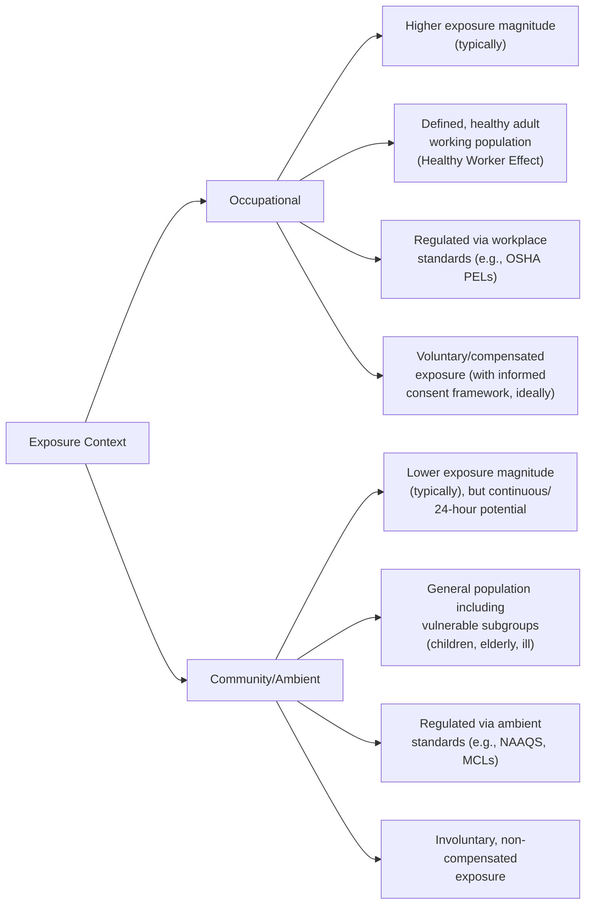
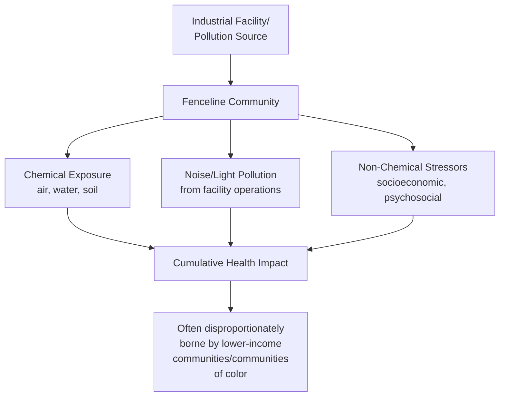
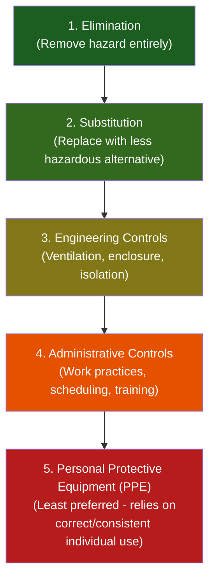

## Occupational and Community Environmental Hazards

### Definition and Scope

Occupational and community environmental hazards encompass two overlapping but analytically distinct exposure contexts: occupational hazards, arising from workplace-specific chemical, physical, biological, and ergonomic agents encountered as a condition of employment; and community (ambient/residential) hazards, arising from environmental exposures affecting the general public in residential, recreational, and non-occupational settings. Both fall within the broader field of environmental and occupational health, sharing common toxicological and epidemiological methodology while differing substantially in exposure magnitude, regulatory framework, exposed population characteristics, and risk tolerance assumptions.

### Occupational vs. Community Exposure: Key Distinctions

**Key Points**

- These distinctions directly justify why occupational exposure limits (OELs) are generally set at higher permissible concentrations than corresponding ambient/community standards for the same substance: occupational standards assume a defined, generally healthier working-age population with limited daily exposure duration (typically an 8-hour workday, 40-hour workweek) and an implicit voluntary/compensated exposure framework, whereas community standards must be protective of a full population range including children, elderly, and individuals with pre-existing conditions, under continuous (potentially 24-hour) exposure assumptions, and without the informed-consent/compensation framework theoretically underlying occupational exposure.
- The "Healthy Worker Effect" is a recognized epidemiological phenomenon in occupational health research: since employed populations are, by the nature of employment screening and job retention, generally healthier than the general population (which includes those too ill to work), simple worker-vs-general-population health comparisons can understate the true health impact of an occupational exposure unless appropriately adjusted for in study design.

### Occupational Hazard Categories

#### Chemical Hazards

- **Solvents**: Organic solvents (e.g., toluene, trichloroethylene) with neurotoxic, hepatotoxic, and in some cases carcinogenic potential via inhalation and dermal exposure routes
- **Heavy metals**: Occupational lead, cadmium, and mercury exposure in specific industries (battery manufacturing, smelting, certain manufacturing processes)
- **Respiratory sensitizers and irritants**: Isocyanates, formaldehyde, and various industrial chemicals capable of inducing occupational asthma or chronic respiratory irritation
- **Carcinogens**: Asbestos, certain solvents (e.g., benzene), and specific industrial process byproducts with established occupational carcinogenic classification

#### Physical Hazards

- **Noise**: Occupational noise-induced hearing loss remains one of the most prevalent occupational health conditions globally, addressed through hearing conservation programs and exposure limits (covered in detail under "Noise and Light Pollution")
- **Ionizing radiation**: Relevant in healthcare (medical imaging, radiotherapy), nuclear industry, and certain research/industrial settings, governed by dose-limit frameworks (e.g., ALARA — As Low As Reasonably Achievable — principle)
- **Vibration**: Whole-body and hand-arm vibration exposure, associated with musculoskeletal and vascular effects (e.g., hand-arm vibration syndrome) in operators of certain machinery and tools
- **Thermal stress**: Heat stress in outdoor and certain industrial occupations, an area of growing occupational health regulatory attention given rising ambient temperatures; cold stress in certain occupational contexts

#### Biological Hazards

- **Bloodborne pathogens**: Relevant primarily in healthcare occupational settings
- **Bioaerosols**: Mold, bacteria, and other biological agents in certain occupational environments (agriculture, waste management, healthcare)
- **Zoonotic disease exposure**: Relevant in agricultural, veterinary, and certain laboratory occupational contexts

#### Ergonomic Hazards

Musculoskeletal strain from repetitive motion, awkward posture, or excessive physical load — while sometimes categorized separately from "environmental" hazards in strict taxonomies, ergonomic hazards are conventionally included within comprehensive occupational health frameworks given their substantial contribution to overall occupational disease/injury burden.

### Occupational Exposure Limit Framework

**Permissible Exposure Limits (PELs)**: Legally enforceable occupational exposure limits (in the US, established and enforced by OSHA), specifying maximum allowable airborne concentration of a substance, typically expressed as an 8-hour time-weighted average (TWA).

**Threshold Limit Values (TLVs)**: Non-regulatory, science-based occupational exposure guideline values developed by the American Conference of Governmental Industrial Hygienists (ACIGH), frequently more current and more health-protective than legally enforceable PELs (a widely recognized gap in current US occupational regulation, since PELs for many substances have not been updated in decades despite evolving toxicological understanding).

**Short-Term Exposure Limits (STELs)**: Maximum allowable concentration for brief exposure periods (typically 15 minutes), addressing substances with acute effects at high short-duration concentrations even where the 8-hour TWA might otherwise be acceptable.

**Ceiling Limits**: A concentration that must never be exceeded at any point during exposure, applied to substances with especially rapid-onset or severe acute toxicity.

$$\text{TWA} = \frac{\sum (C_i \times T_i)}{8 \text{ hours}}$$

Where $C_i$ is the concentration during time period $i$ and $T_i$ is the duration of that period, reflecting that occupational exposure limits generally account for exposure concentration integrated over the full workday rather than instantaneous concentration alone (except where ceiling or STEL limits specifically apply).

**Key Points**

- The gap between legally enforceable OSHA PELs (many dating to standards adopted in 1971 and not substantially updated since for a large number of substances) and more current ACGIH TLVs is a well-documented and frequently cited limitation of the current US occupational exposure regulatory framework, meaning legal compliance with a PEL does not necessarily indicate current best-available scientific protection for worker health — a distinction important for accurately characterizing occupational hazard regulation as it actually operates rather than assuming legal limits automatically reflect current science. [Inference — this gap and its general characterization is well-documented in occupational health literature and government accountability reporting; specific substance-by-substance currency should be verified for precise technical or regulatory application]

### Community/Ambient Environmental Hazard Categories

#### Air Quality

Ambient air pollution from industrial sources, transportation corridors, and other community-adjacent emission sources, regulated in the US via National Ambient Air Quality Standards (NAAQS) for criteria pollutants (particulate matter, ozone, carbon monoxide, sulfur dioxide, nitrogen dioxide, lead), and via separate hazardous air pollutant (HAP) regulatory frameworks for specific toxic air contaminants.

#### Water Quality

Drinking water contamination from source water quality issues, distribution system contamination (e.g., lead service lines), or inadequate treatment, regulated via Maximum Contaminant Levels (MCLs) under frameworks such as the US Safe Drinking Water Act.

#### Soil Contamination

Contaminated sites (including former industrial sites, "brownfields," and legacy contamination from historical industrial or waste disposal activity) posing exposure risk via direct contact, incidental ingestion (particularly relevant for children), and vapor intrusion into overlying structures — addressed through site remediation frameworks such as the US Superfund program.

#### Proximity-Based Hazards

Community exposure resulting from residential proximity to hazard sources: industrial facilities, major roadways (traffic-related air pollution), waste disposal/processing facilities, and other locally undesirable land uses — a category with particularly strong documented linkage to environmental justice concerns given well-documented patterns of disproportionate siting of such facilities near lower-income communities and communities of color.

### Community Health Impact Assessment: Fenceline Communities

"Fenceline communities" is a term used in environmental health and environmental justice literature to describe communities located immediately adjacent to industrial facilities, ports, or other significant pollution sources, and subject to correspondingly elevated cumulative exposure from that proximity, often compounded by exposure to multiple co-located sources and pre-existing socioeconomic and health vulnerabilities.

**Key Points**

- Cumulative impact assessment for fenceline and other community-hazard-proximate populations increasingly incorporates non-chemical stressors (socioeconomic stress, limited healthcare access) alongside chemical exposure data, recognizing that combined chemical and non-chemical burden may produce greater population-level health impact than chemical exposure assessment alone would predict — reflecting the same methodological evolution toward cumulative risk assessment discussed under Human Health Risk Assessment, applied specifically to the community/proximity hazard context.

### Regulatory Frameworks Comparison

| Framework Dimension | Occupational | Community/Ambient |
| --- | --- | --- |
| Primary US regulatory body | OSHA (Occupational Safety and Health Administration) | EPA (Environmental Protection Agency) |
| Key exposure limit type | PEL (Permissible Exposure Limit), TLV (guideline) | NAAQS, MCL, RfD-derived standards |
| Typical averaging period | 8-hour TWA (workday) | 24-hour, annual, or lifetime averaging depending on standard |
| Population basis | Healthy working-age adults | Full population including sensitive subgroups |
| Underlying exposure model | Assumed voluntary/compensated | Assumed involuntary |
| Enforcement mechanism | Workplace inspection, citation | Facility permitting, monitoring, enforcement action |

### Right-to-Know and Community Disclosure Frameworks

**Occupational Context — Hazard Communication Standard (HCS)**: Requires employers to inform workers of chemical hazards present in the workplace via labeling, Safety Data Sheets (SDS), and training, establishing a baseline worker right-to-know framework.

**Community Context — Emergency Planning and Community Right-to-Know Act (EPCRA) / Toxics Release Inventory (TRI)**: Requires certain facilities to publicly report releases of specified toxic chemicals, providing a community-level right-to-know mechanism analogous in principle to workplace hazard communication, enabling public and researcher access to facility-level chemical release data as a foundation for both regulatory oversight and community-level environmental health research (including much of the fenceline community and environmental justice research base).

### Prevention and Control Hierarchy (Occupational Context, Applicable by Analogy to Community Hazards)

The occupational hygiene "hierarchy of controls" is a foundational framework for hazard mitigation prioritization, broadly analogous in structure to the waste management hierarchy discussed elsewhere in this curriculum:

**Key Points**

- This hierarchy reflects a general principle applicable across both occupational and community hazard mitigation contexts: interventions that eliminate or reduce hazard at the source are inherently more reliable than interventions relying on ongoing individual behavior or protective equipment use, since source-level controls do not depend on consistent correct implementation by every exposed individual — PPE is positioned as the least preferred control specifically because its effectiveness depends entirely on correct, consistent use, proper fit, and maintenance, introducing failure points absent from source-level controls.

### Philippine Context

Occupational safety and health in the Philippines is governed primarily by Republic Act No. 11058 (An Act Strengthening Compliance with Occupational Safety and Health Standards), implemented alongside the Occupational Safety and Health Standards issued by the Department of Labor and Employment (DOLE). Community environmental hazard regulation operates through frameworks including the Philippine Clean Air Act (RA 8749) and Clean Water Act (RA 9275), alongside the environmental impact assessment system administered by DENR for hazard-generating projects and facilities. [Unverified — specific implementing regulations, updated standards, and current enforcement mechanisms should be verified against current DOLE/DENR issuances, as this reflects general regulatory framework structure rather than a comprehensive current compliance reference]

### Conclusion

Occupational and community environmental hazards represent two structurally related but analytically distinct domains within environmental health, sharing common toxicological foundations (dose-response, routes of exposure) while differing substantially in exposure population, regulatory philosophy, and risk tolerance framework — reflected concretely in the systematic gap between occupational exposure limits and community ambient standards for the same substances. Both domains increasingly converge on common methodological priorities: cumulative and mixture exposure assessment, attention to vulnerable subpopulations, and right-to-know/disclosure frameworks that enable both regulatory oversight and independent community and research-based hazard characterization. The hierarchy of controls framework, while originating in occupational hygiene, offers a broadly transferable prioritization logic applicable to community hazard mitigation as well — reinforcing that source-level elimination and substitution consistently outperform downstream protective or behavioral interventions across both exposure contexts.

**Related Topics**

- Principles of Environmental Toxicology (shared dose-response foundation)
- Human Health Risk Assessment (shared risk characterization methodology)
- Environmental Epidemiology (Healthy Worker Effect and occupational cohort study design)
- Noise and Light Pollution (occupational and community noise exposure)
- Environmental Justice and cumulative risk assessment
- Emerging Contaminants and Health Effects (occupational exposure pathways for PFAS, solvents)
- Superfund/contaminated site remediation and community proximity hazards