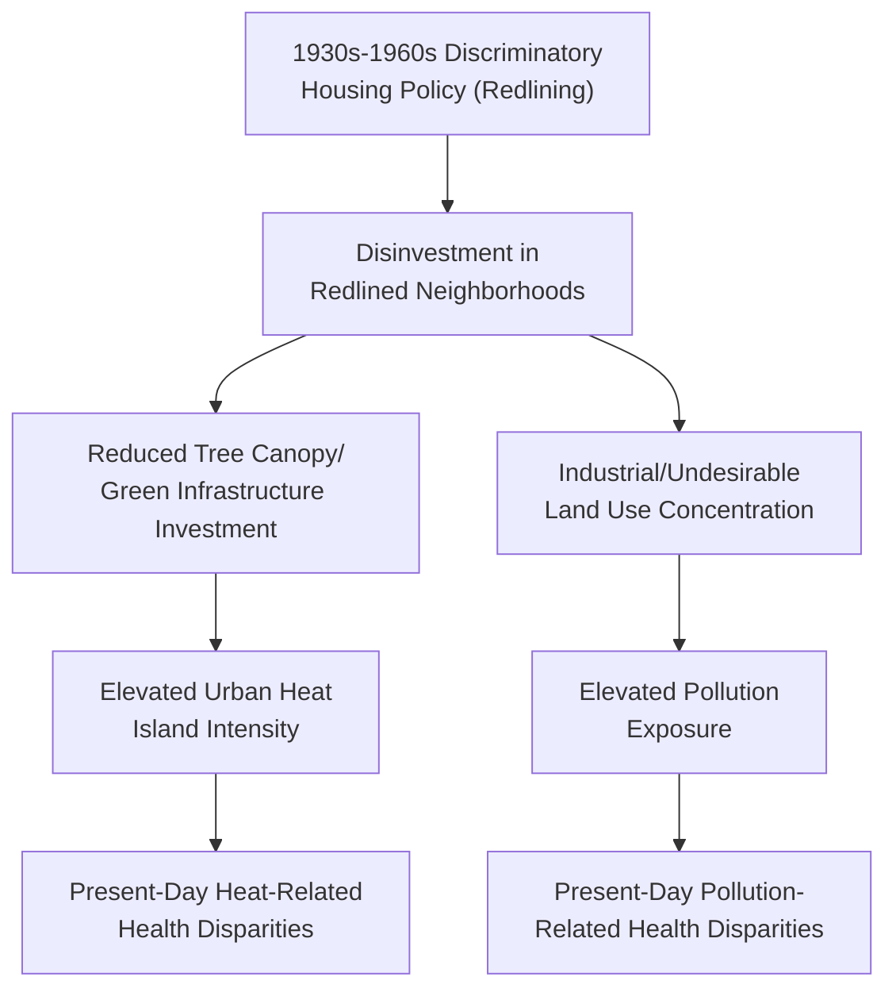
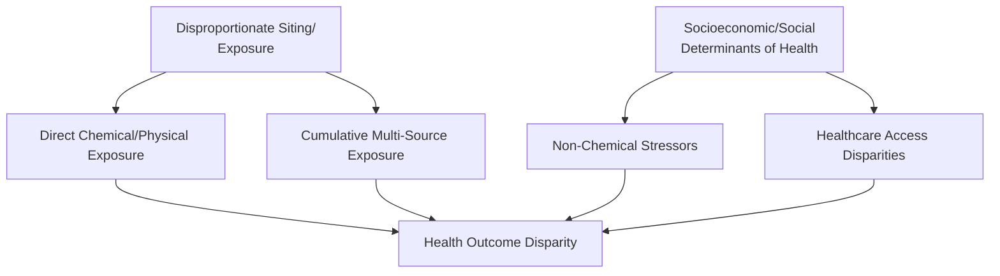

## Environmental Justice in Health Outcomes

### Definition and Core Concept

Environmental justice (EJ) refers to the fair treatment and meaningful involvement of all people, regardless of race, ethnicity, income, national origin, or other demographic characteristics, in the development, implementation, and enforcement of environmental laws, regulations, and policies. Within environmental health and toxicology specifically, environmental justice research focuses on documenting, explaining, and addressing the disproportionate distribution of environmental health burdens and benefits across population subgroups — the observation that exposure to environmental hazards and access to environmental benefits are not randomly or equitably distributed across a population, but instead correlate systematically with socioeconomic status, race/ethnicity, and other demographic factors.

**US EPA's Formal Definition Elements**: Fair treatment (no group bears a disproportionate share of negative environmental consequences) and meaningful involvement (affected communities have genuine opportunity to participate in decisions affecting their environment and health) — two distinct but related pillars of the environmental justice framework.

### Historical Origins

The environmental justice movement in the United States is widely traced to the 1982 protests in Warren County, North Carolina, against the siting of a hazardous PCB waste landfill in a predominantly Black community, an event frequently cited as a foundational catalyzing moment that helped establish the framing of environmental hazard distribution as a civil rights and justice issue rather than solely a technical/regulatory matter. Subsequent foundational research, notably the 1987 "Toxic Wastes and Race in the United States" report by the United Church of Christ Commission for Racial Justice, provided early systematic documentation of racial disparities in hazardous waste facility siting, contributing significantly to the movement's evidence base and public policy visibility.

**Key Points**

- The historical framing of environmental justice as emerging from and remaining connected to the broader civil rights movement is an important context for understanding the field, distinguishing it from purely technical environmental regulation by explicitly centering questions of fairness, historical discrimination, and community self-determination alongside conventional environmental science and risk assessment.

### Documented Patterns of Disproportionate Exposure

Environmental justice research has documented disparities across numerous specific exposure categories, generally using geographic information system (GIS) methods correlating facility/hazard location data with demographic data at the census tract or similar geographic scale:

- **Industrial facility proximity**: Documented patterns of hazardous waste facilities, industrial emitters, and other locally undesirable land uses (LULUs) being disproportionately sited in or near lower-income communities and communities of color across numerous specific studies and geographic contexts
- **Air pollution exposure**: Multiple studies have documented higher ambient air pollution exposure (including traffic-related air pollution and industrial emissions) in lower-income and minority communities relative to the broader population in the same metropolitan areas
- **Drinking water infrastructure**: Documented disparities in water infrastructure quality and contamination risk (e.g., lead service line prevalence, water system capacity/investment) correlating with community socioeconomic and demographic characteristics in specific documented cases
- **Urban heat exposure**: Research connecting historical discriminatory housing policy (notably 20th-century mortgage redlining practices) to present-day disparities in urban tree canopy coverage and corresponding elevated urban heat island intensity in formerly redlined neighborhoods, representing a well-documented example of historical policy creating measurable present-day environmental health disparity
- **Access to environmental benefits**: Beyond hazard exposure, EJ research also documents disparities in access to environmental amenities (green space, parks, tree canopy) that confer health benefits, framing environmental justice as encompassing both disproportionate burden and inequitable access to benefit

**Key Points**

- The specific magnitude and mechanism of documented disparities vary substantially by study, geographic context, hazard type, and analytical methodology — while the general pattern of disproportionate burden is well-documented across a substantial body of research spanning multiple decades and geographic contexts, specific quantitative figures cited for any particular disparity should be evaluated against the specific study/context being referenced rather than treated as a single universal figure applicable everywhere. [Inference — this calibration reflects the genuine heterogeneity present across the environmental justice research literature; it does not undermine the well-established general pattern, but appropriately qualifies specific numeric claims]

### Redlining and Present-Day Environmental Health Disparities: A Case Study

This causal chain, connecting a specific historical discriminatory policy mechanism to present-day, empirically measurable environmental health disparity, is among the most well-documented and frequently cited case studies in the environmental justice literature, illustrating how historical policy decisions can produce durable physical/environmental legacy effects persisting many decades after the formal policy itself was discontinued.

### Mechanistic Pathways Linking Environmental Injustice to Health Outcomes

Environmental justice-related health disparities operate through multiple, often interacting pathways:

**Direct Chemical/Physical Exposure Pathway**: Elevated exposure to air pollution, water contamination, noise, and other hazards directly increases disease risk through established toxicological and epidemiological mechanisms (covered in prior curriculum entries).

**Cumulative and Combined Exposure Pathway**: Fenceline and similarly situated communities frequently experience exposure to multiple co-located hazard sources simultaneously, an additive or potentially synergistic exposure burden not well captured by single-chemical, single-source regulatory risk assessment.

**Non-Chemical Stressor Interaction Pathway**: Socioeconomic stress, limited healthcare access, housing instability, and other social determinants of health can interact with chemical exposure to modify (typically amplify) health effects — a mechanism increasingly incorporated into cumulative risk assessment frameworks, reflecting the understanding that identical chemical exposure may produce different health outcomes depending on co-occurring social and economic stressors affecting an individual's or community's baseline resilience and capacity to respond.

**Healthcare Access Pathway**: Disparities in healthcare access and quality can affect both the likelihood of early detection/intervention for environmentally-associated conditions and the management of pre-existing conditions that may increase susceptibility to environmental exposure effects.

**Key Points**

- This multi-pathway framing is methodologically important because it explains why environmental justice-related health disparities are frequently larger than would be predicted from chemical exposure differences alone: the interaction between chemical exposure and non-chemical socioeconomic/social stressors, combined with cumulative multi-source exposure patterns, produces compounding effects not captured by traditional single-chemical risk assessment models — a key rationale driving the methodological shift toward cumulative risk assessment discussed under both Human Health Risk Assessment and Occupational and Community Environmental Hazards.

### Methodological Approaches in Environmental Justice Research

**Geographic Information Systems (GIS) Analysis**: The dominant methodological approach for documenting spatial correlation between hazard location and demographic characteristics, typically conducted at census tract, block group, or similar administrative geographic scale.

**Environmental Justice Screening Tools**: Government and research-developed mapping tools (such tools have been developed by EPA and various state agencies, combining environmental hazard indicators with demographic and socioeconomic data to identify and prioritize communities experiencing disproportionate cumulative burden) support both research and regulatory prioritization applications. [Unverified — specific current tools, their exact indicator composition, and their operational/regulatory status should be verified against current agency sources, as tool availability and specific regulatory application have been subject to change]

**Community-Based Participatory Research (CBPR)**: An increasingly emphasized methodological approach in environmental justice research, involving affected community members as active partners in research design, data collection, and interpretation rather than solely as study subjects — reflecting the "meaningful involvement" pillar of the environmental justice definition and addressing historical concerns about research being conducted on rather than with affected communities.

**Key Points**

- The shift toward CBPR methodology reflects a broader recognition within the environmental health research field that affected communities often possess valuable contextual knowledge (regarding local exposure sources, historical patterns, and community-specific vulnerability factors) that can substantially improve research validity and relevance, alongside the ethical rationale of ensuring research benefits and involves the communities it studies.

### Regulatory and Policy Response Frameworks

**Executive Order 12898 (US, 1994)**: Directed federal agencies to identify and address disproportionately high adverse human health or environmental effects of their programs, policies, and activities on minority and low-income populations, establishing a formal federal policy foundation for environmental justice consideration in federal agency decision-making.

**Cumulative Impact Assessment Requirements**: A growing number of jurisdictions have moved toward or considered regulatory frameworks requiring cumulative impact assessment (evaluating the combined burden of multiple hazard sources and, in some frameworks, non-chemical stressors) specifically for permitting decisions affecting communities already experiencing disproportionate environmental burden, representing a more structural regulatory response than case-by-case single-facility permitting review. [Unverified — the specific current status, scope, and jurisdictional applicability of cumulative impact assessment regulatory requirements is an actively evolving policy area; verify against current regulatory sources for any specific jurisdiction being referenced]

**Environmental Justice in Permitting and NEPA/EIA Processes**: Environmental justice considerations are increasingly incorporated into environmental impact assessment processes (such as under the US National Environmental Policy Act, NEPA) as a required or recommended analytical component, requiring proposed projects to specifically evaluate and disclose potential disproportionate impacts on environmental justice communities as part of standard environmental review.

### Global and International Dimensions

While much of the foundational environmental justice literature and policy framework developed in a US context, analogous patterns and frameworks are documented and increasingly formalized internationally:

- Disproportionate siting of hazardous facilities and waste processing (including informal e-waste recycling, discussed under Electronic Waste) in lower-income countries and communities globally
- International frameworks addressing transboundary environmental injustice, such as the Basel Convention's restrictions on hazardous waste export from wealthier to lower-income countries (discussed under Electronic Waste and Emerging Waste Streams)
- Climate justice as an increasingly prominent related framework, addressing the observation that populations contributing least to greenhouse gas emissions frequently experience disproportionate climate change impact and adaptive capacity limitations

**Key Points**

- The Philippine and broader Southeast Asian context includes documented environmental justice dimensions relevant to this curriculum's civic/community software focus, including informal waste picker communities' disproportionate exposure to hazardous waste (connecting to the informal e-waste recycling sector discussed previously) and community-level environmental health disparities correlating with informal settlement status and infrastructure access — though specific quantitative documentation for this regional context should be sourced from current regional environmental health literature rather than assumed to directly mirror US-context findings, given genuine contextual differences in regulatory frameworks, settlement patterns, and hazard types. [Inference — this framing reflects general principle transferability rather than a specific documented regional finding; region-specific verification is appropriately flagged]

### Environmental Justice and Health Outcome Measurement

Environmental justice health outcome research typically employs standard epidemiological study designs (discussed under Environmental Epidemiology) applied specifically to comparative analysis across demographic/socioeconomic subgroups, commonly examining:

- Disparities in disease-specific incidence or prevalence rates (e.g., asthma, cardiovascular disease) correlated with environmental hazard proximity and demographic characteristics
- Life expectancy and mortality disparities correlated with cumulative environmental burden indices
- Birth outcome disparities (e.g., preterm birth, low birth weight) associated with prenatal environmental exposure and community-level environmental burden

**Key Points**

- Environmental justice health outcome research faces the same core methodological challenges as environmental epidemiology generally (confounding, particularly given the strong correlation between environmental hazard proximity and socioeconomic status itself; exposure misclassification; and the ecological fallacy risk in area-level analyses) — meaning rigorous EJ health research requires the same careful methodological attention to causal inference discussed under Environmental Epidemiology, including appropriate use of the Bradford Hill considerations, rather than treating documented spatial correlation alone as sufficient evidence of a specific causal health impact, even where the overall weight of evidence across multiple studies and hazard types strongly supports the general pattern of disproportionate burden and associated health impact.

### Conclusion

Environmental justice in health outcomes represents the synthesis of environmental health science with an explicit equity and fairness analytical lens, documenting and seeking to explain the well-established pattern of disproportionate environmental hazard exposure and corresponding health impact borne by lower-income communities and communities of color across numerous specific exposure categories and geographic contexts. Its explanatory power rests on multiple interacting pathways — direct chemical exposure, cumulative multi-source burden, and non-chemical socioeconomic stressor interaction — that together help explain why observed health disparities in affected communities often exceed what single-chemical risk assessment alone would predict. Methodologically, the field draws on standard epidemiological and toxicological tools while increasingly incorporating community-based participatory approaches reflecting its "meaningful involvement" definitional pillar, and its policy influence is reflected in a growing (though still developing and geographically uneven) body of regulatory frameworks incorporating cumulative impact assessment and environmental justice screening into permitting and environmental review processes. As with related fields covered in this curriculum, environmental justice research continues to evolve methodologically, particularly regarding the formal integration of non-chemical stressors into quantitative cumulative risk assessment frameworks.

**Related Topics**

- Human Health Risk Assessment (cumulative risk assessment methodology)
- Environmental Epidemiology (causal inference methodology applied to EJ research)
- Occupational and Community Environmental Hazards (fenceline community concept)
- Electronic Waste and Emerging Waste Streams (informal recycling sector and global EJ dimension)
- Climate Justice and adaptive capacity disparities
- Community-Based Participatory Research methodology
- Urban heat island effects and green infrastructure equity