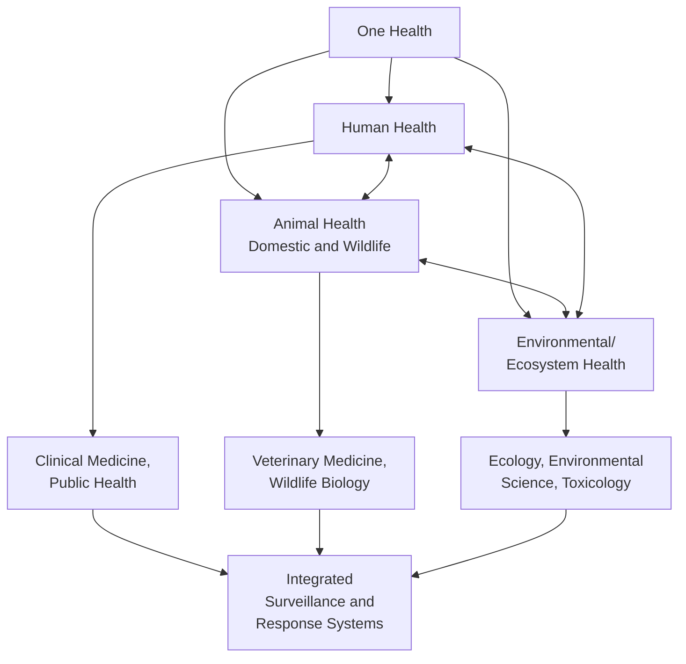
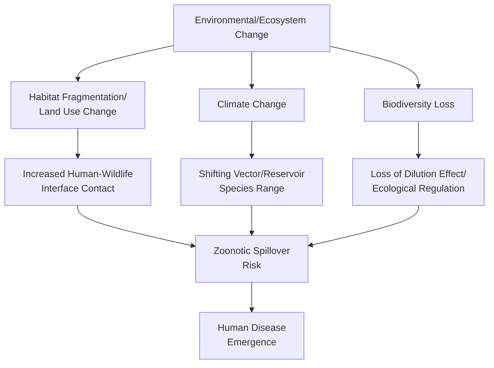
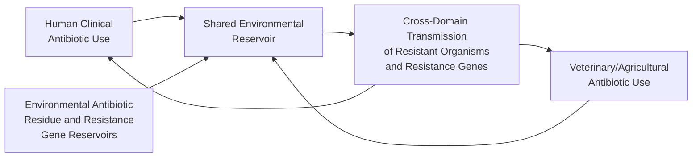

## One Health and Ecosystem Health Approaches

### Definition and Core Concept

One Health is a collaborative, multisectoral, and transdisciplinary approach recognizing the interconnection between human health, animal health, and environmental/ecosystem health, working at local, regional, national, and global scales to achieve optimal health outcomes across this interconnected system. The framework rejects siloed treatment of human medicine, veterinary medicine, and environmental science as independent domains, instead treating them as components of a single interdependent system requiring coordinated analysis and intervention.

**Formal Definition (One Health High-Level Expert Panel, OHHLEP)**: An integrated, unifying approach that aims to sustainably balance and optimize the health of people, animals, and ecosystems, recognizing that human, domestic and wild animal, plant, and environmental health are closely linked and interdependent.

### Conceptual Framework

**Key Points**

- The bidirectional arrows in this framework are conceptually essential: One Health explicitly rejects a unidirectional model (e.g., treating animal or environmental health merely as a pathway/source of human disease) in favor of recognizing genuine interdependence, where human activity affects animal and environmental health just as animal and environmental conditions affect human health.

### Ecosystem Health as a Distinct but Related Concept

**Ecosystem health** is a related framework focused specifically on the functional integrity, resilience, and capacity of ecological systems to maintain their organization and function over time, sometimes treated as a foundational component within the broader One Health framework and sometimes discussed as a related but analytically distinct field (ecosystem health assessment draws more heavily on ecological science metrics — biodiversity, nutrient cycling, primary productivity, resilience to disturbance — while One Health more explicitly centers the health outcome linkages across human, animal, and environmental domains).

**Key Ecosystem Health Indicators**: Biodiversity and species richness; ecosystem functional processes (nutrient cycling, primary productivity, water regulation); resilience (capacity to recover from disturbance); and the presence/absence of degradation indicators (invasive species prevalence, pollution loading, habitat fragmentation).

**Key Points**

- Ecosystem health serves a dual function within the One Health framework: ecosystems provide direct health-supporting ecosystem services to humans (clean water and air provision, disease vector regulation, food production), while ecosystem degradation itself can create conditions that increase disease emergence and transmission risk — meaning ecosystem health functions both as a health determinant in its own right and as a mechanistic pathway connecting environmental change to human and animal disease risk.

### Zoonotic Disease Emergence: The Central One Health Case Study

Zoonotic diseases (diseases transmissible between animals and humans) represent the most extensively developed and policy-visible application of One Health thinking, given that a substantial majority of emerging infectious diseases affecting humans are estimated to have zoonotic origins, and many major historical and contemporary disease events (including HIV/AIDS, various influenza strains, Ebola, and SARS-CoV-2/COVID-19) originated through animal-to-human transmission (zoonotic spillover).

**Key Drivers of Zoonotic Spillover Risk**:

- **Land-use change and habitat fragmentation**: Deforestation, agricultural expansion, and urbanization increase the frequency and intimacy of human-wildlife contact at ecological interface zones, a well-documented driver across multiple emerging infectious disease case studies
- **Wildlife trade and markets**: Live animal markets and wildlife trade create novel, high-contact interfaces between diverse animal species and humans, facilitating both initial spillover and onward viral evolution/recombination opportunities
- **Climate change**: Shifting temperature and precipitation patterns can alter the geographic range of disease vectors (e.g., mosquito species) and reservoir host species, introducing disease transmission risk into previously unaffected regions
- **Biodiversity loss and the "dilution effect" hypothesis**: A hypothesis proposing that higher biodiversity in a host community can reduce disease transmission risk by "diluting" the proportion of competent reservoir hosts relative to less competent or dead-end hosts, such that biodiversity loss may, in some documented systems, increase transmission risk by shifting host community composition toward more competent reservoir species; this hypothesis has substantial supporting evidence in specific well-studied systems (e.g., Lyme disease ecology) but its generalizability across all host-pathogen systems remains an active area of scientific investigation and is not universally accepted as applying uniformly across all disease systems. [Unverified — the dilution effect is a genuinely debated ecological hypothesis with strong support in specific documented systems and contested generalizability; treat as system-specific rather than a universal ecological law]
- **Intensive animal agriculture**: High-density livestock production systems can serve as amplification and mixing environments for pathogens (notably documented for certain influenza subtypes), representing a distinct but related One Health concern connecting agricultural practice to zoonotic and pandemic risk

**Key Points**

- The COVID-19 pandemic substantially elevated global policy and public attention to One Health frameworks specifically because SARS-CoV-2's presumed zoonotic origin (with the precise spillover pathway and intermediate host, if any, remaining a subject of ongoing scientific and, notably, contested investigation) illustrated in real time the massive potential human health, economic, and social consequences of zoonotic spillover events, substantially accelerating investment in One Health surveillance and pandemic preparedness frameworks globally. [Unverified — the precise origin of SARS-CoV-2 remains genuinely contested in the scientific and policy literature as of current knowledge; this entry does not take a position on the specific origin question, noting only the broader pandemic's effect on One Health policy attention]

### Antimicrobial Resistance (AMR): A Second Major One Health Application

Antimicrobial resistance is formally recognized by WHO, FAO (Food and Agriculture Organization), and WOAH (World Organisation for Animal Health) as a quintessential One Health issue, since resistance can emerge and be selected for in human clinical settings, veterinary/agricultural settings (including antibiotic use in livestock production), and environmental reservoirs (as discussed under Emerging Contaminants), with resistant organisms and resistance genes capable of transmission across these domains.

**Tripartite Plus Collaboration**: WHO, FAO, WOAH, and UNEP (United Nations Environment Programme, added as a fourth formal partner reflecting explicit recognition of the environmental dimension of AMR) collaborate on global AMR surveillance and response strategy, an institutional structure directly reflecting One Health's tripartite-plus-environment framing.

### One Health Surveillance Systems

**Integrated Surveillance**: A core operational application of One Health thinking involves establishing surveillance systems that share data and coordinate detection efforts across human public health, veterinary/animal health, and environmental monitoring systems, aiming to detect emerging health threats (particularly zoonotic disease emergence) earlier than any single-sector surveillance system operating in isolation could achieve, since early-warning signals may first appear in animal populations or environmental samples before human clinical presentation.

**Wildlife Disease Surveillance**: Monitoring of wildlife populations for pathogens with zoonotic spillover potential, functioning as an early-warning component of integrated One Health surveillance systems.

**Wastewater-Based Epidemiology**: An increasingly prominent environmental monitoring tool (substantially expanded during the COVID-19 pandemic) involving testing of community wastewater for pathogen genetic material, providing population-level disease trend information that complements individual clinical testing and can detect emerging trends with less individual-level testing burden — representing a direct environmental monitoring contribution to integrated human health surveillance.

### Institutional and Policy Frameworks

**One Health High-Level Expert Panel (OHHLEP)**: An expert advisory body established by the Quadripartite (WHO, FAO, WOAH, UNEP) to provide scientific advice on One Health issues, including the formal definition cited above.

**Global Health Security Agenda and Pandemic Preparedness Frameworks**: Increasingly incorporate explicit One Health components, reflecting institutional recognition (substantially reinforced following the COVID-19 pandemic) that effective pandemic prevention requires addressing zoonotic spillover risk at its ecological and animal-health origins rather than relying solely on human health system response capacity after emergence.

**Key Points**

- A recurring theme in current global health policy discourse is the relative under-investment in "upstream" One Health prevention (addressing land-use change, wildlife trade, and ecosystem degradation drivers of spillover risk) relative to "downstream" human health system response capacity — a resource allocation pattern that has been specifically critiqued in pandemic preparedness policy discussions as potentially less cost-effective than proportionally greater investment in spillover prevention, though the precise optimal resource allocation across prevention versus response remains a genuinely debated policy question rather than a settled conclusion. [Inference — this critique is documented in pandemic preparedness policy literature and post-COVID-19 policy retrospectives; the specific optimal allocation remains an area of ongoing policy debate rather than established consensus]

### Ecosystem Services and Health: The Provisioning Pathway

Beyond disease emergence, ecosystem health connects to human health through the ecosystem services framework — the direct and indirect benefits ecosystems provide to human wellbeing:

- **Provisioning services**: Food, clean water, medicinal resources (many pharmaceutical compounds derive from natural product discovery, an ongoing connection between biodiversity conservation and future medical discovery potential)
- **Regulating services**: Water purification, air quality regulation, disease vector regulation, climate regulation — services whose degradation directly translates to increased human health hazard exposure (connecting directly to topics covered elsewhere in this curriculum, including air/water quality and vector-borne disease risk)
- **Cultural services**: Mental health and wellbeing benefits associated with access to natural environments and green space, an area of growing research interest in environmental health, including documented associations between green space access and various mental and physical health outcomes [Inference — the general association between green space access and wellbeing outcomes is documented across a substantial body of research; specific causal mechanisms and effect magnitudes vary by study and outcome measured]
- **Supporting services**: Foundational ecological processes (nutrient cycling, soil formation, primary production) that underlie the other service categories without directly and immediately benefiting humans

### Practical Application: One Health in Practice

**Multisectoral Coordination Requirement**: Effective One Health implementation requires genuine institutional coordination across traditionally separate sectors (human health ministries, agriculture/veterinary authorities, environmental agencies), which represents a significant practical and institutional challenge distinct from the conceptual framework itself — a frequently noted gap between One Health's conceptual clarity and the practical difficulty of achieving genuine cross-sectoral institutional coordination, budget integration, and data sharing in real-world governmental structures that are typically organized along traditional sectoral lines.

**Key Points**

- This implementation gap — between One Health's widely accepted conceptual validity and the practical institutional challenges of genuine cross-sectoral coordination — is itself a recognized and actively discussed topic within the One Health policy and implementation literature, distinct from questions about the framework's underlying scientific validity, which is broadly well-established.

### Conclusion

One Health and ecosystem health approaches provide an integrative conceptual and operational framework connecting human, animal, and environmental health domains that were historically studied and managed as separate silos, grounded in the recognition that a substantial proportion of emerging human infectious disease threats originate at human-animal-environment interfaces shaped by land-use change, biodiversity loss, climate change, and intensive animal agriculture practices. Its two most developed applications — zoonotic disease emergence and antimicrobial resistance — both illustrate how environmental and ecosystem conditions function as upstream drivers of downstream human health outcomes, reinforcing this curriculum's broader theme that environmental health cannot be fully understood or effectively managed through human-health-focused analysis alone. While the framework's underlying scientific logic is broadly accepted, the practical challenge of achieving genuine multisectoral institutional coordination — spanning traditionally separate human health, veterinary, and environmental governance structures — remains a significant and actively discussed implementation gap, substantially elevated in policy priority following the COVID-19 pandemic's demonstration of zoonotic spillover's potential global consequences.

**Related Topics**

- Environmental Epidemiology (surveillance and causal inference methodology)
- Emerging Contaminants and Health Effects (environmental antimicrobial resistance reservoirs)
- Environmental Justice in Health Outcomes (differential vulnerability to zoonotic and ecosystem-mediated health risk)
- Biodiversity Loss and Ecosystem Resilience
- Climate Change and Vector-Borne Disease Range Shifts
- Wildlife Trade Regulation and Disease Spillover Risk
- Wastewater-Based Epidemiology methodology