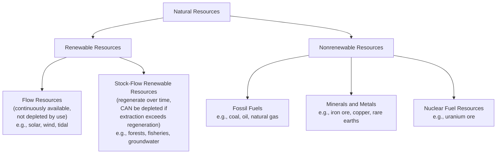
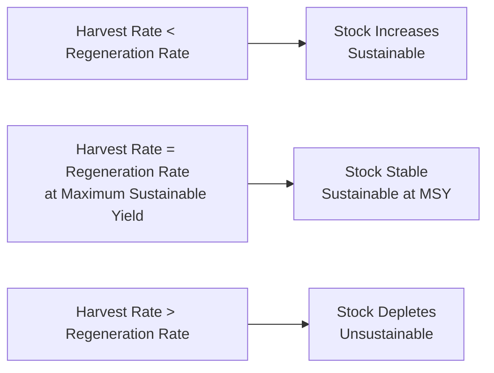

## Renewable and Nonrenewable Resource Classification

### Definition and Core Distinction

Natural resource classification into renewable and nonrenewable categories is founded on the relationship between a resource's rate of natural regeneration/replenishment and its rate of human extraction/consumption. This distinction is fundamentally about relative timescale rather than an absolute, binary physical property — the classification depends on comparing the resource's regeneration rate against a relevant human timeframe (typically compared against human lifespans, generational timescales, or economically/practically meaningful planning horizons).

$$\text{Sustainability of use} = f\left(\frac{\text{Rate of regeneration}}{\text{Rate of extraction/consumption}}\right)$$

### Core Classification Framework

**Key Points**

- A frequently underemphasized but analytically important nuance: not all renewable resources are equally resistant to depletion. True "flow" resources (solar radiation, wind, tidal energy) are functionally inexhaustible on any human-relevant timescale regardless of extraction rate, since harvesting them does not reduce their future availability. In contrast, "stock-flow" renewable resources (forests, fisheries, groundwater aquifers, soil fertility) genuinely regenerate over time but can be depleted, degraded, or even permanently lost if extraction/harvest rate exceeds natural regeneration rate — meaning the "renewable" label does not guarantee sustainable outcomes absent appropriate management.

### Renewable Resources: Detailed Categories

#### True Flow Resources

- **Solar radiation**: Continuously supplied by the sun; harvesting solar energy via photovoltaic or thermal collection does not reduce future solar availability
- **Wind**: Atmospheric kinetic energy driven by solar heating differentials; similarly non-depletable by extraction at current human-relevant scales
- **Tidal and wave energy**: Driven by gravitational and wind-driven forces; effectively non-depletable

#### Stock-Flow Renewable Resources (Biological/Ecological)

- **Forests**: Regenerate through natural or managed regrowth over timescales ranging from years (fast-growing species) to many decades or centuries (old-growth/climax forest ecosystems); sustainable if harvest rate does not exceed regrowth rate, but subject to genuine depletion (deforestation) if extraction exceeds regeneration capacity
- **Fisheries**: Fish populations regenerate through reproduction; sustainable if harvest (fishing) rate does not exceed the population's natural reproductive replacement rate, but subject to population collapse if overfished beyond recovery capacity — a well-documented global resource management challenge
- **Freshwater (renewable component)**: Surface water and shallow groundwater systems are replenished through the hydrological cycle (precipitation, recharge); sustainable if withdrawal does not exceed recharge rate

#### Stock-Flow Renewable Resources (Geophysical/Soil)

- **Soil fertility**: Regenerates through natural pedogenic and biological processes, but at rates that are extremely slow relative to human timescales for the deeper soil formation process (commonly cited as centuries to millennia for meaningful topsoil formation, though the biological fertility component — organic matter, nutrient cycling — can regenerate somewhat faster under appropriate management), meaning soil is sometimes analytically treated as a "slowly renewable" or near-nonrenewable resource on human management timescales despite technically being a renewable/regenerating system. [Inference — soil formation rate estimates vary by soil type, climate, and parent material; the general characterization of soil formation as very slow relative to human use timescales is well-established in soil science literature, though specific rate figures are context-dependent]
- **Deep/fossil groundwater (a boundary case)**: Some groundwater aquifers, particularly deep or geologically isolated aquifers with minimal recharge (sometimes termed "fossil aquifers"), receive negligible recharge on human timescales, meaning they function analytically more like nonrenewable resources despite water generally being classified as a renewable resource category — an important exception illustrating that resource classification should be evaluated at the specific resource/system level rather than assumed uniformly across a general resource category

**Key Points**

- The soil and fossil-aquifer examples both illustrate a broader principle: categorical resource classification (renewable vs. nonrenewable) is a useful simplification, but accurate resource management requires evaluating the specific regeneration rate of the specific resource system in question, since meaningful exceptions exist within both broad categories.

### Nonrenewable Resources: Detailed Categories

#### Fossil Fuels

Coal, petroleum (oil), and natural gas, formed through geological processes (typically involving the burial and transformation of organic material under specific heat/pressure conditions) occurring over geological timescales (commonly millions of years) — timescales that are, for all practical human planning purposes, effectively infinite relative to any human extraction/consumption timeframe, justifying the nonrenewable classification despite technically being part of an extremely slow, ongoing (though geologically active) natural formation process.

#### Minerals and Metals

Formed through various geological processes (igneous, sedimentary, or metamorphic ore formation processes) over similarly long geological timescales; extraction depletes a finite, geologically fixed stock, though it is worth distinguishing between:

- **Total resource base**: The total theoretical quantity of a mineral present in Earth's crust, generally vastly exceeding what has been or will be economically extractable
- **Economically recoverable reserves**: The subset of the total resource base that is currently technically and economically feasible to extract, which can change over time (both increasing, through new discovery and technological/economic changes making previously uneconomic deposits viable, and decreasing, through depletion of the most accessible/highest-grade deposits) — a distinction important for accurately interpreting mineral "reserve" statistics, which reflect current economic and technical conditions rather than the fixed total physical quantity present

#### Nuclear Fuel Resources

Uranium and other fissile/fertile material ore deposits, formed through geological processes and extracted as a finite geological resource; while nuclear fuel itself is nonrenewable, it is worth noting nuclear power's distinct position relative to fossil fuels regarding operational carbon emissions (a separate consideration from resource renewability classification, relevant to but analytically distinct from this specific topic).

$$\text{Reserve-to-Production Ratio (R/P)} = \frac{\text{Proven Reserves}}{\text{Annual Production Rate}}$$

A commonly used metric (expressed in years) estimating how long current proven reserves would last at current production/extraction rates, though this metric has well-recognized limitations: it does not account for future reserve additions (through new discovery or reclassification of previously uneconomic resources), changes in extraction rate, or demand-side changes, meaning R/P ratios should be interpreted as a snapshot indicator under current conditions rather than a literal prediction of resource exhaustion timing. [Inference — the R/P ratio calculation and its standard limitations are well-established and widely documented in resource economics and energy statistics literature]

### The Concept of Sustainable Yield for Renewable Resources

For stock-flow renewable resources, the central management concept is **Maximum Sustainable Yield (MSY)**: the largest harvest/extraction rate that can theoretically be maintained indefinitely without depleting the resource stock, based on the resource's natural regeneration/growth rate.

$$\text{MSY} \approx \text{Population growth rate at the population level where growth rate is maximized}$$

For many biological populations following logistic growth dynamics, this theoretical maximum growth rate (and hence MSY) occurs at approximately half of the population's environmental carrying capacity, though actual fisheries and forestry management in practice involves substantially more complex considerations (age-structured population dynamics, environmental variability, multi-species interactions, and management uncertainty) beyond this simplified single-species logistic growth model. [Inference — the theoretical MSY-at-half-carrying-capacity relationship derives from standard logistic population growth model mathematics and is foundational in resource management theory; actual applied fisheries/forestry management practice has moved toward more sophisticated models given recognized limitations of the simple logistic MSY concept, including its vulnerability to overestimating sustainable harvest under real-world uncertainty and variability]

**Key Points**

- MSY as a management concept has faced significant historical criticism and refinement within resource management science, notably because it does not inherently account for environmental variability, multi-species ecological interactions, or the economic/political pressure toward setting harvest quotas at or near the theoretical maximum (leaving little margin for estimation error or environmental variation) — a documented contributing factor in historical fisheries collapse cases. Contemporary resource management increasingly favors more conservative, precautionary approaches (sometimes termed "optimal sustainable yield," incorporating ecological and economic factors beyond pure population growth maximization) rather than pure MSY targeting. [Inference — this critique and the shift toward more precautionary management approaches is well-documented in fisheries and resource management literature]

### Resource Classification and Depletion Curve Dynamics

**Hubbert Peak Theory (Peak Resource Concept)**: A model, originally developed for petroleum production forecasting, proposing that production of a finite, geologically constrained resource tends to follow a roughly bell-shaped curve over time — rising as discovery and extraction infrastructure develop, peaking as the most accessible/economical deposits are exhausted, and declining as remaining extraction becomes progressively more difficult and costly. This concept (originally applied to US oil production in the 1950s-1970s with some historical predictive success for that specific case) has been applied with varying degrees of accuracy to other nonrenewable resources and other geographic/temporal contexts, and its predictive reliability, particularly for global (rather than single-region) production and in light of technological change (e.g., hydraulic fracturing substantially altering prior peak oil production forecasts), has been genuinely and substantially debated within resource economics and energy analysis literature. [Unverified — Hubbert peak theory's originating case had documented historical relevance; its broader predictive applicability, particularly for global resource production forecasting and in light of subsequent extraction technology changes, remains a genuinely contested topic rather than settled predictive theory]

### Substitutability and Resource Economics

**Key Points**

- Nonrenewable resource depletion concern is analytically complicated by the economic concept of substitutability: as a specific nonrenewable resource becomes scarcer (and correspondingly more expensive), economic incentive increases for developing substitute materials, technologies, or extraction methods — a dynamic that has historically moderated (though not eliminated) resource scarcity concerns for many specific nonrenewable resources, and remains a genuinely debated consideration in comparing more pessimistic ("limits to growth"-style) versus more optimistic (techno-economic substitution-focused) perspectives on long-term nonrenewable resource availability. This substitutability dynamic does not apply uniformly across all nonrenewable resources — some (e.g., certain rare earth elements with limited current substitute options for specific high-technology applications) currently have more constrained substitution possibilities than others. [Inference — the substitutability dynamic and the broader "optimist vs. pessimist" resource economics debate it reflects are well-documented in resource economics literature spanning multiple decades; this is a genuinely long-standing area of disciplinary disagreement rather than a settled question]

### Comparative Summary Table

| Dimension | Renewable (Flow) | Renewable (Stock-Flow) | Nonrenewable |
| --- | --- | --- | --- |
| Example | Solar, wind | Forests, fisheries, soil | Fossil fuels, minerals |
| Regeneration relative to human use | Continuous, non-depletable | Regenerates, but depletable if overused | Effectively none on human timescales |
| Primary management concept | Capacity/infrastructure planning | Maximum Sustainable Yield | Reserve estimation, substitution planning |
| Depletion risk | Negligible | Significant if mismanaged | Inherent and cumulative with use |
| Key management tool | Deployment/technology scaling | Harvest quotas, regeneration protection | Extraction rate planning, recycling, substitution |

### Relevance to Circular Economy and Sustainability Frameworks

**Key Points**

- This classification framework directly underlies broader sustainability and circular economy concepts covered elsewhere in this curriculum (see Recycling Systems and Circular Waste Design): nonrenewable resource conservation is a primary driver for circular material recovery (since recycling directly displaces virgin nonrenewable material extraction), while stock-flow renewable resource management (sustainable forestry, fisheries management, soil conservation) requires distinct but complementary management approaches centered on maintaining harvest/extraction within natural regeneration capacity rather than material recovery/recycling per se.

### Conclusion

The renewable/nonrenewable resource classification, while foundational to natural resource management, is more accurately understood as a spectrum defined by the relationship between regeneration rate and extraction rate rather than a strict binary — true flow resources (solar, wind) are functionally inexhaustible, stock-flow renewable resources (forests, fisheries, soil, most freshwater) can be sustainably managed indefinitely but are genuinely depletable if extraction exceeds regeneration capacity, and nonrenewable resources (fossil fuels, minerals, nuclear fuel) represent a fundamentally finite stock whose management centers on extraction rate planning, substitution economics, and material recovery rather than sustainable yield concepts. Effective natural resource management requires applying the correct management framework to each specific resource based on its actual regeneration dynamics — a stock-flow renewable resource managed as though infinitely available (ignoring sustainable yield limits) faces the same practical depletion risk as a nonrenewable resource extracted without long-term planning, while overly rigid nonrenewable classification can understate real substitution and technological adaptation possibilities documented in resource economics literature.

**Related Topics**

- Maximum Sustainable Yield and fisheries/forestry management
- Recycling Systems and Circular Waste Design (nonrenewable resource conservation linkage)
- Electronic Waste and Emerging Waste Streams (critical mineral/rare earth resource recovery)
- Groundwater Hydrology and Aquifer Management
- Hubbert Peak Theory and resource depletion forecasting
- Soil Conservation and Sustainable Agriculture
- Energy Resources and the Renewable Energy Transition