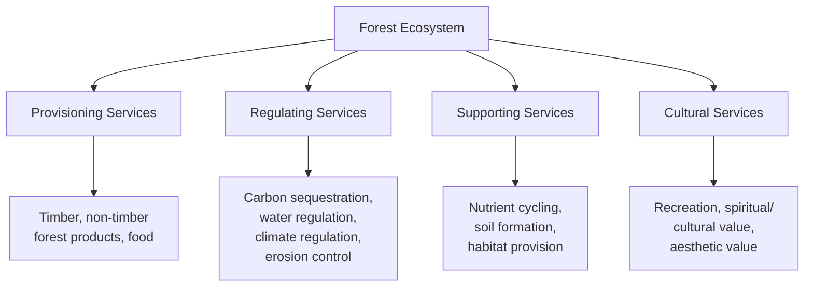
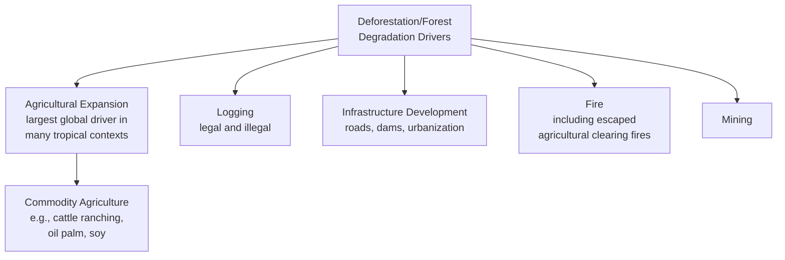
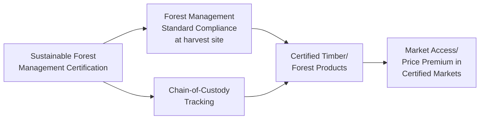

## Forest Ecosystems and Sustainable Forestry

### Definition and Ecological Function

Forest ecosystems are terrestrial biological communities dominated by tree cover, characterized by complex vertical structure (canopy, understory, forest floor) and functioning as one of Earth's most significant carbon sinks, biodiversity reservoirs, and hydrological regulators. Sustainable forestry refers to forest management practices designed to meet current human demand for forest products and services (timber, non-timber forest products, recreation, watershed protection) without compromising the forest ecosystem's long-term ecological function, regeneration capacity, or capacity to meet future needs.

### Forest Types and Global Classification

**Biome-Based Classification**:

- **Tropical rainforests**: High biodiversity, year-round growing conditions, nutrient cycling concentrated largely in living biomass rather than soil (a distinguishing ecological feature with significant implications for post-clearing soil fertility and regeneration capacity)
- **Temperate forests**: Deciduous and/or coniferous, seasonal growth patterns, generally more balanced nutrient distribution between biomass and soil relative to tropical systems
- **Boreal forests (taiga)**: Predominantly coniferous, cold-climate adapted, represents a very substantial global forest carbon stock, particularly in associated permafrost and peatland soils
- **Mangrove forests**: Coastal, salt-tolerant forest ecosystems with disproportionately high carbon storage density (blue carbon) relative to land area, and significant coastal protection and fisheries nursery function

### Forest Ecosystem Services

**Carbon Sequestration Function**: Forests sequester atmospheric carbon dioxide through photosynthesis, storing carbon in living biomass (trunk, branches, roots, leaves), dead organic matter, and forest soils; this function positions forest conservation and afforestation/reforestation as a significant component of climate change mitigation strategy, though the precise magnitude of forest carbon sequestration contribution to global mitigation targets, and comparative approaches to accounting for it, remain areas of active methodological and policy development. [Inference — forest carbon sequestration function and its climate mitigation relevance is well-established science; specific quantitative contribution estimates and accounting methodologies are more actively debated policy/methodological questions]

**Watershed and Hydrological Regulation**: Forest cover influences local and regional hydrology through processes including interception (reducing surface runoff velocity and erosion), evapotranspiration (contributing to regional precipitation patterns in some documented systems, notably including tropical forest "flying rivers"/moisture recycling phenomena), and groundwater recharge regulation.

**Biodiversity Habitat**: Forests, particularly tropical rainforests, host a disproportionately high share of terrestrial biodiversity relative to their global land area coverage, making forest conservation a central strategy within broader biodiversity conservation frameworks.

### Deforestation and Forest Degradation: Drivers and Dynamics

**Key Points**

- Agricultural expansion, particularly commodity-driven agricultural expansion (cattle ranching, oil palm, soy, and similar large-scale export commodity production), is commonly identified as the leading global driver of tropical deforestation across multiple analyses, though the relative importance of specific drivers varies substantially by region, meaning region-specific deforestation driver analysis is generally more useful for targeted policy intervention than a single universal global driver ranking. [Inference — the general pattern of commodity agriculture as a leading tropical deforestation driver is well-documented across multiple monitoring and research sources, though relative ranking and specific figures vary by data source, time period, and geographic scope, and should be verified against current data for specific applications]

**Distinguishing Deforestation from Forest Degradation**: Deforestation refers to complete conversion of forest land to non-forest use (e.g., agriculture, urban development), while forest degradation refers to a reduction in forest quality, density, or ecological function while forest cover technically remains (e.g., selective logging, fragmentation) — an important distinction since degradation can substantially reduce carbon storage, biodiversity value, and ecosystem function even without complete deforestation, and is sometimes less comprehensively captured by remote-sensing-based forest cover monitoring that primarily detects complete cover loss.

### Remote Sensing and Forest Monitoring Technology

Modern forest monitoring relies substantially on satellite remote sensing technology, representing a significant and evolving technical domain within forestry science:

- **Optical satellite imagery** (e.g., Landsat, Sentinel-2): Detects forest cover change through spectral reflectance analysis, forming the backbone of long-term global forest cover change monitoring datasets (e.g., Global Forest Watch, built substantially on University of Maryland/Hansen et al. global forest change datasets)
- **Synthetic Aperture Radar (SAR)**: Provides forest monitoring capability independent of cloud cover (a significant advantage over optical imagery in persistently cloudy tropical forest regions), increasingly used for near-real-time deforestation alert systems
- **LiDAR (Light Detection and Ranging)**: Provides detailed three-dimensional forest structure data (canopy height, biomass estimation), used in both airborne and increasingly satellite-based platforms (e.g., NASA's GEDI mission) for forest carbon stock estimation
- **Near-Real-Time Deforestation Alert Systems**: Platforms combining satellite data streams with automated change-detection algorithms to generate frequent (often weekly or more frequent) deforestation alerts, substantially improving detection speed relative to historical periodic (e.g., annual) forest cover assessment, supporting faster enforcement and intervention response

**Key Points**

- The shift toward near-real-time satellite-based deforestation monitoring represents a significant technological advancement in forest governance capability over the past roughly one to two decades, substantially improving the speed at which illegal or unauthorized deforestation can be detected and potentially addressed, though the translation from improved detection capability to actual enforcement outcomes depends heavily on the governance and institutional capacity of the specific jurisdiction receiving the alerts — technology improves detection but does not by itself guarantee enforcement response. [Inference — this general characterization of remote sensing technology's role and limitations in forest governance is well-supported in forest monitoring and governance literature]

### Sustainable Forest Management Principles

**Selective/Sustainable Logging (Selection Harvesting)**: Harvesting individual mature trees rather than clear-cutting an entire stand, designed to maintain overall forest structure, allow natural regeneration, and preserve a greater degree of ecological function relative to clear-cutting, while still enabling timber extraction.

**Rotation Forestry and Sustainable Yield**: Analogous to the Maximum Sustainable Yield concept applied to fisheries (see Renewable and Nonrenewable Resource Classification), sustainable forestry management aims to harvest timber at a rate not exceeding the forest's natural regrowth/regeneration rate, often organized around defined rotation cycles (the time period between establishment/regeneration and harvest of a given forest stand) calibrated to species growth rates and management objectives.

**Reduced-Impact Logging (RIL)**: A set of specific operational practices (e.g., pre-harvest planning of skid trails and felling direction, directional felling to minimize collateral damage to surrounding trees, minimizing soil compaction from heavy machinery) designed to reduce the ecological damage associated with timber extraction relative to conventional/unplanned logging practices, while still achieving commercial timber harvest objectives.

**Forest Certification Systems**: Third-party certification schemes (notably the Forest Stewardship Council, FSC, and the Programme for the Endorsement of Forest Certification, PEFC) establish standards for sustainable forest management practices and chain-of-custody tracking, allowing consumers and businesses to verify that forest products originate from sustainably managed sources — an important market-based mechanism complementing regulatory forest management requirements.

### Reforestation, Afforestation, and Assisted Natural Regeneration

**Reforestation**: Re-establishing forest cover on land that was previously forested but has since been cleared.

**Afforestation**: Establishing forest cover on land not previously (or not recently) forested — a distinction relevant to both ecological considerations (afforestation on naturally non-forest ecosystems, such as grasslands, can itself create ecological tradeoffs if not carefully sited) and carbon accounting frameworks.

**Assisted Natural Regeneration (ANR)**: A lower-intervention restoration approach that removes barriers to natural forest regrowth (e.g., controlling competing vegetation, protecting from fire or grazing) rather than active tree planting, often more cost-effective and capable of restoring greater biodiversity and structural complexity than monoculture plantation approaches, particularly where a viable seed source and root stock remain present in degraded but not entirely cleared land.

**Key Points**

- Reforestation/afforestation project quality varies substantially, and a significant methodological distinction exists between ecologically diverse, native-species restoration approaches (generally associated with greater biodiversity and long-term ecological function recovery) versus fast-growing monoculture plantation approaches (which can achieve rapid carbon sequestration or timber production but generally provide substantially lower biodiversity value and may carry other ecological tradeoffs, such as altered local hydrology in water-intensive fast-growing species plantations) — a distinction increasingly emphasized in critique of some large-scale reforestation/carbon offset programs that prioritize rapid tree-planting metrics without adequate attention to species selection, ecological appropriateness, and long-term management capacity. [Inference — this quality distinction and associated critique is well-documented in forest restoration and carbon offset program literature; specific program-level quality assessment requires case-by-case evaluation]

### Community and Indigenous Forest Management

A substantial and growing body of research and policy attention has documented that forest areas under community or Indigenous management/tenure frequently exhibit deforestation rates comparable to or lower than conventionally protected areas (e.g., formal government-managed protected areas) in numerous specific studied contexts, contributing to increased policy and conservation-finance attention toward securing and strengthening Indigenous and community forest tenure rights as a forest conservation strategy, alongside its independent significance for Indigenous rights and self-determination. [Inference — this general pattern is documented across a substantial body of comparative research in specific studied regions and contexts; the specific magnitude of comparative effectiveness varies by study, region, and methodology, and should not be treated as a single universal quantitative finding applicable identically everywhere]

### Forest-Climate Feedback and Tipping Point Considerations

**Key Points**

- Certain large forest ecosystems, most notably discussed for the Amazon rainforest in the scientific literature, have been analyzed regarding potential ecological tipping point dynamics — the hypothesis that deforestation and associated hydrological/climate feedback effects beyond some threshold level could trigger a self-reinforcing transition from rainforest to a lower-biomass, savanna-like ecosystem state, which would represent a substantial and potentially difficult-to-reverse loss of forest carbon storage and biodiversity function. This remains an area of active scientific research and modeling, with genuine uncertainty regarding the precise threshold level, the reversibility of such a transition, and the timeline over which it might unfold; while multiple published studies raise this concern based on current climate and deforestation modeling, it should be characterized as a serious, actively researched scientific concern rather than a certain or precisely quantified prediction. [Unverified — Amazon tipping point dynamics are documented and taken seriously across multiple peer-reviewed studies, but specific threshold estimates and timeline predictions vary across the scientific literature and carry genuine uncertainty; treat specific numeric threshold claims as requiring verification against current peer-reviewed sources]

### Regulatory and Policy Frameworks

**REDD+ (Reducing Emissions from Deforestation and Forest Degradation)**: A United Nations Framework Convention on Climate Change (UNFCCC) mechanism providing a results-based finance framework intended to incentivize developing countries to reduce deforestation and forest degradation emissions and invest in low-carbon forest development pathways, representing a major international forest-climate policy mechanism, though its implementation has involved ongoing methodological and effectiveness debates (e.g., regarding baseline-setting methodology, additionality, and permanence of emission reductions) within the forest carbon policy literature. [Inference — REDD+ mechanism structure is well-documented UNFCCC policy; specific implementation critiques and effectiveness debates are documented in forest carbon policy literature and represent genuine ongoing methodological discussion rather than settled consensus]

**Philippine Context**: Forest management in the Philippines is governed primarily through the Department of Environment and Natural Resources (DENR), with the National Greening Program representing a major government reforestation initiative, alongside community-based forest management approaches implemented through Community-Based Forest Management Agreements (CBFMAs) that grant defined communities management rights and responsibilities over specific forest areas. [Unverified — specific current program status, scale, and implementation details should be verified against current DENR sources, as program status and specific figures are subject to updates]

### Conclusion

Forest ecosystems represent one of the most ecologically significant and multifunctional natural resource systems addressed in natural resource management, simultaneously providing globally significant carbon sequestration, biodiversity habitat, watershed regulation, and provisioning services, while facing substantial and ongoing pressure primarily from agricultural expansion, logging, and infrastructure development in tropical forest regions specifically. Sustainable forestry management — spanning selective harvesting practices, sustainable yield-calibrated rotation planning, reduced-impact logging techniques, and third-party certification systems — provides the technical and market-based toolkit for reconciling continued human use of forest resources with long-term ecological function preservation, while modern satellite remote sensing technology has substantially advanced the technical capacity for forest monitoring and near-real-time deforestation detection, though translating this improved detection capability into effective governance outcomes remains dependent on institutional and enforcement capacity. Community and Indigenous forest tenure, forest restoration quality distinctions (native-species versus monoculture approaches), and emerging concerns regarding large-forest-system tipping point dynamics (most prominently discussed for the Amazon) represent active and evolving areas of forest science and policy attention extending beyond traditional timber-yield-focused forestry management frameworks.

**Related Topics**

- Renewable and Nonrenewable Resource Classification (Maximum Sustainable Yield foundation)
- Biodiversity Conservation and Protected Area Management
- Climate Change Mitigation and Carbon Sequestration Strategies
- Indigenous and Community Natural Resource Governance
- Remote Sensing and Environmental Monitoring Technology
- Watershed Management and Hydrological Regulation
- One Health and Ecosystem Health Approaches (deforestation-zoonotic spillover linkage)