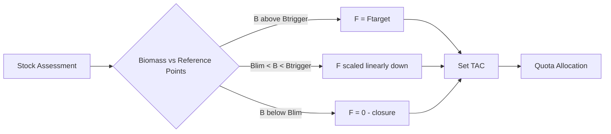
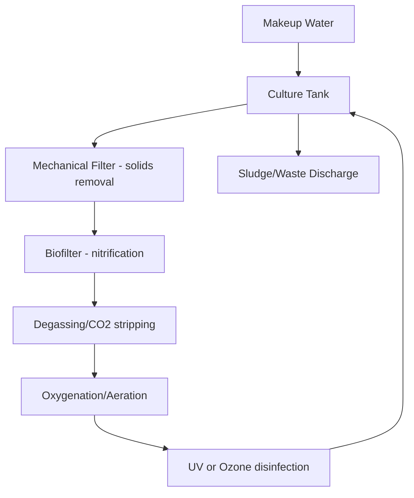

## Fisheries Science and Marine Resource Management

### Overview

Fisheries science is the applied, interdisciplinary study of aquatic populations, their environments, and the human systems that exploit them. It integrates population dynamics, oceanography, ecology, economics, and governance to sustain fish stocks while supporting food security and livelihoods. Marine resource management extends this to broader ocean ecosystems, addressing habitat protection, biodiversity conservation, and the trade-offs between extraction and conservation.

### Population Dynamics and Stock Assessment

**Key Points**

- A fish stock is a population unit with distinct growth, mortality, and reproductive parameters, usually defined by geography, genetics, or management convenience.
- Stock assessment estimates abundance, exploitation rate, and biological reference points to guide catch limits.

Population growth in fisheries is commonly modeled using surplus production models, the simplest being the **Schaefer model**:

$$\frac{dB}{dt} = rB\left(1 - \frac{B}{K}\right) - C$$

where $B$ is biomass, $r$ is the intrinsic growth rate, $K$ is carrying capacity, and $C$ is catch. Setting $dB/dt = 0$ and solving for catch yields the **Maximum Sustainable Yield (MSY)**:

$$MSY = \frac{rK}{4}$$

MSY occurs at $B = K/2$, the biomass level theoretically producing the highest sustainable surplus.

More detailed **age-structured models** (e.g., Virtual Population Analysis, statistical catch-at-age) track cohorts through time using natural mortality ($M$), fishing mortality ($F$), and recruitment. The relationship between spawning stock and recruitment is often modeled with the **Beverton-Holt** or **Ricker** stock-recruitment functions:

Beverton-Holt: $R = \dfrac{\alpha S}{1 + \beta S}$

Ricker: $R = \alpha S e^{-\beta S}$

where $R$ is recruitment, $S$ is spawning stock, and $\alpha$, $\beta$ are fitted parameters. The Ricker function permits recruitment decline at high stock sizes (overcompensation), while Beverton-Holt asymptotes.

[Inference] Model choice between Beverton-Holt and Ricker is often species- and data-dependent, and misspecification can bias reference points; practitioners typically fit both and compare using information criteria such as AIC.

### Reference Points and Harvest Control Rules

Modern fisheries management relies on biological reference points to define sustainable exploitation boundaries:

| Reference Point | Symbol | Definition |
| --- | --- | --- |
| Maximum Sustainable Yield biomass | $B_{MSY}$ | Biomass producing MSY |
| Fishing mortality at MSY | $F_{MSY}$ | Exploitation rate consistent with MSY |
| Limit reference point | $B_{lim}$ | Biomass below which recruitment is impaired |
| Target reference point | $B_{target}$ | Management goal, often $B_{MSY}$ or higher |

A **harvest control rule (HCR)** translates stock status into an allowable catch or fishing mortality, typically ramping F down as biomass falls between $B_{trigger}$ and $B_{lim}$:

### Fishing Mortality and Effort

Fishing mortality is a function of effort and catchability:

$$F = qE$$

where $q$ is catchability (probability of capture per unit effort) and $E$ is fishing effort (e.g., boat-days, trawl-hours). Total mortality $Z$ combines fishing and natural mortality:

$$Z = F + M$$

Catch is estimated via the **Baranov catch equation**:

$$C = \frac{F}{Z}N\left(1 - e^{-Z}\right)$$

where $N$ is the number of individuals at the start of the period. [Unverified] Catchability $q$ is frequently assumed constant in simple models, but empirically it can vary with fish schooling behavior, gear technology creep, and environmental conditions—an issue known as hyperstability, which can mask stock declines in catch-per-unit-effort (CPUE) indices.

### Marine Ecosystem Considerations

**Trophic Structure**

Fisheries operate within food webs, and single-species management increasingly gives way to **Ecosystem-Based Fisheries Management (EBFM)**, which accounts for predator-prey interactions, forage fish dynamics, and habitat dependencies. The **Marine Trophic Index (MTI)**, tracking the mean trophic level of landed catch over time, is used to detect "fishing down the food web," where high-trophic predators are progressively depleted and catch composition shifts toward lower-trophic species.

**Bycatch and Habitat Impacts**

- Bycatch: non-target species caught incidentally, a major driver of marine mammal, seabird, and sea turtle mortality.
- Habitat degradation: bottom trawling can physically damage benthic structures such as coral and seagrass beds, reducing habitat complexity and juvenile fish survival.

**Mitigation technologies** include Turtle Excluder Devices (TEDs), circle hooks (reducing sea turtle and shark bycatch in longline fisheries), and Bycatch Reduction Devices (BRDs) in trawl nets.

### Aquaculture as a Complementary Sector

Aquaculture now supplies more than half of global seafood for human consumption. Systems range from extensive pond culture to intensive Recirculating Aquaculture Systems (RAS).

**Example**

A RAS operates on a closed-loop principle:

The biofilter converts toxic ammonia (NH₃) to less toxic nitrate via nitrification:

$$NH_3 \rightarrow NO_2^- \rightarrow NO_3^-$$

[Inference] RAS systems reduce water use and effluent discharge substantially compared to open pond or net-pen systems, though actual reductions depend on stocking density, species, and system design, and capital/energy costs are typically higher.

**Concerns specific to marine aquaculture** include escapement of farmed fish (genetic introgression into wild populations), nutrient loading near net pens, and sea lice transfer between farmed and wild salmonids.

### Governance Frameworks

**International Law**

The **United Nations Convention on the Law of the Sea (UNCLOS)** establishes the **Exclusive Economic Zone (EEZ)**, extending 200 nautical miles from a coastal state's baseline, within which the state has sovereign rights over fisheries and other resources. Beyond EEZs lie the **High Seas**, governed increasingly by **Regional Fisheries Management Organizations (RFMOs)** such as ICCAT (tuna) and CCAMLR (Southern Ocean).

**Rights-Based Management**

- **Individual Transferable Quotas (ITQs):** allocate a share of the Total Allowable Catch (TAC) to individual fishers or vessels, tradable on a market. Associated with reduced overcapacity and the "race to fish" in systems like New Zealand's Quota Management System.
- **Territorial Use Rights in Fisheries (TURFs):** grant exclusive access to a defined area, common in small-scale and community-based management (e.g., Philippine municipal waters under the Fisheries Code).
- **Co-management:** shared authority between government and local resource users, often implemented through Fisheries and Aquatic Resource Management Councils (FARMCs) in the Philippine context.

**Marine Protected Areas (MPAs)**

MPAs restrict or prohibit extraction within defined boundaries. **No-take marine reserves** are the most restrictive category and are associated with **spillover effects**, where increased biomass and reproductive output inside reserve boundaries enhance adjacent fisheries. [Inference] Spillover magnitude is highly site- and species-specific, depending on reserve size, adult and larval mobility, and enforcement effectiveness.

### Illegal, Unreported, and Unregulated (IUU) Fishing

IUU fishing undermines stock assessments and management effectiveness by introducing unaccounted mortality. Countermeasures include:

- **Vessel Monitoring Systems (VMS)** and **Automatic Identification System (AIS)** satellite tracking
- **Catch documentation schemes** verifying legal origin through the supply chain
- **Port State Measures Agreement (PSMA)**, denying port access to vessels suspected of IUU activity

### Climate Change Interactions

Ocean warming, acidification, and deoxygenation are reshaping fisheries productivity:

- **Range shifts:** Many stocks are moving poleward or to greater depths as species track thermal preferences, complicating jurisdictional allocation between neighboring states or RFMOs.
- **Ocean acidification:** Declining pH (via increased dissolved CO₂ forming carbonic acid) impairs calcification in shellfish and some plankton, with cascading effects on food webs.
- **Phenological mismatch:** Shifts in the timing of primary production relative to fish spawning and larval feeding windows.

$$CO_2 + H_2O \rightleftharpoons H_2CO_3 \rightleftharpoons H^+ + HCO_3^-$$

The increase in $H^+$ ion concentration lowers pH and reduces carbonate ion ($CO_3^{2-}$) availability needed for calcium carbonate shell and skeleton formation.

### Stock Status Diagram

Below is an illustration of the classic biomass-based sustainability framework, the **Kobe plot**, used to visualize stock status relative to $B/B_{MSY}$ and $F/F_{MSY}$.

<svg xmlns="http://www.w3.org/2000/svg" viewBox="0 0 500 420" font-family="sans-serif">
<text x="250" y="20" text-anchor="middle" font-size="15" font-weight="bold">Kobe Plot: Stock Status Framework (svg_diagram)</text>

<rect x="60" y="40" width="180" height="150" fill="#f9d67a" opacity="0.6" />
<rect x="240" y="40" width="180" height="150" fill="#8fd18f" opacity="0.6" />
<rect x="60" y="190" width="180" height="150" fill="#e05c5c" opacity="0.6" />
<rect x="240" y="190" width="180" height="150" fill="#f9d67a" opacity="0.6" />

<line x1="60" y1="340" x2="420" y2="340" stroke="black" stroke-width="2" />
<line x1="60" y1="40" x2="60" y2="340" stroke="black" stroke-width="2" />

<text x="240" y="370" text-anchor="middle" font-size="13">B / B_MSY</text>

<text x="25" y="190" text-anchor="middle" font-size="13" transform="rotate(-90 25 190)">F / F_MSY</text>

<line x1="240" y1="40" x2="240" y2="340" stroke="black" stroke-width="1" stroke-dasharray="4" />
<line x1="60" y1="190" x2="420" y2="190" stroke="black" stroke-width="1" stroke-dasharray="4" />
<text x="240" y="355" text-anchor="middle" font-size="11">1.0</text>
<text x="45" y="193" text-anchor="middle" font-size="11">1.0</text>

<text x="150" y="115" text-anchor="middle" font-size="12" font-weight="bold">Overfished,</text>

<text x="150" y="130" text-anchor="middle" font-size="12" font-weight="bold">Not Overfishing</text>

<text x="330" y="115" text-anchor="middle" font-size="12" font-weight="bold">Healthy Stock</text>

<text x="330" y="130" text-anchor="middle" font-size="12" font-weight="bold">(Sustainable)</text>

<text x="150" y="265" text-anchor="middle" font-size="12" font-weight="bold">Overfished AND</text>

<text x="150" y="280" text-anchor="middle" font-size="12" font-weight="bold">Overfishing</text>

<text x="150" y="295" text-anchor="middle" font-size="11">(Critical)</text>

<text x="330" y="265" text-anchor="middle" font-size="12" font-weight="bold">Not Overfished,</text>

<text x="330" y="280" text-anchor="middle" font-size="12" font-weight="bold">but Overfishing</text>

<circle cx="350" cy="150" r="5" fill="black" />
<circle cx="300" cy="200" r="5" fill="black" />
<circle cx="220" cy="260" r="5" fill="black" />
<circle cx="150" cy="280" r="6" fill="darkred" />
<line x1="350" y1="150" x2="300" y2="200" stroke="black" stroke-width="1.5" />
<line x1="300" y1="200" x2="220" y2="260" stroke="black" stroke-width="1.5" />
<line x1="220" y1="260" x2="150" y2="280" stroke="black" stroke-width="1.5" />
<text x="150" y="300" text-anchor="middle" font-size="10" fill="darkred">Current Year</text>
</svg>

### Practical Example: Setting a Total Allowable Catch

**Example**

Given a stock with $K = 100{,}000$ t, $r = 0.4$, currently assessed at $B = 60{,}000$ t:

1. Estimate MSY: $MSY = rK/4 = (0.4 \times 100{,}000)/4 = 10{,}000$ t
2. Determine $B/B_{MSY}$: since $B_{MSY} = K/2 = 50{,}000$ t, $B/B_{MSY} = 60{,}000/50{,}000 = 1.2$ (above target, stock healthy)
3. Apply harvest control rule: because $B > B_{trigger}$, set $F = F_{MSY}$
4. Compute TAC using Baranov or a simplified approximation: $TAC \approx F_{MSY} \times B = 0.2 \times 60{,}000 = 12{,}000$ t (assuming $F_{MSY} \approx r/2 = 0.2$ under the Schaefer model)

[Inference] This simplified worked example uses Schaefer model shortcuts for illustration; operational stock assessments typically rely on age-structured or Bayesian state-space models with substantially more data inputs and uncertainty quantification.

### Philippine Context Note

[Inference] Given regional relevance, Philippine municipal fisheries operate under the **Philippine Fisheries Code (RA 8550, as amended by RA 10654)**, which reserves waters within 15 km of the shoreline for municipal fisherfolk, mandates FARMC co-management structures, and imposes closed seasons (e.g., the annual sardine closed season in the Visayan Sea) to protect spawning aggregations. Verification against the current implementing rules and regulations is recommended for policy-specific applications, as amendments and local ordinances change over time.

### Conclusion

Fisheries science bridges quantitative population biology with governance and economics to manage a renewable but exhaustible resource. Sustainable outcomes depend on integrating reliable stock assessment, precautionary harvest control rules, ecosystem-level thinking, and enforceable governance—particularly as climate change and IUU fishing introduce growing uncertainty into traditional single-species models.

**Related Topics**

- Ecosystem-Based Fisheries Management (EBFM) and multispecies models
- Bayesian state-space stock assessment methods
- Coral reef fisheries and reef resilience
- Marine spatial planning and MPA network design
- Blue carbon ecosystems (mangroves, seagrass) and their fisheries linkages
- Small-scale fisheries data-poor stock assessment methods (e.g., LBB, CMSY)
- Seafood traceability and certification schemes (MSC, ASC)
- Coastal community climate adaptation and fisheries livelihoods