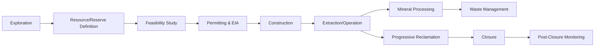

## Mineral and Mining Resource Management

### Overview

Mineral and mining resource management is the interdisciplinary practice of exploring, extracting, processing, and rehabilitating land associated with non-renewable geological resources while minimizing environmental degradation and maximizing long-term social and economic benefit. It integrates geology, environmental science, economics, and policy to govern the full life cycle of mineral resource use, from exploration through post-closure land stewardship.

### Classification of Mineral Resources

**Metallic Minerals**

- Ferrous: iron, manganese, chromium, nickel, cobalt
- Non-ferrous: copper, aluminum (bauxite), lead, zinc, tin
- Precious: gold, silver, platinum-group metals
- Critical/strategic: lithium, cobalt, rare earth elements (REEs), tantalum

**Non-Metallic Minerals**

- Industrial minerals: limestone, gypsum, phosphate, potash, sulfur
- Construction materials: sand, gravel, dimension stone, clay
- Fuel minerals: coal, oil shale, uranium ore

**Resource vs. Reserve Terminology**

- Mineral Resource: a concentration of material of intrinsic economic interest, with reasonable prospects for eventual extraction
- Mineral Reserve: the economically mineable portion of a resource, demonstrated by at least a preliminary feasibility study
- Classifications follow reporting codes such as JORC (Australia), NI 43-101 (Canada), and SEC S-K 1300 (United States), which grade confidence as Measured, Indicated, and Inferred

### The Mining Life Cycle

**Exploration**

- Remote sensing, aeromagnetic and gravimetric surveys, geochemical sampling, and diamond drilling to delineate ore bodies
- Environmental baseline studies (soil, water, air, biodiversity) should begin at this stage to establish pre-mining conditions for later comparison

**Extraction Methods**

- **Surface mining**: open-pit, strip mining, mountaintop removal, quarrying — used where ore bodies are shallow; higher land disturbance footprint
- **Underground mining**: room-and-pillar, longwall, block caving — smaller surface footprint but risks of subsidence and higher operational hazard
- **Placer mining**: extraction from alluvial deposits (e.g., gold panning, dredging)
- **In-situ leaching (ISL)**: chemical solutions injected into ore bodies (common in uranium mining) to dissolve minerals without bulk excavation, reducing surface disturbance but posing groundwater contamination risk

**Mineral Processing**

- Comminution (crushing, grinding), concentration (froth flotation, gravity separation, magnetic separation), and hydrometallurgical or pyrometallurgical extraction
- Generates tailings — finely ground waste rock slurry — and often uses reagents such as cyanide (gold), sulfuric acid (copper leaching), or mercury (artisanal gold amalgamation)

### Environmental Impacts

**Land Disturbance**

- Habitat fragmentation and loss, topography alteration, soil profile destruction
- Overburden and waste rock piles occupy land beyond the mineral footprint itself

**Water Resources**

- **Acid Mine Drainage (AMD)**: oxidation of sulfide minerals (notably pyrite, $FeS_2$) exposed to air and water generates sulfuric acid and mobilizes heavy metals

$$4FeS_2 + 15O_2 + 14H_2O \rightarrow 4Fe(OH)_3 + 8H_2SO_4$$

- AMD can persist for decades to centuries after mine closure if not actively managed, since sulfide oxidation is a self-sustaining reaction once initiated [Inference: duration varies substantially by site geochemistry and remediation effectiveness]
- Tailings dam seepage and catastrophic failures (e.g., Brumadinho, Brazil, 2019; Mount Polley, Canada, 2014) can release contaminated sediment into watersheds
- Dewatering of underground mines can lower regional water tables and dry up wells and springs

**Air Quality**

- Fugitive dust from blasting, hauling, and crushing (particulate matter, $PM_{10}$ and $PM_{2.5}$)
- $SO_2$ emissions from smelting sulfide ores
- Diesel particulate matter and greenhouse gases from heavy equipment

**Soil Contamination**

- Heavy metal accumulation (lead, arsenic, cadmium, mercury) in soils surrounding mine sites and smelters, affecting agricultural land and food chains through bioaccumulation

**Biodiversity**

- Direct habitat loss plus indirect effects: sedimentation of streams, toxic exposure, and barrier effects from infrastructure (roads, pipelines) fragmenting wildlife corridors

### Mine Waste Management

**Tailings Management**

- Tailings Storage Facilities (TSFs): engineered impoundments using upstream, downstream, or centerline dam-raising construction methods; upstream construction is cheaper but more prone to failure under seismic loading or saturation
- Dry stacking and paste tailings: dewatering tailings to reduce water content, improving geotechnical stability and reducing dam-failure risk, though at higher processing cost
- The Global Industry Standard on Tailings Management (GISTM, 2020) establishes consequence-based classification and independent review requirements for TSFs following high-profile failures

**Waste Rock Management**

- Segregation of potentially acid-generating (PAG) versus non-acid-generating (NAG) waste rock using acid-base accounting (ABA) tests
- Encapsulation of PAG material with low-permeability covers to limit oxygen and water ingress

**Water Treatment**

- Active treatment: lime neutralization, sulfide precipitation
- Passive treatment: constructed wetlands, anoxic limestone drains, bioreactors — lower operating cost but require larger land area and longer residence times

### Reclamation and Closure

**Progressive Reclamation**

- Rehabilitating disturbed land concurrently with ongoing operations rather than deferring all restoration to closure, reducing the total disturbed footprint at any given time

**Closure Planning Components**

- Landform reshaping to geotechnically stable, erosion-resistant contours
- Topsoil replacement and revegetation with native or otherwise ecologically appropriate species
- Long-term water management and monitoring of AMD potential
- Financial assurance mechanisms (bonds, trusts, insurance) required by regulators to fund closure even if the operator becomes insolvent

**End Land Uses**

- Options include ecological restoration, agriculture, forestry, recreational areas, or, in some cases, engineered repurposing (e.g., pumped-hydro storage in former pits)

### Regulatory and Governance Frameworks

- **Environmental Impact Assessment (EIA)**: required pre-permitting in most jurisdictions to evaluate predicted impacts and mitigation
- **Extractive Industries Transparency Initiative (EITI)**: global standard for transparency in resource revenue reporting
- **International Council on Mining and Metals (ICMM)**: industry body promoting sustainable development principles
- Jurisdiction-specific frameworks: the U.S. Surface Mining Control and Reclamation Act (SMCRA, coal-specific), Clean Water Act Section 404 permitting for dredge/fill discharges, and equivalent national mining codes elsewhere

### Sustainable and Responsible Mining Practices

- **Life Cycle Assessment (LCA)**: quantifying cumulative environmental burden from extraction through end-of-product-life
- **Circular economy approaches**: urban mining (recovering metals from e-waste and demolition debris), increased recycling rates for copper, aluminum, and steel to reduce virgin extraction demand
- **Responsible sourcing certification**: schemes such as the Initiative for Responsible Mining Assurance (IRMA) and conflict-mineral due diligence under frameworks like the OECD Due Diligence Guidance
- **Community engagement**: Free, Prior, and Informed Consent (FPIC) protocols, particularly relevant where mining affects Indigenous lands
- **Artisanal and Small-Scale Mining (ASM) formalization**: reducing mercury use in gold amalgamation and improving occupational safety in informal mining sectors, which employ tens of millions globally [Unverified: precise global ASM employment figures vary widely by source and year]

### Worked Example: Acid-Base Accounting Screening

A waste rock sample is tested for Net Acid Generating Potential (NAG) using:

$$NAPP = AP - NP$$

Where $AP$ (Acid Potential) is calculated from total sulfur content and $NP$ (Neutralization Potential) from carbonate mineral content, both expressed in kg $CaCO_3$ equivalent per tonne.

- If $NAPP > 0$: material is classified as potentially acid-generating (PAG) and requires encapsulation or active treatment
- If $NAPP \leq 0$: material is generally classified as non-acid-generating (NAG), though confirmatory kinetic testing (humidity cell tests) is standard practice before final classification, since static tests alone can misclassify samples with delayed reactivity

### Illustration: Acid Mine Drainage Pathway (svg_diagram)

<svg xmlns="http://www.w3.org/2000/svg" viewBox="0 0 700 320">
<title>Acid Mine Drainage Pathway (svg_diagram)</title>
<rect x="0" y="0" width="700" height="320" fill="#f5f5f0" />
<text x="350" y="25" font-size="16" text-anchor="middle" font-family="sans-serif" font-weight="bold">Acid Mine Drainage Pathway (svg_diagram)</text>
<rect x="30" y="60" width="140" height="70" fill="#8c8c7a" stroke="#333" />
<text x="100" y="95" font-size="12" text-anchor="middle" font-family="sans-serif">Sulfide-bearing</text>
<text x="100" y="110" font-size="12" text-anchor="middle" font-family="sans-serif">Waste Rock/Tailings</text>
<line x1="170" y1="95" x2="240" y2="95" stroke="#333" stroke-width="2" marker-end="url(#arrow)" />
<text x="205" y="85" font-size="10" text-anchor="middle" font-family="sans-serif">O2 + H2O</text>
<rect x="240" y="60" width="140" height="70" fill="#c98a4b" stroke="#333" />
<text x="310" y="90" font-size="12" text-anchor="middle" font-family="sans-serif">Sulfide</text>
<text x="310" y="105" font-size="12" text-anchor="middle" font-family="sans-serif">Oxidation</text>
<line x1="380" y1="95" x2="450" y2="95" stroke="#333" stroke-width="2" marker-end="url(#arrow)" />
<rect x="450" y="60" width="140" height="70" fill="#b5473a" stroke="#333" />
<text x="520" y="90" font-size="12" text-anchor="middle" font-family="sans-serif">Sulfuric Acid +</text>
<text x="520" y="105" font-size="12" text-anchor="middle" font-family="sans-serif">Dissolved Metals</text>
<line x1="520" y1="130" x2="520" y2="180" stroke="#333" stroke-width="2" marker-end="url(#arrow)" />
<rect x="450" y="180" width="140" height="60" fill="#4a7ba6" stroke="#333" />
<text x="520" y="205" font-size="12" text-anchor="middle" font-family="sans-serif">Surface/Groundwater</text>
<text x="520" y="220" font-size="12" text-anchor="middle" font-family="sans-serif">Contamination</text>
<line x1="450" y1="210" x2="380" y2="210" stroke="#333" stroke-width="2" marker-end="url(#arrow)" />
<rect x="240" y="180" width="140" height="60" fill="#5a8f5a" stroke="#333" />
<text x="310" y="205" font-size="12" text-anchor="middle" font-family="sans-serif">Ecosystem &amp;</text>
<text x="310" y="220" font-size="12" text-anchor="middle" font-family="sans-serif">Drinking Water Impact</text>
<text x="350" y="290" font-size="11" text-anchor="middle" font-family="sans-serif" font-style="italic">Mitigation points: PAG/NAG segregation, encapsulation, passive/active water treatment</text>

</svg>

### Key Points

- Mining management spans the full life cycle: exploration, extraction, processing, waste management, and closure/post-closure monitoring
- Acid mine drainage is among the most persistent and costly environmental liabilities in mining, driven by sulfide oxidation chemistry
- Tailings storage facility design and monitoring are critical risk points, reinforced by post-2019 industry standards like GISTM
- Progressive reclamation and adequate financial assurance are central to preventing "orphaned" mine liabilities
- Circular economy strategies (recycling, urban mining) reduce pressure on virgin resource extraction

### Related Topics

- Environmental Impact Assessment (EIA) methodology
- Water resource management and watershed protection
- Soil remediation and phytoremediation techniques
- Critical mineral supply chains for renewable energy technologies
- Waste management hierarchy and circular economy principles
- Land-use planning and brownfield redevelopment
- Environmental policy and international mining governance frameworks