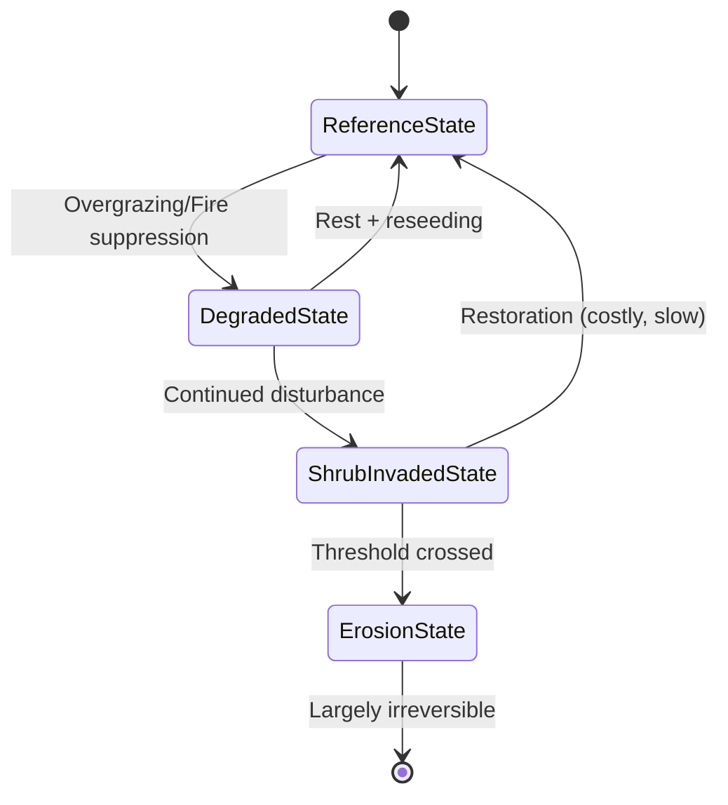

## Rangeland and Grassland Management

### Overview

Rangeland and grassland management is the applied science of sustaining forage production, soil health, hydrological function, biodiversity, and economic livestock or wildlife use on lands dominated by native or naturalized herbaceous and shrub vegetation. Rangelands include grasslands, shrublands, savannas, and some open woodlands that are typically unsuited to cultivated agriculture but support grazing, wildlife habitat, carbon storage, and watershed functions.

### Rangeland Ecosystem Types

- **Temperate grasslands**: prairies (North America), steppes (Eurasia), pampas (South America) — characterized by continental climates, seasonal moisture, and grass-dominated communities
- **Savannas**: tropical/subtropical grasslands with scattered trees, maintained by fire and seasonal rainfall (e.g., African savanna, Cerrado)
- **Shrub-steppe and desert rangelands**: arid systems dominated by drought-tolerant shrubs (e.g., sagebrush steppe, Chihuahuan Desert grassland)
- **Alpine and montane grasslands**: high-elevation systems with short growing seasons and slow recovery from disturbance

### Core Ecological Concepts

**Range Condition and Ecological Site Concept**

- An **Ecological Site** is a distinct kind of land with specific soil and physical characteristics that produces a characteristic plant community under a given disturbance regime
- **State-and-Transition Models (STMs)** describe how a site can exist in multiple stable vegetation "states" (e.g., native perennial grassland vs. shrub-invaded state), with transitions between states triggered by disturbance thresholds (overgrazing, fire suppression, drought) that may not be easily reversible

**Carrying Capacity and Stocking Rate**

- **Carrying capacity**: the maximum animal population a rangeland can sustain over time without degrading the resource base
- **Stocking rate**: the actual number of animals (expressed in Animal Unit Months, AUM) placed on a given area for a given time
- Utilization rate is commonly targeted using the "take half, leave half" guideline, leaving roughly 50% of current year's forage growth ungrazed to maintain plant vigor and root reserves [Inference: exact optimal utilization thresholds vary by species, climate, and site condition]

$$AUM = \frac{Forage\ demand\ per\ animal \times Number\ of\ animals \times Grazing\ days}{30}$$

### Grazing Management Systems

**Continuous Grazing**

- Livestock have unrestricted access to the entire pasture for an extended period
- Simple to manage but risks selective overgrazing of preferred (ice cream) plant species and undergrazing of less palatable ones, shifting community composition over time

**Rotational Grazing**

- Pasture divided into paddocks; livestock moved on a schedule to allow rest and regrowth between grazing events
- Rest periods must align with the physiological recovery time of the dominant forage species, not a fixed calendar interval

**Management-Intensive Grazing (MiG) / Holistic Planned Grazing**

- High stock density for short durations followed by longer rest periods, intended to mimic historic herd-predator dynamics
- Proponents argue this improves litter deposition, nutrient cycling, and root development; the magnitude of soil carbon benefits attributed to intensive rotational grazing versus other systems remains actively debated in the scientific literature [Speculation: claims of large-scale soil carbon sequestration from holistic grazing exceed what is consistently supported by controlled, replicated studies]

**Deferred and Rest-Rotation Grazing**

- Systematically deferring grazing on portions of range during critical growth periods (e.g., seed-set) to allow plant recovery and reseeding

### Rangeland Degradation Processes

**Overgrazing Effects**

- Reduced plant vigor, shortened root systems, decreased basal cover
- Shift in species composition from perennial bunchgrasses toward annual grasses, forbs, or unpalatable shrubs
- Increased bare ground leading to accelerated soil erosion (wind and water)

**Woody Plant Encroachment**

- Fire suppression combined with grazing pressure often allows shrubs and trees (e.g., mesquite, juniper) to encroach into historically grass-dominated systems, reducing herbaceous forage and altering hydrology

**Soil Degradation**

- Compaction from concentrated livestock traffic, particularly near water sources
- Loss of soil organic matter and reduced infiltration capacity, increasing runoff and erosion risk

**Invasive Species**

- Annual grass invasions (e.g., cheatgrass, *Bromus tectorum*, in the North American Great Basin) alter fire regimes by increasing fine fuel continuity, creating a grass-fire cycle that displaces native perennial shrub-steppe vegetation

### Fire Ecology in Rangeland Management

- Many grassland and savanna systems are fire-adapted or fire-dependent, with historic fire return intervals shaping species composition
- **Prescribed burning** is used to control woody encroachment, recycle nutrients, and stimulate grass regrowth
- Fire suppression policies in fire-adapted rangelands can shift systems toward woody dominance, a state that may cross an ecological threshold and become resistant to reversal by fire alone

### Range Monitoring and Assessment

**Vegetation Monitoring Methods**

- Line-point intercept: quantifies plant species cover, bare ground, and litter along transects
- Belt transects and quadrat sampling for species composition and density
- Photo-point monitoring for qualitative, long-term visual trend documentation

**Rangeland Health Indicators**

- Soil/site stability, hydrologic function, and biotic integrity — the three core attributes assessed under frameworks such as the U.S. Interpreting Indicators of Rangeland Health (IIRH) protocol
- Remote sensing and satellite-derived indices (e.g., NDVI — Normalized Difference Vegetation Index) increasingly supplement ground-based monitoring for large-scale trend detection

$$NDVI = \frac{NIR - Red}{NIR + Red}$$

### Restoration Practices

- **Reseeding**: using native or adapted species following disturbance or fire, particularly critical in cheatgrass-prone systems to outcompete invasive annuals before they establish
- **Brush management**: mechanical (chaining, mastication), chemical (herbicide), or prescribed fire treatments to reduce woody encroachment and restore herbaceous cover
- **Water development**: strategically placed stock tanks and troughs to distribute grazing pressure more evenly and reduce riparian degradation from concentrated watering-point use
- **Riparian buffer management**: fencing or seasonal exclusion of livestock from streambanks to protect sensitive riparian vegetation and water quality

### Rangelands and Carbon/Climate

- Grasslands store a substantial share of their carbon belowground in root biomass and soil organic matter, making them comparatively resilient to fire-driven carbon loss relative to forests [Inference: relative resilience depends on fire severity, soil type, and grazing regime]
- Grassland conversion to cropland is a significant source of soil carbon loss; conversely, well-managed perennial grassland can act as a net carbon sink over time, though sequestration rates and permanence remain subjects of ongoing research and are sensitive to future management continuity

### Governance and Policy Frameworks

- Public rangeland management in the U.S. is governed under frameworks such as the Taylor Grazing Act and Federal Land Policy and Management Act (FLPMA), administered by agencies like the Bureau of Land Management (BLM) and U.S. Forest Service
- Communal and pastoral rangeland systems (e.g., in East Africa, Central Asia, Mongolia) often rely on customary tenure and mobility-based grazing strategies (transhumance) adapted to spatially and temporally variable forage availability
- Grazing permits, allotment management plans, and adaptive management frameworks are common regulatory tools balancing livestock production with conservation objectives

### Worked Example: Stocking Rate Calculation

A 200-hectare pasture produces an estimated 1,500 kg/ha of usable forage annually. Using a 50% utilization guideline (750 kg/ha usable), total usable forage is:

$$750\ kg/ha \times 200\ ha = 150{,}000\ kg$$

If one Animal Unit (a 450 kg cow) consumes approximately 350 kg of forage per month (AUM), the pasture's carrying capacity is:

$$\frac{150{,}000\ kg}{350\ kg/AUM} \approx 428\ AUMs$$

This could support roughly 35 animal units for a 12-month grazing period, or a higher number over a shorter rotational season — illustrating how stocking decisions must be matched to forage production and desired utilization intensity. [Inference: actual figures require site-specific forage production and utilization data]

### Illustration: Grazing Rotation and Recovery Cycle (svg_diagram)

<svg xmlns="http://www.w3.org/2000/svg" viewBox="0 0 700 300">
<title>Rotational Grazing Recovery Cycle (svg_diagram)</title>
<rect x="0" y="0" width="700" height="300" fill="#f7f5ef" />
<text x="350" y="25" font-size="16" text-anchor="middle" font-family="sans-serif" font-weight="bold">Rotational Grazing Recovery Cycle (svg_diagram)</text>
<circle cx="350" cy="170" r="110" fill="none" stroke="#333" stroke-width="1.5" stroke-dasharray="4,3" />
<circle cx="350" cy="60" r="45" fill="#7ba05b" stroke="#333" />
<text x="350" y="55" font-size="11" text-anchor="middle" font-family="sans-serif">Paddock A</text>
<text x="350" y="68" font-size="11" text-anchor="middle" font-family="sans-serif">Grazed</text>
<circle cx="460" cy="130" r="45" fill="#a9c98a" stroke="#333" />
<text x="460" y="125" font-size="11" text-anchor="middle" font-family="sans-serif">Paddock B</text>
<text x="460" y="138" font-size="11" text-anchor="middle" font-family="sans-serif">Resting</text>
<circle cx="420" cy="250" r="45" fill="#c9dfae" stroke="#333" />
<text x="420" y="245" font-size="11" text-anchor="middle" font-family="sans-serif">Paddock C</text>
<text x="420" y="258" font-size="11" text-anchor="middle" font-family="sans-serif">Recovered</text>
<circle cx="280" cy="250" r="45" fill="#7ba05b" stroke="#333" />
<text x="280" y="245" font-size="11" text-anchor="middle" font-family="sans-serif">Paddock D</text>
<text x="280" y="258" font-size="11" text-anchor="middle" font-family="sans-serif">Grazed Next</text>
<circle cx="240" cy="130" r="45" fill="#c9dfae" stroke="#333" />
<text x="240" y="125" font-size="11" text-anchor="middle" font-family="sans-serif">Paddock E</text>
<text x="240" y="138" font-size="11" text-anchor="middle" font-family="sans-serif">Recovering</text>
<path d="M 385,95 A 100,100 0 0,1 452,170" fill="none" stroke="#333" stroke-width="2" marker-end="url(#arrow2)" />
<path d="M 460,175 A 100,100 0 0,1 420,205" fill="none" stroke="#333" stroke-width="2" marker-end="url(#arrow2)" />
<path d="M 375,255 A 100,100 0 0,1 285,255" fill="none" stroke="#333" stroke-width="2" marker-end="url(#arrow2)" />
<path d="M 265,213 A 100,100 0 0,1 235,175" fill="none" stroke="#333" stroke-width="2" marker-end="url(#arrow2)" />
<path d="M 260,95 A 100,100 0 0,1 320,60" fill="none" stroke="#333" stroke-width="2" marker-end="url(#arrow2)" />
</svg>

### Key Points

- The state-and-transition model framework, not a linear degradation gradient, best explains how rangelands shift between vegetation states, some of which are resistant to reversal
- Stocking rate must be matched to site-specific forage production and utilization targets rather than fixed regional averages
- Fire suppression and altered grazing regimes are major drivers of woody plant encroachment and invasive annual grass cycles
- Monitoring frameworks combining ground transects with remote sensing (e.g., NDVI) support adaptive, evidence-based management
- Claims about grazing systems and soil carbon sequestration should be treated with appropriate scientific caution given ongoing debate in the literature

### Related Topics

- Soil erosion and conservation practices
- Fire ecology and prescribed burning management
- Invasive species control and biological invasions
- Watershed and riparian zone management
- Wildlife habitat management on multi-use lands
- Climate change adaptation in agricultural and pastoral systems
- Land tenure systems and common-pool resource governance