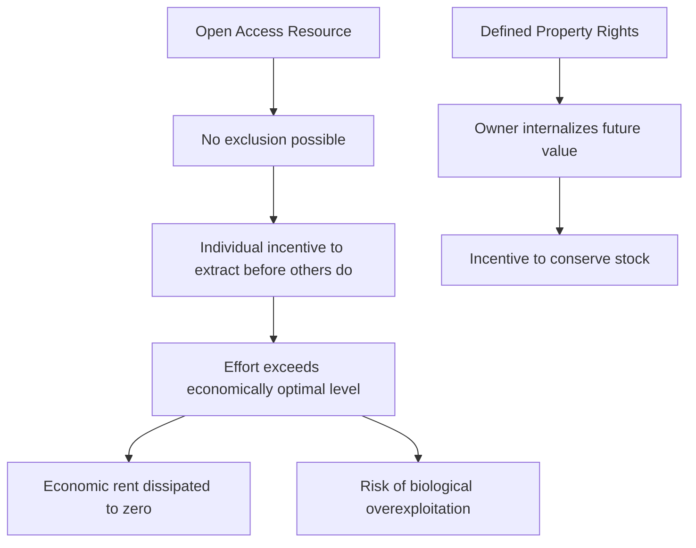

## Resource Economics and Sustainable Yield

### Overview

Resource economics applies economic theory to the allocation, valuation, and management of natural resources over time, addressing how markets, property rights, and policy instruments influence extraction rates, conservation incentives, and intergenerational equity. Sustainable yield concepts provide the biological and economic basis for determining extraction or harvest levels that can be maintained indefinitely without depleting the underlying resource stock.

### Classification of Natural Resources

**Renewable Resources**

- Biological/flow resources capable of regeneration: fisheries, forests, wildlife populations, freshwater systems
- Regeneration rate is finite and can be exceeded by extraction, converting a renewable resource into a functionally depleting one

**Non-Renewable Resources**

- Stock resources with negligible regeneration on human timescales: fossil fuels, minerals, groundwater in non-recharging aquifers
- Management focus shifts from sustainable yield to optimal depletion rate and intergenerational allocation

**Common-Pool Resources**

- Resources characterized by non-excludability (difficult to prevent access) and rivalry (one user's extraction reduces availability to others): open-ocean fisheries, groundwater basins, grazing commons
- Prone to the "tragedy of the commons" dynamic absent effective governance institutions

### Core Concepts in Sustainable Yield

**Maximum Sustainable Yield (MSY)**

- The largest harvest that can be extracted from a renewable resource stock indefinitely, without causing the population to decline over time
- Derived from population growth models, most commonly the logistic (Schaefer) growth model:

$$\frac{dN}{dt} = rN\left(1 - \frac{N}{K}\right) - H$$

Where $N$ is population size, $r$ is intrinsic growth rate, $K$ is carrying capacity, and $H$ is harvest rate. MSY occurs at $N = K/2$, where population growth rate is maximized.

$$MSY = \frac{rK}{4}$$

**Limitations of MSY**

- Assumes a stable, well-characterized growth curve, which is frequently violated by real populations subject to environmental variability, age-structure effects, and multi-species interactions
- Managing precisely at $N = K/2$ leaves little buffer against estimation error or stochastic shocks, historically contributing to stock collapses when MSY was applied as a rigid extraction target rather than an upper bound [Inference: the degree to which MSY mismanagement versus other factors, such as illegal fishing or habitat loss, drove specific historical collapses varies by case and is debated in fisheries literature]

**Optimal Sustainable Yield (OSY)**

- A refinement incorporating economic, social, and ecological objectives beyond pure biological maximization, often set below MSY to provide a safety margin and account for ecosystem services, bycatch, and economic efficiency

### Economic Efficiency in Resource Extraction

**Static Efficiency**

- Allocating a resource among current users to maximize net economic benefit at a single point in time, without regard to future availability

**Dynamic Efficiency**

- Allocating resource extraction across time to maximize the present value of net benefits, explicitly accounting for the opportunity cost of extracting now versus conserving for future use

**Hotelling's Rule (Non-Renewable Resources)**

- Under competitive markets and efficient allocation, the marginal net price (price minus marginal extraction cost) of a non-renewable resource should rise at a rate equal to the discount rate over time

$$\frac{dP}{dt} = rP$$

- This provides a benchmark for socially efficient depletion, though real-world resource prices frequently deviate from Hotelling's predicted path due to technological change, new discoveries, market power, and demand shifts [Inference: empirical support for Hotelling's Rule in observed commodity price series is weak in much of the economics literature]

**Discount Rate Selection**

- The choice of discount rate strongly influences optimal extraction and conservation decisions: higher discount rates favor faster present extraction, while lower rates favor conservation for future generations
- Selecting an appropriate social discount rate for long-horizon environmental decisions (e.g., climate policy, biodiversity conservation) remains a contested normative and empirical question

### Market Failures in Natural Resource Use

**Externalities**

- Costs or benefits of resource use that fall on parties outside the market transaction (e.g., downstream water pollution from upstream extraction, carbon emissions from fossil fuel combustion)
- Left uncorrected, externalities cause resources to be over-extracted or under-conserved relative to the socially optimal level

**Open Access and Property Rights**

- Under open access (no defined property rights), individual harvesters have no incentive to conserve, since resources left unharvested may simply be taken by competitors — driving effort beyond the level that maximizes total economic rent

**Solutions to Open Access Problems**

- **Property rights-based approaches**: Individual Transferable Quotas (ITQs) in fisheries, allocating a tradable share of total allowable catch to individual harvesters
- **Regulatory approaches**: total allowable catch (TAC) limits, gear restrictions, seasonal closures, marine protected areas
- **Community-based management**: customary or co-management institutions governing local commons, as documented extensively in Elinor Ostrom's work on common-pool resource governance
- **Taxation and Pigouvian instruments**: taxes or fees set equal to the marginal external cost to internalize externalities

### Valuation of Natural Resources and Ecosystem Services

**Total Economic Value (TEV) Framework**

- **Use values**: direct (timber, fish harvest), indirect (flood regulation, pollination), and option value (potential future use)
- **Non-use values**: existence value (value placed on a resource's existence independent of use) and bequest value (value of preserving a resource for future generations)

**Valuation Methods**

- **Revealed preference methods**: travel cost method (inferring recreational value from travel expenditure), hedonic pricing (inferring environmental value from property price differentials)
- **Stated preference methods**: contingent valuation (survey-based willingness-to-pay elicitation), choice experiments
- **Production function approaches**: valuing ecosystem services (e.g., wetland flood attenuation) based on their contribution to marketed outputs or avoided damages
- Non-market valuation methods carry inherent methodological uncertainty and are sensitive to survey design and framing; results should be interpreted as informative estimates rather than precise market-equivalent prices [Inference: degree of uncertainty varies by method and application context]

### Policy Instruments for Sustainable Resource Management

**Command-and-Control Regulation**

- Direct limits: catch quotas, harvest bans, protected area designation, technology mandates
- Straightforward to enforce conceptually but can be economically inefficient if uniform standards ignore variation in compliance costs across users

**Market-Based Instruments**

- **Cap-and-trade systems**: setting an aggregate extraction/emission cap and allowing tradable permits (e.g., ITQs in fisheries, carbon cap-and-trade)
- **Resource taxes and royalties**: severance taxes on mineral and timber extraction, water abstraction charges
- **Payments for Ecosystem Services (PES)**: compensating landholders for maintaining ecosystem services (e.g., forest carbon storage, watershed protection)

**Comparative Trade-offs**

| Instrument | Cost-Effectiveness | Administrative Complexity | Distributional Equity Concerns |
| --- | --- | --- | --- |
| Command-and-control | Lower | Moderate | Generally more predictable outcomes |
| ITQs/Cap-and-trade | Higher | High (monitoring, enforcement) | Initial allocation can concentrate access |
| Taxes/royalties | Higher | Moderate | Revenue can be redistributed |
| Community co-management | Context-dependent | Low-Moderate (locally) | Can strengthen local equity if well-designed |

### Sustainable Yield Beyond Fisheries

**Forestry: Sustained Yield Management**

- Analogous to MSY, sustained yield forestry targets a harvest rate matching the mean annual increment (MAI) of forest growth, maintaining a constant or non-declining timber flow over successive rotations
- Modern forest management increasingly incorporates multiple-use and ecosystem-based approaches rather than timber-volume-maximizing sustained yield alone

**Groundwater: Safe Yield**

- The withdrawal rate from an aquifer that can be sustained without long-term water table decline, saltwater intrusion (in coastal aquifers), or land subsidence
- Determining safe yield is complicated by delayed aquifer response times, meaning current extraction impacts may not be observable for years to decades [Inference: response lag length is highly aquifer-specific]

### Worked Example: MSY Calculation

A fish population has an intrinsic growth rate $r = 0.4\ yr^{-1}$ and estimated carrying capacity $K = 100{,}000$ tonnes.

$$MSY = \frac{rK}{4} = \frac{0.4 \times 100{,}000}{4} = 10{,}000\ tonnes/year$$

This yield is only sustainable if the population is maintained near $N = K/2 = 50{,}000$ tonnes. If the population is fished down below this threshold (e.g., due to a period of harvest exceeding 10,000 tonnes/year, or to environmental variation reducing $r$), continuing to harvest at the nominal MSY level would drive further population decline rather than maintain equilibrium — illustrating why MSY functions better as an upper reference point than a fixed annual target. [Inference: real fisheries management typically applies a buffer below calculated MSY for this reason]

### Illustration: Logistic Growth and MSY (svg_diagram)

<svg xmlns="http://www.w3.org/2000/svg" viewBox="0 0 700 350">
<title>Logistic Growth Curve and Maximum Sustainable Yield (svg_diagram)</title>
<rect x="0" y="0" width="700" height="350" fill="#f7f5ef" />
<text x="350" y="25" font-size="16" text-anchor="middle" font-family="sans-serif" font-weight="bold">Logistic Growth and MSY (svg_diagram)</text>
<line x1="60" y1="300" x2="640" y2="300" stroke="#333" stroke-width="1.5" />
<line x1="60" y1="300" x2="60" y2="50" stroke="#333" stroke-width="1.5" />
<text x="350" y="330" font-size="12" text-anchor="middle" font-family="sans-serif">Population Size (N)</text>
<text x="25" y="175" font-size="12" text-anchor="middle" font-family="sans-serif" transform="rotate(-90 25 175)">Growth Rate</text>
<path d="M 60,300 Q 350,50 640,300" fill="none" stroke="#4a7ba6" stroke-width="2.5" />
<line x1="350" y1="300" x2="350" y2="90" stroke="#b5473a" stroke-width="1.5" stroke-dasharray="4,3" />
<circle cx="350" cy="90" r="5" fill="#b5473a" />
<text x="350" y="75" font-size="11" text-anchor="middle" font-family="sans-serif" fill="#b5473a">MSY point (N=K/2)</text>
<line x1="60" y1="300" x2="60" y2="295" stroke="#333" />
<text x="60" y="315" font-size="10" text-anchor="middle" font-family="sans-serif">0</text>
<text x="640" y="315" font-size="10" text-anchor="middle" font-family="sans-serif">K</text>
<text x="350" y="315" font-size="10" text-anchor="middle" font-family="sans-serif">K/2</text>
</svg>

### Key Points

- Maximum Sustainable Yield provides a biologically derived reference point but functions best as an upper bound with a management buffer, not a fixed extraction target
- Open-access conditions systematically drive over-extraction because individual harvesters cannot capture the future value of conservation
- Property rights instruments (ITQs), regulatory limits, and community co-management represent alternative institutional solutions to the commons problem, each with different efficiency and equity trade-offs
- Hotelling's Rule provides a theoretical efficient depletion path for non-renewable resources, though empirical price data often deviate from its predictions
- Total Economic Value frameworks extend resource valuation beyond direct market use to include option, existence, and bequest values

### Related Topics

- Fisheries stock assessment and quota-setting methodologies
- Ecosystem services valuation techniques
- Common-pool resource governance (Ostrom's design principles)
- Environmental cost-benefit analysis and discounting
- Payments for Ecosystem Services (PES) program design
- Forest management and sustained-yield silviculture
- Groundwater hydrology and aquifer management