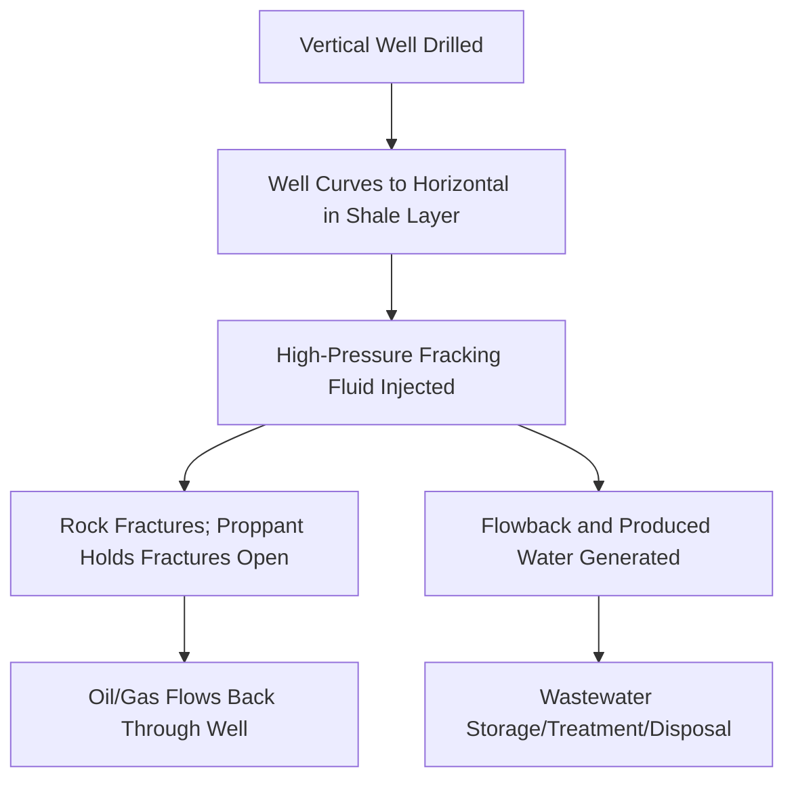

## Fossil Fuel Extraction and Environmental Impacts

### Overview

Fossil fuel extraction encompasses the exploration, drilling, mining, and processing of coal, petroleum, and natural gas — energy resources formed over geological timescales from the compression and heating of ancient organic matter. Extraction and combustion of these resources drive substantial environmental impacts across land, water, air, and climate systems, making the sector a central focus of environmental science and energy policy.

### Fossil Fuel Types and Formation

**Coal**

- Formed from compressed plant material (peat → lignite → bituminous → anthracite) over millions of years under heat and pressure
- Classified by carbon content and heating value, which determine combustion efficiency and pollutant characteristics

**Petroleum (Crude Oil)**

- Formed from marine organic matter (primarily phytoplankton and algae) buried under sediment and subjected to heat and pressure (the "oil window," roughly 60–150°C)
- Occurs in conventional reservoirs (permeable rock trapping migrated oil) and unconventional deposits (tight oil, oil sands)

**Natural Gas**

- Primarily methane ($CH_4$), formed similarly to petroleum or via deeper thermogenic processes; also occurs as biogenic gas from shallow microbial decomposition
- Found in conventional reservoirs, tight formations, coalbed methane deposits, and shale formations

### Extraction Methods

**Coal Mining**

- Surface mining: strip mining, open-pit, and mountaintop removal mining (MTR) — used for shallow seams; MTR involves removing entire ridge tops and depositing overburden ("spoil") into adjacent valleys
- Underground mining: room-and-pillar and longwall methods — longwall mining causes systematic surface subsidence as the extracted panel collapses behind the advancing cutting face

**Conventional Oil and Gas Drilling**

- Vertical or directional drilling into permeable reservoir rock where hydrocarbons have naturally migrated and accumulated beneath an impermeable cap rock
- Primary recovery relies on natural reservoir pressure; secondary recovery (waterflooding) and tertiary/enhanced oil recovery (EOR, e.g., $CO_2$ injection, steam injection) are used as reservoir pressure declines

**Unconventional Extraction: Hydraulic Fracturing ("Fracking")**

- Used to extract oil and gas from low-permeability shale formations
- Process: a horizontal well is drilled into the target shale layer, then high-pressure fluid (water, sand proppant, and chemical additives) is injected to fracture the rock and create pathways for hydrocarbon flow

- **Oil Sands (Tar Sands) Extraction**: surface mining (for shallow deposits) or in-situ methods such as Steam-Assisted Gravity Drainage (SAGD), which injects steam to reduce bitumen viscosity so it can be pumped to the surface; both methods are energy- and water-intensive relative to conventional oil extraction

### Environmental Impacts by Category

**Land Impacts**

- Habitat destruction and fragmentation from well pads, access roads, pipelines, and mining footprints
- Mountaintop removal mining permanently alters topography and buries headwater streams under valley fill
- Land subsidence from longwall coal mining and some in-situ extraction techniques

**Water Impacts**

- **Water consumption**: hydraulic fracturing and oil sands extraction require large volumes of water per well/unit of production, which can strain local water resources in water-scarce regions
- **Produced water and flowback**: fracking generates wastewater containing dissolved salts, hydrocarbons, naturally occurring radioactive materials (NORM), and residual fracking chemicals, requiring treatment, deep-well injection disposal, or recycling
- **Induced seismicity**: deep-well injection disposal of wastewater has been associated with increased earthquake frequency in some regions (e.g., Oklahoma, USA), primarily linked to wastewater disposal wells rather than the fracturing process itself [Inference: attribution varies by specific well and geological setting, and remains an active area of seismological study]
- **Groundwater contamination risk**: potential pathways include well casing failures allowing methane or fluid migration into aquifers, and surface spills of fracking fluids or produced water
- Acid mine drainage from coal mining (see sulfide oxidation chemistry), contaminating streams with heavy metals and lowering pH

**Air Quality Impacts**

- **Coal combustion emissions**: sulfur dioxide ($SO_2$), nitrogen oxides ($NO_x$), particulate matter, and mercury; historically a major contributor to acid rain and regional haze
- **Fugitive methane emissions**: leaks from wellheads, pipelines, and processing facilities across the oil and gas supply chain; methane has a global warming potential substantially higher than $CO_2$ over a 20-year timeframe, making leak rates a significant factor in the net climate impact of natural gas as a "bridge fuel"
- **Volatile Organic Compounds (VOCs)**: released during drilling, flaring, and processing, contributing to ground-level ozone formation near extraction sites
- **Flaring**: burning off associated gas at oil wells when capture infrastructure is unavailable, releasing $CO_2$, black carbon, and unburned methane

**Climate Impacts**

- Combustion of fossil fuels is the dominant anthropogenic source of atmospheric $CO_2$ increase since the industrial era
- Lifecycle greenhouse gas accounting for fossil fuels must include both combustion emissions and upstream "fugitive" emissions from extraction and transport, with methane leakage rates being a key variable affecting comparative climate impact assessments between fuel types

### Comparative Environmental Profile

| Impact Category | Coal | Conventional Oil/Gas | Unconventional (Shale/Oil Sands) |
| --- | --- | --- | --- |
| Land disturbance | High (surface mining) | Moderate | Moderate–High |
| Water use intensity | Moderate (processing) | Low–Moderate | High (fracking, SAGD) |
| Air pollutants (SO2, NOx, PM) | High | Lower | Lower–Moderate |
| GHG intensity (lifecycle) | Highest per unit energy | Lower than coal | Variable; sensitive to methane leakage |
| Water contamination risk | AMD, heavy metals | Spill risk | Flowback/produced water, induced seismicity |

### Regulatory and Mitigation Approaches

**Regulatory Frameworks**

- Environmental Impact Assessments required prior to permitting in most jurisdictions
- Well construction standards (casing and cementing requirements) to reduce groundwater contamination risk from drilling operations
- Air emissions standards limiting $SO_2$, $NO_x$, and particulate output from combustion facilities (e.g., flue gas desulfurization requirements)
- Methane emission regulations targeting leak detection and repair (LDAR) programs across oil and gas infrastructure

**Mitigation Technologies**

- **Flue gas desulfurization ("scrubbers")**: removes $SO_2$ from coal plant emissions using alkaline sorbents
- **Carbon Capture and Storage (CCS)**: captures $CO_2$ from combustion or industrial processes and injects it into geological formations for long-term storage; deployment remains limited relative to total emissions and involves significant energy penalties and cost [Inference: cost and energy penalty figures vary substantially by capture technology and site conditions]
- **Produced water recycling**: reusing flowback water in subsequent fracking operations to reduce freshwater withdrawal and disposal volume
- **Leak detection and repair (LDAR)**: infrared cameras and sensor networks to identify and reduce fugitive methane emissions

### Reclamation Requirements

- Surface mine reclamation: regrading to approximate original contour (required under frameworks like the U.S. Surface Mining Control and Reclamation Act for coal), topsoil replacement, and revegetation
- Well plugging and abandonment: sealing decommissioned oil and gas wells with cement plugs to prevent long-term fluid or gas migration; orphaned and improperly plugged wells remain a documented source of ongoing methane leakage in many older extraction regions

### Worked Example: Methane Leakage and Climate Comparison

Natural gas combustion produces less $CO_2$ per unit of energy than coal combustion. However, upstream methane leakage offsets part or all of this climate advantage depending on the leak rate, because methane's shorter-lived but much stronger warming effect must be accounted for using a Global Warming Potential (GWP) conversion:

$$CO_2e = CH_4\ mass \times GWP_{20\ or\ 100}$$

Using a 20-year GWP for methane (commonly cited in the 80–85× range relative to $CO_2$ by mass) [Unverified: exact GWP value depends on the IPCC assessment report cited and whether climate-carbon feedbacks are included], studies have found that leak rates above a threshold of roughly 2–3% of total production can erode the climate benefit of switching from coal to gas power generation on a shorter time horizon, though the precise threshold is sensitive to the GWP timeframe chosen and remains debated in the literature. [Inference: this threshold figure is illustrative and varies across published studies and assumptions]

### Illustration: Fossil Fuel Extraction Environmental Pathways (svg_diagram)

<svg xmlns="http://www.w3.org/2000/svg" viewBox="0 0 700 380">
<title>Fossil Fuel Extraction Environmental Impact Pathways (svg_diagram)</title>
<rect x="0" y="0" width="700" height="380" fill="#f7f5ef" />
<text x="350" y="25" font-size="16" text-anchor="middle" font-family="sans-serif" font-weight="bold">Extraction Impact Pathways (svg_diagram)</text>
<rect x="270" y="50" width="160" height="50" fill="#4a4a4a" stroke="#333" />
<text x="350" y="80" font-size="12" text-anchor="middle" font-family="sans-serif" fill="#fff">Extraction Site</text>
<line x1="350" y1="100" x2="150" y2="160" stroke="#333" stroke-width="1.5" marker-end="url(#arrow3)" />
<line x1="350" y1="100" x2="350" y2="160" stroke="#333" stroke-width="1.5" marker-end="url(#arrow3)" />
<line x1="350" y1="100" x2="550" y2="160" stroke="#333" stroke-width="1.5" marker-end="url(#arrow3)" />
<rect x="70" y="160" width="160" height="55" fill="#5a8f5a" stroke="#333" />
<text x="150" y="183" font-size="11" text-anchor="middle" font-family="sans-serif">Land Disturbance</text>
<text x="150" y="198" font-size="11" text-anchor="middle" font-family="sans-serif">Habitat Loss</text>
<rect x="270" y="160" width="160" height="55" fill="#4a7ba6" stroke="#333" />
<text x="350" y="183" font-size="11" text-anchor="middle" font-family="sans-serif" fill="#fff">Water Use/</text>
<text x="350" y="198" font-size="11" text-anchor="middle" font-family="sans-serif" fill="#fff">Contamination</text>
<rect x="470" y="160" width="160" height="55" fill="#b5473a" stroke="#333" />
<text x="550" y="183" font-size="11" text-anchor="middle" font-family="sans-serif" fill="#fff">Air Emissions/</text>
<text x="550" y="198" font-size="11" text-anchor="middle" font-family="sans-serif" fill="#fff">Fugitive Methane</text>
<line x1="150" y1="215" x2="150" y2="270" stroke="#333" stroke-width="1.5" marker-end="url(#arrow3)" />
<line x1="350" y1="215" x2="350" y2="270" stroke="#333" stroke-width="1.5" marker-end="url(#arrow3)" />
<line x1="550" y1="215" x2="550" y2="270" stroke="#333" stroke-width="1.5" marker-end="url(#arrow3)" />
<rect x="70" y="270" width="160" height="55" fill="#c9a34a" stroke="#333" />
<text x="150" y="293" font-size="11" text-anchor="middle" font-family="sans-serif">Biodiversity Loss</text>
<text x="150" y="308" font-size="11" text-anchor="middle" font-family="sans-serif">Erosion</text>
<rect x="270" y="270" width="160" height="55" fill="#c9a34a" stroke="#333" />
<text x="350" y="293" font-size="11" text-anchor="middle" font-family="sans-serif">Aquifer/Surface</text>
<text x="350" y="308" font-size="11" text-anchor="middle" font-family="sans-serif">Water Degradation</text>
<rect x="470" y="270" width="160" height="55" fill="#c9a34a" stroke="#333" />
<text x="550" y="293" font-size="11" text-anchor="middle" font-family="sans-serif">Climate Forcing</text>
<text x="550" y="308" font-size="11" text-anchor="middle" font-family="sans-serif">Regional Air Quality</text>
</svg>

### Key Points

- Extraction method (surface vs. underground vs. unconventional) fundamentally shapes the dominant environmental impact pathway for a given fossil fuel
- Hydraulic fracturing introduces distinct risks — water intensity, produced water management, and induced seismicity from disposal wells — not present in conventional drilling
- Fugitive methane emissions are a critical, often underappreciated factor in the true climate footprint of natural gas relative to coal
- Reclamation and well-plugging obligations are essential to limiting long-term post-extraction environmental liabilities
- Carbon capture and other mitigation technologies can reduce, but do not eliminate, the environmental footprint of continued fossil fuel extraction and use

### Related Topics

- Climate change science and greenhouse gas accounting
- Renewable energy systems and the energy transition
- Air quality regulation and pollution control technologies
- Water resource management and contamination remediation
- Mineral and mining resource management
- Energy policy and carbon pricing mechanisms
- Environmental justice in extraction-affected communities