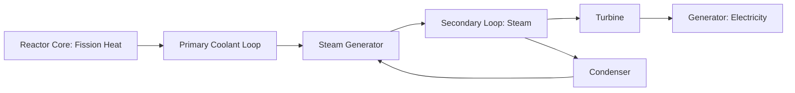

## Nuclear Energy Systems and Safety

### Overview

Nuclear energy systems generate electricity through controlled nuclear fission, releasing energy from the splitting of heavy atomic nuclei to produce heat that drives conventional steam turbine generation. Nuclear power provides high energy density, low operational greenhouse gas emissions, and dispatchable baseload capacity, but requires rigorous engineering safety systems, robust regulatory oversight, and long-term management of radioactive waste due to the hazards associated with radioactive materials and the potential consequences of severe accidents.

### Nuclear Fission Fundamentals

**The Fission Process**

- A neutron strikes a fissile nucleus (commonly uranium-235 or plutonium-239), causing it to split into smaller daughter nuclei, releasing additional neutrons, gamma radiation, and substantial kinetic energy

$$^{235}_{92}U + n \rightarrow fission\ products + 2\text{–}3n + energy\ (\approx 200\ MeV)$$

- Released neutrons can strike additional fissile nuclei, creating a self-sustaining **chain reaction**
- **Criticality** describes the state of the chain reaction: subcritical (reaction dies out), critical (steady, self-sustaining reaction — the operational state of a reactor), and supercritical (reaction rate increases, requiring active control)

**Nuclear Fuel**

- Natural uranium contains approximately 0.7% fissile U-235 and 99.3% non-fissile U-238; most commercial reactors use **enriched uranium** (typically 3–5% U-235) to sustain an efficient chain reaction
- Fuel is fabricated into ceramic uranium dioxide ($UO_2$) pellets, stacked inside sealed metal (typically zirconium alloy) fuel rods

### Reactor Types

**Pressurized Water Reactor (PWR)**

- Most common reactor design globally; uses ordinary ("light") water as both coolant and neutron moderator
- Primary coolant loop is kept under high pressure to prevent boiling, transferring heat via a steam generator to a separate secondary loop that drives the turbine — physically isolating radioactive primary coolant from the turbine system

**Boiling Water Reactor (BWR)**

- Water is allowed to boil directly within the reactor core, and the resulting steam drives the turbine directly, simplifying the system but requiring turbine components to be shielded and maintained as part of the radioactive coolant boundary

**Heavy Water Reactor (e.g., CANDU)**

- Uses deuterium oxide ($D_2O$, "heavy water") as moderator, allowing use of natural (unenriched) uranium fuel due to heavy water's superior neutron economy compared to light water

**Gas-Cooled Reactors**

- Use gas (typically $CO_2$ or helium) as coolant with graphite moderation; historically significant in early reactor generations (e.g., UK Magnox/AGR designs)

**Advanced and Small Modular Reactors (SMRs)**

- Generation IV concepts (e.g., sodium-cooled fast reactors, molten salt reactors, high-temperature gas reactors) aim for improved fuel efficiency, passive safety, and reduced waste longevity
- SMRs are factory-fabricated, modular designs intended to lower capital cost and construction risk through standardization; as of the mid-2020s, most SMR designs remain in licensing, prototype, or early deployment phases rather than widespread commercial operation [Inference: deployment timelines and cost competitiveness remain uncertain and are actively debated in energy policy literature]

### Core Safety Principles

**Defense in Depth**

- Layered, redundant safety barriers ensure that failure of any single system does not lead to radioactive release
- Physical barriers: fuel pellet ceramic matrix, sealed fuel cladding, reactor pressure vessel, and (in most designs) a robust containment structure

**Reactivity Control**

- Control rods containing neutron-absorbing materials (e.g., boron, cadmium, hafnium) are inserted or withdrawn to regulate the chain reaction rate
- **Negative temperature coefficient of reactivity**: a key passive safety feature in most modern designs, where reactor power output automatically decreases as fuel or coolant temperature rises, providing inherent self-stabilizing behavior

**Decay Heat Management**

- Even after a reactor is shut down ("scrammed"), radioactive decay of fission products continues to generate significant heat for an extended period, requiring active or passive cooling
- Loss of decay heat removal capability (e.g., from loss of coolant combined with loss of backup power) is a central failure pathway in severe accident scenarios, as it was in the Fukushima Daiichi accident

**Containment Structures**

- Reinforced concrete and steel structures designed to contain radioactive material release even in the event of core damage, and in many modern designs to withstand external events such as aircraft impact or seismic loading

### Major Historical Accidents and Lessons

**Three Mile Island (1979, USA)**

- Partial core meltdown caused by a combination of mechanical failure and operator misinterpretation of instrumentation; contained by the reactor's containment structure with limited radioactive release, but prompted significant regulatory reform in instrumentation design and operator training

**Chernobyl (1986, USSR)**

- Reactor design (RBMK) lacked a full containment structure and had a positive void coefficient under certain operating conditions, meaning reactivity could increase as coolant boiled — the opposite of the inherently stabilizing behavior in most Western designs
- A combination of design flaws and a flawed safety test led to a power excursion, steam explosion, and graphite fire that released substantial radioactive material into the atmosphere, resulting in the most severe nuclear accident by radiological release to date

**Fukushima Daiichi (2011, Japan)**

- A magnitude 9.0 earthquake triggered automatic reactor shutdown as designed, but the subsequent tsunami exceeded the plant's seawall design height and flooded backup diesel generators, causing loss of power to cooling systems
- Loss of active cooling led to core damage, hydrogen gas buildup, and hydrogen explosions in multiple reactor buildings, releasing radioactive material
- Prompted global regulatory reassessment of external hazard design margins (seismic and flood risk) and backup power redundancy at existing plants [Inference: specific post-Fukushima regulatory changes vary by country]

### Radioactive Waste Management

**Waste Classification**

- **Low-level waste (LLW)**: contaminated tools, protective equipment, filters — requires limited shielding and shorter-term storage
- **Intermediate-level waste (ILW)**: reactor components and resins with higher activity, requiring shielding
- **High-level waste (HLW)**: primarily spent nuclear fuel and reprocessing waste, containing the bulk of radioactivity and requiring the most stringent long-term isolation

**Spent Fuel Management**

- **Wet storage**: spent fuel assemblies are initially stored in on-site cooling pools for several years to allow short-lived radioactivity and heat generation to decay
- **Dry cask storage**: after sufficient cooling, fuel may be transferred to sealed steel/concrete casks for extended on-site or centralized interim storage
- **Reprocessing**: some countries chemically separate usable fissile material (plutonium, unused uranium) from spent fuel for reuse, reducing waste volume but raising proliferation concerns due to separated plutonium

**Geological Disposal**

- The scientific consensus approach for permanent HLW disposal is deep geological repositories, isolating waste in stable rock formations for the timescales required for radioactivity to decay to acceptable levels
- Only a small number of countries have progressed to licensing or constructing operational deep geological repositories as of the mid-2020s, with most spent fuel globally remaining in interim storage [Inference: exact operational status changes over time and should be verified against current national programs]

$$Activity(t) = Activity_0 \times e^{-\lambda t}, \quad \lambda = \frac{\ln 2}{t_{1/2}}$$

Where $t_{1/2}$ is the radioactive half-life of a given isotope, ranging from days (some fission products) to tens of thousands of years (some actinides), which is why HLW requires such extended isolation timeframes.

### Regulatory Framework

- **International Atomic Energy Agency (IAEA)**: sets international safety standards and conducts peer review missions (e.g., Operational Safety Review Team, OSART)
- **National regulators**: independent licensing and oversight bodies (e.g., U.S. Nuclear Regulatory Commission, France's ASN) enforce design certification, operational licensing, and inspection regimes
- **International conventions**: Convention on Nuclear Safety, Joint Convention on the Safety of Spent Fuel Management and Radioactive Waste Management establish binding international safety commitments among signatory states

### Environmental and Comparative Considerations

**Lifecycle Emissions**

- Nuclear power generates minimal direct greenhouse gas emissions during operation; full lifecycle emissions (including uranium mining, enrichment, and plant construction) are generally comparable to or lower than most renewable energy sources on a per-unit-electricity basis, though lifecycle assessment results vary across studies depending on methodology and regional grid mix assumptions [Inference: specific comparative figures should be checked against current, methodologically transparent lifecycle assessments]

**Land and Water Use**

- Nuclear plants have a relatively small land footprint per unit of energy generated compared to many renewable sources, but require substantial cooling water (once-through or recirculating systems), raising thermal discharge considerations for aquatic ecosystems near coastal or riverine plant sites

**Uranium Mining Impacts**

- Conventional and in-situ leach uranium mining share environmental considerations with broader mineral extraction (see Mineral and Mining Resource Management), including radioactive tailings management and, for ISL operations, groundwater contamination risk

### Worked Example: Radioactive Decay Timeline

Cesium-137, a significant fission product, has a half-life of approximately 30 years. If an initial contaminated area has activity $A_0$, the time required to reach 1% of original activity is:

$$0.01 = \left(\frac{1}{2}\right)^{t/30}$$

$$t = 30 \times \frac{\ln(0.01)}{\ln(0.5)} \approx 30 \times 6.64 \approx 199\ years$$

This illustrates why medium-lived fission products, though not as long-lived as high-level actinide waste, still require multi-generational institutional oversight and land-use restriction following contamination events. [Inference: actual environmental remediation timelines depend on additional factors such as soil binding, weathering, and remediation intervention]

### Illustration: Defense-in-Depth Safety Barriers (svg_diagram)

<svg xmlns="http://www.w3.org/2000/svg" viewBox="0 0 700 340">
<title>Nuclear Reactor Defense-in-Depth Barriers (svg_diagram)</title>
<rect x="0" y="0" width="700" height="340" fill="#f7f5ef" />
<text x="350" y="25" font-size="16" text-anchor="middle" font-family="sans-serif" font-weight="bold">Defense-in-Depth Barriers (svg_diagram)</text>
<circle cx="350" cy="185" r="140" fill="none" stroke="#4a4a4a" stroke-width="2" />
<text x="350" y="55" font-size="11" text-anchor="middle" font-family="sans-serif">Containment Structure</text>
<circle cx="350" cy="185" r="105" fill="none" stroke="#4a7ba6" stroke-width="2" />
<text x="350" y="90" font-size="11" text-anchor="middle" font-family="sans-serif">Reactor Pressure Vessel</text>
<circle cx="350" cy="185" r="70" fill="none" stroke="#5a8f5a" stroke-width="2" />
<text x="350" y="125" font-size="11" text-anchor="middle" font-family="sans-serif">Fuel Cladding</text>
<circle cx="350" cy="185" r="35" fill="#b5473a" stroke="#333" />
<text x="350" y="182" font-size="10" text-anchor="middle" font-family="sans-serif" fill="#fff">Ceramic Fuel</text>
<text x="350" y="195" font-size="10" text-anchor="middle" font-family="sans-serif" fill="#fff">Pellet Matrix</text>

<text x="350" y="315" font-size="11" text-anchor="middle" font-family="sans-serif" font-style="italic">Each layer independently retains radioactive material if inner layers fail</text>

</svg>

### Key Points

- Reactor safety relies on redundant, layered physical barriers (defense in depth) rather than any single containment measure
- Negative temperature reactivity coefficients provide critical passive stability in most modern reactor designs, in contrast to the positive void coefficient implicated in the Chernobyl accident
- Decay heat removal after shutdown is a persistent safety requirement, central to the failure sequence at Fukushima Daiichi
- High-level radioactive waste requires geological-timescale isolation strategies due to long half-lives of key isotopes, and permanent disposal infrastructure remains limited globally
- Lifecycle greenhouse gas emissions from nuclear power are generally low, though land, water, and waste management considerations remain central to comprehensive environmental assessment

### Related Topics

- Radiation biology and dose-response relationships
- Nuclear waste geological repository siting and design
- Mineral and mining resource management (uranium mining)
- Energy system comparative lifecycle assessment
- Risk perception and public policy for low-probability, high-consequence events
- Renewable energy systems and grid integration
- Nuclear non-proliferation and international governance