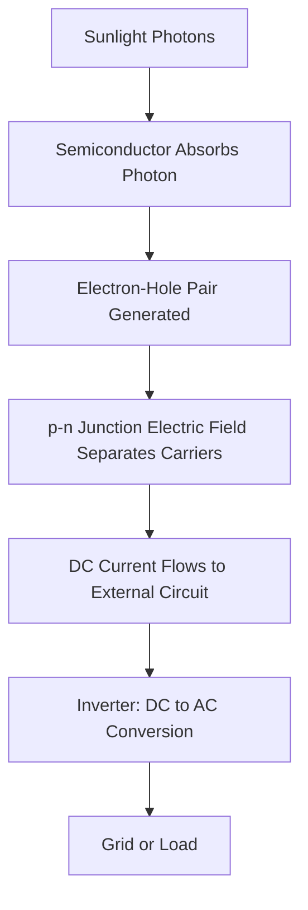

## Solar Energy Technologies

### Overview

Solar energy technologies convert incident solar radiation into usable electricity or heat through photovoltaic (direct electrical conversion) or solar thermal (heat-based) processes. As one of the fastest-growing renewable energy sources globally, solar technologies play a central role in decarbonizing electricity generation, though they introduce distinct engineering, material, land-use, and grid-integration considerations relative to conventional dispatchable generation.

### Solar Resource Fundamentals

**Solar Irradiance**

- **Global Horizontal Irradiance (GHI)**: total solar radiation received on a horizontal surface, combining direct and diffuse components
- **Direct Normal Irradiance (DNI)**: radiation received in a direct line from the sun, relevant primarily to concentrating solar technologies
- Solar resource availability varies with latitude, atmospheric conditions, seasonal sun angle, and local cloud cover, making site-specific resource assessment (typically using satellite-derived or ground-station irradiance data) essential for project planning

**Capacity Factor**

- The ratio of actual energy output over a period to the theoretical maximum output if the system operated continuously at rated capacity
- Solar PV capacity factors are inherently limited by daily and seasonal sun availability, typically ranging from roughly 10–25% depending on location, tracking configuration, and technology, in contrast to dispatchable thermal generation [Inference: precise regional capacity factor figures vary and should be checked against current site-specific data]

### Photovoltaic (PV) Technology

**Photovoltaic Effect**

- Sunlight (photons) striking a semiconductor material excites electrons across the material's band gap, creating electron-hole pairs
- A built-in electric field at the p-n junction separates these charge carriers, driving electron flow through an external circuit as usable direct current (DC) electricity

$$E_{photon} = h\nu = \frac{hc}{\lambda}$$

Where a photon's energy must exceed the semiconductor's band gap energy for absorption and electron excitation to occur.

**Crystalline Silicon (c-Si) Cells**

- **Monocrystalline silicon**: cut from a single continuous silicon crystal, offering higher efficiency (commercial modules commonly in the high teens to low-to-mid 20s percent range) and uniform appearance, at higher manufacturing cost
- **Polycrystalline silicon**: cast from multiple silicon crystal fragments, historically lower cost but slightly lower efficiency than monocrystalline; market share has shifted heavily toward monocrystalline in recent years due to manufacturing cost reductions [Inference: current market share figures change rapidly with manufacturing trends]
- Represents the dominant commercial PV technology by installed capacity

**Thin-Film Technologies**

- **Cadmium Telluride (CdTe)**: lower manufacturing energy and material use than c-Si, with efficiency historically somewhat lower than crystalline silicon, though the gap has narrowed with technology improvements
- **Copper Indium Gallium Selenide (CIGS)**: flexible substrate compatibility, useful for building-integrated and specialty applications
- **Amorphous Silicon (a-Si)**: lower efficiency and largely displaced from utility-scale use by other technologies, though still used in some niche/low-light applications

**Emerging PV Technologies**

- **Perovskite solar cells**: a rapidly advancing research area achieving high lab-reported efficiencies and offering potentially low manufacturing costs; commercial-scale deployment faces ongoing challenges related to long-term stability, moisture/UV degradation, and scale-up manufacturing, and is not yet widespread at utility scale as of the mid-2020s [Unverified: efficiency records and commercialization timelines change frequently; current figures should be checked against recent published research]
- **Tandem/multi-junction cells**: stacking multiple semiconductor layers with different band gaps to capture a broader portion of the solar spectrum, used in high-efficiency applications including space and concentrating PV systems; silicon-perovskite tandem cells are an active area of commercialization effort

### Solar Thermal Technologies

**Concentrating Solar Power (CSP)**

- Uses mirrors or lenses to concentrate direct sunlight onto a receiver, heating a working fluid to drive a conventional steam turbine
- **Parabolic trough**: curved mirrors focus sunlight along a linear receiver tube; the most commercially mature CSP configuration
- **Solar power tower**: an array of ground-mounted mirrors (heliostats) track the sun and focus reflected light onto a central elevated receiver, achieving higher operating temperatures than trough systems
- **Dish-Stirling systems**: parabolic dish concentrators paired with a Stirling engine at the focal point; less commercially widespread than trough or tower designs

**CSP with Thermal Energy Storage**

- A key advantage of CSP over PV is the ability to store thermal energy (commonly in molten salt) for hours after sunset, providing dispatchable solar-derived electricity and helping address solar's intermittency limitation

**Solar Water and Space Heating**

- Flat-plate and evacuated-tube collectors heat a fluid directly for domestic hot water, space heating, or industrial process heat applications, representing a simpler and often more cost-effective use of solar thermal energy for low-temperature heat demand than electricity generation

### System Configuration and Balance of System

**Fixed-Tilt vs. Tracking Systems**

- Fixed-tilt arrays are mounted at a static angle optimized for the site's latitude and seasonal energy priorities, offering lower cost and mechanical simplicity
- Single-axis and dual-axis tracking systems adjust panel orientation to follow the sun's path, increasing energy capture (particularly meaningful for DNI-dependent CSP and high-DNI PV sites) at increased mechanical complexity and cost

**Inverters**

- Convert DC electricity generated by PV modules into grid-compatible AC electricity
- String inverters, central inverters (utility-scale), and module-level power electronics (microinverters, power optimizers) represent different architectural approaches balancing cost, shading tolerance, and system monitoring granularity

**Balance of System (BOS) Components**

- Mounting/racking structures, wiring, combiner boxes, transformers, and monitoring/control systems collectively account for a substantial share of total installed system cost alongside the PV modules themselves

### Environmental Considerations

**Land Use**

- Utility-scale solar installations require substantial land area per unit of capacity relative to fossil generation, raising land-use trade-off considerations, particularly for agricultural or ecologically sensitive land
- **Agrivoltaics**: co-locating solar panels with agricultural production (crop cultivation or livestock grazing beneath elevated panel arrays) as a strategy to reduce net land-use competition

**Manufacturing Lifecycle Impacts**

- Silicon purification and cell manufacturing are energy-intensive processes; the energy payback time (time for a PV system to generate the energy used in its own production) is generally a small fraction of the system's multi-decade operational lifetime, though it varies by manufacturing location and grid carbon intensity [Inference: specific energy payback figures depend on manufacturing energy mix and should be checked against current lifecycle assessments]
- Thin-film technologies using cadmium (CdTe) raise end-of-life material management and recycling considerations, addressed in many jurisdictions through manufacturer take-back and recycling programs

**End-of-Life Management**

- Growing global PV deployment is increasingly raising panel decommissioning and recycling volume considerations; recovery of silicon, glass, aluminum framing, and embedded metals is an active area of recycling process development, though recycling infrastructure and economics remain less mature than for some other renewable technology waste streams [Inference: recycling infrastructure maturity varies significantly by region]

**Intermittency and Grid Integration**

- Solar generation is variable and non-dispatchable without storage, requiring grid-balancing strategies: battery energy storage, demand response, geographic diversification, and complementary dispatchable generation or storage technologies
- The "duck curve" phenomenon describes the mismatch between high midday solar generation and evening peak electricity demand, a key grid-planning consideration in high-solar-penetration systems

### Worked Example: PV System Energy Yield Estimation

A residential rooftop system has a rated capacity of 6 kW and is installed in a location with an estimated capacity factor of 18%.

$$Annual\ Energy\ Output = Capacity \times Capacity\ Factor \times 8760\ hours$$

$$= 6\ kW \times 0.18 \times 8760\ h \approx 9{,}460\ kWh/year$$

This estimate provides a baseline for system sizing relative to household consumption, though actual output varies with shading, panel degradation over time (commonly modeled as a small annual efficiency decline), soiling, and inverter efficiency losses. [Inference: actual system performance depends on numerous site-specific and equipment-specific factors]

### Illustration: Solar PV vs. CSP System Comparison (svg_diagram)

<svg xmlns="http://www.w3.org/2000/svg" viewBox="0 0 700 320">
<title>Photovoltaic vs Concentrating Solar Power Systems (svg_diagram)</title>
<rect x="0" y="0" width="700" height="320" fill="#f7f5ef" />
<text x="350" y="25" font-size="16" text-anchor="middle" font-family="sans-serif" font-weight="bold">PV vs CSP Systems (svg_diagram)</text>
<rect x="50" y="60" width="270" height="220" fill="none" stroke="#333" stroke-width="1.5" />
<text x="185" y="85" font-size="13" text-anchor="middle" font-family="sans-serif" font-weight="bold">Photovoltaic (PV)</text>
<rect x="90" y="110" width="60" height="35" fill="#3a5a7a" stroke="#333" />
<rect x="160" y="110" width="60" height="35" fill="#3a5a7a" stroke="#333" />
<rect x="230" y="110" width="60" height="35" fill="#3a5a7a" stroke="#333" />
<text x="185" y="160" font-size="10" text-anchor="middle" font-family="sans-serif">Direct photon-to-electron</text>
<text x="185" y="175" font-size="10" text-anchor="middle" font-family="sans-serif">conversion (semiconductor)</text>
<line x1="185" y1="190" x2="185" y2="220" stroke="#333" stroke-width="1.5" marker-end="url(#arrow4)" />
<rect x="140" y="220" width="90" height="30" fill="#5a8f5a" stroke="#333" />
<text x="185" y="240" font-size="10" text-anchor="middle" font-family="sans-serif" fill="#fff">Inverter (DC-AC)</text>
<text x="185" y="270" font-size="10" text-anchor="middle" font-family="sans-serif">No inherent storage</text>
<rect x="380" y="60" width="270" height="220" fill="none" stroke="#333" stroke-width="1.5" />
<text x="515" y="85" font-size="13" text-anchor="middle" font-family="sans-serif" font-weight="bold">Concentrating Solar (CSP)</text>
<line x1="410" y1="130" x2="480" y2="115" stroke="#c9a34a" stroke-width="2" />
<line x1="410" y1="150" x2="480" y2="115" stroke="#c9a34a" stroke-width="2" />
<line x1="620" y1="130" x2="480" y2="115" stroke="#c9a34a" stroke-width="2" />
<circle cx="480" cy="115" r="10" fill="#b5473a" />
<text x="515" y="160" font-size="10" text-anchor="middle" font-family="sans-serif">Mirrors focus heat onto receiver</text>
<line x1="480" y1="125" x2="480" y2="220" stroke="#333" stroke-width="1.5" marker-end="url(#arrow4)" />
<rect x="435" y="220" width="90" height="30" fill="#4a7ba6" stroke="#333" />
<text x="480" y="240" font-size="10" text-anchor="middle" font-family="sans-serif" fill="#fff">Steam Turbine</text>
<text x="515" y="270" font-size="10" text-anchor="middle" font-family="sans-serif">Thermal storage enables dispatch</text>
</svg>

### Key Points

- Photovoltaic technology converts sunlight directly to electricity via the semiconductor photovoltaic effect, while CSP concentrates sunlight to generate heat for conventional turbine-based generation
- Crystalline silicon remains the dominant commercial PV technology, while thin-film and emerging technologies like perovskites offer distinct cost, efficiency, and stability trade-offs
- CSP's thermal energy storage capability provides a dispatchability advantage over standard PV, addressing solar's core intermittency limitation
- Land use, manufacturing lifecycle impacts, and end-of-life panel recycling are key environmental considerations alongside solar's low operational emissions
- Grid integration challenges, exemplified by the "duck curve," require complementary storage and flexible generation resources as solar penetration increases

### Related Topics

- Energy storage technologies (batteries, pumped hydro, thermal storage)
- Grid integration and electricity system flexibility
- Wind energy technologies
- Life cycle assessment methodology for energy systems
- Agrivoltaics and dual land-use strategies
- Critical minerals for renewable energy supply chains
- Energy policy incentives and renewable portfolio standards