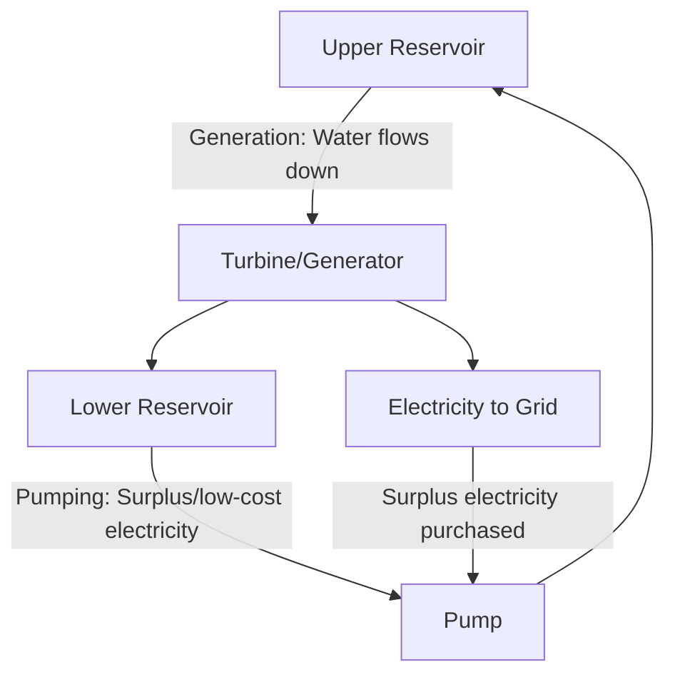

## Hydropower Systems

### Overview

Hydropower systems convert the gravitational potential and kinetic energy of moving water into mechanical and electrical energy, representing one of the oldest and most widely deployed renewable energy technologies globally. Hydropower provides dispatchable generation and grid services (frequency regulation, energy storage via pumped-storage configurations) that complement variable renewable sources, while presenting substantial ecological, hydrological, and social impacts tied to dam construction and river regulation.

### Fundamental Energy Principles

**Hydraulic Power Equation**

- The power available from falling or flowing water depends on flow rate, hydraulic head (elevation drop), and gravitational acceleration

$$P = \rho g Q H \eta$$

Where $P$ is power (watts), $\rho$ is water density (approximately 1000 kg/m³), $g$ is gravitational acceleration (9.81 m/s²), $Q$ is volumetric flow rate (m³/s), $H$ is hydraulic head (m), and $\eta$ is overall system efficiency (turbine, generator, and mechanical losses combined)

**Head Classification**

- **High-head systems** (typically greater than roughly 100 m): common in mountainous terrain, allow smaller flow volumes to generate substantial power, often paired with impulse turbines
- **Medium-head systems**: intermediate configurations common in many conventional dam installations
- **Low-head systems** (typically less than roughly 30 m): common in run-of-river installations on lower-gradient rivers, requiring larger flow volumes and paired with reaction turbines

### Hydropower Plant Configurations

**Conventional (Reservoir/Impoundment) Hydropower**

- A dam impounds water in a reservoir, creating hydraulic head; water is released through turbines on demand, providing dispatchable generation and multi-day to seasonal energy storage capability
- Reservoir storage allows operators to shift generation timing to match demand patterns and to provide critical grid services such as frequency regulation and rapid-response capacity

**Run-of-River Hydropower**

- Generates electricity from the natural flow and elevation drop of a river with minimal or no impoundment, resulting in a substantially smaller reservoir footprint and reduced flow regulation capability compared to conventional dams
- Output closely tracks natural river flow variability, offering limited dispatchability compared to reservoir-based systems but generally lower ecological footprint from reduced flooding of upstream land

**Pumped-Storage Hydropower (PSH)**

- Functions as a large-scale grid energy storage system: water is pumped from a lower reservoir to an upper reservoir during periods of surplus or low-cost electricity (e.g., overnight, or during high renewable output), then released through turbines to generate electricity during periods of high demand
- Represents one of the most mature and widely deployed forms of grid-scale energy storage globally, providing round-trip storage efficiency and multi-hour discharge duration that complement variable renewable generation [Inference: specific round-trip efficiency figures vary by facility design but are commonly cited in the 70–85% range]

**Small-Scale and Micro-Hydropower**

- Systems ranging from micro-hydro (serving individual households or small communities) to small-hydro (typically defined regionally, often under 10–30 MW) provide decentralized generation options, particularly valuable in remote or off-grid contexts, generally with lower absolute ecological footprint than large conventional dams

### Turbine Technologies

**Impulse Turbines**

- **Pelton wheel**: uses one or more high-velocity water jets striking curved buckets on a wheel, suited to high-head, low-flow applications
- **Turgo turbine**: a variant designed for medium-head applications with somewhat higher flow rates than Pelton designs

**Reaction Turbines**

- **Francis turbine**: the most widely used turbine type globally, suited to medium-head applications with moderate to high flow rates; water flows through the turbine runner under pressure, imparting both pressure and velocity-derived energy
- **Kaplan turbine**: features adjustable blades (similar in concept to a ship's propeller), optimized for low-head, high-flow applications; blade pitch adjustment allows efficient operation across a range of flow conditions

### Environmental Impacts

**Riverine Ecosystem Fragmentation**

- Dams act as physical barriers to fish migration, particularly affecting anadromous species (e.g., salmon) that migrate between freshwater and marine environments to spawn
- **Fish passage structures** (fish ladders, fish lifts, bypass channels) are engineered mitigation measures, though their effectiveness varies substantially by species, dam height, and design, and often falls short of restoring pre-dam migration rates [Inference: effectiveness figures are highly species- and site-specific]

**Altered Flow Regimes**

- Dam operation changes the natural timing, magnitude, and variability of downstream flow ("hydrological alteration"), which can disrupt flow-dependent ecological processes such as floodplain inundation, sediment transport cues for spawning, and riparian vegetation establishment
- **Environmental flow releases**: mandated minimum flow regimes designed to mimic key aspects of natural flow variability and support downstream ecological function, increasingly required by modern dam licensing frameworks

**Sediment Trapping**

- Reservoirs trap sediment that would naturally move downstream, leading to two linked impacts: gradual loss of reservoir storage capacity over time, and downstream sediment starvation that can contribute to riverbed erosion, delta subsidence, and coastal erosion at river mouths
- Sediment management approaches include periodic reservoir flushing, sediment bypass tunnels, and sluicing operations during high-flow periods, though these add operational complexity and are not always fully effective at restoring natural sediment loads

**Water Quality and Thermal Effects**

- Reservoir stratification can create oxygen-depleted (hypoxic) conditions in deeper water layers, and water released from different reservoir depths (via selective withdrawal structures) can significantly alter downstream water temperature relative to natural conditions, affecting temperature-sensitive aquatic species

**Greenhouse Gas Emissions from Reservoirs**

- Flooded organic matter in reservoirs, particularly in tropical regions with high biomass decomposition rates, can generate methane emissions through anaerobic decomposition, an emissions pathway not present in fossil-free generation from run-of-river or non-impoundment systems
- The magnitude of reservoir GHG emissions varies substantially by climate, reservoir depth, and organic matter content, and remains an active area of scientific measurement and modeling; tropical, shallow reservoirs are generally associated with proportionally higher emissions intensity than temperate, deep reservoirs [Inference: reservoir-specific emissions estimates require site-specific measurement and are not uniform across all hydropower facilities]

**Land Use and Displacement**

- Large reservoir impoundments can inundate substantial areas of forest, agricultural land, and settlements, in some historical cases requiring large-scale human resettlement and causing significant social disruption to affected communities, particularly Indigenous and rural populations
- Dam safety and structural failure risk (though statistically rare) can pose catastrophic downstream consequences, making dam safety inspection and maintenance a critical ongoing engineering and regulatory responsibility

### Mitigation and Modern Design Approaches

- **Fish-friendly turbine design**: engineering modifications to reduce fish mortality from turbine passage
- **Environmental flow requirements**: increasingly standard in modern dam relicensing and permitting processes
- **Selective withdrawal structures**: allow operators to blend water from different reservoir depths to manage downstream temperature impacts
- **Dam removal**: in cases where a dam's ecological cost is judged to outweigh its energy or water-management benefit (particularly for aging, low-output dams), removal has become an increasingly used restoration tool in some regions to reconnect river systems and restore natural flow and sediment regimes

### Regulatory and Licensing Frameworks

- Large hydropower projects typically require comprehensive Environmental Impact Assessments addressing fisheries, water quality, sediment transport, and social/resettlement impacts
- Relicensing processes for existing dams (common in mature hydropower markets) provide periodic opportunities to impose updated environmental flow and fish passage requirements reflecting current ecological standards
- International frameworks such as the Hydropower Sustainability Standard provide voluntary assessment protocols evaluating environmental and social performance against defined criteria

### Worked Example: Hydropower Output Calculation

A run-of-river facility has a flow rate of 50 m³/s, a hydraulic head of 20 m, and an overall system efficiency of 85%.

$$P = \rho g Q H \eta$$

$$P = 1000 \times 9.81 \times 50 \times 20 \times 0.85 \approx 8{,}339{,}000\ W \approx 8.34\ MW$$

This calculation illustrates the sensitivity of hydropower output to both flow rate and head, explaining why site selection prioritizes locations with either substantial elevation drop or high, reliable flow volume (or both). [Inference: actual seasonal output varies with natural flow variability, particularly for run-of-river systems without reservoir buffering]

### Illustration: Pumped-Storage Hydropower Cycle (svg_diagram)

<svg xmlns="http://www.w3.org/2000/svg" viewBox="0 0 700 320">
<title>Pumped-Storage Hydropower Operating Cycle (svg_diagram)</title>
<rect x="0" y="0" width="700" height="320" fill="#f7f5ef" />
<text x="350" y="25" font-size="16" text-anchor="middle" font-family="sans-serif" font-weight="bold">Pumped-Storage Cycle (svg_diagram)</text>
<rect x="80" y="50" width="200" height="60" fill="#4a7ba6" stroke="#333" />
<text x="180" y="85" font-size="12" text-anchor="middle" font-family="sans-serif" fill="#fff">Upper Reservoir</text>
<rect x="420" y="230" width="200" height="60" fill="#4a7ba6" stroke="#333" />
<text x="520" y="265" font-size="12" text-anchor="middle" font-family="sans-serif" fill="#fff">Lower Reservoir</text>
<line x1="220" y1="110" x2="480" y2="230" stroke="#5a8f5a" stroke-width="3" marker-end="url(#arrow5)" />
<text x="380" y="155" font-size="11" text-anchor="middle" font-family="sans-serif" fill="#5a8f5a">Generate (peak demand)</text>
<text x="380" y="170" font-size="10" text-anchor="middle" font-family="sans-serif" fill="#5a8f5a">Water flows down through turbine</text>
<line x1="480" y1="220" x2="220" y2="120" stroke="#b5473a" stroke-width="3" marker-end="url(#arrow5)" />
<text x="380" y="200" font-size="11" text-anchor="middle" font-family="sans-serif" fill="#b5473a">Pump (off-peak/surplus)</text>
<text x="380" y="215" font-size="10" text-anchor="middle" font-family="sans-serif" fill="#b5473a">Water pumped back uphill</text>
</svg>

### Key Points

- Hydropower output depends on the product of flow rate and hydraulic head, with turbine type (impulse vs. reaction) selected based on the site's specific head and flow characteristics
- Pumped-storage hydropower remains among the most mature large-scale grid energy storage technologies, complementing variable renewable generation
- River fragmentation, altered flow regimes, and sediment trapping represent the most significant and persistent ecological impacts of conventional dam-based hydropower
- Reservoir greenhouse gas emissions, particularly methane from flooded organic matter in tropical settings, complicate hydropower's categorization as a zero-emissions technology and require site-specific assessment
- Environmental flow requirements, fish passage engineering, and in some cases dam removal represent the primary modern tools for mitigating hydropower's ecological footprint

### Related Topics

- River ecosystem management and fish passage engineering
- Energy storage technologies and grid balancing strategies
- Dam safety engineering and risk management
- Sediment transport and coastal geomorphology
- Water resource management and reservoir operations
- Resettlement and social impact assessment in infrastructure development
- Renewable energy grid integration and complementary resource planning