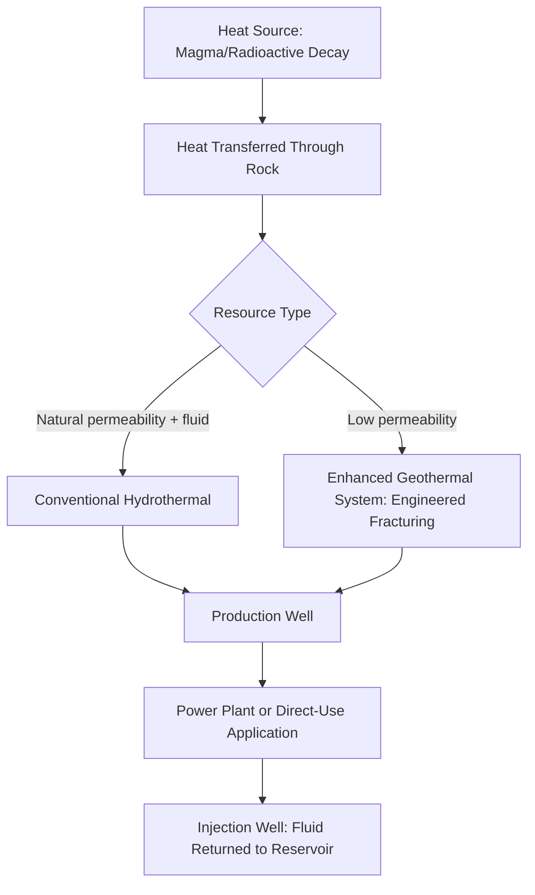

## Geothermal Energy Systems

### Overview

Geothermal energy systems harness heat from the Earth's interior for electricity generation, direct heating applications, and building climate control. Unlike solar and wind, geothermal energy offers continuous, weather-independent baseload potential in suitable locations, though resource availability is geographically constrained by geological conditions, and system design varies substantially by the temperature and depth of the accessible heat resource.

### Sources of Geothermal Heat

**Earth's Internal Heat Budget**

- Primary heat sources include residual heat from planetary formation and ongoing radioactive decay of isotopes (uranium, thorium, potassium) within the Earth's crust and mantle
- Geothermal gradient describes the rate of temperature increase with depth, averaging roughly 25–30°C per kilometer in typical continental crust, though this rate varies substantially by region [Inference: precise gradient figures are highly location-dependent and should be verified against local geological surveys]

**High-Enthalpy Resource Zones**

- Areas of anomalously high geothermal gradient, typically associated with tectonically active regions: plate boundaries, volcanic zones, and rift systems (e.g., the Pacific Ring of Fire, East African Rift, Iceland's mid-Atlantic ridge setting)
- These regions bring high-temperature resources closer to the surface, making them the most economically favorable locations for conventional geothermal electricity generation

### Geothermal Resource Classification

**Hydrothermal Resources**

- Naturally occurring reservoirs where groundwater has been heated by contact with hot rock at depth, requiring three key elements: a heat source, permeable rock to allow fluid circulation, and a caprock to trap the heated fluid
- **Vapor-dominated systems**: reservoirs producing primarily steam (relatively rare, but highly efficient for direct electricity generation)
- **Liquid-dominated systems**: more common, producing a mixture of hot water and steam that requires separation before use in conventional turbine systems

**Enhanced (Engineered) Geothermal Systems (EGS)**

- Target hot rock formations that lack sufficient natural permeability or fluid content for conventional hydrothermal development
- Involves engineered fracturing (hydraulic or other stimulation methods) to create or enhance permeability, followed by fluid injection to enable heat extraction, significantly expanding the geographic range of potentially exploitable geothermal resources beyond naturally hydrothermal areas
- EGS technology has advanced substantially through pilot and early commercial projects in the 2020s, though large-scale commercial deployment remains less mature than conventional hydrothermal development, and induced seismicity risk from fluid injection is a recognized technical and regulatory consideration analogous to concerns in other subsurface fluid injection applications [Unverified: current EGS commercial deployment scale and cost figures are evolving rapidly and should be checked against recent project data]

**Low-to-Moderate Temperature Resources**

- Widely distributed shallow subsurface resources (roughly constant temperature year-round at moderate depths) suitable for direct-use heating applications and ground-source heat pump systems, accessible in a much broader range of geographic locations than high-enthalpy resources suitable for electricity generation

### Geothermal Power Plant Technologies

**Dry Steam Power Plants**

- Used at vapor-dominated resources; steam is piped directly from production wells to drive a turbine, representing the simplest and one of the earliest commercial geothermal power plant designs (e.g., The Geysers, California)

**Flash Steam Power Plants**

- Used at high-temperature liquid-dominated resources; hot pressurized water is brought to the surface and allowed to "flash" into steam as pressure drops, with the steam then driving a turbine while remaining liquid is separated and typically reinjected
- The most common conventional geothermal power plant type globally for medium-to-high temperature hydrothermal resources

**Binary Cycle Power Plants**

- Used at lower-temperature resources insufficient to directly flash to steam; geothermal fluid is passed through a heat exchanger, transferring heat to a secondary working fluid with a lower boiling point (commonly an organic fluid, in an Organic Rankine Cycle configuration), which vaporizes and drives the turbine
- Enables electricity generation from a substantially broader range of resource temperatures than direct steam or flash systems, and geothermal fluid is not exposed to the turbine or atmosphere, reducing mineral scaling and emissions concerns associated with direct-contact systems

### Direct-Use and Heat Pump Applications

**Direct-Use Applications**

- District heating systems, greenhouse and agricultural heating, aquaculture, industrial process heat, and balneology (therapeutic hot springs) applications utilizing geothermal fluid directly or via heat exchangers without electricity conversion
- Generally achieves higher overall energy utilization efficiency than electricity generation, since it avoids the thermodynamic conversion losses inherent in heat-to-electricity generation

**Ground-Source (Geothermal) Heat Pumps**

- Exploit the relatively stable shallow subsurface temperature (typically a few meters to roughly 100 m depth) to provide efficient heating and cooling for buildings via a heat pump cycle, rather than direct use of deep geothermal heat
- Applicable in nearly any geographic location regardless of deep geothermal resource availability, since shallow ground temperature stability is a near-universal characteristic, making this the most widely deployable geothermal-adjacent technology
- Achieves significantly higher heating/cooling efficiency (measured via coefficient of performance, COP) than air-source alternatives in many climates, because the ground serves as a more stable heat source/sink than variable outdoor air temperature [Inference: relative efficiency advantage varies by climate and system design]

### Environmental Considerations

**Land Use**

- Geothermal power plants generally have a relatively small surface land footprint per unit of energy generated compared to solar or wind facilities of equivalent capacity, since the primary "resource collection" occurs underground

**Water Use and Fluid Management**

- Most modern geothermal power plants reinject spent geothermal fluid back into the reservoir after heat extraction, which helps sustain reservoir pressure over the long term and reduces surface water withdrawal and disposal requirements compared to non-reinjection designs
- Reinjection also mitigates potential surface disposal impacts of geothermal fluids, which can contain dissolved minerals and, in some cases, naturally occurring toxic constituents (e.g., arsenic, boron) at concentrations requiring careful management

**Emissions**

- Geothermal electricity generation produces substantially lower direct greenhouse gas emissions than fossil fuel generation; however, some hydrothermal resources naturally release non-condensable gases (including $CO_2$ and hydrogen sulfide, $H_2S$) dissolved in the geothermal fluid, resulting in non-zero direct emissions that vary considerably by specific resource geochemistry [Inference: emissions intensity is highly site-specific and should not be assumed uniform across all geothermal facilities]
- Binary cycle plants, which do not directly release geothermal fluid or gases to the atmosphere, generally have lower direct emissions than flash or dry steam systems at comparable resource sites

**Induced Seismicity**

- Fluid injection associated with both reinjection in conventional systems and stimulation/circulation in EGS has been associated with induced seismic events at some sites, generally of low magnitude but requiring monitoring and, in some jurisdictions, traffic-light protocols that adjust or halt injection operations based on real-time seismic monitoring thresholds
- The relationship between injection parameters and induced seismicity risk is an active area of geomechanical research, with risk management approaches continuing to evolve [Inference: specific risk thresholds and mitigation protocol effectiveness vary by site and regulatory jurisdiction]

**Land Subsidence**

- In some hydrothermal fields, particularly where reinjection does not fully offset fluid extraction, gradual land surface subsidence has been documented, requiring monitoring and management as part of long-term reservoir stewardship

### Resource Sustainability Considerations

- Geothermal reservoirs can experience localized thermal depletion (cooling) or pressure decline if extraction rates exceed the natural or managed replenishment rate, which is why reinjection and careful reservoir management are considered standard modern practice rather than optional additions
- Well-managed geothermal fields can sustain productive output over multi-decade operational periods, though individual well productivity commonly requires periodic redrilling or field management adjustments as reservoir conditions evolve over time [Inference: specific field longevity depends on resource characteristics and management practices]

### Worked Example: Binary Cycle Feasibility Assessment

A moderate-temperature geothermal resource at 140°C would be below the practical threshold for efficient conventional flash steam generation (commonly requiring resource temperatures in significantly higher ranges), but is well-suited to a binary cycle system, since Organic Rankine Cycle working fluids can be selected with boiling points allowing efficient vaporization and turbine operation at this lower resource temperature, extending viable electricity generation to resources that would otherwise only support direct-use applications. [Inference: specific viable temperature thresholds depend on working fluid selection and system engineering, and should be evaluated against current commercial technology specifications]

### Illustration: Flash Steam vs. Binary Cycle Plant Comparison (svg_diagram)

<svg xmlns="http://www.w3.org/2000/svg" viewBox="0 0 700 320">
<title>Flash Steam vs Binary Cycle Geothermal Plants (svg_diagram)</title>
<rect x="0" y="0" width="700" height="320" fill="#f7f5ef" />
<text x="350" y="25" font-size="16" text-anchor="middle" font-family="sans-serif" font-weight="bold">Flash Steam vs Binary Cycle (svg_diagram)</text>
<rect x="40" y="55" width="290" height="230" fill="none" stroke="#333" stroke-width="1.5" />
<text x="185" y="80" font-size="13" text-anchor="middle" font-family="sans-serif" font-weight="bold">Flash Steam Plant</text>
<line x1="185" y1="95" x2="185" y2="140" stroke="#b5473a" stroke-width="3" marker-end="url(#arrow6)" />
<text x="185" y="130" font-size="9" text-anchor="middle" font-family="sans-serif">Hot fluid rises</text>
<rect x="140" y="140" width="90" height="30" fill="#c9a34a" stroke="#333" />
<text x="185" y="160" font-size="10" text-anchor="middle" font-family="sans-serif">Flash Separator</text>
<line x1="185" y1="170" x2="185" y2="210" stroke="#333" stroke-width="2" marker-end="url(#arrow6)" />
<rect x="140" y="210" width="90" height="30" fill="#4a7ba6" stroke="#333" />
<text x="185" y="230" font-size="10" text-anchor="middle" font-family="sans-serif" fill="#fff">Turbine (direct)</text>
<text x="185" y="265" font-size="9" text-anchor="middle" font-family="sans-serif">Geothermal fluid contacts turbine</text>
<rect x="370" y="55" width="290" height="230" fill="none" stroke="#333" stroke-width="1.5" />
<text x="515" y="80" font-size="13" text-anchor="middle" font-family="sans-serif" font-weight="bold">Binary Cycle Plant</text>
<line x1="515" y1="95" x2="515" y2="140" stroke="#b5473a" stroke-width="3" marker-end="url(#arrow6)" />
<rect x="470" y="140" width="90" height="30" fill="#5a8f5a" stroke="#333" />
<text x="515" y="160" font-size="10" text-anchor="middle" font-family="sans-serif" fill="#fff">Heat Exchanger</text>
<line x1="515" y1="170" x2="515" y2="210" stroke="#333" stroke-width="2" marker-end="url(#arrow6)" />
<rect x="470" y="210" width="90" height="30" fill="#4a7ba6" stroke="#333" />
<text x="515" y="230" font-size="10" text-anchor="middle" font-family="sans-serif" fill="#fff">Turbine (secondary fluid)</text>
<text x="515" y="265" font-size="9" text-anchor="middle" font-family="sans-serif">Geothermal fluid stays isolated</text>
</svg>

### Key Points

- Geothermal resource type (vapor-dominated, liquid-dominated, or engineered) and temperature determine which power plant technology (dry steam, flash, or binary cycle) is technically and economically appropriate
- Enhanced Geothermal Systems substantially expand the geographic range of exploitable geothermal resources beyond naturally hydrothermal areas, though commercial-scale deployment is still maturing
- Fluid reinjection is standard modern practice, supporting reservoir sustainability while reducing surface disposal impacts and water consumption
- Induced seismicity from fluid injection is a recognized risk requiring monitoring, relevant to both conventional reinjection and EGS stimulation operations
- Ground-source heat pumps offer near-universally deployable heating/cooling efficiency gains independent of deep geothermal resource availability, distinguishing them from electricity-generating geothermal technologies

### Related Topics

- Ground-source heat pump system design and building energy efficiency
- Induced seismicity and subsurface fluid injection risk management
- Enhanced Geothermal Systems and hydraulic stimulation techniques
- District heating system design and urban energy planning
- Life cycle assessment of renewable energy technologies
- Volcanic and tectonic geology fundamentals
- Grid integration of baseload renewable resources