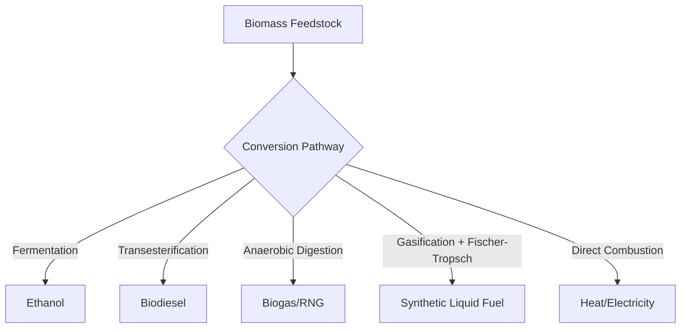

## Bioenergy and Biofuels

### Overview

Bioenergy encompasses energy derived from organic (biomass) material, spanning direct combustion for heat and power, conversion into liquid transportation fuels (biofuels), and production of biogas through anaerobic digestion. As a renewable energy category with unique carbon cycling characteristics compared to solar, wind, or hydro, bioenergy's environmental performance depends heavily on feedstock choice, land-use impacts, and conversion pathway, making lifecycle assessment central to evaluating its sustainability.

### Biomass Feedstock Categories

**Dedicated Energy Crops**

- Purpose-grown crops for energy production: sugarcane, corn (maize), sugar beet for first-generation ethanol; switchgrass, miscanthus, and short-rotation woody crops for cellulosic and solid biomass applications

**Agricultural and Forestry Residues**

- Crop residues (corn stover, wheat straw, rice husks), forestry residues (logging slash, sawmill byproducts), and processing residues, generally considered to have lower direct land-use impact than dedicated energy crops since they are byproducts of existing agricultural or forestry operations

**Municipal Solid Waste (MSW) and Organic Waste**

- Food waste, yard waste, sewage sludge, and the organic fraction of municipal solid waste, processed via anaerobic digestion or waste-to-energy combustion, providing a waste management co-benefit alongside energy recovery

**Algae**

- Microalgae and macroalgae cultivated specifically for biofuel feedstock, offering theoretically high per-area productivity and the potential to avoid competition with conventional agricultural land, though commercial-scale algal biofuel production remains less economically mature than conventional biofuel pathways as of the mid-2020s [Inference: commercialization status changes as technology and cost structures evolve]

### Biofuel Generations and Conversion Pathways

**First-Generation Biofuels**

- Produced from food-crop feedstocks (corn, sugarcane, soybean, palm oil, rapeseed) using established conversion technologies
- **Ethanol production**: fermentation of sugars (directly from sugarcane/sugar beet, or from starch hydrolyzed to sugar in corn-based processes) by yeast, followed by distillation

$$C_6H_{12}O_6 \rightarrow 2C_2H_5OH + 2CO_2$$

- **Biodiesel production**: transesterification of vegetable oils or animal fats with an alcohol (typically methanol) in the presence of a catalyst, producing fatty acid methyl esters (FAME) and glycerol as a byproduct

**Second-Generation (Cellulosic/Advanced) Biofuels**

- Produced from non-food lignocellulosic biomass (crop residues, woody biomass, dedicated non-food energy crops), avoiding direct food-vs-fuel competition associated with first-generation pathways
- **Cellulosic ethanol**: requires pretreatment (mechanical, chemical, or enzymatic) to break down the more recalcitrant lignocellulosic structure before fermentation, historically involving higher processing cost and technical complexity than first-generation ethanol production, though technology has continued to mature [Inference: current commercial-scale cost competitiveness varies by region and technology provider]
- **Fischer-Tropsch synthesis**: converts biomass-derived syngas (via gasification) into liquid hydrocarbon fuels, offering compatibility with existing fuel infrastructure and engines

**Third-Generation Biofuels**

- Primarily algae-derived fuels, distinguished from second-generation pathways by feedstock source rather than fundamentally different conversion chemistry in most cases

**Biogas and Renewable Natural Gas**

- **Anaerobic digestion**: microbial breakdown of organic material (manure, food waste, sewage sludge, energy crops) in the absence of oxygen, producing biogas (primarily methane and $CO_2$) usable for heat, electricity generation, or (after purification/upgrading) injection into natural gas pipelines as renewable natural gas (RNG)

### Solid Biomass for Heat and Power

**Direct Combustion**

- Wood pellets, wood chips, and agricultural residues burned directly for heat or steam generation, commonly in dedicated biomass power plants or co-fired with coal in existing power plant infrastructure to partially displace fossil fuel use

**Biomass Pelletization**

- Densifying raw biomass into uniform pellets improves energy density, handling, storage, and combustion consistency, supporting international biomass trade (notably wood pellet exports for power generation in some regions)

### Environmental and Sustainability Considerations

**Carbon Accounting Complexity**

- Bioenergy combustion releases $CO_2$, but this carbon is generally considered part of the contemporary biogenic carbon cycle if the feedstock is grown and harvested sustainably, since growing biomass reabsorbs atmospheric $CO_2$ through photosynthesis
- This "carbon neutrality" framing requires that biomass harvest rates not exceed regrowth rates, and that the time lag between emission (combustion) and reabsorption (regrowth) be accounted for, since this "carbon payback period" can range from very short (annual crop residues) to many decades (some forest biomass harvesting scenarios), a distinction that has generated substantial scientific and policy debate regarding whether forest biomass energy should be treated as carbon-neutral on policy-relevant timescales [Inference: the appropriate accounting treatment remains actively contested in climate policy literature and depends heavily on specific forest management and harvest assumptions]

**Land-Use Change**

- **Direct land-use change**: converting natural ecosystems (forests, grasslands) to bioenergy feedstock cultivation releases stored carbon and can result in a substantial "carbon debt" that may take years to decades to repay through avoided fossil fuel emissions, depending on the ecosystem converted
- **Indirect land-use change (ILUC)**: when existing agricultural land is diverted to energy crop production, food production may be displaced to other land (including previously uncultivated land), causing emissions and biodiversity impacts not directly attributable to the bioenergy project site itself; ILUC effects are difficult to measure precisely and remain a subject of ongoing modeling debate and methodological refinement [Inference: ILUC quantification carries substantial modeling uncertainty across published studies]

**Food-vs-Fuel Competition**

- First-generation biofuels derived from food crops raise concerns about competition with food production and potential impacts on food prices and land availability, a key motivating factor behind the shift toward second-generation and residue/waste-based feedstocks in policy and research priorities

**Water Use**

- Bioenergy crop cultivation can require substantial irrigation water depending on crop type and region, an important lifecycle consideration alongside land and carbon impacts, particularly in water-stressed agricultural regions

**Biodiversity**

- Monoculture energy crop plantations can reduce habitat and species diversity relative to natural ecosystems or more diverse agricultural systems, an impact that varies with feedstock choice, cultivation practices, and the land type being converted or utilized

### Lifecycle Greenhouse Gas Assessment

**Key Lifecycle Stages Requiring Accounting**

- Feedstock cultivation (fertilizer-related nitrous oxide emissions, land-use change, farm equipment fuel use)
- Feedstock transport and processing energy inputs
- Conversion process energy and efficiency
- Combustion/end-use emissions and displaced fossil fuel emissions credit

**Net Energy and Emissions Balance**

- The Net Energy Ratio (energy output relative to fossil energy input across the full production chain) and lifecycle GHG emissions relative to the fossil fuel being displaced are critical sustainability metrics, varying substantially across feedstock and conversion pathway combinations, with second-generation and waste-derived pathways generally (though not universally) achieving more favorable lifecycle profiles than first-generation food-crop-based pathways [Inference: specific comparative figures depend heavily on methodology, regional agricultural practices, and system boundaries chosen in each study]

### Policy Frameworks

- Renewable fuel mandates and blending requirements (e.g., ethanol blending standards in gasoline) have historically driven first-generation biofuel market growth in several major markets
- Sustainability certification schemes (e.g., Roundtable on Sustainable Biomaterials, various national low-carbon fuel standards) increasingly incorporate lifecycle carbon intensity scoring and land-use change considerations to differentiate feedstock and pathway sustainability rather than treating all bioenergy as uniformly low-carbon

### Worked Example: Biogas Energy Content Estimation

An anaerobic digester processing agricultural waste produces biogas with a methane content of 60% by volume, at a total biogas production rate of 500 m³/day. Methane has an energy content of approximately 35.8 MJ/m³ at standard conditions.

$$Methane\ volume = 500\ m^3/day \times 0.60 = 300\ m^3\ CH_4/day$$

$$Energy\ content = 300\ m^3 \times 35.8\ MJ/m^3 \approx 10{,}740\ MJ/day \approx 2{,}983\ kWh/day$$

This illustrates how digester gas composition (methane fraction) directly determines usable energy output, which is why biogas upgrading (removing $CO_2$ and other impurities to increase methane concentration) is commonly used when biogas is intended for pipeline injection or vehicle fuel applications requiring higher energy density. [Inference: actual digester output varies with feedstock composition, digester temperature, and retention time]

### Illustration: Biofuel Generation Feedstock Comparison (svg_diagram)

<svg xmlns="http://www.w3.org/2000/svg" viewBox="0 0 700 300">
<title>Biofuel Generations and Feedstock Sources (svg_diagram)</title>
<rect x="0" y="0" width="700" height="300" fill="#f7f5ef" />
<text x="350" y="25" font-size="16" text-anchor="middle" font-family="sans-serif" font-weight="bold">Biofuel Generations (svg_diagram)</text>
<rect x="40" y="60" width="180" height="180" fill="#c9a34a" stroke="#333" />
<text x="130" y="85" font-size="12" text-anchor="middle" font-family="sans-serif" font-weight="bold">1st Generation</text>
<text x="130" y="110" font-size="10" text-anchor="middle" font-family="sans-serif">Corn, sugarcane,</text>
<text x="130" y="125" font-size="10" text-anchor="middle" font-family="sans-serif">soybean, palm oil</text>
<text x="130" y="150" font-size="10" text-anchor="middle" font-family="sans-serif">Food-crop feedstock</text>
<text x="130" y="175" font-size="10" text-anchor="middle" font-family="sans-serif">Mature technology</text>
<text x="130" y="200" font-size="10" text-anchor="middle" font-family="sans-serif">Food-vs-fuel concern</text>
<rect x="260" y="60" width="180" height="180" fill="#5a8f5a" stroke="#333" />
<text x="350" y="85" font-size="12" text-anchor="middle" font-family="sans-serif" font-weight="bold" fill="#fff">2nd Generation</text>
<text x="350" y="110" font-size="10" text-anchor="middle" font-family="sans-serif" fill="#fff">Crop residues,</text>
<text x="350" y="125" font-size="10" text-anchor="middle" font-family="sans-serif" fill="#fff">woody biomass</text>
<text x="350" y="150" font-size="10" text-anchor="middle" font-family="sans-serif" fill="#fff">Non-food feedstock</text>
<text x="350" y="175" font-size="10" text-anchor="middle" font-family="sans-serif" fill="#fff">Higher processing</text>
<text x="350" y="190" font-size="10" text-anchor="middle" font-family="sans-serif" fill="#fff">complexity</text>
<rect x="480" y="60" width="180" height="180" fill="#4a7ba6" stroke="#333" />
<text x="570" y="85" font-size="12" text-anchor="middle" font-family="sans-serif" font-weight="bold" fill="#fff">3rd Generation</text>
<text x="570" y="110" font-size="10" text-anchor="middle" font-family="sans-serif" fill="#fff">Algae</text>
<text x="570" y="150" font-size="10" text-anchor="middle" font-family="sans-serif" fill="#fff">High theoretical</text>
<text x="570" y="165" font-size="10" text-anchor="middle" font-family="sans-serif" fill="#fff">productivity</text>
<text x="570" y="190" font-size="10" text-anchor="middle" font-family="sans-serif" fill="#fff">Limited commercial</text>
<text x="570" y="205" font-size="10" text-anchor="middle" font-family="sans-serif" fill="#fff">maturity</text>
</svg>

### Key Points

- Biofuel feedstock choice (food crop vs. residue/waste vs. algae) fundamentally determines land-use, food security, and lifecycle carbon implications
- Bioenergy's "carbon neutrality" is conditional on sustainable harvest rates and appropriate accounting for the time lag between combustion emissions and biomass regrowth, a point of ongoing scientific and policy debate, particularly for forest biomass
- Indirect land-use change remains a methodologically challenging but potentially significant factor in comprehensive bioenergy lifecycle assessment
- Second-generation and waste/residue-derived pathways generally reduce direct food-vs-fuel competition relative to first-generation food-crop-based biofuels
- Anaerobic digestion of organic waste provides a dual benefit of waste management and renewable energy recovery through biogas production

### Related Topics

- Life cycle assessment methodology for energy systems
- Land-use change and indirect emissions accounting
- Waste-to-energy technologies and municipal solid waste management
- Sustainable agriculture and soil carbon dynamics
- Renewable fuel policy and carbon intensity standards
- Forest carbon accounting and sustainable forestry practices
- Algae cultivation and advanced biofuel research