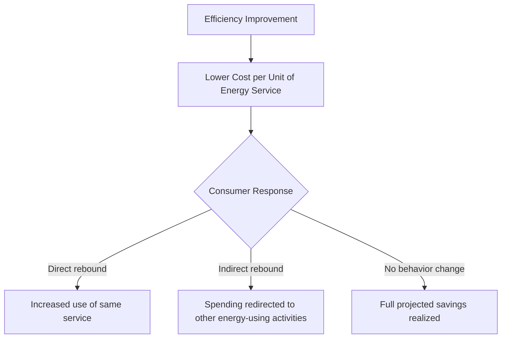

## Energy Efficiency and Conservation

### Overview

Energy efficiency and conservation encompass the strategies, technologies, and behavioral practices aimed at reducing energy consumption for a given level of service or output. Distinct from energy supply-side solutions (generation technology), efficiency and conservation represent demand-side approaches that reduce environmental impact, lower costs, and ease strain on energy infrastructure, often at lower marginal cost than equivalent new generation capacity.

### Core Conceptual Distinctions

**Energy Efficiency vs. Energy Conservation**

- **Energy efficiency** refers to achieving the same output or service using less energy input (e.g., an LED bulb producing equivalent light output to an incandescent bulb using substantially less electricity)
- **Energy conservation** refers to reducing energy consumption through behavioral change or reduced service demand (e.g., turning off unused lights, reducing thermostat setpoints)
- Both strategies reduce total energy consumption but operate through different mechanisms — technological improvement versus demand reduction — and are often pursued together in comprehensive energy management programs

**Energy Intensity**

- A macro-level metric expressing energy consumption per unit of economic output (e.g., energy use per unit of GDP), commonly used to track efficiency improvement trends at national or sectoral scale over time, though changes in energy intensity reflect a combination of efficiency gains, structural economic shifts, and fuel-mix changes rather than efficiency improvements alone [Inference: disentangling these contributing factors requires careful decomposition analysis]

### The Energy Efficiency Gap and Jevons Paradox

**The Energy Efficiency Gap**

- Refers to the observed phenomenon that many cost-effective energy efficiency investments (with favorable projected payback periods) are not adopted at the rate that simple economic analysis would predict, attributed to factors including information asymmetries, split incentives (e.g., landlord-tenant dynamics where the party making efficiency investments differs from the party receiving energy bill savings), high upfront capital costs, and behavioral/bounded-rationality factors in decision-making [Inference: the relative importance of each barrier varies by sector, market, and specific technology]

**Jevons Paradox (Rebound Effect)**

- Describes the phenomenon where efficiency improvements that reduce the cost of energy services can lead to increased consumption of that service, partially or (in some documented cases) fully offsetting the expected energy savings
- The magnitude of rebound effects varies substantially by sector, technology, and market context, ranging from minimal in some applications to significant in others; economy-wide "backfire" effects (where rebound fully negates or exceeds projected savings) remain a subject of ongoing empirical debate among energy economists [Inference: rebound effect magnitude is highly context-dependent and actively studied]

### Building Energy Efficiency

**Building Envelope**

- Insulation (walls, roof, foundation), air sealing, and high-performance windows reduce unwanted heat transfer, directly lowering heating and cooling energy demand
- Thermal bridging (localized heat transfer through structural elements that bypass insulation) can significantly undermine overall envelope performance if not addressed in design and construction

**HVAC Systems**

- High-efficiency heat pumps, variable-speed equipment, and properly sized (rather than oversized) systems reduce energy consumption while maintaining comfort; oversized HVAC equipment commonly cycles on/off inefficiently and can reduce both efficiency and equipment lifespan
- Building automation and smart thermostats optimize heating/cooling schedules based on occupancy patterns, further reducing unnecessary conditioning of unoccupied spaces

**Lighting**

- Transition from incandescent to compact fluorescent (CFL) and subsequently LED lighting has substantially reduced lighting energy intensity, since LEDs convert a much higher proportion of electrical input into visible light rather than waste heat compared to incandescent technology
- Daylighting design and occupancy/motion sensors further reduce unnecessary lighting energy use

**Building Certification and Standards**

- Green building certification systems (e.g., LEED, BREEAM, Passive House) provide structured frameworks and third-party verification for comprehensive building efficiency performance, addressing envelope, systems, and sometimes broader sustainability criteria beyond energy alone
- Building energy codes establish minimum efficiency requirements for new construction and major renovations, with code stringency and enforcement varying substantially by jurisdiction

### Industrial Energy Efficiency

**Combined Heat and Power (CHP/Cogeneration)**

- Simultaneously generates electricity and captures otherwise-wasted heat for industrial process use or building heating, achieving substantially higher overall fuel utilization efficiency than generating electricity and heat separately, since the thermal energy that would otherwise be rejected in conventional power generation is instead productively used

**Motor and Process Efficiency**

- Variable Frequency Drives (VFDs) adjust electric motor speed to match actual load requirements rather than running motors at constant full speed with mechanical throttling, substantially reducing energy waste in pumping, fan, and compressor applications where load varies over time
- Waste heat recovery systems capture and reuse thermal energy from industrial processes (e.g., furnace exhaust, compressed air systems) that would otherwise be released to the environment

**Energy Management Systems**

- ISO 50001 and similar frameworks provide structured methodologies for industrial facilities to systematically identify, implement, and monitor energy efficiency improvements as part of ongoing operational management rather than one-time interventions

### Transportation Efficiency

**Vehicle Efficiency Standards**

- Fuel economy and emissions standards (e.g., Corporate Average Fuel Economy standards in various jurisdictions) drive manufacturer investment in more efficient internal combustion engines, lightweighting, aerodynamic improvements, and electrification
- Electric vehicles convert a substantially higher proportion of stored energy into vehicle motion compared to internal combustion engines, which lose significant energy as waste heat through the thermodynamic limitations of combustion-based propulsion [Inference: specific comparative efficiency figures depend on vehicle class, drive cycle, and electricity generation source for EVs]

**Modal Shift and Transportation Demand Management**

- Shifting trips from single-occupancy vehicles to public transit, rail freight (generally more energy-efficient per ton-mile than truck freight for long-haul applications), cycling, and walking reduces overall transportation energy intensity independent of vehicle technology improvements
- Urban planning and land-use design (transit-oriented development, mixed-use zoning) influence transportation energy demand at a structural level by affecting trip distances and mode availability

### Appliance and Equipment Standards

**Minimum Efficiency Performance Standards**

- Mandatory minimum efficiency requirements for appliances and equipment (refrigerators, water heaters, industrial motors) establish a market floor, phasing out the least efficient available products over time
- **Energy labeling programs** (e.g., ENERGY STAR and equivalent national programs) provide voluntary above-minimum efficiency certification, supporting informed consumer purchasing decisions through standardized comparative labeling

### Demand-Side Management and Smart Grid Technologies

**Demand Response**

- Programs that incentivize or enable consumers (residential, commercial, or industrial) to shift or reduce electricity consumption during periods of high demand or grid stress, reducing the need for peaking generation capacity and supporting grid reliability
- Can be implemented through price signals (time-of-use or dynamic pricing), direct load control (utility-managed cycling of appliances like water heaters or air conditioners), or automated building/industrial system responses

**Smart Metering and Energy Monitoring**

- Advanced metering infrastructure (AMI) provides granular, near-real-time energy consumption data, supporting both utility-side grid management and consumer-side awareness and behavioral conservation opportunities
- Building energy management systems and sub-metering enable identification of specific high-consumption end uses, supporting targeted efficiency interventions

### Behavioral and Policy Approaches to Conservation

**Behavioral Interventions**

- Comparative feedback (e.g., showing households their energy use relative to similar neighboring households) and other behavioral "nudge" approaches have demonstrated measurable, though generally modest, conservation effects in multiple studies, representing a complementary rather than substitute strategy alongside technological efficiency measures [Inference: effect magnitude varies by study design, population, and intervention specifics]

**Policy Instruments**

- **Utility energy efficiency programs**: rebates, financing, and direct installation programs, often funded through utility rate structures or public benefit charges
- **Building codes and appliance standards**: regulatory floors establishing minimum efficiency requirements
- **Carbon and energy pricing**: price signals that indirectly incentivize efficiency investment by increasing the economic value of energy savings
- **Energy efficiency obligations/white certificate schemes**: require utilities or energy suppliers to achieve specified energy savings targets, often through customer-facing efficiency programs

### Environmental and Economic Significance

**Efficiency as a Resource**

- Energy efficiency is frequently characterized in energy planning as a low-cost or "first fuel" resource, since avoided energy consumption through efficiency investment can often be achieved at lower cost per unit of energy service than developing equivalent new generation capacity, though specific cost-effectiveness comparisons depend on the efficiency measure, region, and avoided generation cost being compared [Inference: specific cost-competitiveness figures vary substantially by study and context]

**Emissions Reduction Contribution**

- Because efficiency reduces total energy demand rather than shifting the source of supply, it reduces emissions proportionally regardless of the underlying generation mix, making it a broadly applicable complement to supply-side decarbonization strategies across virtually any electricity grid composition

### Worked Example: Simple Payback Calculation

A building upgrade replacing older lighting with LED fixtures costs $15,000 upfront and is projected to reduce annual electricity consumption by 40,000 kWh. At an electricity price of $0.12/kWh:

$$Annual\ Savings = 40{,}000\ kWh \times \$0.12/kWh = \$4{,}800/year$$

$$Simple\ Payback\ Period = \frac{Initial\ Cost}{Annual\ Savings} = \frac{\$15{,}000}{\$4{,}800} \approx 3.1\ years$$

This simplified calculation excludes factors such as financing costs, potential rebound effects in space usage, equipment maintenance savings, and time-value-of-money considerations addressed by more comprehensive lifecycle cost analysis, but illustrates the basic economic logic commonly used in preliminary efficiency investment screening. [Inference: actual project economics require more comprehensive analysis incorporating these additional factors]

### Illustration: Energy Efficiency Hierarchy Across Sectors (svg_diagram)

<svg xmlns="http://www.w3.org/2000/svg" viewBox="0 0 700 320">
<title>Energy Efficiency Strategies Across Sectors (svg_diagram)</title>
<rect x="0" y="0" width="700" height="320" fill="#f7f5ef" />
<text x="350" y="25" font-size="16" text-anchor="middle" font-family="sans-serif" font-weight="bold">Efficiency Strategies by Sector (svg_diagram)</text>
<rect x="40" y="60" width="180" height="200" fill="#5a8f5a" stroke="#333" />
<text x="130" y="85" font-size="12" text-anchor="middle" font-family="sans-serif" font-weight="bold" fill="#fff">Buildings</text>
<text x="130" y="115" font-size="10" text-anchor="middle" font-family="sans-serif" fill="#fff">Envelope insulation</text>
<text x="130" y="135" font-size="10" text-anchor="middle" font-family="sans-serif" fill="#fff">High-efficiency HVAC</text>
<text x="130" y="155" font-size="10" text-anchor="middle" font-family="sans-serif" fill="#fff">LED lighting</text>
<text x="130" y="175" font-size="10" text-anchor="middle" font-family="sans-serif" fill="#fff">Smart controls</text>
<rect x="260" y="60" width="180" height="200" fill="#4a7ba6" stroke="#333" />
<text x="350" y="85" font-size="12" text-anchor="middle" font-family="sans-serif" font-weight="bold" fill="#fff">Industry</text>
<text x="350" y="115" font-size="10" text-anchor="middle" font-family="sans-serif" fill="#fff">CHP/Cogeneration</text>
<text x="350" y="135" font-size="10" text-anchor="middle" font-family="sans-serif" fill="#fff">Variable Frequency</text>
<text x="350" y="150" font-size="10" text-anchor="middle" font-family="sans-serif" fill="#fff">Drives</text>
<text x="350" y="175" font-size="10" text-anchor="middle" font-family="sans-serif" fill="#fff">Waste heat recovery</text>
<rect x="480" y="60" width="180" height="200" fill="#c9a34a" stroke="#333" />
<text x="570" y="85" font-size="12" text-anchor="middle" font-family="sans-serif" font-weight="bold">Transportation</text>
<text x="570" y="115" font-size="10" text-anchor="middle" font-family="sans-serif">Fuel economy standards</text>
<text x="570" y="140" font-size="10" text-anchor="middle" font-family="sans-serif">Electrification</text>
<text x="570" y="165" font-size="10" text-anchor="middle" font-family="sans-serif">Modal shift</text>
<text x="570" y="190" font-size="10" text-anchor="middle" font-family="sans-serif">Transit-oriented</text>
<text x="570" y="205" font-size="10" text-anchor="middle" font-family="sans-serif">planning</text>
</svg>

### Key Points

- Energy efficiency (doing more with less input) and conservation (behavioral demand reduction) are distinct but complementary strategies for reducing energy consumption
- The rebound effect (Jevons Paradox) means efficiency gains do not always translate into proportional real-world energy savings, with magnitude varying substantially by sector and context
- Building envelope, HVAC, and lighting improvements represent major, well-established efficiency opportunities in the built environment
- Combined heat and power and variable frequency drives are among the most impactful industrial efficiency technologies due to their ability to capture otherwise-wasted energy or match energy input to actual variable demand
- Efficiency is frequently characterized as a comparatively low-cost decarbonization resource, complementing supply-side renewable energy transition strategies across any electricity generation mix

### Related Topics

- Green building certification systems and standards
- Demand response and smart grid technologies
- Transportation electrification and modal shift planning
- Industrial process optimization and combined heat and power
- Behavioral economics in environmental decision-making
- Carbon pricing and energy policy instruments
- Building energy codes and appliance efficiency standards