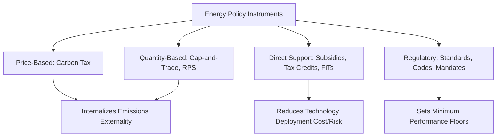

## Energy Policy and the Global Energy Transition

### Overview

Energy policy encompasses the regulatory, fiscal, and institutional frameworks governments and international bodies use to shape energy production, distribution, and consumption. The global energy transition refers to the ongoing structural shift from a fossil-fuel-dominated energy system toward low-carbon and renewable energy sources, driven by climate change mitigation goals, energy security considerations, and evolving technology and cost dynamics. This transition raises complex questions of pace, equity, technological pathway, and geopolitical realignment.

### Foundational Policy Instruments

**Carbon Pricing Mechanisms**

- **Carbon tax**: a direct price set per unit of greenhouse gas emissions (typically per tonne of $CO_2$-equivalent), providing price certainty but not a guaranteed emissions quantity outcome
- **Cap-and-trade (emissions trading systems)**: sets a firm cap on total allowable emissions within a jurisdiction or sector, allocating or auctioning tradable permits; provides quantity certainty but permit price can fluctuate based on market conditions
- Both mechanisms aim to internalize the externality of greenhouse gas emissions, theoretically directing investment toward the lowest-cost emissions reduction opportunities across the economy, though effectiveness depends heavily on price/cap stringency, coverage scope, and the presence of exemptions or free allocation provisions [Inference: real-world policy effectiveness varies substantially by design details and enforcement]

**Renewable Portfolio Standards / Renewable Energy Targets**

- Mandate that utilities or the broader electricity system source a specified percentage of electricity from renewable or low-carbon sources by a target date, functioning as a quantity-based mandate rather than a price-based instrument

**Feed-in Tariffs and Contracts for Difference**

- **Feed-in tariffs**: guarantee renewable energy generators a fixed price per unit of electricity fed into the grid, historically important in driving early-stage renewable deployment in several major markets by reducing investment risk
- **Contracts for Difference (CfDs)**: a more recent mechanism in many markets, guaranteeing generators a fixed "strike price" while allowing them to sell into the wholesale market, with the difference settled between generator and counterparty (often a government body), balancing investment certainty with market price exposure

**Subsidies and Fiscal Incentives**

- Direct subsidies, tax credits, and accelerated depreciation provisions for renewable energy, energy efficiency, and clean technology investment (e.g., investment tax credits, production tax credits)
- **Fossil fuel subsidies**: many governments continue to provide subsidies (direct or through underpricing relative to full social cost) for fossil fuel production or consumption, which several international bodies and researchers identify as working against transition and climate goals; the scale and appropriate accounting methodology for global fossil fuel subsidies is a subject of ongoing analysis and some debate depending on whether "subsidy" is defined narrowly (direct transfers) or broadly (including unpriced externalities) [Inference: subsidy estimates vary substantially depending on methodology used]

### International Climate and Energy Governance

**United Nations Framework Convention on Climate Change (UNFCCC) Process**

- The Paris Agreement (2015) established a framework of Nationally Determined Contributions (NDCs), where individual countries set their own emissions reduction targets and periodically update them, rather than a top-down binding allocation of national emissions targets as under earlier frameworks
- The Paris Agreement's long-term temperature goal (limiting warming to well below 2°C, pursuing efforts toward 1.5°C above pre-industrial levels) provides the overarching reference point against which national and global energy transition ambition is commonly assessed

**International Energy Agency (IEA) and Comparable Bodies**

- Publishes influential global energy outlook scenarios and technology roadmaps used widely in policy and investment planning, alongside other institutions producing comparable analyses (e.g., IRENA for renewable-specific analysis)
- Energy transition scenario modeling involves substantial uncertainty regarding technology cost trajectories, policy implementation, and demand growth, meaning published scenarios should be understood as conditional projections under stated assumptions rather than precise predictions [Inference: scenario uncertainty is inherent to long-term energy modeling methodology]

### Key Dimensions of the Global Energy Transition

**Electricity Sector Decarbonization**

- Generally considered the most technologically mature transition pathway, given the commercial maturity of wind, solar, and storage technologies alongside existing hydro and nuclear capacity, though grid integration, transmission expansion, and storage deployment remain significant implementation challenges in many jurisdictions

**Electrification of End-Uses**

- Shifting historically fossil-fuel-dependent end uses (transportation via electric vehicles, building heating via heat pumps, some industrial processes) to electricity, which can then be decarbonized at the generation level, representing a core strategic pillar of many national transition plans
- Electrification strategy effectiveness for emissions reduction depends directly on the carbon intensity of the electricity grid being connected to, meaning electrification and grid decarbonization are commonly understood as complementary, sequenced strategies rather than independent interventions

**Hard-to-Abate Sectors**

- Heavy industry (steel, cement, chemicals), aviation, shipping, and some agricultural emissions present greater technical decarbonization challenges than electricity or light-duty transportation, due to high-temperature process heat requirements, energy density needs, or process-inherent (non-combustion) emissions sources
- Emerging pathways include green hydrogen for industrial feedstock and high-temperature applications, carbon capture for process emissions, and sustainable aviation/marine fuels, though most of these pathways remain at early-to-moderate commercial maturity relative to electricity sector solutions [Inference: technology readiness and cost competitiveness for hard-to-abate sector solutions continue to evolve]

**Grid Infrastructure and Flexibility**

- Transmission expansion, grid modernization, and storage deployment are frequently identified in energy policy literature as critical enabling infrastructure for high-renewable-penetration systems, with permitting timelines and infrastructure investment pace cited as potential bottlenecks to transition speed in multiple jurisdictions [Inference: specific bottleneck severity varies significantly by region and regulatory context]

### Just Transition and Equity Considerations

**Just Transition Framework**

- A policy and labor-focused concept emphasizing that the shift away from fossil fuel-dependent economic activity should include support for affected workers and communities (retraining, economic diversification support, transitional income assistance), reflecting the reality that fossil fuel extraction and related industries represent significant employment and economic bases in specific regions

**Energy Access and Global Equity**

- A substantial global population still lacks reliable access to modern energy services, and energy transition policy discourse increasingly addresses the tension between rapid decarbonization ambition (particularly emphasized by higher-income, historically higher-emitting countries) and the developmental energy needs of lower-income countries seeking to expand energy access and economic growth
- The concept of "common but differentiated responsibilities," embedded in international climate governance frameworks, reflects recognition that transition pathways, financing responsibilities, and timelines may reasonably differ across countries with different historical emissions contributions and development stages — a position with continued areas of international negotiation and disagreement regarding specific application [Inference: this remains an area of active and sometimes contentious international policy negotiation]

**Distributional Impacts of Carbon Pricing**

- Carbon pricing can have regressive distributional effects if energy costs represent a larger share of income for lower-income households, a concern commonly addressed through revenue recycling mechanisms (rebates, dividends) or targeted assistance programs in policy design

### Energy Security and Geopolitical Dimensions

**Traditional Energy Security Concerns**

- Historically centered on securing reliable, affordable access to fossil fuel supplies (particularly oil and natural gas), given geographic concentration of reserves and geopolitical supply disruption risk

**Emerging Energy Security Dimensions**

- The transition introduces new supply chain security considerations centered on critical minerals for renewable energy and battery technologies (lithium, cobalt, rare earth elements), which are also geographically concentrated in production and, in some cases, processing capacity
- Some policy analysts characterize this shift as trading one set of geopolitical energy dependencies for another, though the specific risk profile differs (e.g., mineral supply is generally a one-time input to durable capital stock rather than an ongoing fuel flow, altering the nature though not necessarily eliminating the reality of supply chain vulnerability) [Inference: comparative assessment of fossil fuel versus critical mineral geopolitical risk is a matter of ongoing analysis and some disagreement among energy security researchers]

**Trade Policy and Industrial Strategy**

- Recent years have seen increased use of industrial policy tools (domestic content requirements, tariffs on imported clean energy equipment, large-scale domestic manufacturing incentives) by multiple major economies, reflecting a policy shift toward combining climate objectives with domestic industrial and supply chain strategy considerations [Inference: specific policy details and trade implications continue to evolve and vary by jurisdiction]

### Measuring Transition Progress

**Common Metrics**

- Share of renewable/low-carbon electricity generation in total generation mix
- Carbon intensity of electricity generation (grams $CO_2$/kWh)
- Total and sectoral greenhouse gas emissions trends relative to stated national targets
- Investment flows into clean energy versus fossil fuel infrastructure

**Interpreting Transition Metrics**

- Aggregate global figures can mask substantial regional variation in transition pace, starting points, and near-term versus long-term trajectory, meaning single global statistics should generally be supplemented with regional and sectoral context for meaningful policy assessment [Inference: appropriate metric interpretation depends on the specific policy question being addressed]

### Worked Example: Carbon Tax Revenue and Price Signal Effect

A jurisdiction implements a carbon tax of $50 per tonne $CO_2e$. For a coal-fired power plant emitting approximately 0.9 tonnes $CO_2e$ per MWh generated, the tax adds a direct cost of:

$$Additional\ cost = 0.9\ tonnes/MWh \times \$50/tonne = \$45/MWh$$

Comparing this to a natural gas plant emitting approximately 0.4 tonnes $CO_2e$/MWh:

$$Additional\ cost = 0.4 \times \$50 = \$20/MWh$$

This $25/MWh cost differential created by the carbon price illustrates the mechanism by which carbon pricing is intended to shift the relative economic competitiveness of generation sources toward lower-carbon options, all else being equal. [Inference: real-world dispatch and investment decisions depend on numerous additional factors including existing capital stock, fuel price volatility, and other regulatory considerations beyond the carbon price alone]

### Illustration: Energy Transition Policy Framework (svg_diagram)

<svg xmlns="http://www.w3.org/2000/svg" viewBox="0 0 700 320">
<title>Energy Transition Policy Framework Layers (svg_diagram)</title>
<rect x="0" y="0" width="700" height="320" fill="#f7f5ef" />
<text x="350" y="25" font-size="16" text-anchor="middle" font-family="sans-serif" font-weight="bold">Transition Policy Layers (svg_diagram)</text>
<rect x="150" y="50" width="400" height="60" fill="#4a4a4a" stroke="#333" />
<text x="350" y="85" font-size="12" text-anchor="middle" font-family="sans-serif" fill="#fff">International Frameworks (Paris Agreement, NDCs)</text>
<rect x="150" y="130" width="400" height="60" fill="#4a7ba6" stroke="#333" />
<text x="350" y="165" font-size="12" text-anchor="middle" font-family="sans-serif" fill="#fff">National Policy (Carbon Pricing, RPS, Subsidies)</text>
<rect x="150" y="210" width="400" height="60" fill="#5a8f5a" stroke="#333" />
<text x="350" y="245" font-size="12" text-anchor="middle" font-family="sans-serif" fill="#fff">Sectoral Implementation (Grid, Industry, Transport)</text>
<line x1="350" y1="110" x2="350" y2="130" stroke="#333" stroke-width="2" marker-end="url(#arrow7)" />
<line x1="350" y1="190" x2="350" y2="210" stroke="#333" stroke-width="2" marker-end="url(#arrow7)" />
</svg>

### Key Points

- Energy policy instruments span price-based (carbon tax), quantity-based (cap-and-trade, renewable portfolio standards), and direct support (subsidies, feed-in tariffs) mechanisms, each with distinct certainty and implementation trade-offs
- The Paris Agreement's bottom-up Nationally Determined Contributions framework represents a structurally different approach to international climate governance than earlier top-down emissions allocation frameworks
- Electricity sector decarbonization is generally the most mature transition pathway, while hard-to-abate sectors (heavy industry, aviation, shipping) face greater technical and cost challenges
- Just transition and global energy equity considerations highlight that transition pace and responsibility allocation involve genuine distributional and developmental trade-offs, not purely technical optimization problems
- Critical mineral supply chains introduce new energy security dimensions that differ from, but do not necessarily eliminate, geopolitical dependency concerns associated with fossil fuel energy systems

### Related Topics

- Carbon pricing mechanism design and implementation
- Critical minerals and renewable energy supply chains
- Grid infrastructure and transmission policy
- Climate change science and international governance frameworks
- Energy storage technologies
- Environmental justice and just transition policy
- Corporate climate disclosure and sustainable finance