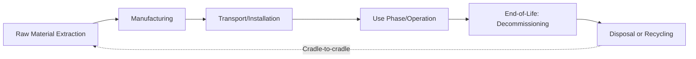

## Life Cycle Assessment of Energy Systems

### Overview

Life Cycle Assessment (LCA) is a standardized methodological framework for quantifying the environmental impacts of a product, process, or system across its full life cycle — from raw material extraction through manufacturing, use, and end-of-life disposal or recycling. Applied to energy systems, LCA enables consistent, comparative evaluation of technologies (fossil, nuclear, renewable) across multiple environmental dimensions rather than relying solely on direct operational emissions, which can substantially understate or misrepresent a technology's total environmental footprint.

### LCA Methodological Framework

**Standardized Framework (ISO 14040/14044)**

- International standards define LCA as comprising four iterative phases: goal and scope definition, life cycle inventory (LCI) analysis, life cycle impact assessment (LCIA), and interpretation
- Adherence to standardized methodology supports comparability between studies, though results remain sensitive to specific methodological choices made within the standard's flexible framework, meaning studies following ISO standards can still produce meaningfully different results depending on scope and assumption choices [Inference: degree of result variation depends on how significantly methodological choices differ between studies]

**System Boundaries**

- **Cradle-to-gate**: covers raw material extraction through manufacturing, excluding use-phase and end-of-life stages; commonly used for comparing manufactured components (e.g., PV panels) before installation-specific factors are considered
- **Cradle-to-grave**: the most complete boundary, covering the full life cycle from raw material extraction through end-of-life disposal or recycling
- **Cradle-to-cradle**: extends cradle-to-grave by explicitly incorporating recycling and material recovery back into subsequent production cycles, aligned with circular economy principles

**Functional Unit**

- The reference unit against which all inventory inputs and outputs are normalized, critical for meaningful comparison between technologies (e.g., "per kWh of electricity generated" or "per MW of installed capacity over a defined operational lifetime")
- Selecting an appropriate functional unit is essential for valid cross-technology comparison, since technologies with different capacity factors, operational lifetimes, or output characteristics can produce misleading comparisons if not normalized to a consistent, clearly defined functional basis

### Key Impact Categories in Energy System LCA

**Global Warming Potential (Greenhouse Gas Emissions)**

- The most commonly reported LCA metric for energy technologies, typically expressed as grams or kilograms $CO_2$-equivalent per kWh of electricity generated, incorporating emissions from all life cycle stages rather than operational combustion emissions alone

$$GHG\ intensity = \frac{Total\ lifecycle\ GHG\ emissions\ (CO_2e)}{Total\ lifetime\ energy\ output\ (kWh)}$$

**Other Standard Impact Categories**

- **Land use**: area occupied per unit of energy output over the technology's operational lifetime, relevant particularly for comparing solar, wind, bioenergy, and hydropower footprints
- **Water consumption**: total water withdrawn and consumed across the life cycle, including cooling water for thermal power plants, water used in manufacturing (e.g., silicon processing for PV), and hydraulic fracturing or oil sands extraction water use
- **Resource depletion**: consumption of finite mineral and metal resources, particularly relevant for technologies with high critical mineral intensity (batteries, wind turbine magnets, PV cells)
- **Human toxicity and ecotoxicity**: potential health and ecosystem impacts from pollutant releases across the life cycle, including mining-related heavy metal releases and manufacturing process chemical use
- **Eutrophication and acidification potential**: impacts from nutrient and acidifying pollutant releases, relevant to both fossil fuel combustion emissions and agricultural impacts of bioenergy feedstock cultivation

### Comparative LCA Findings Across Energy Technologies

**General Patterns from Published Literature**

- Fossil fuel technologies (particularly coal) consistently show substantially higher lifecycle greenhouse gas intensity than renewable and nuclear technologies across the large majority of published comparative LCA studies, driven overwhelmingly by combustion-phase emissions that dwarf manufacturing and infrastructure-related emissions for these technologies
- Renewable technologies (wind, solar, hydro) and nuclear power show substantially lower lifecycle greenhouse gas intensity than fossil generation, though not zero, due to manufacturing energy inputs, material extraction, and construction-phase emissions [Inference: specific comparative rankings and precise figures vary across studies depending on methodology, regional manufacturing energy mix, and technology generation assumed, and should be checked against current peer-reviewed meta-analyses rather than treated as fixed values]

**Trade-offs Revealed Through Multi-Category LCA**

- No energy technology performs uniformly best across all impact categories, illustrating why comprehensive LCA is valuable beyond single-metric (e.g., carbon-only) comparison: for example, a technology with very low operational carbon intensity may have comparatively higher land use or mineral resource intensity per unit of energy output than an alternative technology
- This multi-dimensional trade-off pattern is a core justification for using full LCA frameworks in energy technology and policy evaluation, rather than optimizing for a single environmental metric in isolation [Inference: the specific trade-off pattern and its policy significance depend on which impact categories are prioritized in a given decision context]

### Manufacturing and Supply Chain Considerations

**Energy Payback Time (EPBT)**

- The time required for an energy technology to generate the amount of energy equivalent to what was consumed in its own production, a metric particularly relevant to evaluating renewable technologies where manufacturing energy input represents a larger proportion of total lifecycle energy use than for fossil generation (where fuel input dominates)
- Energy payback times for mainstream renewable technologies (solar PV, wind) are generally a small fraction of their multi-decade operational lifetimes under typical operating conditions, though specific figures vary by manufacturing location's grid carbon intensity, technology generation, and site-specific resource availability (irradiance, wind speed) [Inference: specific payback time figures require verification against current technology-specific and location-specific studies]

**Critical Mineral Intensity**

- Renewable and storage technologies exhibit materially different mineral intensity profiles than fossil generation: wind turbines (rare earth elements for permanent magnet generators), solar PV (silver, silicon, and for thin-film technologies, tellurium or indium/gallium), and batteries (lithium, cobalt, nickel, graphite)
- LCA-based resource depletion assessment increasingly incorporates these material intensity differences as a distinct consideration alongside greenhouse gas metrics, particularly relevant given projected large-scale renewable and storage deployment under global energy transition scenarios

### End-of-Life Considerations

**Decommissioning and Disposal**

- Fossil fuel plant decommissioning involves demolition and site remediation, potentially including contaminated soil/groundwater remediation at long-operating facilities
- Nuclear plant decommissioning involves specialized, extended processes for radioactive material management and facility dismantlement, representing a longer and more technically complex end-of-life phase than most other generation technologies
- Renewable technology end-of-life (particularly PV panel and wind turbine blade waste) is an area of growing LCA and policy attention as early deployment cohorts approach end-of-operational-life, with recycling infrastructure and processes still maturing for several key material streams (blade composites, certain PV cell technologies) [Inference: recycling infrastructure maturity is evolving and should be assessed against current regional capacity]

### Limitations and Methodological Challenges in Energy LCA

**Data Quality and Regional Variability**

- LCA results depend heavily on underlying inventory data quality and regional specificity (e.g., local electricity grid mix used in manufacturing, regional mining practices), meaning global average figures can obscure substantial project-specific or region-specific variation

**Allocation Methodology**

- Systems producing multiple outputs (e.g., combined heat and power, or biofuel production generating co-products) require allocation decisions about how to distribute environmental burdens across outputs, and different allocation approaches (mass-based, energy-based, economic value-based) can produce meaningfully different results for the same underlying physical system [Inference: appropriate allocation method choice depends on study goals and remains a point of methodological discussion in LCA practice]

**Temporal and Technological Dynamics**

- LCA studies represent a snapshot based on data available at the time of study, while manufacturing processes, grid carbon intensity, and technology efficiency continue to evolve, meaning older LCA studies may not accurately represent current technology performance, particularly for rapidly evolving technologies like solar PV and battery storage

**Comparing Dispatchable and Variable Resources**

- Standard per-kWh LCA comparisons do not inherently capture differences in dispatchability and grid value between technologies (e.g., a variable renewable resource versus a dispatchable fossil or nuclear plant), which some researchers argue warrants supplementary system-level or value-adjusted analysis alongside standard per-unit LCA metrics for policy-relevant comparison [Inference: the appropriate role of system-level adjustments in standard LCA practice remains a subject of ongoing methodological discussion]

### Worked Example: Comparing Functional Units

Consider comparing a solar PV system with a 20% capacity factor and a 25-year assumed operational lifetime against a natural gas plant with a 50% capacity factor and a 30-year assumed operational lifetime, both rated at 100 MW.

$$Lifetime\ output_{PV} = 100\ MW \times 0.20 \times 8760\ h/year \times 25\ years \approx 4{,}380{,}000\ MWh$$

$$Lifetime\ output_{gas} = 100\ MW \times 0.50 \times 8760\ h/year \times 30\ years \approx 13{,}140{,}000\ MWh$$

This calculation demonstrates why simple installed-capacity comparisons are inadequate for LCA purposes: total lifecycle environmental burden must be divided by total lifetime energy output (the functional unit) to produce a meaningful per-kWh comparison, since the two technologies deliver substantially different total energy output over their respective assumed lifetimes even at identical rated capacity. [Inference: illustrative capacity factor and lifetime figures used here are simplified assumptions; actual comparative LCA requires technology- and site-specific data]

### Illustration: Life Cycle Impact Categories Radar Comparison (svg_diagram)

<svg xmlns="http://www.w3.org/2000/svg" viewBox="0 0 700 380">
<title>Multi-Category LCA Comparison Concept (svg_diagram)</title>
<rect x="0" y="0" width="700" height="380" fill="#f7f5ef" />
<text x="350" y="25" font-size="16" text-anchor="middle" font-family="sans-serif" font-weight="bold">Multi-Category LCA Trade-offs (svg_diagram)</text>
<polygon points="350,60 470,140 430,270 270,270 230,140" fill="none" stroke="#333" stroke-width="1" />
<polygon points="350,100 430,155 405,240 295,240 270,155" fill="none" stroke="#333" stroke-width="1" />
<polygon points="350,140 390,170 380,210 320,210 310,170" fill="none" stroke="#333" stroke-width="1" />

<text x="350" y="45" font-size="10" text-anchor="middle" font-family="sans-serif">GHG Intensity</text>

<text x="500" y="140" font-size="10" text-anchor="middle" font-family="sans-serif">Land Use</text>

<text x="450" y="290" font-size="10" text-anchor="middle" font-family="sans-serif">Water Use</text>

<text x="250" y="290" font-size="10" text-anchor="middle" font-family="sans-serif">Resource Depletion</text>

<text x="195" y="140" font-size="10" text-anchor="middle" font-family="sans-serif">Toxicity</text>

<polygon points="350,80 440,150 410,240 290,240 260,150" fill="#4a7ba6" fill-opacity="0.3" stroke="#4a7ba6" stroke-width="2" />
<text x="350" y="330" font-size="11" text-anchor="middle" font-family="sans-serif" fill="#4a7ba6">Example Technology Profile (illustrative shape only)</text>
<text x="350" y="350" font-size="10" text-anchor="middle" font-family="sans-serif" font-style="italic">No single technology minimizes all categories simultaneously</text>
</svg>

### Key Points

- LCA provides a standardized, multi-stage framework (ISO 14040/14044) for comprehensive environmental comparison of energy technologies beyond operational emissions alone
- Functional unit selection is critical to valid technology comparison, since differing capacity factors and operational lifetimes can substantially affect per-unit results if not properly normalized
- Fossil fuel technologies consistently show substantially higher lifecycle greenhouse gas intensity than renewable and nuclear technologies, though precise comparative figures vary across studies and should be checked against current literature
- No energy technology minimizes all environmental impact categories simultaneously, underscoring the value of multi-category LCA over single-metric (carbon-only) technology comparison
- LCA results are sensitive to methodological choices (system boundaries, allocation methods, regional data), meaning careful attention to study methodology is essential when comparing or citing LCA findings

### Related Topics

- Renewable energy technology environmental comparison (solar, wind, hydro, geothermal)
- Critical minerals and mining resource management
- Circular economy and end-of-life material recovery
- Carbon accounting and greenhouse gas inventory methodology
- Nuclear waste management and decommissioning
- Environmental impact assessment methodology
- Energy policy and technology comparative evaluation