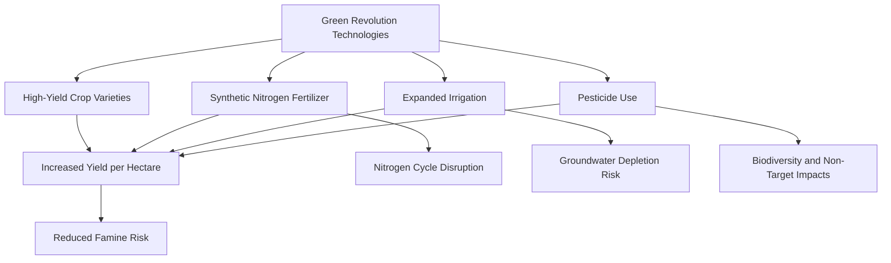

## Agroecosystems and Modern Agricultural Practices

### Overview

Agroecosystems are managed ecological systems shaped by human agricultural activity, integrating crop and livestock production with the surrounding biophysical environment, including soil, water, climate, and biodiversity. Modern agricultural practices have dramatically increased global food production capacity through mechanization, synthetic inputs, and crop genetics, while simultaneously generating significant environmental pressures on soil health, water resources, biodiversity, and climate systems that shape contemporary sustainable agriculture research and policy.

### Agroecosystem Structure and Function

**Components of an Agroecosystem**

- Biotic components: crops, livestock, soil microbiota, pollinators, pest and beneficial insect populations, weeds
- Abiotic components: soil physical/chemical properties, climate, water availability, topography
- Human management inputs: tillage, irrigation, fertilization, pest management, crop selection and rotation decisions

**Key Distinctions from Natural Ecosystems**

- Agroecosystems typically exhibit reduced species diversity relative to natural ecosystems, particularly in monoculture systems, and require continuous external energy and material inputs (fertilizer, fuel, seed) to maintain productivity, in contrast to natural ecosystems' greater reliance on internal nutrient cycling
- Agroecosystems are subject to more frequent and intensive disturbance (tillage, harvest) than most natural ecosystems, fundamentally shaping their soil, hydrological, and biodiversity characteristics

### The Green Revolution and Modern Intensification

**Historical Context**

- The mid-20th-century Green Revolution introduced high-yielding crop varieties (particularly wheat and rice), synthetic nitrogen fertilizers, expanded irrigation, and pesticide use, substantially increasing global cereal production and contributing significantly to reduced famine risk in many regions during this period
- This intensification came alongside significant environmental trade-offs that became increasingly apparent in subsequent decades, including groundwater depletion, soil degradation, biodiversity loss, and agrochemical pollution, shaping the environmental science and policy discourse around sustainable intensification that followed

**Synthetic Nitrogen Fixation (Haber-Bosch Process)**

- Industrial synthesis of ammonia from atmospheric nitrogen and hydrogen enabled large-scale synthetic fertilizer production, fundamentally altering the global nitrogen cycle by adding substantial reactive nitrogen beyond natural biological fixation rates

$$N_2 + 3H_2 \rightarrow 2NH_3$$

- This process is widely credited with supporting a substantial share of current global food production capacity relative to what natural nitrogen fixation alone could sustain, while simultaneously being identified as a major driver of anthropogenic disruption to the global nitrogen cycle [Inference: precise quantitative estimates of synthetic nitrogen's contribution to global food production vary across studies and methodologies]

### Cropping Systems

**Monoculture**

- Cultivation of a single crop species over a large area, offering economies of scale in mechanization and management, but generally exhibiting reduced resilience to pest/disease outbreaks and greater susceptibility to yield variability, since genetic and species uniformity removes the buffering effect of diversity against correlated shocks

**Polyculture and Crop Diversification**

- Intercropping (growing multiple crop species simultaneously in proximity) and diversified crop rotations can improve pest and disease suppression, nutrient cycling efficiency, and yield stability relative to monoculture, though often at some trade-off in mechanization efficiency and per-crop yield optimization [Inference: the magnitude of these trade-offs varies substantially by crop combination, region, and management system]

**Crop Rotation**

- Sequential planting of different crop species on the same land across growing seasons, historically used to manage soil fertility (e.g., alternating nitrogen-fixing legumes with nitrogen-demanding cereals), break pest and pathogen life cycles, and reduce weed pressure

**Cover Cropping**

- Planting non-harvested crops (e.g., legumes, grasses) during fallow periods to protect soil from erosion, suppress weeds, improve soil organic matter, and in the case of leguminous cover crops, contribute biologically fixed nitrogen to the following cash crop

### Soil Management Practices

**Tillage Systems**

- **Conventional tillage**: intensive soil inversion and mechanical breakup, historically standard practice for seedbed preparation and weed control, but associated with accelerated soil organic matter loss, increased erosion susceptibility, and soil structure degradation over time
- **Conservation tillage / No-till**: reduces or eliminates soil disturbance, leaving crop residue on the surface, generally associated with improved soil organic matter retention, reduced erosion, and improved water infiltration compared to conventional tillage, though transition can involve initial yield or weed management adjustment challenges depending on region and cropping system [Inference: yield and management outcomes during no-till transition vary by soil type, climate, and crop]

**Soil Fertility Management**

- Synthetic fertilizers provide readily available nutrients (nitrogen, phosphorus, potassium) but require careful management to avoid over-application, which contributes to nutrient runoff, eutrophication, and, for nitrogen specifically, nitrous oxide emissions from soil microbial processes
- Organic amendments (compost, manure, cover crop residue) contribute to soil organic matter and support soil microbial community function, generally providing more gradual nutrient release than synthetic fertilizers

### Irrigation and Water Management

**Irrigation Methods**

- **Flood/furrow irrigation**: lower capital cost but generally lower water-use efficiency due to substantial losses from evaporation, runoff, and deep percolation beyond the crop root zone
- **Sprinkler irrigation**: improved application uniformity and efficiency relative to flood irrigation, at higher equipment cost
- **Drip (micro) irrigation**: delivers water directly to the plant root zone, achieving the highest water-use efficiency among common irrigation methods by minimizing evaporation and runoff losses, at the highest per-area equipment cost among the three approaches

**Water Resource Pressures**

- Agricultural irrigation represents the largest share of global freshwater withdrawal, and unsustainable groundwater extraction for irrigation (exceeding natural aquifer recharge rates) has led to documented water table decline in several major agricultural regions globally, a concern directly connected to broader water resource and groundwater management challenges

### Pest and Weed Management

**Integrated Pest Management (IPM)**

- A management framework combining biological, cultural, mechanical, and chemical control methods, using pesticides as one tool within a broader strategy rather than the primary or sole pest management approach, with the goal of reducing pesticide use, cost, and resistance development while maintaining effective pest control
- Components include pest monitoring/scouting, economic threshold-based decision-making (applying control measures only when pest populations exceed a level justifying intervention cost), biological control (beneficial insects, predators), and targeted pesticide application when needed

**Pesticide Environmental Considerations**

- Non-target impacts on beneficial insects (including pollinators), aquatic organisms (via runoff), and soil organisms are central environmental concerns in pesticide use, with specific impact magnitude varying substantially by active ingredient, application method, and site conditions
- Pesticide resistance development in target pest populations is a recognized and ongoing challenge requiring rotation of pesticide modes of action and integration with non-chemical control methods to manage resistance evolution

### Genetically Modified and Biotechnology-Enhanced Crops

**Common GM Crop Traits**

- Herbicide tolerance (allowing broad-spectrum herbicide application without crop damage) and insect resistance (commonly via Bacillus thuringiensis, Bt, genes expressing insecticidal proteins) represent the most widely commercialized GM crop trait categories globally
- Additional traits in commercial or developmental stages include drought tolerance, enhanced nutritional content (e.g., biofortification), and disease resistance

**Environmental and Agronomic Considerations**

- GM insect-resistant crops have been associated in multiple studies with reduced broad-spectrum insecticide application in some cropping systems, though outcomes vary by crop, region, and specific pest pressure context [Inference: comparative pesticide use outcomes are actively studied and vary across the published literature]
- Herbicide-tolerant crop systems have in some cases been associated with the evolution of herbicide-resistant weed populations due to intensive reliance on a narrow set of herbicide modes of action, illustrating a resistance management challenge analogous to pesticide resistance in pest management
- Gene flow to wild relatives and non-target ecological effects remain active areas of ecological risk assessment research, with specific risk profiles varying by crop species, trait, and regional ecological context

### Precision Agriculture

**Core Technologies**

- GPS-guided equipment, variable-rate application technology (adjusting fertilizer, pesticide, or seed application rate based on within-field spatial variability), remote sensing (satellite and drone-based crop monitoring), and soil sensor networks enable more spatially and temporally precise input management than traditional uniform-rate field management
- Precision agriculture aims to optimize input use efficiency by matching application rates to actual localized crop and soil needs, with the goal of maintaining or improving yield while reducing excess input application and associated environmental impacts (nutrient runoff, over-irrigation)

### Livestock Integration and Impacts

**Livestock Production Systems**

- Range from extensive grazing systems (see Rangeland and Grassland Management) to intensive Concentrated Animal Feeding Operations (CAFOs), with substantially different environmental footprint profiles across land use, water use, and waste management dimensions
- Manure management in intensive systems presents both a resource opportunity (organic fertilizer, biogas feedstock via anaerobic digestion) and an environmental risk (nutrient runoff, ammonia and methane emissions) depending on storage and application practices

### Environmental Impacts Summary

**Soil Degradation**

- Erosion, compaction, salinization (particularly in irrigated arid regions with poor drainage), and organic matter loss represent primary soil degradation pathways associated with intensive conventional agricultural practice

**Water Quality**

- Nutrient runoff (nitrogen and phosphorus) from agricultural land is a leading contributor to freshwater and coastal eutrophication globally, including well-documented downstream effects such as harmful algal blooms and hypoxic "dead zones"

**Biodiversity**

- Habitat conversion for agricultural expansion, pesticide non-target effects, and landscape simplification (loss of hedgerows, field margins, crop diversity) are identified as major contributors to global agricultural biodiversity pressure, including documented pollinator decline concerns in multiple regions

**Greenhouse Gas Emissions**

- Agriculture contributes to global greenhouse gas emissions through nitrous oxide from soil nitrogen cycling, methane from livestock enteric fermentation and rice paddy cultivation, and $CO_2$ from land-use change and fossil fuel use in farm operations

### Worked Example: Nitrogen Use Efficiency Calculation

A cereal crop field receives 150 kg N/ha as synthetic fertilizer and produces a harvested yield removing 90 kg N/ha in grain.

$$Nitrogen\ Use\ Efficiency\ (NUE) = \frac{N\ removed\ in\ harvest}{N\ applied} \times 100$$

$$NUE = \frac{90}{150} \times 100 = 60\%$$

The remaining 40% of applied nitrogen is subject to loss pathways including volatilization, leaching, denitrification (as $N_2O$ and $N_2$), and residual soil retention, illustrating why improving nitrogen use efficiency through precision application timing and rate is simultaneously an economic and environmental management priority. [Inference: actual loss pathway partitioning depends on soil type, climate, and application timing/method]

### Illustration: Agroecosystem Nutrient and Input Flows (svg_diagram)

<svg xmlns="http://www.w3.org/2000/svg" viewBox="0 0 700 340">
<title>Agroecosystem Input-Output Flow Diagram (svg_diagram)</title>
<rect x="0" y="0" width="700" height="340" fill="#f7f5ef" />
<text x="350" y="25" font-size="16" text-anchor="middle" font-family="sans-serif" font-weight="bold">Agroecosystem Flows (svg_diagram)</text>
<rect x="260" y="130" width="180" height="80" fill="#8c6a4a" stroke="#333" />
<text x="350" y="165" font-size="12" text-anchor="middle" font-family="sans-serif" fill="#fff">Agroecosystem</text>
<text x="350" y="185" font-size="12" text-anchor="middle" font-family="sans-serif" fill="#fff">(Crop/Soil System)</text>
<line x1="100" y1="80" x2="270" y2="140" stroke="#5a8f5a" stroke-width="2" marker-end="url(#arrow8)" />
<text x="100" y="65" font-size="10" text-anchor="middle" font-family="sans-serif">Fertilizer Input</text>
<line x1="100" y1="150" x2="260" y2="165" stroke="#4a7ba6" stroke-width="2" marker-end="url(#arrow8)" />
<text x="100" y="135" font-size="10" text-anchor="middle" font-family="sans-serif">Irrigation Water</text>
<line x1="100" y1="220" x2="270" y2="195" stroke="#b5473a" stroke-width="2" marker-end="url(#arrow8)" />
<text x="100" y="235" font-size="10" text-anchor="middle" font-family="sans-serif">Pesticide Input</text>
<line x1="440" y1="150" x2="600" y2="90" stroke="#c9a34a" stroke-width="2" marker-end="url(#arrow8)" />
<text x="600" y="75" font-size="10" text-anchor="middle" font-family="sans-serif">Harvested Yield</text>
<line x1="440" y1="185" x2="600" y2="210" stroke="#7a4a9a" stroke-width="2" marker-end="url(#arrow8)" />
<text x="600" y="230" font-size="10" text-anchor="middle" font-family="sans-serif">Nutrient Runoff</text>
<line x1="350" y1="210" x2="350" y2="280" stroke="#4a4a4a" stroke-width="2" marker-end="url(#arrow8)" />
<text x="350" y="300" font-size="10" text-anchor="middle" font-family="sans-serif">GHG Emissions (N2O, CH4, CO2)</text>
</svg>

### Key Points

- Agroecosystems differ fundamentally from natural ecosystems in requiring continuous external inputs and typically exhibiting reduced biological diversity, particularly under monoculture management
- The Green Revolution's synthetic fertilizer, irrigation, and high-yield variety technologies substantially increased global food production while introducing significant environmental trade-offs still actively managed today
- Integrated Pest Management and precision agriculture represent key strategies for improving input-use efficiency and reducing environmental impact while maintaining agricultural productivity
- Nutrient runoff, soil degradation, and biodiversity loss represent the most consistently documented environmental pressures associated with intensive conventional agricultural practice
- No-till/conservation tillage and cover cropping are widely supported soil health practices, though transition outcomes vary by soil type, climate, and cropping system

### Related Topics

- Soil science and soil conservation practices
- Water resource management and irrigation efficiency
- Nutrient cycling and eutrophication
- Sustainable and regenerative agriculture practices
- Pollinator conservation and agricultural biodiversity
- Genetically modified organisms and agricultural biotechnology policy
- Rangeland and livestock management systems