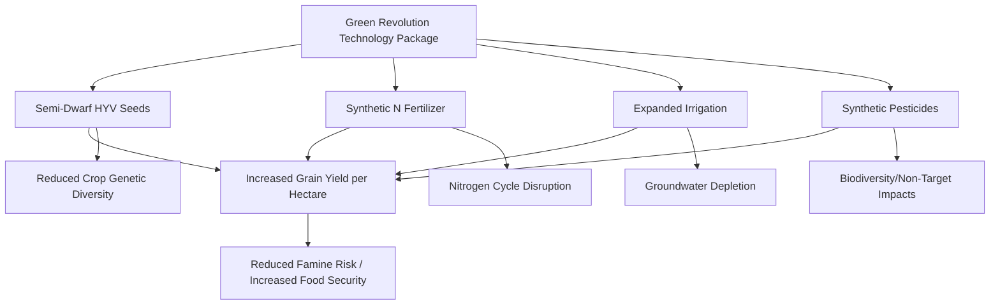

## The Green Revolution and Its Environmental Legacy

### Overview

The Green Revolution refers to the mid-20th-century transformation of global agriculture through the introduction of high-yielding crop varieties, synthetic fertilizers, expanded irrigation, and agrochemical pest control, primarily spanning the 1940s through the 1970s. It dramatically increased cereal grain production and is widely credited with averting predicted famines in several densely populated regions, while simultaneously establishing agricultural production patterns whose environmental consequences — soil degradation, water depletion, biodiversity loss, and agrochemical pollution — continue to shape environmental science and sustainable agriculture policy today.

### Historical Origins and Key Figures

**Norman Borlaug and Wheat Breeding**

- Agricultural scientist Norman Borlaug led breeding programs in Mexico beginning in the 1940s that developed semi-dwarf, disease-resistant, high-yielding wheat varieties, work for which he was awarded the Nobel Peace Prize in 1970 in recognition of the technology's contribution to global food security
- Semi-dwarf breeding reduced plant height, which allowed wheat to allocate more energy to grain production and resist "lodging" (stem collapse) under the weight of grain when heavily fertilized — a limitation that had constrained yield potential in taller traditional varieties

**Expansion to Rice and Other Regions**

- Similar high-yielding semi-dwarf rice varieties (notably developed at the International Rice Research Institute, IRRI, in the Philippines) extended Green Revolution technology to South and Southeast Asian rice production systems beginning in the 1960s
- Adoption spread across Latin America, South Asia, and parts of the Middle East and North Africa, though adoption patterns and outcomes varied considerably by region, crop, and local agroecological and institutional conditions [Inference: regional adoption timelines and outcome variation are well-documented but complex, and specific figures should be checked against agricultural history literature for particular regions]

### Core Technological Components

**High-Yielding Varieties (HYVs)**

- Semi-dwarf, fertilizer-responsive crop varieties bred specifically to convert high nutrient input into substantially increased grain yield, in contrast to traditional varieties that had been selected over long periods for traits including regional adaptation and stress tolerance rather than maximum yield response to intensive input use

**Synthetic Nitrogen Fertilizer**

- Industrial ammonia synthesis via the Haber-Bosch process enabled large-scale, relatively low-cost synthetic nitrogen fertilizer production, providing the high nutrient input required for HYVs to express their yield potential

$$N_2 + 3H_2 \xrightarrow{catalyst,\ high\ T\ \&\ P} 2NH_3$$

**Expanded Irrigation Infrastructure**

- Large-scale irrigation development (canal systems, groundwater tube wells) provided the consistent water supply required to support intensive, fertilizer-responsive cropping systems, particularly critical for the multiple-cropping-per-year systems that became more widespread under Green Revolution intensification

**Synthetic Pesticides**

- Organochlorine, organophosphate, and later other pesticide classes provided pest and disease control supporting the yield reliability needed to justify farmers' increased input investment in HYV seed and fertilizer

### Documented Production and Food Security Outcomes

**Yield and Production Gains**

- Cereal grain yields, particularly wheat and rice, increased substantially across major adopting regions during the Green Revolution period, widely credited in agricultural and development economics literature with playing a central role in averting large-scale famine predicted by some mid-20th-century population and food supply projections [Inference: precise quantitative yield increase figures and famine-avoidance counterfactuals vary across studies and involve inherent difficulty in establishing precise causal counterfactuals]

**Economic and Social Effects**

- Increased production supported lower real food prices in many adopting regions over subsequent decades, with documented benefits for food security and poverty reduction, though the distribution of economic benefits across farm sizes and social groups varied by region and has been a subject of considerable study and debate in development economics and agricultural history literature [Inference: distributional outcome findings are heterogeneous across studies and regional contexts]

### Environmental Legacy: Soil Impacts

**Soil Degradation Pathways**

- Intensive tillage associated with Green Revolution cropping systems contributed to accelerated soil erosion and organic matter decline in many adopting regions over subsequent decades
- **Salinization**: expanded irrigation in regions with inadequate drainage led to progressive soil salinization in some major agricultural areas, as evaporation concentrates dissolved salts in the root zone over repeated irrigation cycles without adequate leaching or drainage, a well-documented degradation pathway in several intensively irrigated Green Revolution regions

**Soil Nutrient and Biological Changes**

- Sustained reliance on synthetic nitrogen fertilizer, in the absence of adequate organic matter management, has been associated in agronomic research with declining soil organic carbon and altered soil microbial community composition in some long-term intensively managed systems, though the magnitude and consistency of this effect vary by soil type, climate, and specific management practice [Inference: soil biological response to sustained fertilizer use is an active area of soil science research with context-dependent findings]

### Environmental Legacy: Water Resources

**Groundwater Depletion**

- Expanded tube-well irrigation, particularly for rice and wheat double-cropping systems in regions such as northern India's Punjab, has been associated with documented long-term groundwater table decline in several major Green Revolution agricultural regions, representing one of the most consistently cited environmental concerns in the technology's legacy [Inference: specific rates of groundwater decline are region-specific and require current hydrogeological data for precise figures]

**Water Quality**

- Nutrient runoff from intensive fertilizer application has contributed to documented eutrophication of downstream water bodies in multiple Green Revolution agricultural regions, contributing to the broader global pattern of agricultural nutrient pollution affecting freshwater and coastal ecosystems

### Environmental Legacy: Biodiversity

**Agricultural Biodiversity (Agrobiodiversity) Loss**

- Widespread adoption of a relatively narrow set of high-yielding varieties displaced numerous traditional, locally adapted crop landraces in many regions, a process associated with concerns about genetic vulnerability (reduced resilience to novel pest, disease, or climate stresses due to reduced underlying genetic diversity) and loss of genetic resources that may hold value for future breeding programs
- Ex-situ seed banks and, more recently, renewed interest in agrobiodiversity conservation and traditional variety preservation reflect ongoing efforts to address this legacy concern, though the scale of landrace loss that occurred during peak Green Revolution adoption is generally considered substantial and, for many specific traditional varieties, effectively irreversible [Inference: precise quantitative loss figures vary by crop and region and are inherently difficult to establish comprehensively]

**Non-Target Ecological Effects**

- Pesticide use associated with Green Revolution intensification contributed to documented non-target impacts on beneficial insects, aquatic organisms, and in some cases wildlife populations, part of the broader pattern of agricultural intensification-associated biodiversity pressure

### Environmental Legacy: Climate and Greenhouse Gas Emissions

**Nitrogen Cycle and Emissions**

- Large-scale synthetic nitrogen fertilizer use, a core Green Revolution technology, is a major contributor to anthropogenic nitrous oxide emissions through soil microbial nitrification and denitrification processes, representing a significant and directly attributable climate legacy of the technology package
- Rice paddy cultivation under intensified multiple-cropping systems is a documented source of methane emissions from anaerobic decomposition in flooded soil conditions, a legacy consideration particularly relevant to intensified rice-growing regions

### Contemporary Reassessment and Sustainable Intensification

**Second Green Revolution / Sustainable Intensification Discourse**

- Contemporary agricultural science and policy discourse frequently frames the challenge of meeting future food demand as requiring "sustainable intensification" — increasing productivity while reducing the environmental footprint per unit of production — explicitly informed by lessons drawn from the first Green Revolution's environmental trade-offs
- This includes renewed emphasis on precision agriculture, integrated pest management, improved nitrogen use efficiency, conservation tillage, and, in some frameworks, agroecological and diversified system approaches, reflecting an evolving synthesis rather than simple rejection or continuation of Green Revolution-era intensification philosophy [Inference: the appropriate balance between input-intensive and agroecological approaches remains an active area of scientific and policy debate]

**Regional Equity Considerations**

- The Green Revolution's technology package required capital investment (irrigation infrastructure, fertilizer, purchased seed) that was not equally accessible to all farmers, and some historical analyses note that certain smallholder and resource-limited farming populations, along with some regions (notably parts of sub-Saharan Africa, where adoption was comparatively limited during the primary Green Revolution period), experienced more limited direct benefit from the technology package than better-resourced farmers and regions [Inference: regional and distributional outcome patterns are heterogeneous and remain a subject of ongoing agricultural development and economic history scholarship]

### Worked Example: Comparative Nitrogen Input Intensity

A traditional pre-Green Revolution wheat variety might respond to nitrogen application only up to a modest rate before lodging risk limits further yield response, while a semi-dwarf HYV can utilize substantially higher fertilizer rates due to its lodging-resistant structure. Illustrating this relationship conceptually:

If a traditional variety's yield plateaus near 60 kg N/ha applied (beyond which lodging risk negates further yield gain), while an HYV continues responding productively up to approximately 150 kg N/ha, this roughly 2.5-fold difference in economically justified nitrogen input rate illustrates the mechanistic link between the plant breeding innovation (lodging resistance) and the fertilizer-intensive input package that became characteristic of Green Revolution agriculture. [Inference: these are illustrative figures for conceptual purposes; actual response curves are crop-, variety-, and site-specific]

### Illustration: Green Revolution Technology Package and Legacy Timeline (svg_diagram)

<svg xmlns="http://www.w3.org/2000/svg" viewBox="0 0 700 320">
<title>Green Revolution Technology Package and Environmental Legacy (svg_diagram)</title>
<rect x="0" y="0" width="700" height="320" fill="#f7f5ef" />
<text x="350" y="25" font-size="16" text-anchor="middle" font-family="sans-serif" font-weight="bold">Green Revolution Legacy (svg_diagram)</text>
<line x1="60" y1="80" x2="640" y2="80" stroke="#333" stroke-width="2" />
<circle cx="150" cy="80" r="6" fill="#5a8f5a" />
<text x="150" y="60" font-size="10" text-anchor="middle" font-family="sans-serif">1940s-50s: Wheat</text>
<text x="150" y="105" font-size="9" text-anchor="middle" font-family="sans-serif">Borlaug/Mexico</text>
<circle cx="350" cy="80" r="6" fill="#5a8f5a" />
<text x="350" y="60" font-size="10" text-anchor="middle" font-family="sans-serif">1960s: Rice</text>
<text x="350" y="105" font-size="9" text-anchor="middle" font-family="sans-serif">IRRI/Asia</text>
<circle cx="550" cy="80" r="6" fill="#5a8f5a" />
<text x="550" y="60" font-size="10" text-anchor="middle" font-family="sans-serif">1970s: Peak</text>
<text x="550" y="105" font-size="9" text-anchor="middle" font-family="sans-serif">Expansion</text>
<rect x="60" y="160" width="270" height="120" fill="#4a7ba6" stroke="#333" />
<text x="195" y="185" font-size="12" text-anchor="middle" font-family="sans-serif" font-weight="bold" fill="#fff">Production Benefits</text>
<text x="195" y="210" font-size="10" text-anchor="middle" font-family="sans-serif" fill="#fff">Increased cereal yields</text>
<text x="195" y="230" font-size="10" text-anchor="middle" font-family="sans-serif" fill="#fff">Reduced famine risk</text>
<text x="195" y="250" font-size="10" text-anchor="middle" font-family="sans-serif" fill="#fff">Lower real food prices</text>
<rect x="370" y="160" width="270" height="120" fill="#b5473a" stroke="#333" />
<text x="505" y="185" font-size="12" text-anchor="middle" font-family="sans-serif" font-weight="bold" fill="#fff">Environmental Costs</text>
<text x="505" y="210" font-size="10" text-anchor="middle" font-family="sans-serif" fill="#fff">Groundwater depletion</text>
<text x="505" y="230" font-size="10" text-anchor="middle" font-family="sans-serif" fill="#fff">Soil degradation/salinization</text>
<text x="505" y="250" font-size="10" text-anchor="middle" font-family="sans-serif" fill="#fff">Agrobiodiversity loss</text>
</svg>

### Key Points

- The Green Revolution's core technology package — semi-dwarf HYVs, synthetic nitrogen fertilizer, expanded irrigation, and pesticides — is widely credited with substantially increasing global cereal production and reducing famine risk during the mid-20th century
- Semi-dwarf plant breeding solved a specific agronomic constraint (lodging under heavy fertilization), mechanistically enabling the fertilizer-intensive input package that became characteristic of the broader technology system
- Groundwater depletion, soil salinization, and agrobiodiversity loss represent the most consistently documented and cited environmental legacy concerns across Green Revolution-adopting regions
- Distributional outcomes varied considerably by region and farmer resource level, with some populations and regions (including much of sub-Saharan Africa during the primary adoption period) experiencing more limited direct benefit
- Contemporary "sustainable intensification" discourse explicitly seeks to draw lessons from the Green Revolution's environmental trade-offs while addressing continued global food demand growth

### Related Topics

- Agroecosystems and modern agricultural practices
- Soil salinization and irrigation management
- Groundwater hydrology and sustainable water use
- Agrobiodiversity conservation and seed banking
- Sustainable intensification and precision agriculture
- Nitrogen cycle disruption and eutrophication
- Global food security and agricultural development policy