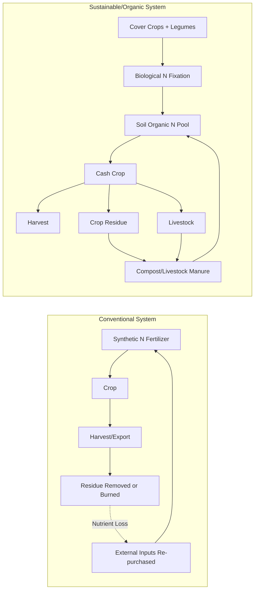

## Sustainable and Organic Farming Systems

### Definitions and Conceptual Framework

**Sustainable agriculture** refers to farming systems designed to meet present food and fiber needs without compromising the ability of future generations to meet their own needs. It rests on three interlocking pillars: environmental stewardship, economic viability, and social equity. Sustainability is a systems-level goal that can be pursued through many practice sets, not a single certified method.

**Organic farming** is a specific, regulated production system defined by the prohibition (or strict limitation) of synthetic inputs — synthetic fertilizers, synthetic pesticides, genetically modified organisms (GMOs), and synthetic growth regulators — combined with mandated practices such as crop rotation, cover cropping, and composting. Organic status is typically verified through third-party certification (e.g., USDA National Organic Program, EU Organic Regulation 2018/848).

**Key distinction:** All organic farms pursue practices aligned with sustainability, but not all sustainable farms are certified organic (e.g., a conventional farm using no-till and precision fertilization is sustainable but not organic). Conversely, organic certification does not automatically guarantee sustainability outcomes (e.g., an organic monoculture with heavy tillage can still degrade soil).

**Key Points:**

- Sustainability = a systems goal (ecological, economic, social)
- Organic = a regulated, input-based certification standard
- Overlap is large but not total

---

### Core Ecological Principles

Sustainable and organic systems draw on **agroecology**, the application of ecological concepts to agricultural systems. Central principles include:

1. **Nutrient cycling** — closing loops between crop, livestock, and soil rather than relying on linear input-output flows
2. **Biodiversity** — functional diversity above and below ground buffers against pest outbreaks and climate variability
3. **Energy efficiency** — minimizing fossil-fuel-derived inputs (synthetic N fertilizer is especially energy-intensive via the Haber-Bosch process)
4. **Resilience** — systems designed to recover from and adapt to shocks (drought, flooding, pest pressure)
5. **Self-regulation** — using ecological interactions (predator-prey, allelopathy, competition) to replace synthetic interventions

---

### Soil Health Management

Soil is treated as a living system rather than an inert growing medium.

**Core practices:**

- **Cover cropping**: Non-cash crops (e.g., clover, vetch, rye) planted between cash crop cycles to prevent erosion, fix nitrogen (legumes), suppress weeds, and add organic matter
- **Crop rotation**: Sequential planting of different species to break pest/disease cycles, balance nutrient demand, and diversify root architecture
- **Composting and manure management**: Recycling organic waste into stable humus-rich amendments
- **Reduced/no-till**: Minimizing soil disturbance to preserve fungal networks, soil structure, and carbon stocks
- **Green manures**: Cover crops incorporated directly into soil to boost organic matter and nutrient availability

**Soil organic matter (SOM) dynamics** can be conceptually modeled by a simple mass balance:

$$\frac{dC}{dt} = I - kC$$

Where $C$ is soil carbon stock, $I$ is the rate of organic matter inputs (residues, manure, roots), and $k$ is the decomposition rate constant. Practices that increase $I$ (cover crops, compost) or decrease $k$ (reduced tillage, which limits oxygen exposure and microbial decomposition) both raise steady-state soil carbon $C_{ss} = I/k$.

**[Inference]** Actual field-level carbon sequestration rates vary substantially with climate, soil texture, and baseline SOM, so this equation is a simplified heuristic rather than a predictive field model.

---

### Nitrogen and Nutrient Management

Because synthetic nitrogen fertilizer is excluded or restricted in organic systems, nitrogen supply depends on **biological nitrogen fixation (BNF)** and organic matter mineralization.

**Biological nitrogen fixation** occurs via symbiosis between leguminous plants (soybeans, clover, alfalfa, beans) and *Rhizobium* bacteria in root nodules, which convert atmospheric N₂ into plant-available ammonium:

$$N_2 + 8H^+ + 8e^- + 16\,ATP \rightarrow 2NH_3 + H_2 + 16\,ADP + 16\,P_i$$

This reaction is catalyzed by the nitrogenase enzyme complex, which is oxygen-sensitive — explaining why nodules maintain low internal oxygen via leghemoglobin.

**Other nutrient strategies:**

- **Composted manure** supplies slow-release N, P, K along with micronutrients
- **Rock phosphate and potassium sulfate** are permitted mineral inputs in most organic standards (mined, not synthetically processed)
- **Mycorrhizal fungi** extend effective root surface area, improving phosphorus uptake in P-limited soils

---

### Pest, Weed, and Disease Management

Organic and sustainable systems substitute synthetic pesticide chemistry with **Integrated Pest Management (IPM)** principles:

**Biological control** — Introducing or conserving natural enemies (e.g., ladybird beetles for aphids, parasitoid wasps for caterpillars, *Bacillus thuringiensis* (Bt) as a microbial insecticide)

**Cultural control** — Crop rotation to disrupt pest life cycles; trap cropping (sacrificial plantings that draw pests away from cash crops); resistant cultivar selection

**Mechanical/physical control** — Tillage-based weed suppression, mulching, row covers, flame weeding

**Botanical/mineral pesticides** (permitted in organic systems under restriction) — neem oil (azadirachtin), pyrethrin, copper- and sulfur-based fungicides

**Allelopathy** — Some cover crops (e.g., rye, sorghum-sudangrass) release biochemical compounds that suppress weed germination

**[Unverified]** Copper-based fungicides, while organic-approved, can accumulate in soil with repeated heavy use and affect soil microbial communities; regulatory limits vary by jurisdiction.

---

### Livestock Integration

**Mixed crop-livestock systems** reintroduce animals as active nutrient-cycling agents rather than isolating them in confined operations.

- **Rotational/managed intensive grazing**: Livestock moved through paddocks on a schedule that allows forage recovery, mimicking natural herd movement patterns and improving pasture productivity and soil carbon
- **Manure as fertilizer**: Closes the nutrient loop between animal and crop systems
- **Organic livestock standards**: Require organic feed, restrict/prohibit routine antibiotics and synthetic hormones, and mandate outdoor access

---

### Comparative Diagram: Conventional vs. Sustainable/Organic Nutrient Flow

---

### Water Management

- **Soil moisture retention**: Higher SOM from organic practices increases water-holding capacity (each 1% increase in SOM can hold significantly more plant-available water per unit soil volume)
- **Drip irrigation and mulching**: Reduce evaporative losses, compatible with both organic and conventional sustainable systems
- **Contour farming and terracing**: Reduce runoff and erosion on sloped land
- **Water-use efficiency (WUE)**: Defined as biomass or yield produced per unit of water consumed, often improved via reduced tillage (less evaporation) and diversified rooting depths

---

### Certification Standards and Regulatory Frameworks

| Standard | Region | Key Features |
| --- | --- | --- |
| USDA National Organic Program (NOP) | United States | Prohibits synthetic pesticides/fertilizers, GMOs; 3-year transition period required |
| EU Organic Regulation 2018/848 | European Union | Similar prohibitions; stricter livestock welfare provisions |
| JAS (Japanese Agricultural Standard) | Japan | Organic labeling standard, mutual recognition agreements with some regions |
| Participatory Guarantee Systems (PGS) | Global South, smallholder contexts | Peer-review-based, lower-cost alternative to third-party certification |

**Transition period**: Most standards require a multi-year conversion window (commonly 3 years) during which land must be managed organically before products can be labeled "organic," reflecting the time needed to reduce residual synthetic input effects and rebuild soil biology.

---

### Yield and Economic Considerations

**[Inference/Unverified — contested empirical area]** Meta-analyses of organic vs. conventional yields generally report an average yield gap in the range of roughly 10-25%, with the gap narrowing significantly for legumes and perennials and widening for cereals under high-input conventional management. Yield gaps are highly context-dependent (crop type, climate, soil, management skill) and specific figures should be treated as illustrative ranges rather than universal constants, since study methodology varies considerably.

**Economic offsets to lower yields:**

- Price premiums for certified organic products
- Reduced input costs (no synthetic fertilizer/pesticide purchases)
- Potential government subsidies/incentive programs for conservation practices
- Reduced long-term costs from soil degradation avoidance

---

### Environmental Trade-offs and Debates

**Land-sparing vs. land-sharing**: A central debate is whether lower-yielding organic systems requiring more land (land-sharing, high on-farm biodiversity) produce better net environmental outcomes than higher-yielding conventional systems on less land with intact land set aside elsewhere (land-sparing). **[Speculation/contested]** — this remains an active area of disagreement among agricultural economists and ecologists, with outcomes depending heavily on regional land-use alternatives (e.g., what the "spared" land would otherwise be used for).

**Greenhouse gas trade-offs**: Organic systems typically show lower direct emissions per hectare (no synthetic N production emissions, higher soil carbon), but may show higher emissions per unit of output where yields are substantially lower, since more land and inputs are needed to produce equivalent output.

---

### Example: Simplified Organic Crop Rotation Plan (4-Year Cycle)

**Example**

| Year | Crop | Function |
| --- | --- | --- |
| 1 | Soybean (legume) | Nitrogen fixation, soil building |
| 2 | Winter wheat | Nitrogen-demanding cash crop, uses fixed N |
| 3 | Cover crop (clover/rye mix) + fallow period | Erosion control, weed suppression, further N fixation |
| 4 | Corn/maize | High-nitrogen-demand cash crop, benefits from prior years |

This sequence balances nitrogen supply and demand across years while breaking pest and weed life cycles that would otherwise build up under continuous monocropping.

---

### Illustrative Diagram: Soil Health Feedback Loop (svg_diagram)

<svg xmlns="http://www.w3.org/2000/svg" viewBox="0 0 640 420">
<text x="320" y="30" text-anchor="middle" font-size="16" font-weight="bold" fill="#2d4a2b">Soil Health Feedback Loop (svg_diagram)</text>
<circle cx="320" cy="220" r="150" fill="none" stroke="#8a9a5b" stroke-width="2" stroke-dasharray="4,3" />
<ellipse cx="320" cy="90" rx="90" ry="35" fill="#c9dabf" stroke="#4a6b3a" stroke-width="2" />
<text x="320" y="95" text-anchor="middle" font-size="13" fill="#2d4a2b">Cover Crops &amp; Compost</text>
<ellipse cx="460" cy="180" rx="90" ry="35" fill="#e8d9a8" stroke="#a08540" stroke-width="2" />
<text x="460" y="185" text-anchor="middle" font-size="13" fill="#5c4a1f">Increased Organic Matter</text>
<ellipse cx="460" cy="300" rx="90" ry="35" fill="#c9dabf" stroke="#4a6b3a" stroke-width="2" />
<text x="460" y="295" text-anchor="middle" font-size="12" fill="#2d4a2b">Improved Water</text>
<text x="460" y="310" text-anchor="middle" font-size="12" fill="#2d4a2b">Retention &amp; Structure</text>
<ellipse cx="320" cy="360" rx="90" ry="35" fill="#e8d9a8" stroke="#a08540" stroke-width="2" />
<text x="320" y="365" text-anchor="middle" font-size="13" fill="#5c4a1f">Enhanced Microbial Activity</text>
<ellipse cx="180" cy="300" rx="90" ry="35" fill="#c9dabf" stroke="#4a6b3a" stroke-width="2" />
<text x="180" y="295" text-anchor="middle" font-size="12" fill="#2d4a2b">Nutrient</text>
<text x="180" y="310" text-anchor="middle" font-size="12" fill="#2d4a2b">Cycling/Availability</text>
<ellipse cx="180" cy="180" rx="90" ry="35" fill="#e8d9a8" stroke="#a08540" stroke-width="2" />
<text x="180" y="185" text-anchor="middle" font-size="13" fill="#5c4a1f">Healthier Crop Growth</text>
<path d="M390,110 Q440,140 445,150" fill="none" stroke="#4a6b3a" stroke-width="2" marker-end="url(#arrow)" />
<path d="M475,215 Q480,260 475,270" fill="none" stroke="#4a6b3a" stroke-width="2" marker-end="url(#arrow)" />
<path d="M420,325 Q380,345 365,355" fill="none" stroke="#4a6b3a" stroke-width="2" marker-end="url(#arrow)" />
<path d="M275,355 Q230,340 220,325" fill="none" stroke="#4a6b3a" stroke-width="2" marker-end="url(#arrow)" />
<path d="M165,270 Q160,225 165,215" fill="none" stroke="#4a6b3a" stroke-width="2" marker-end="url(#arrow)" />
<path d="M220,150 Q260,120 280,110" fill="none" stroke="#4a6b3a" stroke-width="2" marker-end="url(#arrow)" />
</svg>

---

### Climate Change Mitigation and Adaptation Roles

- **Carbon sequestration**: Increased SOM directly translates to atmospheric CO₂ drawdown into stable soil carbon pools
- **Reduced emissions**: Avoidance of synthetic N fertilizer (Haber-Bosch process is highly energy-intensive and nitrous oxide, N₂O, from over-application is a potent greenhouse gas with roughly 273× the 100-year global warming potential of CO₂)
- **Resilience to climate extremes**: Higher SOM and diversified cropping systems improve buffering against drought (greater water-holding capacity) and flooding (better infiltration)
- **Agroforestry integration**: Combining trees with crops/livestock adds carbon storage in woody biomass and diversifies farm income

---

### Common Challenges and Limitations

**Key Points:**

- **Labor intensity**: Mechanical weeding, composting, and diversified management typically require more labor input than input-substitution conventional farming
- **Transition costs**: The multi-year certification transition period often comes without organic price premiums yet, creating a financial gap
- **Pest pressure variability**: Without synthetic pesticides, some pest outbreaks can be harder to control rapidly, particularly in monoculture-adjacent landscapes
- **Nutrient timing precision**: Organic nutrient sources (compost, manure) release nutrients more slowly and less predictably than synthetic fertilizers, which can create synchrony mismatches with peak crop demand
- **Scale and market access**: Smallholder farmers may face disproportionate certification costs relative to farm revenue, partially addressed by Participatory Guarantee Systems

---

### Related Topics

- Agroecology and ecosystem services in agriculture
- Precision agriculture and its intersection with sustainable input reduction
- Soil microbiome science and the rhizosphere
- Life cycle assessment (LCA) methodology for food systems
- Permaculture design principles
- Agroforestry and silvopasture systems
- Food system resilience and climate adaptation
- Global nitrogen cycle disruption and planetary boundaries
- Biodynamic farming (Steiner-based certification systems)
- Carbon farming and soil carbon credit markets