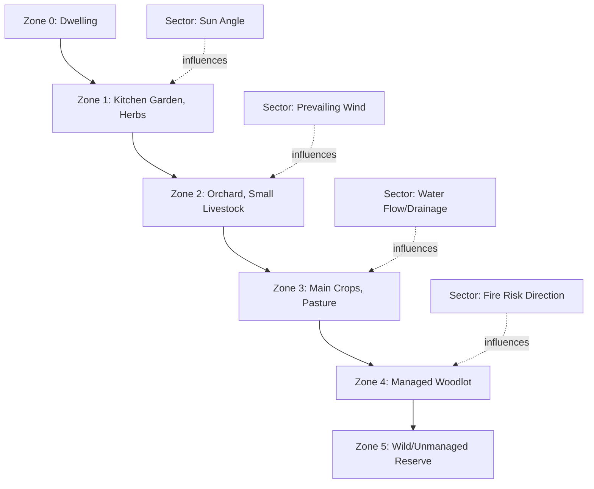

## Agroecology and Permaculture

### Definitions and Conceptual Distinctions

**Agroecology** is the application of ecological science and principles to the design, management, and evaluation of agricultural systems. It operates simultaneously as a scientific discipline, a set of farming practices, and a social movement advocating for food sovereignty and equitable food systems.

**Permaculture** (a portmanteau of "permanent agriculture" or "permanent culture") is a design system, developed by Bill Mollison and David Holmgren in the 1970s, that applies observed patterns from natural ecosystems to the design of human settlements and agricultural systems. It is prescriptive and design-centered, offering a defined methodology and ethical framework.

**Key distinction:** Agroecology is primarily a scientific and analytical framework used to study and optimize existing or new farming systems at multiple scales (field, farm, landscape, food system). Permaculture is primarily a design methodology with explicit ethics and principles applied at the site/farm scale, often oriented toward smallholder, homestead, or community contexts. The two overlap extensively in practice and share ecological foundations, but agroecology has stronger grounding in peer-reviewed agronomic and ecological research, while permaculture is more design-practice-oriented with a less formalized research base.

**Key Points:**

- Agroecology = science + practice + movement, multi-scale
- Permaculture = design system + ethics, primarily site-scale
- Both reject input-substitution monoculture models in favor of diversified, self-regulating systems

---

### Agroecology: Scientific Foundations

Agroecology is typically analyzed across three nested levels:

1. **Plot/field level** — species interactions, polycultures, soil-plant relationships
2. **Farm level** — whole-farm design, crop-livestock integration, resource cycling
3. **Food system level** — market structures, food sovereignty, land tenure, socioeconomic equity

**Core ecological concepts applied:**

- **Succession**: Mimicking natural vegetative succession stages (pioneer species → intermediate → climax) in perennial polyculture design
- **Niche complementarity**: Selecting species with different resource-use patterns (rooting depth, light requirements, nutrient needs) to minimize competition and maximize productivity per unit area
- **Trophic interactions**: Managing predator-prey and plant-herbivore relationships to achieve natural pest regulation
- **Nutrient cycling closure**: Minimizing external input dependency by recycling on-farm biomass

**The Land Equivalent Ratio (LER)** is a standard agroecological metric for evaluating polyculture efficiency, comparing intercropped yield to monoculture yield:

$$LER = \frac{Y_{ab}}{Y_{aa}} + \frac{Y_{ba}}{Y_{bb}}$$

Where $Y_{ab}$ is the yield of crop $a$ grown in intercrop with $b$, and $Y_{aa}$ is the yield of crop $a$ in monoculture (same notation pattern for crop $b$). An $LER > 1$ indicates the intercrop system produces more combined output than separate monocultures on equivalent land area — a common empirical finding in well-designed legume-cereal intercrops.

---

### Permaculture: Ethics and Design Principles

Permaculture is built on **three core ethics**:

1. **Earth Care** — regenerating and protecting natural systems
2. **People Care** — meeting human needs for wellbeing and self-reliance
3. **Fair Share** — redistributing surplus, setting limits to consumption

**David Holmgren's 12 design principles** (commonly cited framework):

1. Observe and interact
2. Catch and store energy
3. Obtain a yield
4. Apply self-regulation and accept feedback
5. Use and value renewable resources and services
6. Produce no waste
7. Design from patterns to details
8. Integrate rather than segregate
9. Use small and slow solutions
10. Use and value diversity
11. Use edges and value the marginal
12. Creatively use and respond to change

**Key Points:**

- Ethics provide the "why"; the 12 principles provide the "how" of design decision-making
- Principles are meant to be applied holistically, not as a checklist

---

### Permaculture Design Tools and Methods

**Zone and sector analysis** — A core permaculture planning tool organizing site elements by frequency of human interaction (zones) and by external energy flows (sectors: sun, wind, water, fire risk).

| Zone | Description | Example Elements |
| --- | --- | --- |
| Zone 0 | Home/dwelling | House, immediate living space |
| Zone 1 | Frequently visited, intensively managed | Kitchen garden, herbs, small livestock |
| Zone 2 | Semi-intensive | Orchards, larger vegetable plots, beehives |
| Zone 3 | Extensive, less frequent visits | Main crops, pasture, larger livestock |
| Zone 4 | Semi-wild, minimal management | Managed woodlot, forage areas |
| Zone 5 | Unmanaged wild land | Observation, biodiversity reserve |

**Sector analysis** maps external energies entering the site (prevailing wind direction, sun angle across seasons, water flow/drainage, fire risk direction) to inform placement decisions — e.g., placing windbreaks upwind of vulnerable crops, orienting structures for passive solar gain.

**Keyline design** — A water-harvesting and soil-building technique (developed by P.A. Yeomans) that uses subsoil plowing along contour-derived "keylines" to redistribute water evenly across a landscape from valleys toward ridges, reducing erosion and improving infiltration.

---

### Diagram: Permaculture Zone and Sector Layout

---

### Food Forests and Forest Gardening

A **food forest** (forest garden) is a permaculture design pattern that mimics the structure of a natural woodland ecosystem using edible/useful species, organized into vertical layers:

1. **Canopy layer** — large fruit/nut trees
2. **Sub-canopy/low tree layer** — dwarf fruit trees
3. **Shrub layer** — berries, currants
4. **Herbaceous layer** — perennial vegetables, herbs
5. **Ground cover/rhizosphere layer** — low-growing edible spreaders
6. **Root layer** — root vegetables, tubers
7. **Vertical/climber layer** — vines (grapes, kiwi, climbing beans)

This layered stacking maximizes light capture and spatial resource use per unit area, analogous to niche complementarity in agroecological polyculture theory.

**[Inference]** Long-term yield and labor-efficiency outcomes of mature food forests relative to conventional orchards are not extensively documented in controlled long-term studies; most evidence is observational or case-study based rather than replicated field-trial research.

---

### Guilds and Companion Planting

A **plant guild** is a functional grouping of species that support one another through complementary roles, commonly illustrated by the "Three Sisters" system (Indigenous North American intercropping):

- **Corn** — provides vertical structure for beans to climb
- **Beans** (legume) — fixes atmospheric nitrogen, benefiting corn and squash
- **Squash** — sprawling ground cover suppresses weeds and retains soil moisture

This is a practical historical example of niche complementarity and mutualistic facilitation predating formal agroecological theory by centuries.

---

### Swales and Water Harvesting

**Swales** are shallow, level-bottomed trenches dug on contour, paired with a downhill mound (berm), designed to slow, spread, and sink water into the landscape rather than allowing runoff.

**Function:**

- Intercepts surface runoff during rainfall events
- Allows water to infiltrate slowly, recharging the soil profile and subsurface water table
- Trees/perennials planted on the berm access the elevated moisture zone

**Design consideration**: Swale spacing and sizing depend on slope gradient, soil infiltration rate, and expected rainfall intensity — typically calculated using site-specific hydrological assessment rather than a fixed universal formula.

---

### Illustrative Diagram: Swale Cross-Section (svg_diagram)

<svg xmlns="http://www.w3.org/2000/svg" viewBox="0 0 640 320">
<text x="320" y="28" text-anchor="middle" font-size="15" font-weight="bold" fill="#2d4a2b">Swale and Berm Cross-Section (svg_diagram)</text>
<path d="M40,220 L200,220 Q240,220 260,260 Q280,300 320,300 Q360,300 380,260 Q400,220 440,220 L600,220" fill="none" stroke="#5c4a2f" stroke-width="3" />
<path d="M260,260 Q280,300 320,300 Q360,300 380,260 L380,260 Q360,290 320,290 Q280,290 260,260 Z" fill="#a3c9e0" stroke="#4a7a9c" stroke-width="1.5" />
<text x="320" y="280" text-anchor="middle" font-size="11" fill="#2d5670">Swale (water)</text>
<ellipse cx="330" cy="210" rx="55" ry="18" fill="#c9dabf" stroke="#4a6b3a" stroke-width="1.5" />
<text x="330" y="215" text-anchor="middle" font-size="11" fill="#2d4a2b">Berm (planting mound)</text>
<line x1="330" y1="192" x2="330" y2="150" stroke="#4a6b3a" stroke-width="4" />
<circle cx="330" cy="135" r="22" fill="#7fa864" stroke="#4a6b3a" stroke-width="1.5" />
<text x="330" y="110" text-anchor="middle" font-size="11" fill="#2d4a2b">Tree/Perennial</text>
<path d="M100,200 L150,220" fill="none" stroke="#4a7a9c" stroke-width="2" marker-end="url(#arrowswale)" />
<text x="100" y="195" font-size="10" fill="#2d5670">Surface runoff</text>
<text x="320" y="245" text-anchor="middle" font-size="10" fill="`#5c4a1f`">Contour line (level along slope)</text>

</svg>

---

### Agroecological Transition Frameworks

Agroecological transition is often described through a staged model (based on the framework popularized by Stephen Gliessman):

**Level 1** — Increase efficiency of conventional practices (reduce/optimize input use)

**Level 2** — Substitute conventional inputs with agroecological alternatives (biological pest control for synthetic pesticides)

**Level 3** — Redesign the agroecosystem based on ecological processes (diversified rotations, integrated crop-livestock systems)

**Level 4** — Reconnect producers and consumers, rebuild local/regional food systems

**Level 5** — Build a new global food system based on equity, participation, and ecological integrity

This staged model illustrates that agroecological transition is not binary (organic/conventional) but incremental and multi-dimensional, spanning technical, social, and political-economic change.

---

### Example: Comparing Approaches on a Single Site

**Example**

A 2-hectare smallholding transitioning from conventional monoculture vegetable production:

- **Agroecological analysis** would evaluate: crop diversity indices, nutrient flow balances (N, P, K budgets), pest/predator ratios, soil biological activity, and socioeconomic indicators (labor input, market access, income stability)
- **Permaculture design** would apply: zone/sector mapping of the specific site, swale placement following contour surveys, guild design around key fruit trees, and a phased implementation plan following the "small and slow solutions" principle

Both frameworks would likely converge on similar practices (polyculture, water harvesting, reduced tillage) but arrive there through different reasoning processes — agroecology through ecological/systems analysis, permaculture through pattern-based design principles.

---

### Criticisms and Limitations

**Key Points:**

- **Permaculture**: Criticized within academic circles for having a comparatively thin peer-reviewed evidence base relative to its popularity; much of the foundational literature is practitioner-authored rather than subject to rigorous experimental replication. **[Unverified]** — the extent of this evidence gap is a matter of ongoing debate, and research volume has been increasing.
- **Agroecology**: Criticized by some agronomists for potential yield trade-offs at scale and for the difficulty of achieving political/institutional support given entrenched conventional agricultural policy and subsidy structures
- **Both frameworks**: Face challenges in scaling from smallholder/demonstration contexts to large commercial operations, and often require higher management skill and knowledge intensity compared to standardized conventional protocols
- **Labor intensity**: Both approaches, especially in early establishment phases (e.g., food forest establishment, swale construction), typically require greater upfront labor and time-to-yield compared to conventional annual cropping

---

### Related Topics

- Sustainable and organic farming systems (input standards and certification)
- Silvopasture and agroforestry systems
- Biodynamic farming and closed-loop farm ecosystems
- Food sovereignty and land tenure policy
- Soil microbiome and rhizosphere ecology
- Water harvesting and small-scale hydrology (keyline design, rainwater catchment)
- Indigenous and traditional ecological knowledge (TEK) in agriculture
- Urban agriculture and permaculture in constrained spaces
- Regenerative grazing and holistic management (Allan Savory framework)
- Ecosystem services valuation in agricultural landscapes