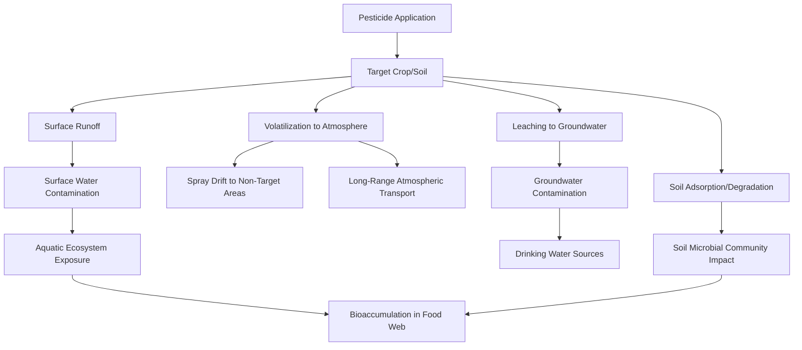

## Pesticides and Their Environmental Impacts

### Definitions and Classification

**Pesticides** are chemical or biological agents used to prevent, destroy, repel, or mitigate pests, including insects, weeds, fungi, rodents, and other organisms deemed harmful to crops, human health, or property. The term is an umbrella category encompassing several functional classes.

**Classification by target organism:**

| Class | Target | Common Examples |
| --- | --- | --- |
| Insecticides | Insects | Organophosphates, pyrethroids, neonicotinoids |
| Herbicides | Weeds/unwanted plants | Glyphosate, atrazine, 2,4-D |
| Fungicides | Fungal pathogens | Copper compounds, azoles, strobilurins |
| Rodenticides | Rodents | Anticoagulants (warfarin-type) |
| Nematicides | Parasitic nematodes | Fumigants, organophosphates |
| Herbicides (defoliants) | Plant growth/senescence | Paraquat |

**Classification by chemical structure:**

- **Organochlorines** — persistent, lipophilic (e.g., DDT, largely banned in most countries)
- **Organophosphates** — acetylcholinesterase inhibitors, generally less persistent than organochlorines but acutely toxic
- **Carbamates** — similar mode of action to organophosphates
- **Pyrethroids** — synthetic analogs of natural pyrethrins, disrupt sodium channels in nerve cells
- **Neonicotinoids** — nicotinic acetylcholine receptor agonists, systemic (absorbed into plant tissue)
- **Glyphosate and other herbicides** — targets the shikimate pathway (EPSPS enzyme), present in plants and some microorganisms but not animals

---

### Modes of Action

**Organophosphates and carbamates** inhibit acetylcholinesterase (AChE), the enzyme responsible for breaking down the neurotransmitter acetylcholine at nerve synapses:

$$Acetylcholine \xrightarrow{AChE} Choline + Acetate$$

When AChE is inhibited, acetylcholine accumulates at synapses, causing continuous nerve stimulation — this mechanism underlies both pest control efficacy and mammalian/human acute toxicity risk, since the enzyme is conserved across many animal taxa.

**Neonicotinoids** bind to nicotinic acetylcholine receptors (nAChRs) in the insect central nervous system, causing overstimulation, paralysis, and death. Because these receptors have structural differences between insects and vertebrates, neonicotinoids exhibit selective toxicity favoring insects over mammals — though this same systemic, water-soluble property is central to concerns about non-target pollinator exposure via nectar and pollen.

**Glyphosate** inhibits 5-enolpyruvylshikimate-3-phosphate synthase (EPSPS), a key enzyme in the shikimate pathway used by plants and some microbes to synthesize aromatic amino acids. Because animals lack this pathway, glyphosate's direct mechanism does not target animal cells — though environmental and formulation-related health questions remain an active area of regulatory science and scientific debate.

**[Unverified]** The human health risk classification of glyphosate remains genuinely contested among regulatory bodies: the International Agency for Research on Cancer (IARC) classified it as "probably carcinogenic to humans" (Group 2A) in 2015, while other major regulatory agencies (US EPA, European Food Safety Authority) have concluded existing evidence does not support this classification. This is a live scientific and regulatory disagreement rather than a settled fact.

---

### Environmental Fate and Transport Pathways

Once applied, pesticides move through the environment via several pathways:

**Key fate-determining properties:**

- **Persistence (half-life)**: Time required for 50% degradation; ranges from days (many organophosphates) to decades (legacy organochlorines like DDT)
- **Water solubility**: Determines leaching/runoff potential
- **Octanol-water partition coefficient ($K_{ow}$)**: Predicts bioaccumulation tendency; higher $\log K_{ow}$ values indicate greater lipophilicity and biomagnification potential
- **Soil adsorption coefficient ($K_{oc}$)**: Predicts binding to soil organic matter, influencing mobility

---

### Bioaccumulation and Biomagnification

**Bioaccumulation** refers to the accumulation of a substance within an individual organism over its lifetime, occurring when the uptake rate exceeds the elimination rate.

**Biomagnification** refers to the increasing concentration of a substance at successive trophic levels in a food web, most pronounced for lipophilic, persistent compounds.

The classic historical example is **DDT** (dichlorodiphenyltrichloroethane), which biomagnified through aquatic food webs and caused eggshell thinning in raptors (notably bald eagles and peregrine falcons) via interference with calcium metabolism — a case that became central to Rachel Carson's *Silent Spring* (1962) and subsequent regulatory action (US ban in 1972).

**Simplified biomagnification relationship** across trophic levels can be approximated as:

$$C_n = C_0 \times BMF^n$$

Where $C_n$ is the contaminant concentration at trophic level $n$, $C_0$ is the baseline environmental concentration, and $BMF$ is the biomagnification factor (typically $>1$ for persistent lipophilic compounds).

---

### Effects on Pollinators

**Neonicotinoid impacts on bees** are among the most extensively studied non-target effects in contemporary pesticide science:

- **Sublethal effects**: Impaired navigation, foraging efficiency, learning/memory (associated with effects on the mushroom bodies of the bee brain), and reduced colony reproductive success, observed even at concentrations below acute lethal thresholds
- **Systemic exposure**: Because neonicotinoids are absorbed into plant vascular tissue, they appear in pollen and nectar, creating chronic low-dose exposure pathways distinct from direct contact spraying
- **Regulatory response**: The EU implemented restrictions/bans on several neonicotinoids (clothianidin, imidacloprid, thiamethoxam) for outdoor use, citing pollinator risk assessments

**[Inference]** Pollinator decline (including colony collapse disorder in honeybees) is widely understood to be multi-causal, involving pesticide exposure alongside *Varroa* mite infestation, habitat loss, pathogens, and nutritional stress; attributing decline to pesticides alone would overstate the current scientific consensus, which emphasizes interacting stressors.

---

### Aquatic Ecosystem Effects

**Herbicide runoff** (e.g., atrazine) can cause:

- Algal community shifts and eutrophication-adjacent effects when nutrient-pesticide interactions alter primary producer dynamics
- **[Unverified/contested]** Endocrine-disrupting effects in amphibians have been reported in some studies (e.g., research on atrazine and gonadal abnormalities in frogs), though findings and their ecological significance have been debated within the herpetological and toxicological research community, with some replication attempts yielding mixed results

**Insecticide runoff** effects on aquatic invertebrates:

- Pyrethroids are highly toxic to fish and aquatic invertebrates even at low concentrations due to their mode of action on shared ion channel structures
- Reductions in macroinvertebrate diversity and abundance downstream of agricultural runoff are commonly documented in watershed studies, affecting food availability for fish and amphibians

---

### Soil Microbial and Non-Target Terrestrial Effects

- **Soil microbial community shifts**: Some fungicides (particularly broad-spectrum compounds) can suppress beneficial soil fungi, including mycorrhizal associations important for plant nutrient uptake
- **Earthworm toxicity**: Certain insecticide classes show measurable acute and sublethal toxicity to earthworms, affecting soil structure and organic matter turnover functions they perform
- **Non-target arthropod effects**: Broad-spectrum insecticides reduce populations of natural pest predators (spiders, predatory beetles, parasitoid wasps), potentially triggering **secondary pest outbreaks** when a previously controlled pest's natural enemies are eliminated

---

### Pesticide Resistance Evolution

Repeated pesticide application exerts strong selective pressure, driving the evolution of resistance in target pest populations through standard natural selection dynamics:

1. Genetic variation exists in the pest population (some individuals carry resistance alleles, e.g., altered target-site proteins or enhanced detoxification enzymes)
2. Pesticide application kills susceptible individuals
3. Resistant individuals survive and reproduce disproportionately
4. Resistance allele frequency increases across generations

This dynamic can be conceptually modeled with a selection coefficient framework, where resistant genotype frequency $p$ changes generation over generation as:

$$p_{t+1} = \frac{p_t \times w_R}{p_t \times w_R + (1-p_t) \times w_S}$$

Where $w_R$ and $w_S$ are relative fitness values of resistant and susceptible genotypes under pesticide exposure ($w_R > w_S$ under continued selection pressure).

**Documented cases**: Resistance has been reported in numerous major pest species (e.g., glyphosate-resistant weeds such as *Amaranthus palmeri*, pyrethroid-resistant mosquitoes, organophosphate-resistant Colorado potato beetles), driving cycles of increasing application rates or shifts to new chemical classes.

---

### Regulatory and Risk Assessment Frameworks

**Key Points:**

- **Registration/approval process**: Most jurisdictions (US EPA under FIFRA, EU under Regulation 1107/2009) require toxicological, environmental fate, and efficacy data before market approval
- **Maximum Residue Limits (MRLs)**: Legal thresholds for pesticide residue on food commodities, set with safety margins below levels associated with observed toxicological effects
- **Buffer zones and application restrictions**: Mandated distances from water bodies, schools, or residential areas to reduce drift exposure
- **Restricted Use Pesticides (RUP)**: Categories requiring certified applicator licensing due to elevated risk profiles

**[Unverified]** Regulatory standards and permitted active ingredients vary substantially across jurisdictions and are periodically revised; a compound banned in one region (e.g., certain neonicotinoids in the EU) may remain approved elsewhere, so current status should be verified against the relevant national/regional regulatory database rather than assumed static.

---

### Integrated Pest Management as a Mitigation Framework

IPM (introduced in the Sustainable and Organic Farming Systems context) directly addresses pesticide environmental impacts by establishing an economic threshold-based decision framework rather than calendar-based or prophylactic spraying:

**IPM decision hierarchy:**

1. Monitoring and pest identification (scouting, trapping)
2. Establishing economic injury thresholds (pest density at which control costs are justified by prevented crop loss)
3. Prioritizing cultural, biological, and mechanical controls
4. Selective/targeted chemical application only when thresholds are exceeded, using the most selective and least persistent effective compound

---

### Illustrative Diagram: Trophic Biomagnification (svg_diagram)

<svg xmlns="http://www.w3.org/2000/svg" viewBox="0 0 640 380">
<text x="320" y="28" text-anchor="middle" font-size="15" font-weight="bold" fill="#5c2d2d">Pesticide Biomagnification Through a Food Web (svg_diagram)</text>
<rect x="60" y="300" width="90" height="40" fill="#a8c98a" stroke="#4a6b3a" stroke-width="1.5" />
<text x="105" y="323" text-anchor="middle" font-size="11" fill="#2d4a2b">Algae/Plankton</text>
<text x="105" y="358" text-anchor="middle" font-size="10" fill="#5c2d2d">Low concentration</text>
<rect x="220" y="250" width="90" height="45" fill="#d4c98a" stroke="#8a7a3a" stroke-width="1.5" />
<text x="265" y="270" text-anchor="middle" font-size="11" fill="#5c4a1f">Small Fish</text>
<text x="265" y="285" text-anchor="middle" font-size="10" fill="#5c4a1f">(zooplankton feeder)</text>
<text x="265" y="308" text-anchor="middle" font-size="10" fill="#5c2d2d">Moderate concentration</text>
<rect x="380" y="180" width="90" height="50" fill="#d4a87a" stroke="#8a5a3a" stroke-width="1.5" />
<text x="425" y="200" text-anchor="middle" font-size="11" fill="#5c3a1f">Large Fish</text>
<text x="425" y="215" text-anchor="middle" font-size="10" fill="#5c3a1f">(predator)</text>
<text x="425" y="243" text-anchor="middle" font-size="10" fill="#5c2d2d">High concentration</text>
<rect x="500" y="90" width="100" height="55" fill="#d47a7a" stroke="#8a3a3a" stroke-width="1.5" />
<text x="550" y="112" text-anchor="middle" font-size="11" fill="#5c1f1f">Fish-Eating Bird</text>
<text x="550" y="127" text-anchor="middle" font-size="11" fill="#5c1f1f">(apex predator)</text>
<text x="550" y="160" text-anchor="middle" font-size="10" fill="#5c1f1f">Highest concentration</text>
<path d="M150,315 L220,280" fill="none" stroke="#5c2d2d" stroke-width="2" marker-end="url(#arrowbio)" />
<path d="M310,265 L380,220" fill="none" stroke="#5c2d2d" stroke-width="2" marker-end="url(#arrowbio)" />
<path d="M470,195 L500,150" fill="none" stroke="#5c2d2d" stroke-width="2" marker-end="url(#arrowbio)" />
</svg>

---

### Example: Calculating a Simple Bioaccumulation Scenario

**Example**

A wetland shows a baseline waterborne pesticide concentration ($C_0$) of 0.001 ppm. If the estimated biomagnification factor (BMF) per trophic level is 5, the approximate concentration at the third trophic level (e.g., a piscivorous bird, three steps removed from the water) would be:

$$C_3 = 0.001 \times 5^3 = 0.001 \times 125 = 0.125 \text{ ppm}$$

This illustrates, at a simplified conceptual level, why apex predators in aquatic-linked food webs are disproportionately vulnerable to persistent, lipophilic pesticide residues even when environmental water concentrations appear low. **[Inference]** Real-world BMF values vary substantially by compound, species, and ecosystem, so this example is illustrative of the mathematical principle rather than a specific empirical case.

---

### Mitigation and Alternative Strategies

**Key Points:**

- **Precision application technology**: GPS-guided variable-rate sprayers reduce total volume applied and off-target drift
- **Biopesticides**: Microbial agents (*Bacillus thuringiensis*), botanical extracts (neem, pyrethrin), and RNA interference (RNAi)-based products offer more target-specific alternatives with generally shorter environmental persistence
- **Resistant cultivar breeding**: Reduces reliance on chemical control by building pest/disease resistance into the crop genome
- **Buffer strips and riparian vegetation**: Physically intercept runoff before it reaches water bodies
- **Crop rotation and diversification**: Reduces pest population buildup, lowering baseline pesticide demand

---

### Related Topics

- Sustainable and organic farming systems (input restrictions and alternatives)
- Integrated Pest Management (IPM) frameworks in depth
- Eutrophication and agricultural nutrient runoff
- Endocrine-disrupting chemicals and environmental toxicology
- Biopesticides and RNAi-based pest control technologies
- Pollinator decline and colony collapse disorder
- Environmental risk assessment and regulatory toxicology (FIFRA, REACH)
- Persistent organic pollutants (POPs) and the Stockholm Convention
- Genetically modified crops and herbicide-tolerant trait systems
- Watershed-scale agricultural runoff management