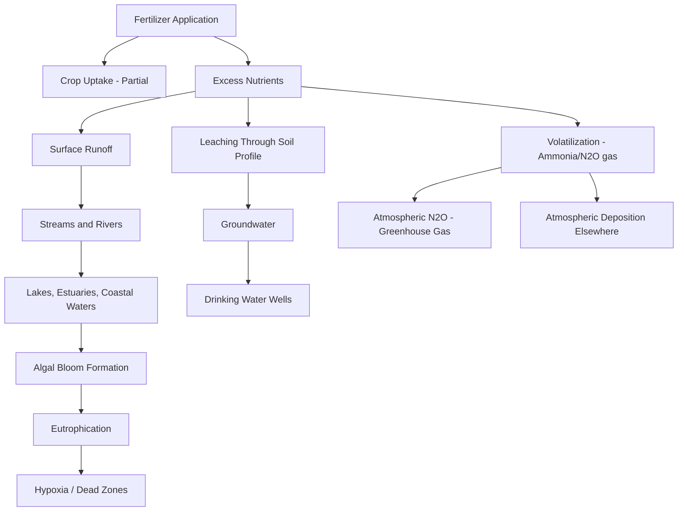

## Fertilizers and Nutrient Pollution

### Definitions and Fertilizer Classification

**Fertilizers** are substances applied to soil or plants to supply essential nutrients for growth, primarily nitrogen (N), phosphorus (P), and potassium (K) — collectively referred to by the shorthand **N-P-K**, along with secondary macronutrients (calcium, magnesium, sulfur) and micronutrients (zinc, boron, iron, manganese, copper, molybdenum).

**Classification by origin:**

| Type | Description | Examples |
| --- | --- | --- |
| Synthetic/inorganic | Industrially manufactured, typically water-soluble, fast-acting | Urea, ammonium nitrate, monoammonium phosphate (MAP), potassium chloride |
| Organic | Derived from plant/animal materials, slower nutrient release | Compost, manure, bone meal, fish emulsion |
| Mineral | Mined, minimally processed | Rock phosphate, potassium sulfate (often organic-certified) |

**N-P-K labeling convention**: Commercial fertilizers are labeled with three numbers representing percentage by weight of total nitrogen (N), available phosphate ($P_2O_5$), and soluble potash ($K_2O$) — e.g., a "10-10-10" fertilizer contains 10% each by weight.

---

### The Haber-Bosch Process and Synthetic Nitrogen

Synthetic nitrogen fertilizer production relies on the **Haber-Bosch process**, which industrially fixes atmospheric nitrogen gas into ammonia:

$$N_2 + 3H_2 \xrightarrow{Fe \, catalyst, \, high \, T/P} 2NH_3$$

This reaction requires high temperature (approximately 400-450°C) and high pressure (approximately 150-300 atmospheres), making it highly energy-intensive — commonly cited as consuming roughly 1-2% of global energy production and a substantial share of global natural gas consumption, since natural gas typically supplies both the hydrogen feedstock and process energy.

**Historical significance**: The Haber-Bosch process is widely credited with enabling the dramatic 20th-century expansion of global food production (often called the foundation of the "Green Revolution" alongside crop breeding advances), with some estimates attributing a substantial share of current global population support to synthetic nitrogen availability. **[Inference]** Precise population-supported figures vary across sources depending on methodology and should be treated as order-of-magnitude estimates rather than precise counts.

---

### Nutrient Pollution Pathways

Excess nutrients not taken up by crops enter the broader environment through several pathways:

**Nitrogen use efficiency (NUE)** is a key agronomic metric describing the proportion of applied nitrogen actually taken up by the crop:

$$NUE = \frac{N_{uptake}}{N_{applied}} \times 100\%$$

**[Unverified/context-dependent]** Global average cereal cropping NUE is commonly cited in the range of roughly 30-50%, meaning a substantial share of applied nitrogen is lost to the environment rather than incorporated into harvested biomass; specific values vary considerably by crop, region, climate, and management practice, so this range should be treated as an illustrative approximation rather than a precise global constant.

---

### Eutrophication Process

**Eutrophication** is the process by which a water body becomes progressively enriched with nutrients (primarily nitrogen and phosphorus), triggering a cascading ecological sequence:

1. **Nutrient loading** — Excess N and P enter the water body via runoff/leaching
2. **Algal/cyanobacterial bloom** — Rapid proliferation of phytoplankton fueled by nutrient abundance
3. **Light attenuation** — Dense algal biomass blocks sunlight penetration, killing submerged aquatic vegetation
4. **Algal die-off and decomposition** — Bloom organisms die and sink, fueling bacterial decomposition
5. **Oxygen depletion** — Aerobic decomposition consumes dissolved oxygen faster than it can be replenished
6. **Hypoxia/anoxia** — Oxygen levels drop below thresholds required to support most aquatic animal life
7. **Dead zone formation** — Fish kills and mass mortality of oxygen-dependent organisms; mobile species flee, sessile/benthic organisms often die in place

**Limiting nutrient concept**: In most freshwater systems, **phosphorus** is typically the limiting nutrient controlling algal growth (per Liebig's Law of the Minimum), while in most marine/estuarine systems, **nitrogen** is typically the primary limiting nutrient — though this generalization has regional exceptions and can shift seasonally.

**Liebig's Law of the Minimum** states that growth is dictated not by total resources available, but by the scarcest resource relative to need — meaning even small increases in the limiting nutrient (often phosphorus in lakes) can trigger disproportionate bloom responses.

---

### Case Study: Gulf of Mexico Dead Zone

**Example**

The Gulf of Mexico hypoxic zone, driven substantially by nitrogen and phosphorus runoff from the Mississippi River-Atchafalaya River drainage basin (which encompasses a large portion of US Midwestern corn and soybean agricultural land), is one of the most extensively documented and among the largest recurring hypoxic zones globally, with NOAA-supported annual surveys tracking its size, which fluctuates based on precipitation, nutrient loading, and other factors year to year. This case illustrates the landscape-scale connection between inland agricultural nutrient management and distant coastal ecosystem health, sometimes called a **telecoupled** environmental effect.

---

### Illustrative Diagram: Eutrophication Cascade (svg_diagram)

<svg xmlns="http://www.w3.org/2000/svg" viewBox="0 0 640 400">
<text x="320" y="28" text-anchor="middle" font-size="15" font-weight="bold" fill="#2d4a5c">Eutrophication Cascade in a Water Body (svg_diagram)</text>
<rect x="40" y="60" width="140" height="50" rx="6" fill="#c9dabf" stroke="#4a6b3a" stroke-width="1.5" />
<text x="110" y="90" text-anchor="middle" font-size="12" fill="#2d4a2b">Nutrient Runoff (N, P)</text>
<rect x="250" y="60" width="140" height="50" rx="6" fill="#a8c96a" stroke="#5a7a3a" stroke-width="1.5" />
<text x="320" y="85" text-anchor="middle" font-size="12" fill="#2d4a1f">Algal Bloom</text>
<text x="320" y="100" text-anchor="middle" font-size="11" fill="#2d4a1f">Formation</text>
<rect x="460" y="60" width="140" height="50" rx="6" fill="#8a9a5b" stroke="#5a6a3a" stroke-width="1.5" />
<text x="530" y="85" text-anchor="middle" font-size="12" fill="#f0f0d8">Light Blocked</text>
<text x="530" y="100" text-anchor="middle" font-size="11" fill="#f0f0d8">Submerged Plants Die</text>
<rect x="460" y="160" width="140" height="50" rx="6" fill="#7a6a4a" stroke="#4a3a2a" stroke-width="1.5" />
<text x="530" y="185" text-anchor="middle" font-size="12" fill="#f0e8d8">Algae Die,</text>
<text x="530" y="200" text-anchor="middle" font-size="11" fill="#f0e8d8">Bacterial Decomposition</text>
<rect x="250" y="160" width="140" height="50" rx="6" fill="#5a6a7a" stroke="#3a4a5a" stroke-width="1.5" />
<text x="320" y="185" text-anchor="middle" font-size="12" fill="#f0f0f0">Dissolved Oxygen</text>
<text x="320" y="200" text-anchor="middle" font-size="11" fill="#f0f0f0">Consumed</text>
<rect x="40" y="160" width="140" height="50" rx="6" fill="#4a3a4a" stroke="#2a1a2a" stroke-width="1.5" />
<text x="110" y="185" text-anchor="middle" font-size="12" fill="#f0e8f0">Hypoxia /</text>
<text x="110" y="200" text-anchor="middle" font-size="12" fill="#f0e8f0">Dead Zone</text>
<rect x="40" y="260" width="560" height="60" rx="6" fill="#3a2a3a" stroke="#2a1a2a" stroke-width="1.5" />
<text x="320" y="285" text-anchor="middle" font-size="12" fill="#f0e8f0">Fish Kills, Loss of Biodiversity, Economic Impact</text>
<text x="320" y="303" text-anchor="middle" font-size="11" fill="#d8c8d8">(fisheries, tourism, ecosystem services)</text>
<path d="M180,85 L250,85" fill="none" stroke="#2d4a5c" stroke-width="2" marker-end="url(#arroweu)" />
<path d="M390,85 L460,85" fill="none" stroke="#2d4a5c" stroke-width="2" marker-end="url(#arroweu)" />
<path d="M530,110 L530,160" fill="none" stroke="#2d4a5c" stroke-width="2" marker-end="url(#arroweu)" />
<path d="M460,185 L390,185" fill="none" stroke="#2d4a5c" stroke-width="2" marker-end="url(#arroweu)" />
<path d="M250,185 L180,185" fill="none" stroke="#2d4a5c" stroke-width="2" marker-end="url(#arroweu)" />
<path d="M110,210 L110,260" fill="none" stroke="#2d4a5c" stroke-width="2" marker-end="url(#arroweu)" />
</svg>

---

### Harmful Algal Blooms (HABs) and Toxin Production

Some eutrophication-driven blooms involve **cyanobacteria** (blue-green algae) capable of producing **cyanotoxins** — including microcystins (hepatotoxic), anatoxins (neurotoxic), and cylindrospermopsin — which pose direct risks to:

- **Drinking water safety**: Requiring costly additional treatment or emergency water advisories in affected municipalities
- **Recreational water use**: Skin contact and accidental ingestion risks
- **Livestock and pet health**: Documented cases of animal poisoning from contaminated water sources
- **Aquatic ecosystem function**: Some cyanotoxins affect fish and other aquatic organisms directly, compounding hypoxia-driven mortality

---

### Atmospheric Nitrogen Pathways

Beyond aquatic pollution, fertilizer nitrogen contributes to atmospheric impacts:

**Ammonia volatilization**: Surface-applied nitrogen fertilizers (especially urea) can volatilize as ammonia gas ($NH_3$), which contributes to fine particulate matter (PM2.5) formation downwind and can redeposit as atmospheric nitrogen loading onto distant, sometimes nutrient-sensitive ecosystems (e.g., nutrient-poor natural grasslands or forests) — a process called **atmospheric nitrogen deposition**.

**Nitrous oxide ($N_2O$) emissions**: Soil microbial processes (nitrification and denitrification) convert a fraction of applied nitrogen fertilizer into nitrous oxide, a greenhouse gas with a global warming potential roughly 273 times that of CO₂ over a 100-year timeframe. Agricultural soils are commonly cited as one of the largest anthropogenic sources of atmospheric N₂O.

$$NH_4^+ \xrightarrow{nitrification} NO_3^- \xrightarrow{denitrification} N_2O, N_2$$

**[Inference]** The fraction of applied nitrogen converted to N₂O (the "emission factor") varies with soil moisture, temperature, and management, so field-level and regional estimates differ from generalized default coefficients used in national greenhouse gas inventories (e.g., IPCC Tier 1 default emission factors).

---

### Phosphorus Pollution and the Phosphorus Cycle

Unlike nitrogen, phosphorus has no significant atmospheric gaseous phase and is a **finite, mined resource** primarily sourced from phosphate rock deposits.

**Key phosphorus pollution mechanisms:**

- **Soil erosion-bound transport**: Phosphorus binds strongly to soil particles, so erosion (rather than dissolved leaching) is often the dominant transport pathway to surface water
- **Legacy phosphorus**: Phosphorus can accumulate in soils over decades of over-application, continuing to leach or erode into waterways long after application rates are reduced — a documented lag effect complicating watershed remediation timelines

**[Unverified]** Estimates of global phosphate rock reserve depletion timelines vary substantially across studies and have been revised multiple times as new deposits are identified and extraction economics change; specific "years remaining" figures circulating in older literature should be treated with caution rather than as fixed projections.

---

### Mitigation Strategies

**Key Points:**

**4R Nutrient Stewardship framework** (widely used agronomic best-practice model):

1. **Right source** — matching fertilizer type to soil/crop needs
2. **Right rate** — applying based on soil testing and crop demand, avoiding over-application
3. **Right time** — synchronizing application with periods of peak crop uptake demand
4. **Right place** — precise placement (e.g., banding, subsurface injection) to minimize surface exposure and runoff risk

**Additional mitigation approaches:**

- **Buffer strips and riparian zones**: Vegetated areas along waterways that filter and absorb nutrients before they enter water bodies
- **Cover cropping**: Scavenges residual soil nitrogen between cash crop cycles, reducing off-season leaching
- **Precision agriculture**: Variable-rate application technology matching fertilizer input to spatially variable soil nutrient status and yield potential
- **Controlled-release and enhanced-efficiency fertilizers**: Coated or stabilized formulations (e.g., polymer-coated urea, nitrification inhibitors) that slow nutrient release to better match plant uptake curves
- **Constructed wetlands and bioreactors**: Engineered systems that intercept and denitrify agricultural drainage water before it reaches receiving water bodies
- **Manure nutrient management planning**: Matching livestock manure application rates to crop nutrient needs rather than convenience-based disposal

---

### Fertilizer Use and Sustainable/Organic Systems Contrast

Connecting to the prior chapter topic on sustainable and organic farming: organic systems avoid synthetic fertilizers, relying instead on compost, manure, and biological nitrogen fixation. This generally reduces peak nutrient availability spikes (lowering acute leaching risk during high-solubility application events) but does not eliminate nutrient pollution risk entirely — over-application of manure, or manure application poorly timed relative to crop uptake, can still generate substantial nutrient runoff and leaching, since nutrient pollution is fundamentally a function of nutrient balance and timing rather than nutrient source alone.

---

### Regulatory and Policy Approaches

- **Nutrient Management Plans (NMPs)**: Required in many jurisdictions for large livestock operations (Concentrated Animal Feeding Operations, CAFOs) under water quality regulations
- **Total Maximum Daily Load (TMDL) programs**: Watershed-scale regulatory frameworks (used under the US Clean Water Act) setting pollutant load limits for impaired water bodies, including nutrient-impaired systems
- **EU Nitrates Directive**: Establishes maximum application rates and designates Nitrate Vulnerable Zones with stricter management requirements
- **Fertilizer taxes/subsid[y] reform**: Some jurisdictions have explored pricing mechanisms to internalize the environmental cost of nutrient pollution, though political and economic feasibility varies considerably by context

---

### Related Topics

- Pesticides and their environmental impacts (parallel agrochemical pollution pathway)
- Sustainable and organic farming systems (nutrient management alternatives)
- Eutrophication and freshwater/marine ecosystem dynamics
- Global nitrogen and phosphorus biogeochemical cycles
- Watershed and Total Maximum Daily Load (TMDL) management
- Greenhouse gas emissions from agricultural soils
- Precision agriculture and variable-rate application technology
- Concentrated Animal Feeding Operations (CAFOs) and manure management
- Constructed wetlands for agricultural drainage treatment
- Phosphorus resource scarcity and circular economy approaches (struvite recovery)