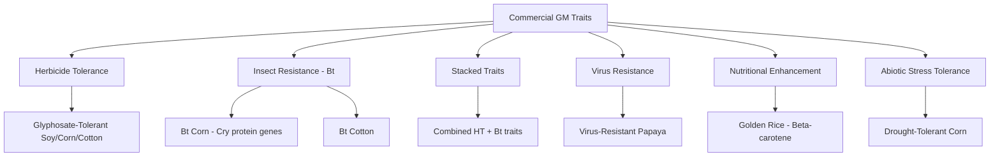

## Genetically Modified Organisms in Agriculture

### Definitions and Core Concepts

**Genetically modified organisms (GMOs)** are organisms whose genetic material has been altered using biotechnology techniques in ways that do not occur naturally through mating or natural recombination. In agriculture, this typically involves inserting, deleting, or editing specific genes to confer desired traits such as pest resistance, herbicide tolerance, or improved nutritional content.

**Distinction from conventional breeding**: Traditional plant breeding relies on selective breeding, crossbreeding, and mutation-based selection over many generations, working within a species' existing gene pool or closely related species. Genetic engineering allows direct, targeted introduction of specific genes — including genes from unrelated species (transgenic) or genes from within the same/related species (cisgenic) — bypassing the sexual reproduction barrier.

**Key terminology:**

- **Transgenic** — contains genetic material from a different species
- **Cisgenic** — contains genetic material from the same or sexually compatible species
- **Genome editing** (e.g., CRISPR-Cas9) — precise modification of existing genes without necessarily introducing foreign DNA, technically distinct from classical transgenic GMOs though often grouped under broader "genetically engineered" terminology in public discourse

---

### Core Genetic Engineering Techniques

**Recombinant DNA technology** — The foundational technique involves isolating a gene of interest, inserting it into a vector (often a modified plasmid), and introducing it into the target organism's genome.

**Agrobacterium-mediated transformation** — The most common method for plant genetic engineering, exploiting the natural ability of the soil bacterium *Agrobacterium tumefaciens* to transfer a segment of its DNA (T-DNA) into plant cells as part of its natural infection process. Scientists replace the bacterium's natural disease-causing genes with genes of interest.

**Gene gun (biolistic) method** — Physically propels DNA-coated microscopic metal particles (gold or tungsten) into plant cells, used particularly for species less amenable to *Agrobacterium* transformation (e.g., many cereal crops).

**CRISPR-Cas9 genome editing** — Uses a guide RNA to direct the Cas9 enzyme to a specific DNA sequence, where it creates a targeted double-strand break. The cell's natural repair mechanisms then either:

- Introduce small insertions/deletions (disrupting gene function) via non-homologous end joining (NHEJ)
- Incorporate a specific new sequence via homology-directed repair (HDR), if a template is supplied

$$\text{Guide RNA} + \text{Cas9} \rightarrow \text{Target DNA Recognition} \rightarrow \text{Double-Strand Break} \rightarrow \text{Repair (NHEJ or HDR)}$$

**Regulatory distinction**: Because CRISPR-edited organisms can sometimes be produced without introducing foreign DNA (only editing existing native sequences), some jurisdictions regulate them differently from traditional transgenic GMOs. **[Unverified]** Regulatory treatment of genome-edited crops varies substantially and is actively evolving across jurisdictions (e.g., differing approaches in the US, EU, and other regions), so current classification status should be verified against current regulatory guidance rather than assumed fixed.

---

### Major Commercial GM Trait Categories

**Herbicide-tolerant (HT) crops**: Engineered to survive application of specific herbicides (most commonly glyphosate), allowing broad-spectrum weed control without harming the crop. The trait typically works by inserting a modified EPSPS enzyme gene (often from a soil bacterium) that is insensitive to glyphosate inhibition, since glyphosate's native mode of action targets the plant's own EPSPS enzyme in the shikimate pathway.

**Insect-resistant (Bt) crops**: Engineered to express *Bacillus thuringiensis* (Bt) crystal (Cry) proteins, which are toxic to specific insect larvae when ingested but have a mode of action highly specific to insect gut receptors, generally considered to pose minimal direct toxicity to non-target vertebrates. Bt proteins have also been used for decades as a spray-applied biopesticide in organic farming, predating the GM crop application.

**Stacked trait varieties**: Combine multiple engineered traits (e.g., herbicide tolerance plus multiple Bt insect-resistance genes) in a single cultivar, now common in major commodity crops like corn.

---

### Case Study: Bt Cotton and Insect Resistance Management

**Example**

Bt cotton, engineered to express Cry proteins toxic to bollworm and budworm larvae, has been widely adopted in cotton-growing regions globally. A central agronomic management concern is preventing target pest populations from evolving resistance to the Bt toxin — addressed through **refuge strategy** requirements, where farmers plant a percentage of non-Bt cotton alongside Bt cotton to maintain a population of Bt-susceptible insects, diluting resistance allele frequency through interbreeding with any resistant individuals that do emerge. This is a direct practical application of population genetics principles to resistance management, structurally analogous to pesticide resistance evolution dynamics.

**[Inference]** The long-term durability of refuge-based resistance management depends heavily on farmer compliance rates and regional coordination, and documented cases of resistance evolution despite refuge strategies exist in some regions and pest species, indicating the strategy reduces but does not eliminate resistance risk.

---

### Environmental Impact Considerations

**Potential environmental benefits (documented in various studies, context-dependent):**

- **Reduced insecticide use**: Bt crop adoption has been associated in multiple studies with reduced application of broad-spectrum insecticides targeting the specific pests controlled by the Bt trait, potentially benefiting non-target beneficial insects
- **Conservation tillage compatibility**: Herbicide-tolerant crops can facilitate no-till/reduced-till farming by simplifying weed control without cultivation, supporting soil erosion reduction and carbon retention benefits associated with reduced tillage
- **Land-use efficiency**: Some studies report yield gains attributable to effective pest control, potentially reducing land conversion pressure (a land-sparing argument)

**Potential environmental concerns:**

- **Herbicide use shifts**: Widespread glyphosate-tolerant crop adoption has been associated with increased glyphosate application volume in some regions, and the evolution of glyphosate-resistant weed species (e.g., *Amaranthus palmeri*, *Conyza canadensis*) has driven increased herbicide use complexity, including reintroduction of older, sometimes more toxic herbicide classes in some management systems
- **Gene flow to wild relatives**: Cross-pollination between GM crops and sexually compatible wild or weedy relatives can transfer engineered traits, a documented concern particularly for herbicide tolerance genes moving into related weed species — though the ecological significance varies by crop, region, and presence of compatible wild relatives
- **Non-target organism effects**: Early research (e.g., a widely publicized 1999 laboratory study on Bt corn pollen and monarch butterfly larvae) raised concerns subsequently investigated by larger field-realistic studies; **[Unverified/contested]** the overall field-level risk to monarch butterflies from Bt corn pollen specifically has been a subject of extensive follow-up research with varying conclusions depending on study design and pollen exposure assumptions, and remains referenced in ongoing scientific and public discussion
- **Biodiversity effects on herbicide-tolerant cropping systems**: Simplified, highly effective weed control can reduce weed biomass that some farmland bird and insect species rely on, an effect documented in some UK Farm Scale Evaluations research

---

### Illustrative Diagram: Refuge Strategy for Bt Resistance Management (svg_diagram)

<svg xmlns="http://www.w3.org/2000/svg" viewBox="0 0 640 320">
<text x="320" y="28" text-anchor="middle" font-size="15" font-weight="bold" fill="#2d4a2b">Bt Crop Refuge Strategy Field Layout (svg_diagram)</text>
<rect x="60" y="70" width="200" height="180" fill="#a8c96a" stroke="#4a6b3a" stroke-width="2" />
<text x="160" y="160" text-anchor="middle" font-size="13" fill="#2d4a1f">Bt Cotton</text>
<text x="160" y="178" text-anchor="middle" font-size="12" fill="#2d4a1f">(~80% of field)</text>
<rect x="280" y="70" width="70" height="180" fill="#d4c98a" stroke="#8a7a3a" stroke-width="2" />
<text x="315" y="150" text-anchor="middle" font-size="11" fill="#5c4a1f" transform="rotate(-90 315 150)">Non-Bt Refuge</text>
<text x="315" y="235" text-anchor="middle" font-size="10" fill="#5c4a1f">(~20%)</text>
<rect x="400" y="90" width="200" height="140" fill="none" stroke="#5c2d2d" stroke-width="1.5" stroke-dasharray="4,3" />
<text x="500" y="115" text-anchor="middle" font-size="12" font-weight="bold" fill="#5c2d2d">Population Genetics Logic</text>
<text x="410" y="140" font-size="10" fill="#3a2a2a">Susceptible insects survive</text>
<text x="410" y="155" font-size="10" fill="#3a2a2a">on refuge crop</text>
<text x="410" y="175" font-size="10" fill="#3a2a2a">Interbreed with any rare</text>
<text x="410" y="190" font-size="10" fill="#3a2a2a">resistant survivors from</text>
<text x="410" y="205" font-size="10" fill="#3a2a2a">Bt-treated section</text>
<text x="410" y="222" font-size="10" fill="#3a2a2a">Dilutes resistance allele frequency</text>
</svg>

---

### Human Health and Food Safety Considerations

**Regulatory assessment process**: GM crops approved for commercial cultivation and food use in most major jurisdictions undergo substantial safety assessment, typically including compositional analysis (comparing nutrient/toxin profiles to conventional counterparts — the "substantial equivalence" concept), allergenicity screening (since many known food allergens are proteins, and novel proteins are screened against allergen databases), and toxicology data review.

**Scientific consensus on health safety**: Major scientific bodies — including the US National Academies of Sciences, the World Health Organization, and the European Commission — have reviewed extensive available evidence and concluded that currently approved GM foods on the market do not present greater health risks than their conventional counterparts. **[Unverified/note on nuance]** This consensus applies to currently approved, extensively studied commercial GM crops; it is a statement about the aggregate evidence base for approved products rather than a claim that all conceivable genetic modifications are inherently safe, since safety assessment is trait- and product-specific.

**Persistent public perception gap**: **[Inference]** Public opinion on GMO food safety in many regions diverges notably from mainstream scientific society position statements, a well-documented gap studied in science communication research; the reasons are multi-causal (trust in institutions, corporate concentration concerns, labeling transparency debates, and distinct concerns about ecological/economic effects that are separate from direct health safety questions).

---

### Golden Rice: A Case Study in Nutritional Biofortification

**Example**

Golden Rice is engineered to biosynthesize beta-carotene (a vitamin A precursor) in the rice grain endosperm, addressing vitamin A deficiency — a significant public health problem in some rice-dependent developing regions, associated with childhood blindness and increased mortality risk. The trait was achieved by inserting genes encoding enzymes in the beta-carotene biosynthesis pathway (originally from daffodil and a soil bacterium in early versions; later versions used maize genes for improved expression).

This case illustrates a GM application oriented toward public health/humanitarian goals rather than input-trait agronomic efficiency (herbicide tolerance, pest resistance), and has also become a prominent case study in debates over GMO regulatory approval timelines, since Golden Rice faced an extended multi-decade path from initial development to regulatory approval and cultivation in some countries, a timeline frequently cited in discussions of regulatory stringency trade-offs.

---

### Economic and Social Dimensions

**Key Points:**

- **Seed patent systems and market concentration**: Commercial GM seed development is concentrated among a small number of large agribusiness companies, raising concerns among some stakeholders about farmer seed-saving practices, seed price trends, and market power dynamics — contrasted with open-access public-sector breeding programs (e.g., some biofortification projects)
- **Smallholder adoption outcomes**: **[Unverified/context-dependent]** Studies of GM crop adoption impacts on smallholder farmers (e.g., Bt cotton in India) show mixed and regionally variable results across different research studies regarding yield gains, income effects, and input cost changes, making broad generalizations across all smallholder contexts unreliable
- **Labeling policy debates**: Jurisdictions vary substantially in GM food labeling requirements (mandatory labeling in the EU; a national bioengineered food disclosure standard in the US), reflecting differing regulatory philosophies about consumer right-to-know versus scientific risk-based labeling justification

---

### Regulatory Frameworks by Region

| Region | Approach | Key Features |
| --- | --- | --- |
| United States | Product-based (regulate the trait/product, not the process) | Coordinated Framework across USDA, EPA, FDA |
| European Union | Process-based (regulate the genetic modification process itself) | Stringent case-by-case authorization, mandatory labeling, generally more restrictive cultivation approval |
| China | Mixed, evolving | Historically cautious on cultivation, significant import approvals for feed/processing |
| Various developing nations | Highly variable | Ranges from adoption-encouraging to precautionary-restrictive frameworks |

**[Unverified]** Regulatory frameworks in this domain are subject to frequent legislative and judicial revision (e.g., ongoing EU deliberation over new genomic techniques/genome-edited crop regulation distinct from established GMO rules); current specifics should be verified against up-to-date regulatory sources rather than assumed static.

---

### GMOs in the Context of Sustainable Agriculture Debates

Connecting to earlier chapter topics: GM crops occupy a contested position relative to sustainability and organic farming frameworks. Organic certification standards (US NOP, EU Organic Regulation) explicitly **prohibit GMO use**, reflecting a philosophical and regulatory stance that ecological farming systems should not rely on genetic engineering, regardless of individual trait environmental performance.

Simultaneously, some agroecologists and sustainability researchers argue that specific GM traits (e.g., reduced-tillage-enabling herbicide tolerance, reduced-insecticide Bt traits, drought tolerance) can deliver environmental benefits aligned with sustainability goals independent of organic certification status — while others raise concerns about corporate concentration, monoculture reinforcement, and herbicide-resistant weed evolution as countervailing sustainability costs. **[Speculation/contested]** This remains one of the more polarized debates within environmental science and agricultural policy discourse, without a single unified expert consensus position on net sustainability impact across all GM trait types and contexts.

---

### Related Topics

- Sustainable and organic farming systems (organic GMO exclusion policy)
- Pesticides and their environmental impacts (Bt and herbicide-tolerance trait interactions)
- Pesticide/herbicide resistance evolution in weeds and insects
- CRISPR and genome editing regulatory frameworks
- Biofortification and public health nutrition interventions
- Agricultural biodiversity and gene flow to wild relatives
- Seed sovereignty and intellectual property in agriculture
- Food labeling policy and consumer science communication
- Green Revolution history and its environmental legacy
- Precision breeding and marker-assisted selection as GMO alternatives