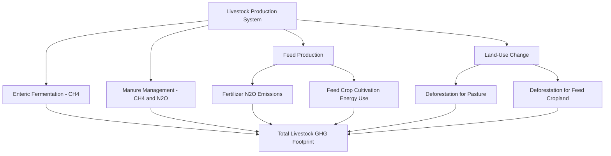

## Livestock Production and Environmental Impact

### Overview and Scope

Livestock production — the raising of cattle, poultry, swine, sheep, goats, and other domesticated animals for meat, dairy, eggs, and fiber — represents one of the largest anthropogenic land-use categories and a significant contributor to global greenhouse gas emissions, water use, and biodiversity pressure. Its environmental footprint varies enormously by species, production system, region, and feed sourcing, making generalized statements about "livestock impact" highly sensitive to system boundaries and methodology.

**Key Points:**

- Livestock systems range from extensive pastoral grazing to intensive confined feeding operations, each with distinct environmental profiles
- Environmental impact assessment must account for direct emissions, land-use change, feed production supply chains, and water use collectively
- Ruminants (cattle, sheep, goats) and non-ruminants (poultry, swine) differ substantially in emissions profile due to differing digestive physiology

---

### Greenhouse Gas Emissions from Livestock

**Enteric fermentation** is the primary source of livestock-related methane emissions, occurring in the digestive systems of ruminant animals. Ruminants possess a specialized four-chambered stomach (rumen, reticulum, omasum, abomasum) that hosts a complex microbial community capable of breaking down cellulose from plant fiber that non-ruminant digestive systems cannot process.

**Methanogenesis** in the rumen occurs via archaeal microorganisms that produce methane as a byproduct of anaerobic fermentation of feed:

$$CO_2 + 4H_2 \xrightarrow{methanogens} CH_4 + 2H_2O$$

Methane ($CH_4$) has a global warming potential roughly 28-34 times that of CO₂ over a 100-year timeframe (GWP100), but importantly has a much shorter atmospheric lifetime (approximately 12 years) compared to CO₂, meaning its climate forcing dynamics differ substantially from long-lived greenhouse gases — a distinction increasingly emphasized in climate policy discussions around livestock methane specifically.

**Additional livestock-related GHG sources:**

- **Manure management**: Anaerobic decomposition of stored manure (especially in liquid/slurry systems common in intensive operations) produces both methane and nitrous oxide
- **Nitrous oxide from manure and feed production**: Nitrogen applied to grow feed crops, and nitrogen excreted in manure, undergoes nitrification-denitrification processes producing N₂O (as covered in the fertilizer/nutrient pollution context)
- **Land-use change emissions**: Conversion of forest or grassland to pasture or feed-crop cropland releases stored carbon, a major emissions source particularly associated with certain tropical deforestation patterns

**[Unverified/methodologically contested]** Estimates of livestock's total share of global anthropogenic greenhouse gas emissions vary substantially across studies (commonly cited figures range roughly from the mid-teens to high-teens percent globally, with some estimates higher when land-use change is fully attributed), depending heavily on system boundary choices (whether land-use change, full supply chain, and processing/transport emissions are included) and methodology (e.g., FAO GLEAM model versus other life-cycle assessment approaches). Specific percentage figures should be treated as estimates dependent on stated methodology rather than a single settled number.

---

### Land Use and Deforestation Pressure

Livestock production is a major driver of global agricultural land use, both directly (pasture/grazing land) and indirectly (cropland dedicated to livestock feed production, especially soy and maize).

**Direct land conversion**: In some regions, notably parts of the Amazon basin, cattle ranching has been documented as a significant driver of deforestation, with forest cleared for pasture establishment. **[Unverified/regionally variable]** The precise attribution share of deforestation to cattle ranching versus other drivers (soy expansion, logging, infrastructure development) varies by region and study period, and remains an active area of remote-sensing-based research with periodically updated estimates.

**Feed crop land footprint**: A substantial share of global soybean and maize production is directed toward livestock feed (particularly for poultry and swine), meaning livestock land-use impact extends well beyond visible pastureland into distant feed-crop growing regions, creating supply-chain-linked deforestation risk (e.g., soy expansion in South American cropping regions supplying international feed markets).

---

### Feed Conversion Efficiency

**Feed conversion ratio (FCR)** measures the mass of feed required to produce a unit mass of live weight gain (or edible product), a standard metric for comparing production efficiency across species:

$$FCR = \frac{\text{Feed Input (mass)}}{\text{Weight Gain or Product Output (mass)}}$$

**Approximate comparative FCR ranges** (illustrative, varies by production system, feed quality, and genetics):

| Species | Approximate FCR Range (feed:live weight gain) |
| --- | --- |
| Poultry (broiler chicken) | Lowest (most efficient), roughly 1.5-2:1 |
| Swine | Intermediate, roughly 2.5-3.5:1 |
| Cattle (beef, grain-finished) | Higher, roughly 6-10:1 |

**[Inference]** These ranges are commonly cited approximations from agricultural science literature; actual values vary considerably with genetics, feed quality, production system (grain-finished versus grass-finished), and measurement methodology (live weight versus edible product basis), so specific figures should be treated as illustrative rather than precise universal constants. Ruminants' comparatively higher FCR for direct feed-to-meat conversion is partially offset by their unique ability to convert cellulose-rich forage (inedible to humans) on marginal land unsuitable for crop production — a nuance often left out of simplified efficiency comparisons.

---

### Water Use in Livestock Production

**Water footprint** accounting distinguishes three water categories:

- **Green water**: Rainwater stored in soil and used by feed crops (largest component for most livestock water footprints)
- **Blue water**: Surface and groundwater used for irrigation of feed crops, drinking water, and processing/servicing operations
- **Grey water**: Freshwater required to dilute and assimilate pollutants (nutrient runoff, waste) to meet water quality standards

**[Unverified]** Commonly cited water footprint comparisons (e.g., liters of water per kilogram of beef versus grain) vary substantially depending on methodology, production system, and regional climate/rainfall patterns; frequently circulated figures in popular media often lack clear specification of green/blue/grey water composition, so such figures should be interpreted cautiously and cross-checked against methodology-transparent sources (e.g., peer-reviewed water footprint network studies).

---

### Nutrient Pollution from Concentrated Animal Feeding Operations (CAFOs)

Intensive livestock operations concentrate large volumes of manure in confined areas, creating distinct nutrient management challenges connecting directly to the fertilizer/nutrient pollution topic covered previously:

- **Manure lagoon systems**: Liquid manure storage systems used in some intensive swine and dairy operations, which can pose risks of nutrient leaching, ammonia volatilization, and in severe failure events (e.g., storm-related lagoon breach), acute water contamination
- **Over-application risk**: When manure application rates on nearby cropland exceed crop nutrient uptake capacity (often driven by transportation cost economics favoring proximity over agronomic optimization), excess nutrients contribute to the same runoff/leaching/eutrophication pathways described in prior nutrient pollution content
- **Antibiotic and pathogen concerns**: Manure from operations using routine antibiotic administration can introduce antibiotic residues and resistant bacterial strains into soil and water systems, an area of active veterinary and public health research

---

### Biodiversity Impacts

**Habitat conversion**: Pasture and feed-crop expansion directly displaces native habitat, contributing to biodiversity loss in affected regions, particularly significant in biodiversity-rich areas undergoing agricultural frontier expansion.

**Overgrazing effects**: Excessive stocking density relative to land carrying capacity can degrade vegetation cover, cause soil compaction and erosion, and reduce native plant/wildlife diversity — though the ecological outcome depends heavily on grazing management approach (continuous versus rotational/managed grazing) rather than livestock presence alone.

**Predator conflict**: Livestock operations in regions overlapping large carnivore ranges (wolves, big cats) can generate human-wildlife conflict, historically contributing to predator population declines through lethal control programs, though this dynamic varies enormously by region and current management policy.

---

### Rotational Grazing and Regenerative Livestock Management

Connecting to the earlier agroecology/permaculture content, **managed intensive rotational grazing** is a management approach that moves livestock through subdivided paddocks on a planned schedule, allowing forage recovery between grazing periods.

**Claimed potential benefits** (subject to ongoing scientific evaluation):

- Improved forage regrowth and pasture productivity through disturbance-recovery cycling analogous to historical wild herbivore migration patterns
- Potential soil carbon accumulation through enhanced root turnover and reduced overgrazing-driven degradation
- Reduced erosion risk relative to continuous overgrazing scenarios

**[Unverified/actively debated]** The magnitude and even the direction of soil carbon sequestration benefits attributed to rotational/holistic grazing management (sometimes marketed under trademarked frameworks) is a genuinely contested area within rangeland and soil science research, with some studies finding meaningful sequestration benefits under specific conditions and other studies finding effects that are context-dependent, smaller than claimed, or not clearly distinguishable from continuous grazing systems under equivalent stocking rates. This remains an active area of scientific investigation rather than a settled consensus, and claims of rotational grazing fully offsetting cattle methane emissions at scale are not well supported by current peer-reviewed evidence consensus.

---

### Illustrative Diagram: Livestock Environmental Footprint Pathways (svg_diagram)

<svg xmlns="http://www.w3.org/2000/svg" viewBox="0 0 640 380">
<text x="320" y="28" text-anchor="middle" font-size="15" font-weight="bold" fill="#5c3a2d">Livestock Production Environmental Footprint (svg_diagram)</text>
<rect x="260" y="50" width="120" height="50" rx="6" fill="#d4a87a" stroke="#8a5a3a" stroke-width="2" />
<text x="320" y="80" text-anchor="middle" font-size="13" fill="#5c3a1f">Livestock System</text>
<rect x="40" y="140" width="130" height="50" rx="6" fill="#c9dabf" stroke="#4a6b3a" stroke-width="1.5" />
<text x="105" y="162" text-anchor="middle" font-size="11" fill="#2d4a2b">Enteric CH4</text>
<text x="105" y="178" text-anchor="middle" font-size="11" fill="#2d4a2b">Emissions</text>
<rect x="190" y="140" width="130" height="50" rx="6" fill="#c9dabf" stroke="#4a6b3a" stroke-width="1.5" />
<text x="255" y="162" text-anchor="middle" font-size="11" fill="#2d4a2b">Manure N2O/CH4</text>
<text x="255" y="178" text-anchor="middle" font-size="11" fill="#2d4a2b">Emissions</text>
<rect x="340" y="140" width="130" height="50" rx="6" fill="#c9dabf" stroke="#4a6b3a" stroke-width="1.5" />
<text x="405" y="162" text-anchor="middle" font-size="11" fill="#2d4a2b">Feed Crop Land</text>
<text x="405" y="178" text-anchor="middle" font-size="11" fill="#2d4a2b">and Water Use</text>
<rect x="490" y="140" width="130" height="50" rx="6" fill="#c9dabf" stroke="#4a6b3a" stroke-width="1.5" />
<text x="555" y="162" text-anchor="middle" font-size="11" fill="#2d4a2b">Pasture Land</text>
<text x="555" y="178" text-anchor="middle" font-size="11" fill="#2d4a2b">Conversion</text>
<rect x="60" y="250" width="180" height="45" rx="6" fill="#e8d9a8" stroke="#a08540" stroke-width="1.5" />
<text x="150" y="277" text-anchor="middle" font-size="11" fill="#5c4a1f">Climate Forcing</text>
<rect x="260" y="250" width="180" height="45" rx="6" fill="#e8d9a8" stroke="#a08540" stroke-width="1.5" />
<text x="350" y="277" text-anchor="middle" font-size="11" fill="#5c4a1f">Nutrient/Water Pollution</text>
<rect x="460" y="250" width="160" height="45" rx="6" fill="#e8d9a8" stroke="#a08540" stroke-width="1.5" />
<text x="540" y="277" text-anchor="middle" font-size="11" fill="#5c4a1f">Biodiversity Loss</text>
<path d="M280,100 L105,140" fill="none" stroke="#5c3a2d" stroke-width="1.5" marker-end="url(#arrowlv)" />
<path d="M300,100 L255,140" fill="none" stroke="#5c3a2d" stroke-width="1.5" marker-end="url(#arrowlv)" />
<path d="M340,100 L405,140" fill="none" stroke="#5c3a2d" stroke-width="1.5" marker-end="url(#arrowlv)" />
<path d="M360,100 L555,140" fill="none" stroke="#5c3a2d" stroke-width="1.5" marker-end="url(#arrowlv)" />
<path d="M105,190 L150,250" fill="none" stroke="#5c3a2d" stroke-width="1.5" marker-end="url(#arrowlv)" />
<path d="M255,190 L300,250" fill="none" stroke="#5c3a2d" stroke-width="1.5" marker-end="url(#arrowlv)" />
<path d="M405,190 L360,250" fill="none" stroke="#5c3a2d" stroke-width="1.5" marker-end="url(#arrowlv)" />
<path d="M555,190 L540,250" fill="none" stroke="#5c3a2d" stroke-width="1.5" marker-end="url(#arrowlv)" />
</svg>

---

### Mitigation Strategies

**Feed additives and enteric methane reduction**: Research and early commercial deployment of feed additives (e.g., certain seaweed species such as *Asparagopsis*, and synthetic compounds like 3-nitrooxypropanol) have shown methane reduction potential in controlled trials by inhibiting methanogenesis pathways in the rumen. **[Unverified/emerging]** Field-scale efficacy, long-term safety, animal health effects, and economic viability of these additives at commercial scale are still being established through ongoing research and early commercial rollout, so results should be considered promising but not yet fully validated at scale.

**Manure management improvements:**

- Anaerobic digesters capturing methane for biogas energy use rather than atmospheric release
- Covered lagoon systems reducing direct emissions
- Improved manure application timing/rate matching (4R stewardship, as covered in nutrient pollution content)

**Genetic selection**: Breeding programs selecting for feed efficiency and, in some research programs, lower enteric methane output per unit of production.

**Dietary shift and demand-side approaches**: Reducing per-capita consumption of the highest-footprint animal products (particularly ruminant meat) in high-consumption regions is frequently cited in life-cycle assessment literature as having substantial mitigation potential, though this is a demand-side social/policy intervention distinct from production-side technical mitigation, and involves complex cultural, economic, and nutritional considerations beyond pure environmental calculus.

**Silvopastoral systems**: Integrating trees into grazing systems (connecting to agroforestry concepts covered in the agroecology/permaculture topic) can provide shade (reducing heat stress and associated productivity/methane implications), additional carbon storage in woody biomass, and diversified farm income streams.

---

### Comparative Environmental Footprint Across Livestock Products

**Example**

Life-cycle assessment studies commonly report a general pattern (though exact figures vary by study and system boundary) where ruminant products (beef, lamb) show higher greenhouse gas emissions and land-use footprint per unit of protein or per kilogram of product compared to monogastric products (pork, poultry, eggs), which in turn are generally higher than most plant-based protein sources (legumes, pulses). **[Inference]** This general ordering pattern (ruminant > monogastric > plant-based) appears consistently across multiple independent life-cycle assessment studies and is a reasonably well-supported general pattern in the literature, though exact magnitude comparisons vary considerably by specific production system, region, and functional unit chosen (per kg product, per kg protein, per calorie, or per unit of essential nutrient density).

---

### Related Topics

- Fertilizers and nutrient pollution (CAFO manure management overlap)
- Sustainable and organic farming systems (grass-fed and pasture-based standards)
- Agroecology and permaculture (silvopasture and holistic grazing design)
- Global methane emissions and short-lived climate pollutant policy
- Deforestation drivers and land-use change carbon accounting
- Water footprint methodology and virtual water trade
- Antibiotic resistance and agricultural antimicrobial use
- Alternative proteins (plant-based and cultivated meat technologies)
- Life-cycle assessment (LCA) methodology in food systems
- Rangeland ecology and grazing management science