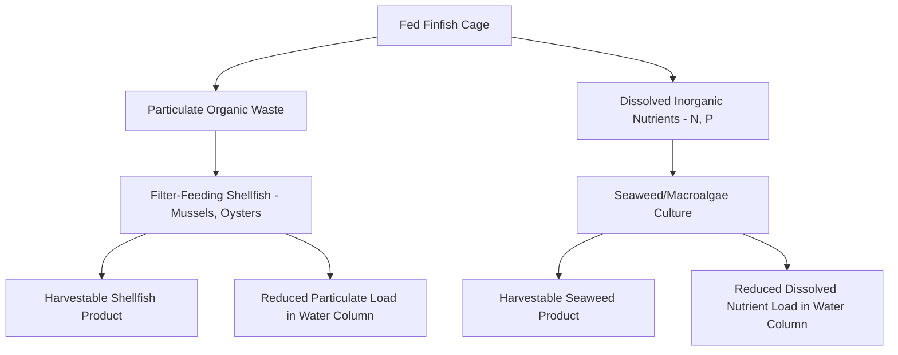

## Aquaculture Systems and Sustainability

### Definitions and Scope

**Aquaculture** is the farming of aquatic organisms — finfish, crustaceans, mollusks, and aquatic plants (algae/seaweed) — under controlled or semi-controlled conditions, encompassing both freshwater and marine (mariculture) production systems. Aquaculture now supplies a substantial and growing share of global seafood consumption, complementing (and in many product categories surpassing) wild-capture fisheries.

**Classification by intensity:**

| System Type | Description | Stocking Density | Input Reliance |
| --- | --- | --- | --- |
| Extensive | Minimal management, relies on natural productivity | Low | Minimal supplemental feed |
| Semi-intensive | Some feed/fertilizer supplementation, pond management | Moderate | Partial supplemental feed |
| Intensive | High management, controlled feeding, aeration | High | Full formulated feed dependency |
| Super-intensive/Recirculating | Fully engineered, closed-loop water systems | Very high | Full formulated feed, high energy input |

---

### Major Production System Types

**Pond culture**: The most widespread traditional aquaculture method, using earthen or lined ponds, common for species like tilapia, carp, and catfish. Water exchange rates and management intensity vary widely.

**Cage and net-pen culture**: Fish raised in cages or net enclosures suspended in open water bodies (lakes, coastal waters, fjords), commonly used for salmon, and increasingly other marine finfish. Water flows freely through the enclosure, meaning waste and uneaten feed disperse directly into surrounding waters.

**Recirculating Aquaculture Systems (RAS)**: Land-based, closed-loop systems that filter and reuse water continuously, incorporating mechanical filtration (removing solid waste), biological filtration (nitrifying bacteria converting toxic ammonia to less-toxic nitrate), and often UV or ozone disinfection.

$$NH_3 \xrightarrow{Nitrosomonas} NO_2^- \xrightarrow{Nitrobacter} NO_3^-$$

This two-step **nitrification** process (analogous to biological wastewater treatment) is the core biological filtration mechanism enabling RAS to maintain water quality despite high stocking densities and minimal water exchange, since ammonia is acutely toxic to fish even at low concentrations while nitrate is comparatively far less toxic and can be managed through periodic water exchange or denitrification.

**Integrated Multi-Trophic Aquaculture (IMTA)**: Co-culturing species from different trophic levels in proximity so that waste products from one species become inputs for another — for example, fed finfish (producing particulate and dissolved waste), filter-feeding shellfish (consuming particulate organic waste), and seaweed (absorbing dissolved inorganic nutrients like nitrogen and phosphorus). This design directly mirrors nutrient-cycling principles discussed in the agroecology and permaculture context, applied to an aquatic system.

---

### Feed Sourcing: The Fish-In, Fish-Out Challenge

A central sustainability metric for carnivorous farmed species (salmon, many marine finfish, shrimp) is the reliance on **fishmeal and fish oil (FMFO)** derived from wild-caught forage fish (anchoveta, sardines, menhaden), creating a dependency loop between aquaculture and wild fisheries.

**Forage Fish Dependency Ratio (FFDR)**, sometimes called "fish-in, fish-out" (FIFO) ratio, measures the amount of wild fish required to produce a unit of farmed fish:

$$FFDR = \frac{\text{Wild fish input (fishmeal + fish oil, converted to whole fish equivalent)}}{\text{Farmed fish output}}$$

**[Unverified/evolving]** Historical FFDR ratios for species like farmed salmon were commonly cited in the range of several kilograms of wild fish per kilogram of farmed product in earlier decades of the industry; more recent industry data suggests substantial improvement toward ratios approaching or below 1:1 for many major producers due to feed formulation innovation, though current values vary considerably by species, feed formulation, and producer, and should be verified against current industry/certification body reporting rather than assumed static.

**Feed substitution trends**: Increasing incorporation of plant-based proteins (soy, canola meal), insect meal (e.g., black soldier fly larvae), microbial proteins (single-cell protein from fermentation), and algae-derived omega-3 fatty acids as partial fishmeal/fish oil replacements, reducing wild forage fish dependency — though each substitute carries its own environmental footprint considerations (e.g., soy-based feed ingredients linking aquaculture indirectly to terrestrial land-use and deforestation pressures covered in the livestock topic).

---

### Environmental Impacts of Open Net-Pen Systems

**Nutrient loading and benthic impacts**: Uneaten feed and fish waste from open net-pen systems settle beneath and around cages, potentially causing localized organic enrichment of sediments, altered benthic (seafloor) invertebrate communities, and in poorly sited or poorly managed operations, localized eutrophication effects analogous to those covered in the nutrient pollution topic, though effects are typically localized rather than widespread compared to diffuse agricultural runoff.

**Escapes and genetic interaction**: Farmed fish escaping from net pens can interbreed with wild populations of the same or closely related species, potentially affecting wild population genetic diversity and fitness. **[Unverified/species and region-dependent]** The ecological significance of escape-driven genetic introgression varies substantially by species, farmed stock origin (domesticated versus wild-derived broodstock), and regional wild population status, and is an active area of fisheries genetics research rather than a uniformly quantified risk across all systems.

**Disease and parasite transfer**: High stocking densities in net-pen systems can facilitate pathogen and parasite (notably sea lice in salmon farming) proliferation, with potential transfer risk to wild migratory fish populations passing through farmed regions — a well-documented concern particularly studied in Pacific and Atlantic salmon farming regions.

**Chemical treatments**: Antibiotics (for bacterial disease control) and parasiticides (for sea lice control) used in some intensive systems can enter surrounding waters, raising concerns analogous to antibiotic resistance and non-target organism effects discussed in the livestock and pesticide topics respectively.

---

### Shrimp Aquaculture and Mangrove Deforestation

**Example**

Coastal shrimp farming, particularly historically in parts of Southeast Asia and Latin America, has been a documented driver of mangrove forest conversion, since mangrove-fringed coastal areas provide suitable conditions for shrimp pond construction. Mangrove loss carries substantial environmental costs beyond simple habitat conversion: mangroves provide significant coastal storm surge and erosion protection, serve as nursery habitat for numerous commercially and ecologically important marine species, and store disproportionately large amounts of carbon per unit area in their soils (sometimes termed "blue carbon"), making mangrove-to-shrimp-pond conversion a notable source of both biodiversity loss and carbon emissions. **[Inference]** Rates of mangrove-driven shrimp pond expansion have reportedly slowed in some regions due to improved siting regulations, certification standards, and mangrove restoration initiatives, though deforestation pressure continues in some areas depending on regional governance and enforcement capacity.

---

### Illustrative Diagram: Recirculating Aquaculture System (RAS) Water Flow (svg_diagram)

<svg xmlns="http://www.w3.org/2000/svg" viewBox="0 0 640 340">
<text x="320" y="26" text-anchor="middle" font-size="15" font-weight="bold" fill="#2d4a5c">Recirculating Aquaculture System Water Loop (svg_diagram)</text>
<rect x="260" y="50" width="120" height="70" rx="6" fill="#a3c9e0" stroke="#4a7a9c" stroke-width="2" />
<text x="320" y="90" text-anchor="middle" font-size="13" fill="#2d5670">Fish Culture Tank</text>
<rect x="60" y="160" width="120" height="55" rx="6" fill="#c9dabf" stroke="#4a6b3a" stroke-width="1.5" />
<text x="120" y="182" text-anchor="middle" font-size="11" fill="#2d4a2b">Mechanical Filter</text>
<text x="120" y="198" text-anchor="middle" font-size="10" fill="#2d4a2b">(solid waste removal)</text>
<rect x="220" y="220" width="130" height="55" rx="6" fill="#e8d9a8" stroke="#a08540" stroke-width="1.5" />
<text x="285" y="242" text-anchor="middle" font-size="11" fill="#5c4a1f">Biofilter</text>
<text x="285" y="258" text-anchor="middle" font-size="10" fill="#5c4a1f">(nitrification: NH3 to NO3-)</text>
<rect x="400" y="160" width="130" height="55" rx="6" fill="#d4a8c9" stroke="#8a4a7a" stroke-width="1.5" />
<text x="465" y="182" text-anchor="middle" font-size="11" fill="#5c2d4a">UV/Ozone</text>
<text x="465" y="198" text-anchor="middle" font-size="10" fill="#5c2d4a">Disinfection</text>
<path d="M280,120 L140,160" fill="none" stroke="#2d4a5c" stroke-width="2" marker-end="url(#arrowras)" />
<path d="M160,215 L250,220" fill="none" stroke="#2d4a5c" stroke-width="2" marker-end="url(#arrowras)" />
<path d="M350,240 L440,215" fill="none" stroke="#2d4a5c" stroke-width="2" marker-end="url(#arrowras)" />
<path d="M465,160 L360,110" fill="none" stroke="#2d4a5c" stroke-width="2" marker-end="url(#arrowras)" />

<text x="320" y="300" text-anchor="middle" font-size="10" fill="`#5c4a1f`">Closed loop: minimal water exchange, high water-use efficiency</text>

</svg>

---

### Bivalve and Seaweed Aquaculture: Restorative Potential

**Filter-feeding bivalve culture** (oysters, mussels, clams) and **seaweed/macroalgae culture** are frequently distinguished from fed finfish/crustacean aquaculture because they do not require external feed input — bivalves filter naturally occurring phytoplankton and organic particulates, while seaweed derives energy through photosynthesis using ambient dissolved nutrients.

**Documented ecosystem service potential:**

- **Water filtration**: Bivalves can measurably improve local water clarity and reduce phytoplankton biomass through filtration activity, with some restoration-oriented oyster reef projects explicitly designed for water quality improvement alongside harvest goals
- **Nutrient extraction**: Both bivalves and seaweed remove nitrogen and phosphorus from the water column as they grow, offering a potential nutrient bioextraction tool in nutrient-impaired coastal systems — sometimes proposed as a complementary approach to land-based nutrient pollution mitigation strategies covered earlier
- **Carbon considerations**: Seaweed aquaculture's role in carbon sequestration is an area of active scientific interest; **[Unverified/emerging research area]** claims about seaweed farming as a significant, verifiable, permanent carbon sequestration strategy (versus carbon that is largely respired, harvested, or otherwise returned to the active carbon cycle) remain scientifically contested and are the subject of ongoing measurement and methodology research, so such claims should be treated cautiously pending more mature verification science

---

### Certification and Sustainability Standards

**Key Points:**

- **Aquaculture Stewardship Council (ASC)**: Certification standard addressing environmental and social performance criteria including feed sourcing, effluent management, escape prevention, and disease/chemical management
- **Best Aquaculture Practices (BAP)**: Certification covering environmental, social, food safety, and animal welfare criteria across the production chain
- **Seafood Watch and similar consumer guides**: Science-based advisory rating systems (not certifications per se) that assess aquaculture and wild-capture products against sustainability criteria to guide consumer and buyer purchasing decisions
- **Life-cycle assessment (LCA) comparisons**: Increasingly used to compare aquaculture environmental footprint (carbon, land, water, nutrient release) against both wild-capture fisheries and terrestrial livestock protein sources on a standardized functional-unit basis (e.g., per kg edible protein)

---

### Comparative Environmental Efficiency

**Example**

Life-cycle assessment literature commonly places well-managed aquaculture of efficient, low-trophic-level species (e.g., bivalves, certain farmed finfish with optimized feed conversion) favorably relative to terrestrial ruminant livestock production on metrics like feed conversion ratio and greenhouse gas emissions per unit of edible protein, since aquatic ectothermic animals do not expend metabolic energy on thermoregulation and can exhibit comparatively efficient feed-to-biomass conversion. **[Inference]** This general efficiency advantage is reasonably well-supported in the comparative LCA literature for many aquaculture systems, but is not universal — some intensive systems with high energy inputs (e.g., energy-intensive RAS operations, especially in regions with carbon-intensive electricity grids) or high-FFDR carnivorous species can show less favorable comparative footprints, so system-specific and region-specific evaluation is necessary rather than blanket generalization across "aquaculture" as a single category.

---

### Emerging Technologies and Innovations

**Offshore aquaculture**: Moving net-pen operations into deeper, higher-energy offshore waters, theoretically offering greater dispersion/dilution of waste and reduced nearshore benthic impact, though requiring more robust and costly engineering to withstand open-ocean conditions. **[Unverified/emerging]** Long-term environmental performance data for offshore systems at commercial scale remains comparatively limited relative to established nearshore systems, as the sector is still in a relatively early commercial development phase in many regions.

**Land-based closed-containment systems**: Expansion of RAS technology for species traditionally farmed in open net pens (e.g., land-based salmon farming ventures), aiming to eliminate escape risk, disease transfer to wild populations, and direct benthic nutrient loading, at the trade-off of higher capital and energy costs (pumping, aeration, temperature control) — creating an energy-versus-direct-ecological-impact trade-off that is an active subject of comparative sustainability assessment.

**Alternative feed ingredient development**: Continued research into insect meal, single-cell/microbial protein, and algae-based omega-3 production aims to further reduce forage fish dependency and the indirect land-use footprint associated with plant-based feed substitutes.

---

### Related Topics

- Livestock production and environmental impact (comparative feed conversion and LCA methodology)
- Fertilizers and nutrient pollution (nutrient loading parallels in open net-pen systems)
- Pesticides and their environmental impacts (parasiticide and antibiotic use parallels)
- Wild-capture fisheries management and overfishing
- Blue carbon ecosystems (mangroves, seagrass, salt marsh)
- Coastal ecosystem restoration (oyster reef and seagrass restoration)
- Marine spatial planning and offshore development siting
- Food security and global protein supply projections
- Life-cycle assessment methodology in food systems
- Antibiotic resistance and aquatic animal health management