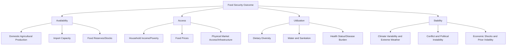

## Global Food Security and Distribution

### Definitions and Conceptual Framework

**Food security** is most commonly defined (following the widely referenced FAO framework) as a condition in which all people, at all times, have physical, social, and economic access to sufficient, safe, and nutritious food that meets their dietary needs and food preferences for an active and healthy life. This definition encompasses four commonly cited dimensions:

1. **Availability** — sufficient quantities of food are physically present, through domestic production, imports, or stocks
2. **Access** — individuals/households have adequate resources (economic, physical, social) to obtain appropriate food
3. **Utilization** — food is used appropriately, involving adequate diet quality, safe preparation, and biological ability to absorb nutrients (linked to health status, water/sanitation)
4. **Stability** — the other three dimensions are maintained over time, without disruption from shocks (economic, climatic, conflict-related)

**A fifth dimension — agency/sustainability** — has been increasingly incorporated in more recent conceptual frameworks (e.g., by the High Level Panel of Experts on Food Security), emphasizing people's capacity to make their own food-related choices and the long-term ecological sustainability of food systems.

**Food insecurity** exists on a severity spectrum, from mild (uncertainty about food access) through moderate (reduced quality/variety) to severe (reduced quantity, hunger, and in extreme cases, famine conditions).

---

### Measurement Frameworks

**Key Points:**

- **Prevalence of Undernourishment (PoU)**: FAO's primary indicator, estimating the proportion of a population whose habitual food consumption is insufficient to provide the dietary energy levels required for an active, healthy life
- **Food Insecurity Experience Scale (FIES)**: A survey-based measurement tool capturing self-reported experiences of food access difficulty, used to generate internationally comparable food insecurity severity estimates
- **Integrated Food Security Phase Classification (IPC)**: A standardized five-phase scale (from Phase 1 "Minimal" to Phase 5 "Catastrophe/Famine") used primarily in acute crisis and humanitarian contexts to classify severity and guide response prioritization
- **Global Hunger Index (GHI)**: A composite index combining undernourishment, child wasting, child stunting, and child mortality indicators to produce comparative country-level scores

**[Unverified]** Specific global food insecurity figures (e.g., total number of undernourished people worldwide) are updated periodically in annual FAO reporting and fluctuate with global economic, climatic, and conflict conditions; current-year figures should be verified against the most recent State of Food Security and Nutrition in the World (SOFI) report rather than assumed static, since this is an actively tracked and revised statistic.

---

### Determinants of Food Security

---

### Climate Change Impacts on Food Security

Climate change affects food security across multiple pathways simultaneously:

**Yield impacts**: Rising temperatures beyond crop-specific thermal optima, altered precipitation patterns, and increased frequency of extreme heat events can reduce yields of major staple crops in many production regions, though effects vary by crop, region, and adaptation capacity — with some higher-latitude regions potentially seeing yield benefits from moderate warming and extended growing seasons under some climate scenarios, alongside yield losses projected in many lower-latitude and already heat-stressed production regions.

**Water stress**: Altered precipitation patterns and increased frequency/severity of drought affect both rainfed and irrigated agriculture, with irrigation-dependent regions facing compounding pressure from reduced snowpack/glacial melt water sources in some major river basins.

**Extreme weather and supply chain disruption**: Increased frequency of extreme weather events (floods, storms, heatwaves) can disrupt not only production but also transportation infrastructure and storage facilities, affecting the "availability" and "stability" dimensions of food security simultaneously.

**Nutritional quality effects**: **[Unverified/emerging research]** Some research has found that elevated atmospheric CO₂ concentrations can reduce the protein and mineral micronutrient (e.g., zinc, iron) content of certain staple crops through a mechanism sometimes called the "CO₂ fertilization dilution effect" — this remains an active area of crop physiology research with implications still being fully characterized across crop types and growing conditions.

---

### Food Loss and Waste

**Definitions:**

- **Food loss** — reduction in food quantity/quality occurring during production, post-harvest handling, storage, and processing stages, typically prior to reaching the retail/consumer stage
- **Food waste** — food discarded at the retail and consumer stages, often due to quality standards, overproduction relative to demand, or consumer behavior

**[Unverified]** Commonly cited global estimates suggest a substantial proportion of food produced globally (frequently cited figures fall roughly in the range of one-quarter to one-third of total food produced, depending on measurement methodology and whether inedible parts are excluded) is lost or wasted across the supply chain; precise figures vary by methodology (e.g., FAO Food Loss Index versus UNEP Food Waste Index use different scope definitions), so specific percentages should be treated as estimates rather than precisely measured universal constants.

**Regional distribution pattern**: A commonly observed pattern in food loss/waste literature is that **food loss** (production/post-harvest/storage stage) tends to be proportionally larger in lower-income regions, often linked to inadequate storage infrastructure, cold chain gaps, and post-harvest handling capacity, while **food waste** (retail/consumer stage) tends to be proportionally larger in higher-income regions, linked to consumer behavior, retail cosmetic standards, and overproduction relative to demand patterns.

**Environmental significance**: Food loss and waste represents not only a food security concern but an environmental one, since all resources embedded in producing wasted food (land, water, fertilizer, energy, associated GHG emissions) are expended without generating nutritional benefit — connecting directly to resource efficiency themes across the fertilizer, livestock, and aquaculture topics covered previously.

---

### Global Trade and Distribution Systems

**Comparative advantage and trade dependency**: Global food trade allows regions to specialize in production suited to their agroecological conditions and import staples better suited to production elsewhere, generally improving aggregate global food availability efficiency — but creates **trade dependency risk**, where food-importing nations/regions become vulnerable to supply disruptions, price spikes, or export restrictions imposed by major producing/exporting countries.

**Export restrictions and price volatility**: During periods of global food price stress (e.g., documented episodes during the 2007-2008 and 2010-2011 global food price crises), some major grain-exporting countries have implemented export restrictions to protect domestic supply, which can amplify global price volatility and disproportionately affect import-dependent food-insecure regions — a dynamic studied extensively in food security and trade policy literature.

**Strategic grain reserves**: Some countries and regional bodies maintain government-held food/grain reserves as a buffer mechanism against supply shocks and price volatility, though the effectiveness, cost, and appropriate scale of such reserves remains a subject of ongoing policy debate among food security economists.

---

### Case Study: The 2007-2008 and 2022 Global Food Price Crises

**Example**

The 2007-2008 global food price crisis, driven by a combination of factors including poor harvests in major producing regions, rising energy/fertilizer costs, increased biofuel demand competing for feedstock crops, and export restriction-driven panic dynamics, led to sharp price increases for staple grains and triggered food-related social unrest in numerous countries. A more recent disruption followed Russia's invasion of Ukraine beginning in 2022, given both countries' significant roles as global wheat, maize, and sunflower oil exporters; the resulting disruption to Black Sea grain shipping routes and fertilizer export constraints (Russia being a major fertilizer exporter) contributed to renewed global food price pressure, illustrating the concentrated geographic vulnerability of global staple crop trade to regional conflict and disruption.

---

### Illustrative Diagram: Global Food Supply Chain Vulnerability Points (svg_diagram)

<svg xmlns="http://www.w3.org/2000/svg" viewBox="0 0 640 300">
<text x="320" y="26" text-anchor="middle" font-size="15" font-weight="bold" fill="#5c3a2d">Food Supply Chain Vulnerability Points (svg_diagram)</text>
<rect x="20" y="70" width="110" height="55" rx="6" fill="#c9dabf" stroke="#4a6b3a" stroke-width="1.5" />
<text x="75" y="102" text-anchor="middle" font-size="11" fill="#2d4a2b">Production</text>
<rect x="160" y="70" width="110" height="55" rx="6" fill="#e8d9a8" stroke="#a08540" stroke-width="1.5" />
<text x="215" y="92" text-anchor="middle" font-size="11" fill="#5c4a1f">Storage/</text>
<text x="215" y="108" text-anchor="middle" font-size="11" fill="#5c4a1f">Post-Harvest</text>
<rect x="300" y="70" width="110" height="55" rx="6" fill="#a3c9e0" stroke="#4a7a9c" stroke-width="1.5" />
<text x="355" y="92" text-anchor="middle" font-size="11" fill="#2d5670">Processing/</text>
<text x="355" y="108" text-anchor="middle" font-size="11" fill="#2d5670">Transport</text>
<rect x="440" y="70" width="110" height="55" rx="6" fill="#d4a8c9" stroke="#8a4a7a" stroke-width="1.5" />
<text x="495" y="92" text-anchor="middle" font-size="11" fill="#5c2d4a">Retail/</text>
<text x="495" y="108" text-anchor="middle" font-size="11" fill="#5c2d4a">Distribution</text>

<text x="75" y="150" text-anchor="middle" font-size="10" fill="`#5c2d2d`">Climate shocks,</text>

<text x="75" y="164" text-anchor="middle" font-size="10" fill="`#5c2d2d`">crop failure</text>

<text x="215" y="150" text-anchor="middle" font-size="10" fill="`#5c2d2d`">Inadequate cold</text>

<text x="215" y="164" text-anchor="middle" font-size="10" fill="`#5c2d2d`">chain, pest loss</text>

<text x="355" y="150" text-anchor="middle" font-size="10" fill="`#5c2d2d`">Conflict, port</text>

<text x="355" y="164" text-anchor="middle" font-size="10" fill="`#5c2d2d`">closures, fuel cost</text>

<text x="495" y="150" text-anchor="middle" font-size="10" fill="`#5c2d2d`">Price volatility,</text>

<text x="495" y="164" text-anchor="middle" font-size="10" fill="`#5c2d2d`">consumer waste</text>

<rect x="130" y="200" width="380" height="60" rx="6" fill="#3a2a3a" stroke="#2a1a2a" stroke-width="1.5" />
<text x="320" y="225" text-anchor="middle" font-size="12" fill="#f0e8f0">Household Food Insecurity Outcome</text>
<text x="320" y="245" text-anchor="middle" font-size="10" fill="#d8c8d8">Compounded by income/poverty and market access factors</text>
<path d="M130,97 L160,97" fill="none" stroke="#5c3a2d" stroke-width="2" marker-end="url(#arrowfs)" />
<path d="M270,97 L300,97" fill="none" stroke="#5c3a2d" stroke-width="2" marker-end="url(#arrowfs)" />
<path d="M410,97 L440,97" fill="none" stroke="#5c3a2d" stroke-width="2" marker-end="url(#arrowfs)" />
<path d="M300,175 L320,200" fill="none" stroke="#5c3a2d" stroke-width="2" marker-end="url(#arrowfs)" />
</svg>

---

### Sustainable Food Systems as a Food Security Strategy

Connecting to earlier chapter content: the topics covered previously — sustainable and organic farming, agroecology, pesticide and fertilizer management, GMOs, livestock, and aquaculture — each intersect with food security through the **availability** and **stability** dimensions specifically.

**Key intersections:**

- **Yield stability versus yield maximization**: Diversified, agroecologically-managed systems are frequently argued to offer more resilient (though not necessarily higher-ceiling) yields under climatic stress, which may be more valuable for stability-dimension food security than peak-yield-optimized monocultures vulnerable to single-point-of-failure shocks — though this trade-off is genuinely debated in the literature, as covered in the agroecology/permaculture and sustainable farming topics
- **Local versus global food system resilience**: Strengthening local/regional production capacity can reduce trade dependency vulnerability, but complete food self-sufficiency is neither feasible nor efficient for most nations given agroecological constraints, creating an ongoing policy tension between self-sufficiency and comparative-advantage-based trade efficiency
- **Nutrient and resource efficiency**: Reducing fertilizer/pesticide over-application waste, improving livestock feed efficiency, and reducing aquaculture forage fish dependency (as covered in prior topics) all contribute to a more resource-efficient food system with greater long-term production stability under resource-constrained future scenarios

---

### Policy Instruments and Interventions

**Key Points:**

- **Social safety nets**: Cash transfers, food assistance programs (e.g., school feeding programs, food voucher systems), and public distribution systems that directly address the "access" dimension for vulnerable populations
- **Agricultural extension and technology transfer**: Programs disseminating improved crop varieties, farming techniques, and market information to smallholder farmers, aimed at improving the "availability" dimension through productivity gains
- **Infrastructure investment**: Roads, storage facilities, and cold chain development reduce post-harvest loss and improve market access, addressing both "availability" and "access" dimensions
- **Trade policy coordination**: International coordination mechanisms (e.g., discussions within the G20, WTO agricultural trade frameworks) aimed at discouraging destabilizing export restriction cascades during price crisis periods
- **Early warning and famine prevention systems**: Systems like the Famine Early Warning Systems Network (FEWS NET) that monitor indicators (rainfall, crop conditions, market prices, conflict data) to enable earlier humanitarian response before crisis escalation to famine-level severity

---

### Related Topics

- Fertilizers and nutrient pollution (resource efficiency and food production trade-offs)
- Livestock production and environmental impact (protein supply and resource footprint)
- Aquaculture systems and sustainability (alternative protein supply chains)
- Sustainable and organic farming systems (yield stability versus yield maximization debate)
- Climate change adaptation in agricultural systems
- Food loss and waste reduction strategies and technologies
- Humanitarian response and famine early warning systems
- Global trade policy and agricultural subsidy structures
- Smallholder farmer livelihoods and agricultural extension services
- Nutrition transition and dietary pattern shifts globally