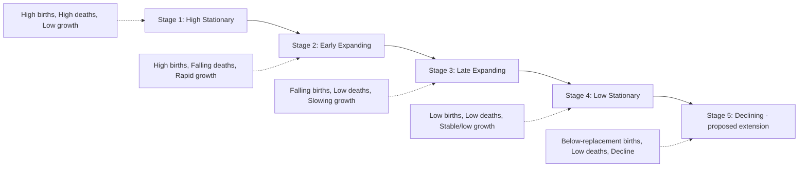

## The Demographic Transition Model

### Definition and Historical Origins

The **Demographic Transition Model (DTM)** is a conceptual framework describing the historically observed pattern of change in birth rates and death rates as a society undergoes economic, social, and industrial development, and the resulting effect on population growth rate over time. The model was developed based on observed demographic patterns in industrializing Western European and North American nations from the 18th through 20th centuries, with foundational formulations attributed to demographers including Warren Thompson (1929) and later refined by Frank Notestein (1945).

**Core premise**: As societies move from pre-industrial, agrarian conditions toward industrialized, urbanized conditions, both birth rates and death rates decline — but not simultaneously or at the same pace — and the resulting gap between the two rates determines the population growth trajectory at each stage.

---

### The Four (or Five) Stages

**Stage 1 — High Stationary**: Both birth rates and death rates are high, roughly balancing each other, resulting in low or fluctuating overall population growth. Characteristic of pre-industrial, subsistence-agriculture-based societies with limited medical infrastructure, high infant mortality, and cultural/economic incentives favoring high fertility (e.g., children as agricultural labor and old-age security). Death rates fluctuate significantly in response to famine, disease outbreaks, and other density-independent shocks.

**Stage 2 — Early Expanding**: Death rates begin falling relatively rapidly, driven primarily by improved sanitation, clean water access, basic public health measures, and improved food security, while birth rates remain high due to lagging cultural/economic adjustment. The widening gap between high births and falling deaths produces the most rapid population growth rates observed in the entire transition sequence.

**Stage 3 — Late Expanding**: Birth rates begin declining substantially, driven by factors including increased urbanization (reducing the economic value of large families as agricultural labor), rising female education and workforce participation, improved child survival (reducing the incentive for "insurance" births), increased access to contraception, and rising costs of child-rearing in urbanizing economies. Death rates continue at low levels. Population growth rate decelerates but remains positive.

**Stage 4 — Low Stationary**: Both birth rates and death rates stabilize at low levels, resulting in slow, stable, or minimal population growth. Characteristic of most developed, post-industrial economies. Age structure begins shifting toward an older population profile.

**Stage 5 — Declining (proposed extension)**: In some highly developed societies, birth rates fall below replacement level while death rates remain low or rise slightly due to an aging population, resulting in natural population decline absent offsetting immigration. **[Inference]** Stage 5 was not part of the original mid-20th-century DTM formulation and represents a later extension proposed by some demographers to describe patterns observed in a subset of countries (e.g., parts of East Asia and Europe) since the late 20th century; its universality as a "final stage" applicable to all developing nations is not a settled matter and remains a subject of ongoing demographic research and debate.

---

### Mechanisms Driving Death Rate Decline (Stage 1 to Stage 2)

**Key Points:**

- **Public health infrastructure**: Clean water access, sanitation systems, and waste management reducing waterborne and infectious disease transmission
- **Medical advances**: Vaccination programs, antibiotics, and improved obstetric/neonatal care substantially reducing infant and maternal mortality
- **Food security improvements**: Agricultural productivity gains (connecting to the Haber-Bosch process and Green Revolution content covered in the food security topic) reducing famine-related mortality
- **Reduced infant/child mortality specifically**: Often the single largest contributor to overall death rate decline in early transition stages, since historically high child mortality disproportionately weighted crude death rate statistics

---

### Mechanisms Driving Birth Rate Decline (Stage 2 to Stage 3)

**Key Points:**

- **Urbanization**: Shifts children's economic role from agricultural labor asset (favoring high fertility) toward economic cost in urban settings (school, housing, reduced immediate labor value)
- **Female education and labor force participation**: Widely documented as one of the strongest predictors of fertility decline across diverse country contexts, operating through delayed marriage/childbearing age, increased opportunity cost of childbearing, and greater reproductive decision-making autonomy
- **Reduced child mortality (delayed effect)**: As child survival improves, the "insurance" motivation for high fertility (having many children to ensure some survive to adulthood) diminishes over a generational lag period
- **Contraception access and family planning programs**: Direct technological/policy enabler of fertility rate reduction, though typically operating in conjunction with the socioeconomic drivers above rather than as an independent standalone factor
- **Rising costs of child-rearing**: Urbanization and increased emphasis on child education/human capital investment (a shift sometimes described as movement from a "quantity" to "quality" fertility strategy in demographic-economic literature) raises the marginal cost of additional children

---

### Illustrative Diagram: Birth and Death Rate Curves Across DTM Stages (svg_diagram)

<svg xmlns="http://www.w3.org/2000/svg" viewBox="0 0 680 380">
<text x="340" y="26" text-anchor="middle" font-size="15" font-weight="bold" fill="#2d4a5c">Demographic Transition Model: Rate Curves by Stage (svg_diagram)</text>
<line x1="80" y1="320" x2="620" y2="320" stroke="#333" stroke-width="1.5" />
<line x1="80" y1="60" x2="80" y2="320" stroke="#333" stroke-width="1.5" />
<text x="350" y="350" text-anchor="middle" font-size="11" fill="#333">Time / Development Level</text>
<text x="35" y="190" text-anchor="middle" font-size="11" fill="#333" transform="rotate(-90 35 190)">Rate per 1000</text>
<line x1="188" y1="60" x2="188" y2="320" stroke="#bbb" stroke-width="1" stroke-dasharray="3,3" />
<line x1="296" y1="60" x2="296" y2="320" stroke="#bbb" stroke-width="1" stroke-dasharray="3,3" />
<line x1="404" y1="60" x2="404" y2="320" stroke="#bbb" stroke-width="1" stroke-dasharray="3,3" />
<line x1="512" y1="60" x2="512" y2="320" stroke="#bbb" stroke-width="1" stroke-dasharray="3,3" />

<text x="134" y="330" text-anchor="middle" font-size="10" fill="`#5c2d2d`">Stage 1</text>

<text x="242" y="330" text-anchor="middle" font-size="10" fill="`#5c2d2d`">Stage 2</text>

<text x="350" y="330" text-anchor="middle" font-size="10" fill="`#5c2d2d`">Stage 3</text>

<text x="458" y="330" text-anchor="middle" font-size="10" fill="`#5c2d2d`">Stage 4</text>

<text x="566" y="330" text-anchor="middle" font-size="10" fill="`#5c2d2d`">Stage 5</text>

<path d="M80,90 L188,88 L250,95 L296,180 L350,240 L404,275 L512,282 L620,285" fill="none" stroke="#c0392b" stroke-width="3" />
<text x="600" y="278" font-size="10" fill="#c0392b" font-weight="bold">Birth Rate</text>
<path d="M80,95 L188,180 L250,240 L296,275 L350,282 L404,285 L512,283 L620,265" fill="none" stroke="#2874a6" stroke-width="3" />
<text x="600" y="255" font-size="10" fill="#2874a6" font-weight="bold">Death Rate</text>
<path d="M188,88 L188,180 L250,95 L250,240" fill="#f5cba7" opacity="0.4" />
<path d="M250,95 L296,180 L296,275 L350,240" fill="#f5cba7" opacity="0.4" />
<text x="260" y="140" font-size="10" fill="#8a4a1f" font-weight="bold">Growth Gap</text>
</svg>

---

### Population Growth Rate Trajectory Across Stages

Applying the exponential growth framework covered previously ($r = b - d$, where $b$ and $d$ are per capita birth and death rates), the DTM predicts a characteristic trajectory of $r$ across stages:

| Stage | Birth Rate ($b$) | Death Rate ($d$) | Growth Rate ($r = b - d$) |
| --- | --- | --- | --- |
| 1 | High | High | Near zero (small, fluctuating) |
| 2 | High | Falling rapidly | Largest positive value (peak growth) |
| 3 | Falling | Low | Positive but declining |
| 4 | Low | Low | Near zero (stable) |
| 5 | Below replacement | Low (rising slightly with aging) | Negative (decline) |

This trajectory explains why the highest global population growth rates historically observed in specific countries correspond to nations in Stage 2 of the transition, while Stage 4/5 countries exhibit population stability or decline absent immigration.

---

### Regional Case Illustrations

**Example**

- **Stage 1 (largely historical/theoretical in the present day)**: Very few, if any, national populations remain in classical Stage 1 conditions in the current era; the stage is primarily of historical and theoretical reference value, describing pre-industrial societies globally prior to the 18th-19th century transition onset in Western Europe
- **Stage 2 (illustrative pattern)**: Some nations in Sub-Saharan Africa continue to exhibit relatively high fertility alongside substantially reduced mortality compared to historical baselines, consistent with Stage 2/early Stage 3 patterns, though considerable country-to-country variation exists within the region and rates are actively changing
- **Stage 3/4 transition (illustrative pattern)**: Many rapidly industrializing nations across Asia and Latin America have moved through Stage 2 into Stage 3/4 territory over recent decades, with substantial fertility decline documented in national statistics
- **Stage 4/5 (illustrative pattern)**: Several nations in Europe and East Asia (including Japan, South Korea, and a number of European countries) exhibit below-replacement fertility and, in some cases, natural population decline, consistent with Stage 4/5 characterization

**[Unverified]** Specific current-year fertility rates, growth rates, and stage classifications for individual countries change over time and should be verified against current demographic data sources (e.g., UN World Population Prospects, national statistical offices) rather than treated as fixed, since this is an actively monitored and periodically updated area of demographic statistics.

---

### Critiques and Limitations of the DTM

**Key Points:**

- **Eurocentric origin and generalizability concerns**: The model was derived from the historical experience of a specific set of Western industrializing nations; its applicability as a universal predictive sequence for all developing nations has been critiqued by demographers who note that colonial history, globalization-era technology transfer, differing family planning policy environments, and distinct cultural/religious contexts can produce transition patterns that diverge from the original historical template in timing, pace, and mechanism
- **Compressed transitions**: Many later-transitioning countries have moved through the stages considerably faster than the multi-century timeline observed in the original Western European/North American cases, since they benefit from pre-existing medical and agricultural technology transfer rather than needing to independently develop it, a pattern sometimes discussed under the framing of "transition compression"
- **Non-linear and reversible assumptions questioned**: The model implies a largely one-directional progression; however, some researchers have documented cases of fertility rate stalls (periods where fertility decline plateaus rather than continuing smoothly toward Stage 4) or, in some economically disrupted contexts, temporary reversals, indicating the model's stages are not strictly deterministic or universally linear in every national case
- **Does not incorporate migration**: The classical DTM is framed around natural increase (births and deaths) and does not explicitly model migration flows, which can substantially alter a specific country's actual population trajectory independent of its underlying fertility/mortality stage — a limitation particularly relevant for smaller nations or those with significant emigration/immigration flows
- **Stage 5 validity debate**: As noted above, whether sustained below-replacement decline represents a genuine universal "final stage" applicable to all sufficiently developed societies, or is instead a context-specific pattern observed in a subset of cases (potentially reversible with policy intervention, cultural shift, or economic change), remains **[Speculation/contested]** among demographers, without clear consensus

---

### Policy Implications by Stage

**Key Points:**

- **Stage 2 contexts**: Policy attention often focuses on family planning access, girls' education expansion, and maternal/child health investment, aimed at accelerating the transition to Stage 3 and moderating peak growth rate pressures on infrastructure, resource systems, and food security (connecting to the global food security topic covered previously)
- **Stage 4/5 contexts**: Policy attention often shifts toward aging population management (pension system sustainability, healthcare capacity for older populations, workforce/immigration policy), and in some countries, pro-natalist policies aimed at supporting fertility rates closer to replacement level, with documented mixed effectiveness across different national policy interventions

---

### Connection to Environmental Pressure and the I=PAT Framework

The DTM's population growth trajectory intersects directly with environmental impact considerations through the **I = PAT framework** (Impact = Population × Affluence × Technology), a widely used conceptual heuristic in environmental science for decomposing aggregate environmental pressure into contributing factors.

**[Inference]** A key nuance often highlighted in this intersection is that Stage 2/early Stage 3 countries (experiencing peak population growth rates) frequently have comparatively low per-capita resource consumption and emissions (low "Affluence" and "Technology" impact multipliers), while Stage 4/5 countries (with stable or declining population) often have substantially higher per-capita consumption footprints — meaning that population growth rate alone is an incomplete proxy for a country's or region's total environmental impact, and must be considered jointly with consumption and technology factors rather than in isolation. This nuance is frequently emphasized in environmental science literature to counter overly simplistic population-growth-centric framings of global environmental pressure.

---

### Related Topics

- Population growth dynamics and models (exponential/logistic model foundations)
- Global food security and distribution (Malthusian theory and Stage 2 growth pressure)
- I=PAT framework and environmental impact decomposition
- Fertility decline drivers and family planning policy
- Population aging and pension/healthcare system sustainability
- Urbanization and its demographic drivers
- Migration dynamics and environmental/economic displacement
- Ecological footprint and per-capita consumption metrics
- Historical case studies of national demographic transitions
- Human carrying capacity debates and neo-Malthusian perspectives