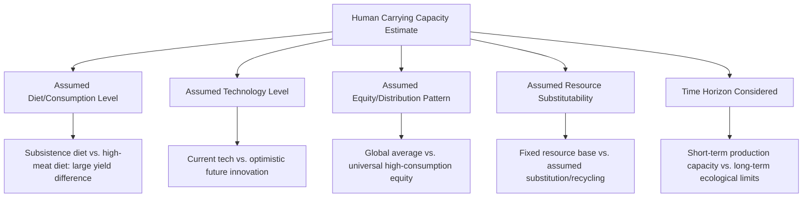

## Human Carrying Capacity Debates

### Definitions and Conceptual Foundations

**Carrying capacity**, in classical ecological terms, refers to the maximum population size of a species that a given environment can sustain indefinitely, given available resources (food, water, space, habitat) without degrading the environment's capacity to support that population over time — formally represented as the parameter $K$ in the logistic growth model.

**Human carrying capacity** attempts to extend this concept to human populations, but the extension is substantially more contested and methodologically complex than for wildlife populations, because human resource requirements, consumption patterns, and effective resource availability are not biologically fixed the way they are for most non-human species — they are mediated by technology, social organization, trade, and consumption choices that can change dramatically over time and vary enormously across populations.

**Key Points:**

- Wildlife carrying capacity: relatively well-defined, tied to a fixed set of biological resource needs (food, water, habitat/territory) within a bounded ecosystem
- Human carrying capacity: highly variable depending on technology level, consumption patterns, trade access, and normative assumptions about acceptable quality of life
- This fundamental difference is the central reason human carrying capacity estimates vary so dramatically across studies and remain scientifically and politically contested

---

### Historical Development of the Concept

**Thomas Malthus (1798)** provided an early foundational (though not carrying-capacity-framed in modern terminology) argument that population grows geometrically while food production grows arithmetically, implying an inevitable ceiling on sustainable population size enforced through "positive checks" (famine, disease, war) — as covered in the population growth dynamics topic.

**Mid-to-late 20th century revival**: Concern about human carrying capacity limits resurfaced prominently with works including Paul Ehrlich's *The Population Bomb* (1968) and the Club of Rome's *Limits to Growth* report (1972), both of which projected resource depletion and population/environmental crisis scenarios based on then-current growth trend extrapolations.

**[Inference]** Many specific predictions from this era (e.g., Ehrlich's forecasts of mass famine by the 1970s-1980s) did not materialize as projected, largely due to underestimated technological and agricultural adaptive capacity (notably the Green Revolution's yield gains, covered in the food security and fertilizer topics) — a pattern of underestimating adaptive capacity that critics argue has recurred across successive generations of carrying-capacity-limit predictions, while defenders of the broader concern argue that delayed timing does not invalidate the underlying finite-resource logic, only its specific historical timeline estimates.

---

### Why Estimates Vary So Widely

**[Unverified/highly contested]** Published human carrying capacity estimates in the scientific and policy literature span an extremely wide range — commonly cited compilations show estimates differing by more than an order of magnitude across studies — precisely because each study embeds different assumptions along the dimensions shown above. This variance is not primarily a matter of differing scientific measurement precision (as it would be for, say, measuring a physical constant), but rather reflects genuinely different normative and technological scenario assumptions built into each estimate. Any specific numerical carrying capacity figure encountered in the literature or popular media should therefore be understood as conditional on its stated assumptions rather than as a single empirically settled ceiling.

---

### Key Analytical Frameworks in the Debate

**The I = PAT framework** (Impact = Population × Affluence × Technology) is one of the most widely used conceptual tools for decomposing aggregate human environmental pressure, developed initially in the 1970s (associated with Paul Ehrlich, John Holdren, and Barry Commoner in various formulations) as a response to overly simplistic population-only framings of environmental limits:

$$I = P \times A \times T$$

Where $I$ is environmental impact, $P$ is population size, $A$ is affluence (consumption per capita, often proxied by GDP per capita), and $T$ is technology (impact intensity per unit of consumption/economic activity, which can be reduced through efficiency improvements or increased through resource-intensive technology choices).

**Key implication for the carrying capacity debate**: This framework explicitly demonstrates that population size alone is an incomplete determinant of aggregate environmental impact — a given planetary carrying capacity ceiling could theoretically support a larger population at lower per-capita affluence/technology impact, or a smaller population at higher per-capita impact, meaning "carrying capacity" is inherently a joint function of population size and consumption/technology pattern rather than a population-only threshold.

**Ecological footprint methodology**: A widely used empirical approach that estimates the biologically productive land and water area required to produce the resources a population consumes and absorb its waste (including carbon emissions), compared against **biocapacity** (available biologically productive area). This framework produces a related but distinct metric from classical carrying capacity, expressed in standardized units (global hectares) allowing comparison across populations and consumption patterns.

$$\text{Overshoot} = \frac{\text{Ecological Footprint}}{\text{Biocapacity}}$$

An overshoot ratio greater than 1 indicates consumption/waste generation exceeding regenerative capacity, implying reliance on resource stock depletion or waste accumulation beyond assimilative capacity — a concept operationalized annually by organizations such as the Global Footprint Network through "Earth Overshoot Day" calculations. **[Unverified]** Specific current-year overshoot figures and Earth Overshoot Day dates are updated annually and methodology has evolved over time; current figures should be verified against the source organization's latest published data rather than assumed static.

---

### Planetary Boundaries Framework

A related but analytically distinct approach, the **planetary boundaries framework** (developed by Johan Rockström, Will Steffen, and colleagues, first published 2009 with subsequent updates), identifies nine Earth system processes with proposed boundary thresholds beyond which the risk of destabilizing abrupt or irreversible environmental change increases substantially:

1. Climate change
2. Biosphere integrity (biodiversity loss)
3. Land-system change
4. Freshwater use
5. Biogeochemical flows (nitrogen and phosphorus cycles)
6. Ocean acidification
7. Atmospheric aerosol loading
8. Stratospheric ozone depletion
9. Introduction of novel entities (chemical pollution, plastics, etc.)

**Distinction from classical carrying capacity**: This framework does not attempt to specify a single human population number, but rather defines safe operating thresholds for aggregate human activity (population × consumption × technology combined) across multiple Earth system dimensions simultaneously, implicitly reframing the "limits" question away from population size alone toward total systemic pressure across several distinct biophysical processes. **[Unverified/actively revised]** Several boundaries in this framework (including biosphere integrity, biogeochemical flows, and land-system change, among others depending on the specific published update) are assessed by the framework's proponents as already exceeded in various assessments; specific current status assessments are periodically revised in updated publications and carry methodological uncertainty that framework authors themselves acknowledge, so current-status claims should be checked against the latest published assessment.

---

### Illustrative Diagram: Frameworks for Assessing Human-Environment Limits (svg_diagram)

<svg xmlns="http://www.w3.org/2000/svg" viewBox="0 0 640 340">
<text x="320" y="26" text-anchor="middle" font-size="15" font-weight="bold" fill="#2d4a5c">Comparing Human Limits Frameworks (svg_diagram)</text>
<rect x="30" y="60" width="170" height="100" rx="6" fill="#c9dabf" stroke="#4a6b3a" stroke-width="1.5" />
<text x="115" y="85" text-anchor="middle" font-size="12" font-weight="bold" fill="#2d4a2b">Classical Carrying</text>
<text x="115" y="100" text-anchor="middle" font-size="12" font-weight="bold" fill="#2d4a2b">Capacity (K)</text>
<text x="115" y="125" text-anchor="middle" font-size="10" fill="#2d4a2b">Single population ceiling</text>
<text x="115" y="140" text-anchor="middle" font-size="10" fill="#2d4a2b">number, resource-based</text>
<rect x="235" y="60" width="170" height="100" rx="6" fill="#e8d9a8" stroke="#a08540" stroke-width="1.5" />
<text x="320" y="85" text-anchor="middle" font-size="12" font-weight="bold" fill="#5c4a1f">I = PAT</text>
<text x="320" y="105" text-anchor="middle" font-size="10" fill="#5c4a1f">Impact as joint function of</text>
<text x="320" y="120" text-anchor="middle" font-size="10" fill="#5c4a1f">Population, Affluence,</text>
<text x="320" y="135" text-anchor="middle" font-size="10" fill="#5c4a1f">Technology</text>
<rect x="440" y="60" width="170" height="100" rx="6" fill="#a3c9e0" stroke="#4a7a9c" stroke-width="1.5" />
<text x="525" y="85" text-anchor="middle" font-size="12" font-weight="bold" fill="#2d5670">Ecological Footprint</text>
<text x="525" y="105" text-anchor="middle" font-size="10" fill="#2d5670">Land/water area required</text>
<text x="525" y="120" text-anchor="middle" font-size="10" fill="#2d5670">vs. biocapacity</text>
<text x="525" y="135" text-anchor="middle" font-size="10" fill="#2d5670">available</text>
<rect x="135" y="200" width="370" height="100" rx="6" fill="#d4a8c9" stroke="#8a4a7a" stroke-width="1.5" />
<text x="320" y="225" text-anchor="middle" font-size="12" font-weight="bold" fill="#5c2d4a">Planetary Boundaries</text>
<text x="320" y="248" text-anchor="middle" font-size="10" fill="#5c2d4a">Multi-dimensional Earth system</text>
<text x="320" y="263" text-anchor="middle" font-size="10" fill="#5c2d4a">thresholds (9 processes), not a</text>
<text x="320" y="278" text-anchor="middle" font-size="10" fill="#5c2d4a">single population number</text>
</svg>

---

### Technological Optimist and Cornucopian Perspectives

A contrasting position in the debate, sometimes associated with economists like Julian Simon (notably in his opposing stance to Paul Ehrlich, including a well-documented public wager on resource price trends in the 1980s), argues that human ingenuity, technological innovation, market price signals, and resource substitution have historically expanded effective carrying capacity faster than population growth has approached prior limits, and that this pattern is likely to continue.

**Key supporting observations cited by this perspective:**

- Historical track record of agricultural productivity gains substantially outpacing Malthusian arithmetic-growth assumptions
- Resource price trends: some historical long-run commodity price data show real (inflation-adjusted) prices for many resources declining or remaining stable over extended periods despite rising population and consumption, interpreted by proponents as evidence against binding scarcity
- Technological substitution examples (e.g., synthetic materials replacing scarcer natural resources in various applications, renewable energy technology reducing fossil fuel dependency)

**Key critiques of this perspective:**

- Historical price trends for specific commodities do not necessarily generalize to fundamentally different resource categories, particularly those without viable substitutes (e.g., stable climate conditions, biodiversity, certain ecosystem services)
- Critics argue that adaptive capacity has clear historical precedent but is not a law of nature guaranteeing continued success, and that some environmental changes (species extinction, certain forms of ecosystem degradation, climate tipping points) may be irreversible on human-relevant timescales regardless of future technological innovation, distinguishing them from substitutable market commodities
- The debate is sometimes characterized as reflecting differing implicit assumptions about the reversibility and substitutability of natural capital versus manufactured/human capital — a distinction central to differing schools of thought within ecological versus neoclassical environmental economics

**[Speculation/contested]** This remains one of the more fundamentally unresolved debates spanning ecological economics, environmental science, and resource economics, reflecting genuinely different disciplinary assumptions about the substitutability of natural capital rather than a dispute resolvable through additional data collection alone.

---

### Equity and Distribution Dimensions

A significant strand of the human carrying capacity debate concerns not merely aggregate resource availability, but **distributional questions** — since global per-capita resource consumption varies enormously across countries and populations, aggregate "average" carrying capacity figures can obscure substantial disparities in who consumes how much.

**Key Points:**

- A global population living at high-consumption developed-country per-capita footprint levels would imply a substantially lower sustainable population ceiling than the same population living at lower-consumption levels, illustrating that carrying capacity estimates are inseparable from assumed consumption/equity scenarios
- Some scholars and environmental justice advocates argue that debates focused primarily on population size (particularly population growth concentrated in lower-consumption developing regions) can obscure the disproportionate role of high per-capita consumption in already-developed, historically lower-population-growth regions in driving aggregate environmental pressure — a critique frequently raised in response to population-centric framings of environmental limits
- **[Inference]** This equity dimension is a major reason many contemporary environmental scientists and ecological economists frame sustainability challenges primarily around consumption patterns and technology choices (particularly in high-consuming populations) rather than population growth alone, without necessarily dismissing population dynamics as an irrelevant factor

---

### Example: Illustrating Consumption-Dependent Capacity Estimates

**Example**

A simplified illustrative exercise (not derived from a specific published study, presented purely to demonstrate the underlying I=PAT logic): if a given planetary resource base could sustainably support a certain aggregate level of resource extraction $R_{max}$, and per-capita consumption varies by scenario, then sustainable population $P_{sustainable}$ under each consumption scenario would scale inversely with per-capita consumption $A$ (holding technology intensity $T$ constant):

$$P_{sustainable} = \frac{R_{max}}{A \times T}$$

Under this simplified relationship, a scenario assuming a high-consumption lifestyle for all (large $A$) would mathematically imply a substantially lower sustainable population ceiling than a scenario assuming modest consumption levels, illustrating why "human carrying capacity" cannot be meaningfully stated as a single number independent of consumption assumptions. **[Inference]** This is a simplified illustrative relationship intended to demonstrate the underlying I=PAT logic rather than a validated predictive model with empirically calibrated parameters.

---

### Contemporary Framing: From "Limits" to "Safe Operating Space"

**Key Points:**

- Much contemporary environmental science discourse has shifted from seeking a single definitive human carrying capacity number toward frameworks (like planetary boundaries) that define multi-dimensional "safe operating space" concepts, reflecting a methodological shift away from the more totalizing single-number carrying capacity framing common in mid-20th-century literature
- This shift partly reflects the recognition, discussed above, that human resource requirements are not fixed the way wildlife carrying capacity parameters are, making a single static $K$ value a poor fit for human population-environment dynamics
- Nonetheless, concern about aggregate human demand exceeding regenerative and assimilative capacity of Earth systems remains a live and actively researched question, simply reframed through more nuanced, multi-dimensional, and scenario-dependent analytical tools rather than abandoned as a concern

---

### Related Topics

- Population growth dynamics and models (carrying capacity K parameter in logistic growth)
- The demographic transition model (population trajectory and consumption pattern intersections)
- Global food security and distribution (Malthusian theory and agricultural capacity)
- I=PAT framework and environmental impact decomposition
- Planetary boundaries framework in depth
- Ecological footprint and biocapacity accounting methodology
- Ecological economics versus neoclassical environmental economics
- Environmental justice and consumption equity
- Resource substitution and technological innovation in resource economics
- Earth system tipping points and irreversibility in environmental change