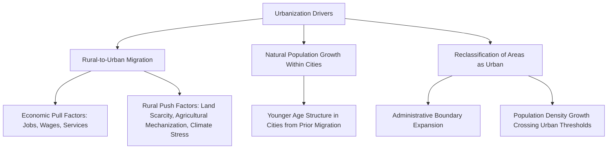

## Urbanization Trends and Patterns

### Definitions and Measurement

**Urbanization** refers to the process by which an increasing proportion of a population comes to live in urban areas (cities and towns), typically accompanied by structural economic shifts from agriculture toward industry and services, and changes in settlement density, infrastructure, and social organization.

**Key measurement concepts:**

- **Urbanization level/rate**: The percentage of a total population residing in urban areas at a given point in time
- **Urbanization growth rate**: The rate of change in the urban population share over time (distinct from urban population growth rate, which measures absolute/relative growth of the urban population itself, including both natural increase and migration)
- **Urban agglomeration**: A functionally integrated urban area, which may include a core city plus contiguous built-up suburban areas, sometimes crossing formal administrative boundaries

**Defining "urban" — a methodological challenge**: There is no single internationally standardized definition of what constitutes an "urban area." National statistical offices use varying criteria including population size thresholds, population density thresholds, administrative/legal designation, and the proportion of the population engaged in non-agricultural activity. **[Unverified]** Because definitions vary by country, cross-national urbanization comparisons carry inherent methodological caveats, and aggregated global urbanization statistics (e.g., from UN sources) rely on harmonization efforts that should be understood as best-available estimates rather than perfectly standardized measurements.

---

### Historical and Global Patterns

Urbanization has been a long-term global structural trend closely linked to the demographic transition and economic development processes covered in prior topics. Historically, sustained urbanization began most prominently with the Industrial Revolution in Western Europe and North America (18th-19th centuries), driven by the shift from agrarian to industrial/manufacturing economies concentrated in urban centers.

**[Unverified — current figures require verification]** Global urbanization has reportedly crossed the threshold where a majority of the world's population resides in urban areas (a milestone widely reported as occurring around 2007-2008 based on UN estimates), with continued projected increase in urban population share over coming decades; specific current-year percentages and regional breakdowns should be verified against the most recent UN World Urbanization Prospects report, since this is a continuously updated statistical series.

**Regional variation**: Urbanization levels vary substantially by region and development status, with generally higher urbanization shares in North America, Europe, and Latin America, and comparatively lower (but often more rapidly increasing) urbanization shares in parts of Africa and Asia — though considerable within-region heterogeneity exists across individual countries.

---

### Drivers of Urbanization

**Rural-to-urban migration** is typically the dominant driver of rapid urbanization in developing/industrializing economies, commonly analyzed through **push-pull migration theory**:

- **Pull factors**: Perceived or actual economic opportunity (higher wages, employment diversity), access to education and healthcare services, social/cultural amenities, and network effects (existing family/community connections in urban areas)
- **Push factors**: Agricultural land scarcity or fragmentation, agricultural mechanization reducing rural labor demand, limited rural economic diversification, and increasingly, climate-related stress on rural livelihoods (drought, land degradation) — connecting to the climate change and food security content covered in the agriculture chapter

**Natural increase within urban populations**: Once a substantial urban population is established, its own natural growth (births minus deaths within the urban population) becomes an increasingly significant contributor to continued urban population growth, particularly in later stages of a country's urbanization trajectory, alongside continued migration.

---

### Urban Primacy and City-Size Distribution

**Urban primacy** refers to a pattern where a single dominant city (typically the capital or largest commercial center) holds a disproportionately large share of a country's total urban population relative to other cities, often measured via the **primacy index** (ratio of the largest city's population to the second-largest city's population, or to the sum of the next several largest cities).

**Zipf's Law and the rank-size rule**: An empirically observed regularity in many (though not all) national urban systems, where city population size tends to be inversely proportional to its population rank:

$$P_r = \frac{P_1}{r}$$

Where $P_r$ is the population of the city ranked $r$-th by size, and $P_1$ is the population of the largest city. **[Unverified/context-dependent]** This relationship holds as a reasonable empirical approximation in some national urban systems but deviates substantially in others (particularly those exhibiting strong urban primacy, where the largest city far exceeds what the rank-size rule would predict); it functions as a useful descriptive heuristic rather than a universal law with guaranteed applicability to every national context.

**Drivers and consequences of high primacy**: Often associated with historical colonial administrative concentration, centralized economic/political governance structures, and infrastructure investment concentration; consequences can include disproportionate environmental pressure, congestion, and service strain concentrated in the primate city, alongside comparative underdevelopment in secondary urban centers and rural regions.

---

### Megacities and Urban Agglomerations

A **megacity** is commonly defined as an urban agglomeration with a population exceeding 10 million people, a category that has grown substantially in number globally over recent decades as urbanization has proceeded, particularly in Asia. **[Unverified]** The specific current count and ranking of global megacities changes as urban populations grow and are periodically revised in UN and other demographic data sources; current figures should be verified against up-to-date sources rather than assumed static.

**Environmental and infrastructure implications of megacity growth:**

- Concentrated demand for water, energy, waste management, and transportation infrastructure, often outpacing planned infrastructure capacity in rapidly growing megacities, particularly in lower-income rapidly urbanizing contexts
- Urban heat island effects intensify with city size and density (covered in more detail below)
- Air quality challenges from concentrated transportation, industrial, and energy-use emissions
- Increased vulnerability to certain climate risks (coastal megacities facing sea-level rise and storm surge exposure, given the historical tendency of major cities to develop near coastlines and river deltas for trade/transport access)

---

### Informal Settlements and Slum Growth

A significant feature of rapid urbanization in many developing-economy contexts is the growth of **informal settlements** (sometimes termed slums or informal housing areas), characterized by inadequate access to formal infrastructure (clean water, sanitation, secure land tenure, durable housing) despite often being embedded within or adjacent to formal urban areas.

**Key Points:**

- Informal settlement growth often reflects a mismatch between the pace of rural-to-urban migration and the pace of formal housing/infrastructure development, particularly in rapidly urbanizing lower-income contexts
- Environmental health risks are disproportionately concentrated in informal settlements, including inadequate sanitation-related disease risk, exposure to flooding and landslide hazards (informal settlements are often located on marginal, hazard-prone land due to land tenure constraints), and limited access to clean water and waste management services
- **[Unverified]** Global and regional estimates of informal settlement/slum population size are tracked by international bodies (e.g., UN-Habitat) and are periodically updated; current figures should be verified against recent UN-Habitat or national data sources rather than treated as static, since this is an actively monitored statistic subject to methodology refinement

---

### Illustrative Diagram: Urban Growth and Informal Settlement Dynamics (svg_diagram)

<svg xmlns="http://www.w3.org/2000/svg" viewBox="0 0 640 320">
<text x="320" y="26" text-anchor="middle" font-size="15" font-weight="bold" fill="#5c3a2d">Rapid Urbanization and Infrastructure Gap (svg_diagram)</text>
<line x1="70" y1="270" x2="580" y2="270" stroke="#333" stroke-width="1.5" />
<line x1="70" y1="60" x2="70" y2="270" stroke="#333" stroke-width="1.5" />
<text x="325" y="300" text-anchor="middle" font-size="11" fill="#333">Time</text>
<text x="30" y="165" text-anchor="middle" font-size="11" fill="#333" transform="rotate(-90 30 165)">Population/Capacity</text>
<path d="M70,250 Q200,220 320,140 Q450,80 580,70" fill="none" stroke="#c0392b" stroke-width="3" />
<text x="560" y="60" text-anchor="middle" font-size="10" fill="#c0392b" font-weight="bold">Urban Population Demand</text>
<path d="M70,255 Q200,240 320,200 Q450,170 580,155" fill="none" stroke="#2874a6" stroke-width="3" />
<text x="560" y="170" text-anchor="middle" font-size="10" fill="#2874a6" font-weight="bold">Formal Infrastructure Capacity</text>
<path d="M320,140 L320,200 L450,170 L450,80 Z" fill="#e8b87a" opacity="0.5" />
<text x="400" y="130" text-anchor="middle" font-size="11" fill="#8a4a1f" font-weight="bold">Infrastructure Gap</text>
<text x="400" y="145" text-anchor="middle" font-size="10" fill="#8a4a1f">(Informal Settlement Growth)</text>
</svg>

---

### Environmental Effects of Urbanization

**Urban Heat Island (UHI) effect**: Cities characteristically exhibit elevated temperatures relative to surrounding rural areas, driven primarily by:

- Replacement of vegetated/permeable surfaces with heat-absorbing impervious materials (asphalt, concrete, roofing) with higher thermal mass and lower albedo (reflectivity)
- Reduced evapotranspiration cooling from vegetation loss
- Waste heat release from buildings, vehicles, and industrial activity (anthropogenic heat flux)
- Urban canyon geometry (tall buildings) trapping heat and reducing nighttime radiative cooling

The UHI temperature differential is commonly quantified as:

$$\Delta T_{UHI} = T_{urban} - T_{rural}$$

**[Unverified]** UHI intensity varies considerably by city size, density, climate, urban form, and time of day/season (typically most pronounced at night and under calm, clear weather conditions); specific magnitude figures cited in various studies depend heavily on these local factors, so general "X degrees warmer" figures should be understood as illustrative rather than universally applicable constants.

**Land-use change and habitat loss**: Urban expansion directly converts natural or agricultural land to built environment, contributing to habitat fragmentation and loss, particularly significant when urban expansion occurs in or adjacent to biodiversity-sensitive areas or high-quality agricultural land (connecting to the land-use change themes discussed in the livestock and food security topics).

**Impervious surface hydrology effects**: Increased impervious surface coverage reduces natural infiltration and increases surface runoff volume and velocity, altering local hydrology, increasing flood risk, and often concentrating pollutant transport (connecting to the nutrient/pesticide runoff pathways covered in the fertilizer and pesticide topics, applied here to urban stormwater rather than agricultural runoff contexts).

**Air quality**: Concentrated transportation, energy generation, and industrial emissions in dense urban areas can create localized air pollution challenges (particulate matter, ground-level ozone precursors, nitrogen oxides), with health and environmental implications extending beyond city boundaries through atmospheric transport.

---

### Urbanization's Relationship to Agricultural Land and Food Systems

Connecting to the Agriculture and Food Systems chapter: urban expansion frequently competes directly with agricultural land use, particularly since many historically significant cities developed in fertile river valley or coastal plain locations well-suited to agriculture, creating an ongoing land-use tension as urban footprints expand into surrounding productive farmland.

**Peri-urban agriculture**: The zone of agricultural activity at the urban-rural interface faces distinct pressures (land conversion pressure, water competition, land price inflation) but also opportunities (proximity to urban markets, potential for urban nutrient/waste stream reuse), representing an increasingly studied intersection of urbanization and food systems planning.

**Urban agriculture**: Growing practice of food production within city boundaries (community gardens, rooftop farming, vertical farming systems), motivated by food security, local food system resilience, and in some cases environmental/social co-benefits, though its capacity to meaningfully substitute for conventional agricultural supply at scale is generally considered limited relative to total urban food demand.

---

### Urban Sustainability and Density Trade-offs

**Key Points:**

**Density-efficiency argument**: Higher-density urban development is frequently associated in urban planning and environmental literature with lower per-capita environmental footprint in several dimensions — reduced per-capita transportation emissions (shorter trip distances, greater viability of public transit and walking/cycling), reduced per-capita infrastructure and heating/cooling energy demand (shared walls, smaller unit sizes), and reduced land conversion per capita compared to low-density sprawl development patterns.

**Density trade-offs and counter-considerations**:

- Concentrated pollution exposure and urban heat island intensity typically increase with density, creating localized environmental health trade-offs even as aggregate per-capita footprint may improve
- Green space and access to nature can be reduced in very high-density development absent deliberate planning intervention (parks, urban forestry, green infrastructure requirements)
- **[Inference]** The net sustainability comparison between compact high-density development and various forms of lower-density development is context-dependent on specific transportation infrastructure, energy source mix, and planning policy choices, rather than a universal density-alone relationship; well-planned lower-density development with strong transit and green infrastructure can outperform poorly planned high-density development on some metrics, indicating that planning quality interacts substantially with density itself

**Compact city and Transit-Oriented Development (TOD) planning approaches**: Urban planning strategies explicitly designed to capture density-related efficiency benefits while mitigating trade-offs, typically emphasizing mixed land use, public transit accessibility, walkability, and deliberate green space integration.

---

### Example: Comparing Urbanization Trajectories

**Example**

Two illustrative (generalized, not country-specific) urbanization trajectory patterns commonly discussed in urban geography literature:

- **Gradual, infrastructure-matched urbanization**: Historical pattern in many earlier-industrializing nations, where urbanization proceeded over an extended multi-generational timeframe, allowing infrastructure development (housing, sanitation, transit) to more closely track population growth, though even in these historical cases substantial informal settlement and infrastructure strain occurred during peak industrialization periods
- **Rapid, compressed urbanization**: Pattern observed in many more recently and rapidly industrializing nations, where urbanization rates have proceeded considerably faster than the historical Western European/North American pace (paralleling the "compressed demographic transition" pattern discussed in the DTM topic), creating more acute and immediate infrastructure and informal settlement pressures within a shorter timeframe

**[Inference]** This generalized two-pattern framing is a simplification used for illustrative comparison; actual national urbanization trajectories vary considerably and are shaped by specific historical, economic, political, and geographic factors that resist reduction to a simple binary categorization.

---

### Related Topics

- Population growth dynamics and models (urban population growth components)
- The demographic transition model (urbanization as a Stage 2/3 transition driver)
- Human carrying capacity debates (urban density and consumption pattern intersections)
- Global food security and distribution (peri-urban land competition and urban food systems)
- Urban heat island mitigation strategies and green infrastructure
- Informal settlements, housing policy, and urban environmental justice
- Transit-oriented development and compact city planning
- Climate change adaptation in coastal and flood-prone urban areas
- Migration dynamics, including climate-driven and economic rural-urban migration
- Urban water and wastewater infrastructure management