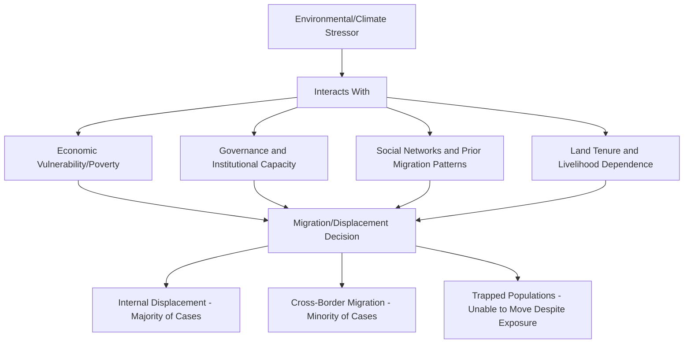

## Environmental Migration and Displacement

### Definitions and Terminology Challenges

**Environmental migration** refers to the movement of people, whether within or across national borders, driven wholly or partially by environmental change or environmental hazards, including sudden-onset disasters (floods, storms, earthquakes) and slow-onset degradation processes (desertification, sea-level rise, prolonged drought).

**Terminology and legal status is a genuinely unsettled area**: Terms in common use include "environmental migrant," "climate migrant," "environmentally displaced person," and "climate refugee" — however, **[Unverified/actively contested]** none of these terms currently carry formal legal status under the 1951 Refugee Convention, which defines "refugee" specifically around persecution based on race, religion, nationality, political opinion, or membership in a particular social group, and does not include environmental or climate drivers as a qualifying basis. This legal gap is a subject of ongoing international policy debate, and terminology usage varies across academic, humanitarian, and legal contexts; some scholars and organizations advocate for expanded legal recognition while others caution that the term "climate refugee" risks conflating distinct legal and policy categories with different protection mechanisms and obligations.

**Key distinction — internal versus cross-border displacement**: The overwhelming majority of documented environmentally-linked displacement occurs **within** national borders (internal displacement) rather than across international borders, a pattern with significant implications for which legal/institutional frameworks apply (internal displacement typically falls under national government responsibility and frameworks like the UN Guiding Principles on Internal Displacement, rather than international refugee law).

---

### The Multi-Causal Nature of Environmental Migration

**Key conceptual point**: Contemporary migration scholarship generally frames environmental factors as operating through interaction with other drivers rather than as a standalone, isolated causal factor — a person's decision or forced necessity to migrate in response to environmental stress is typically mediated by economic resources, social networks, governance capacity, and existing vulnerability, meaning environmental change is more accurately described as a "threat multiplier" or contributing driver rather than a sole determinant in most documented cases. **[Inference]** This multi-causal framing is widely adopted in migration and climate research literature specifically because attempts to isolate a purely "environmental" migration category independent of these interacting factors have proven empirically and conceptually difficult, complicating both measurement and policy design.

---

### Trapped Populations: An Often-Overlooked Dimension

A significant and frequently underemphasized aspect of the environmental displacement literature is the concept of **trapped populations** — people who are exposed to environmental risk and might otherwise migrate, but lack the financial, social, or physical resources to do so, resulting in involuntary immobility rather than migration.

**Key Points:**

- This challenges a common simplified assumption that environmental stress straightforwardly "produces" migration; in some of the most severely resource-constrained contexts, environmental stress can instead reduce migration capacity (since migration itself requires resources — money, information, social networks) even as environmental risk exposure increases
- **[Unverified/actively researched]** The relative scale of trapped populations compared to those who do migrate is difficult to measure directly (since by definition trapped populations do not appear in migration statistics) and remains an area of ongoing methodological development in migration research, using approaches like household vulnerability surveys and aspiration-capability migration frameworks

---

### Sudden-Onset versus Slow-Onset Environmental Drivers

**Sudden-onset disasters** (floods, cyclones/hurricanes, earthquakes, wildfires) typically produce the most immediately visible and statistically documented displacement events, often triggering rapid, large-scale, but frequently **temporary** displacement, with many affected populations returning once immediate hazard conditions subside and housing/infrastructure is restored — though displacement can become protracted or permanent when destruction is severe, resources for rebuilding are insufficient, or the underlying hazard risk is deemed to have permanently increased.

**Slow-onset processes** (sea-level rise, desertification, prolonged/recurrent drought, soil degradation, glacial retreat affecting water supply) typically produce more gradual displacement patterns that are considerably harder to attribute, measure, and document through conventional disaster-tracking mechanisms, since there is often no single discrete triggering event, and migration decisions may unfold incrementally over years, blending into broader patterns of economic and livelihood-driven migration.

**Monitoring institutions**: Organizations such as the Internal Displacement Monitoring Centre (IDMC) track and report disaster-related displacement data globally, providing among the more systematically collected datasets in this field, though methodological limitations remain more pronounced for slow-onset-driven displacement compared to sudden-onset disaster displacement, which is comparatively easier to identify and count.

---

### Case Contexts Frequently Cited in the Literature

**Example**

- **Small island developing states (SIDS)**: Low-lying island nations (various Pacific and Indian Ocean states are commonly cited examples) face documented long-term existential concern regarding sea-level rise and increased storm intensity/frequency, raising distinct legal and policy questions about statehood continuity, maritime boundary rights, and potential future planned relocation — some governments in this category have engaged in early-stage planning discussions regarding managed relocation options, though the scale, timeline, and precise governance arrangements for such scenarios remain evolving policy areas rather than fully resolved frameworks
- **Sahel region drought and desertification**: A frequently cited context in the slow-onset displacement literature, where recurrent drought, land degradation, and desertification pressures interact with existing agricultural livelihood dependence, population growth, and in some areas, conflict dynamics, to contribute to both internal displacement and rural-to-urban migration patterns — though as with the general multi-causal framing above, isolating the specific weight of environmental factors relative to conflict, governance, and economic drivers in this region is analytically complex and debated among researchers
- **Bangladesh and delta/coastal flooding**: Frequently cited due to its combination of high population density, low-lying delta geography, and exposure to both riverine flooding and coastal storm surge/salinity intrusion, contributing to internal migration patterns (notably toward urban centers such as Dhaka) that researchers link, at least partially, to environmental stress compounding existing economic and livelihood pressures

**[Unverified]** Specific displacement figures associated with each of these contexts are periodically updated by tracking organizations (IDMC, UNHCR, and others) and vary by methodology and reporting year; specific numerical claims should be verified against current primary-source reporting rather than treated as fixed figures, given the dynamic and actively monitored nature of this data.

---

### Illustrative Diagram: Environmental Displacement Decision Framework (svg_diagram)

<svg xmlns="http://www.w3.org/2000/svg" viewBox="0 0 640 340">
<text x="320" y="26" text-anchor="middle" font-size="15" font-weight="bold" fill="#2d4a5c">Environmental Stress and Migration Outcomes (svg_diagram)</text>
<rect x="240" y="50" width="160" height="50" rx="6" fill="#a3c9e0" stroke="#4a7a9c" stroke-width="2" />
<text x="320" y="80" text-anchor="middle" font-size="12" fill="#2d5670">Environmental Stressor</text>
<rect x="80" y="150" width="150" height="60" rx="6" fill="#c9dabf" stroke="#4a6b3a" stroke-width="1.5" />
<text x="155" y="172" text-anchor="middle" font-size="11" fill="#2d4a2b">Sufficient Capacity</text>
<text x="155" y="188" text-anchor="middle" font-size="11" fill="#2d4a2b">to Migrate</text>
<rect x="245" y="150" width="150" height="60" rx="6" fill="#e8d9a8" stroke="#a08540" stroke-width="1.5" />
<text x="320" y="172" text-anchor="middle" font-size="11" fill="#5c4a1f">Insufficient Capacity</text>
<text x="320" y="188" text-anchor="middle" font-size="11" fill="#5c4a1f">(Trapped Population)</text>
<rect x="410" y="150" width="150" height="60" rx="6" fill="#d4a8c9" stroke="#8a4a7a" stroke-width="1.5" />
<text x="485" y="172" text-anchor="middle" font-size="11" fill="#5c2d4a">Adaptation in Place</text>
<text x="485" y="188" text-anchor="middle" font-size="11" fill="#5c2d4a">(No Migration Needed)</text>
<rect x="30" y="250" width="120" height="50" rx="6" fill="#c9dabf" stroke="#4a6b3a" stroke-width="1.5" opacity="0.7" />
<text x="90" y="278" text-anchor="middle" font-size="10" fill="#2d4a2b">Internal Displacement</text>
<rect x="170" y="250" width="120" height="50" rx="6" fill="#c9dabf" stroke="#4a6b3a" stroke-width="1.5" opacity="0.7" />
<text x="230" y="278" text-anchor="middle" font-size="10" fill="#2d4a2b">Cross-Border Migration</text>
<path d="M280,100 L180,150" fill="none" stroke="#2d4a5c" stroke-width="2" marker-end="url(#arrowem)" />
<path d="M320,100 L320,150" fill="none" stroke="#2d4a5c" stroke-width="2" marker-end="url(#arrowem)" />
<path d="M360,100 L460,150" fill="none" stroke="#2d4a5c" stroke-width="2" marker-end="url(#arrowem)" />
<path d="M130,210 L100,250" fill="none" stroke="#2d4a5c" stroke-width="2" marker-end="url(#arrowem)" />
<path d="M175,210 L235,250" fill="none" stroke="#2d4a5c" stroke-width="2" marker-end="url(#arrowem)" />
</svg>

---

### Legal and Policy Frameworks

**Key Points:**

- **UN Guiding Principles on Internal Displacement (1998)**: A non-binding but widely referenced framework outlining the rights and protections of internally displaced persons, applicable to environmentally-displaced populations that remain within national borders (the majority of documented cases)
- **Nansen Initiative and Platform on Disaster Displacement**: State-led international consultative processes aimed at building consensus around protection frameworks for cross-border disaster-displaced persons, given the identified gap in formal refugee law coverage for this population
- **Regional frameworks**: Some regional instruments (e.g., certain African Union frameworks) have incorporated broader displacement definitions that extend some protection coverage in ways not present in the global 1951 Refugee Convention framework, though coverage and implementation vary considerably by region
- **National planned relocation programs**: Some governments have begun developing formal planned relocation frameworks for populations in high-risk zones (e.g., some Pacific island nations, and various national-level programs relocating populations from severe flood or erosion-risk zones), representing an emerging policy response category distinct from both spontaneous migration and formal refugee protection systems

**[Unverified/evolving policy area]** International legal and policy frameworks specifically addressing environmental/climate displacement are in active development and subject to ongoing negotiation and revision (including discussions within UNFCCC processes regarding "loss and damage" mechanisms that intersect with displacement concerns); current status should be verified against up-to-date sources from UNHCR, IDMC, or relevant international bodies rather than assumed static, given the genuinely unsettled and evolving nature of this policy area.

---

### Measurement and Data Challenges

**Key Points:**

- Attribution difficulty: Distinguishing the specific causal weight of environmental factors from economic, social, and political factors in any given migration decision is methodologically difficult, particularly for slow-onset drivers, since migration surveys and displacement tracking typically capture proximate triggers rather than full underlying causal chains
- Undercounting of slow-onset and internal displacement: Existing tracking systems (like IDMC's Global Report on Internal Displacement) are comparatively more robust for sudden-onset disaster displacement than for slow-onset process-driven migration, which tends to be gradual, harder to timestamp, and more likely to blend into general economic migration statistics
- **[Inference]** Given these measurement challenges, any specific global aggregate figures for "environmental" or "climate" migrants/displaced persons circulating in media or advocacy contexts should be treated with caution regarding precise methodology and should be checked against the specific definitional scope (internal vs. cross-border, sudden vs. slow-onset, displaced vs. migrated) used by the originating source, since these methodological choices substantially affect resulting figures

---

### Connections to Prior Demographic and Agricultural Topics

Environmental migration intersects directly with several previously covered topics:

- **Urbanization**: Rural-to-urban migration driven partly by agricultural land degradation, drought, or climate-related livelihood stress (as discussed in the urbanization topic's "push factors") represents a significant overlap between environmental migration and broader urbanization trends, particularly in agriculturally-dependent developing regions
- **Global food security and distribution**: Environmental degradation affecting agricultural livelihoods (soil degradation, water stress, extreme weather impacts on crop yields, as covered in the food security and fertilizer/nutrient pollution topics) is a commonly cited slow-onset driver contributing to rural-to-urban or cross-border migration pressure in agriculturally dependent populations
- **Population growth dynamics and carrying capacity debates**: Some analyses connect population pressure in ecologically vulnerable or resource-constrained regions to increased vulnerability to environmental displacement triggers, though as with other single-factor framings discussed in the carrying capacity topic, this connection is generally understood as one contributing factor among several interacting drivers rather than a standalone deterministic relationship

---

### Adaptation as an Alternative to Migration

**Key Points:**

- In-place adaptation strategies (improved water management, drought-resistant agricultural practices as discussed in the sustainable/organic farming and agroecology topics, flood defense infrastructure, livelihood diversification) represent policy alternatives aimed at reducing the necessity of migration/displacement by increasing resilience to environmental stress
- **[Inference]** The relative emphasis in international policy discourse between supporting in-place adaptation versus planning for managed migration/relocation reflects differing assessments of the feasibility and cost-effectiveness of adaptation relative to the severity and permanence of specific environmental risks (e.g., adaptation is generally considered more viable for moderate, reversible stress compared to severe, permanent risks like substantial sea-level rise affecting low-lying areas), and remains a genuinely debated balance in climate adaptation and displacement policy planning rather than a settled formula

---

### Related Topics

- Urbanization trends and patterns (rural-to-urban migration overlap)
- Global food security and distribution (agricultural livelihood stress as a displacement driver)
- Human carrying capacity debates (population-environment vulnerability intersections)
- Climate change adaptation strategies in vulnerable regions
- Small island developing states and sea-level rise policy
- Internal displacement monitoring and humanitarian response systems
- International refugee law and its gaps regarding environmental drivers
- Loss and damage mechanisms under UNFCCC climate policy frameworks
- Sahel region desertification and drought dynamics
- Managed retreat and planned relocation policy design