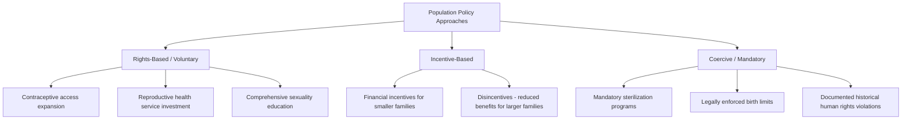

## Population Policy and Family Planning

### Definitions and Policy Scope

**Population policy** encompasses deliberate government or institutional actions intended to influence population size, growth rate, distribution, or composition, ranging from direct fertility-targeted interventions to broader socioeconomic policies with demographic effects (education, healthcare, migration policy, urban planning).

**Family planning** refers specifically to the ability of individuals and couples to anticipate and attain their desired number and spacing of children, through access to information, contraceptive methods, and reproductive health services, exercised as a voluntary individual/couple decision within a supportive policy and service-delivery environment (as distinguished from coercive population control measures, discussed below).

**Key distinction — population policy versus family planning access**: These are related but conceptually distinct: family planning access is fundamentally a reproductive health and rights-based service provision matter, while population policy is a broader, more explicitly state-directed category that may or may not center on individual reproductive autonomy — historically, population policies have ranged from strongly rights-based, voluntary-access approaches to explicitly coercive state-directed fertility control measures, a distinction with significant human rights implications addressed further below.

---

### Historical Development of Population Policy

**Post-World War II context**: Concern about rapid population growth in the context of the Stage 2 demographic transition (covered in the DTM topic) — combined with Malthusian and neo-Malthusian resource concerns (covered in the carrying capacity topic) — drove substantial mid-to-late 20th century international attention to population policy, particularly from the 1950s through 1980s.

**International Conference on Population and Development (ICPD), Cairo 1994**: A pivotal shift in international population policy framing, moving away from top-down demographic target-setting (numerical population growth reduction goals) toward a **rights-based reproductive health framework**, emphasizing individual and couple reproductive autonomy, gender equality, and comprehensive reproductive healthcare access as ends in themselves, rather than population growth reduction as the primary policy objective with family planning as an instrumental means to that end. This conceptual shift remains foundational to contemporary international population policy discourse and is widely referenced as a watershed moment in the field.

---

### Voluntary versus Coercive Population Policy: A Critical Distinction

**Key Points:**

- **Rights-based/voluntary approaches**: Center on expanding informed choice and access — comprehensive reproductive healthcare, diverse contraceptive method availability, sexuality education, and removal of access barriers (cost, geographic distance, social stigma, spousal/family consent requirements) — without numerical targets or coercive enforcement mechanisms
- **Incentive-based approaches**: Use financial or social incentives (e.g., benefits tied to family size) to encourage smaller family size without direct legal compulsion, though critics note that incentive structures can create de facto coercive pressure on economically vulnerable populations, blurring the line between voluntary and coercive categorization in practice
- **Coercive approaches**: Historically documented cases include forced or coerced sterilization programs and legally mandated birth limits with enforcement mechanisms, which have been widely condemned in international human rights frameworks and are generally repudiated in contemporary mainstream population policy discourse, though documented historical cases (and some ongoing allegations in specific contexts) remain a significant and sensitive area of human rights history and scholarship

**[Unverified/sensitive topic requiring case-specific sourcing]** Specific historical population policy programs (including well-documented cases in various countries across different decades) involved coercive elements to varying documented degrees; the specifics, scale, and current status of any particular historical or ongoing program should be researched through dedicated human rights and demographic history sources rather than generalized in this overview, given the sensitivity and case-specific nature of this history.

---

### Contraceptive Access and the "Unmet Need" Concept

**Unmet need for family planning** is a standard demographic and public health metric referring to the proportion of women (typically measured among married or in-union women of reproductive age, with expanded definitions increasingly used for all sexually active women) who wish to avoid or delay pregnancy but are not using any method of contraception.

$$\text{Unmet Need (\%)} = \frac{\text{Women wanting to avoid/delay pregnancy, not using contraception}}{\text{Total women of reproductive age (relevant subgroup)}} \times 100$$

**[Unverified]** Global and regional unmet need figures are tracked and periodically updated by organizations including the UN Population Division and Guttmacher Institute; current figures vary by region and should be verified against recent primary sources rather than assumed static, since this is an actively monitored statistic subject to revision as survey data updates.

**Documented barriers contributing to unmet need** commonly cited in family planning research:

- **Supply-side barriers**: Inadequate healthcare infrastructure, contraceptive method stockouts, insufficient trained healthcare provider availability, particularly in rural or under-resourced areas
- **Cost barriers**: Direct and indirect costs of contraceptive services and products, disproportionately affecting lower-income populations
- **Knowledge/information barriers**: Limited awareness of available methods, correct use, or where to access services
- **Social/cultural barriers**: Spousal or family opposition, social stigma, religious or cultural norms affecting individual autonomy over reproductive decisions
- **Policy/legal barriers**: Restrictive laws regarding contraceptive access (e.g., age restrictions, spousal consent requirements, restrictions on specific methods)

---

### Contraceptive Methods Overview

**Key Points (non-exhaustive summary; not intended as clinical guidance):**

| Method Category | Examples | General Characteristics |
| --- | --- | --- |
| Long-Acting Reversible Contraception (LARC) | IUDs, implants | High effectiveness, long duration, reversible upon removal |
| Short-acting hormonal methods | Oral contraceptive pills, injectables, patches | Require regular user action/adherence |
| Barrier methods | Condoms (male/female), diaphragms | Also provide varying STI protection (notably condoms) |
| Permanent methods | Tubal ligation, vasectomy | Intended as permanent, though reversal is sometimes possible with variable success |
| Fertility awareness-based methods | Cycle tracking, symptom-based methods | No hormonal/device intervention, generally lower typical-use effectiveness than LARC methods |

**[Unverified — clinical specifics require dedicated medical sourcing]** Method-specific effectiveness rates, side effect profiles, and suitability considerations vary by individual health context and should be sourced from clinical/medical guidance rather than this general overview, which is intended to convey policy-relevant category distinctions rather than clinical decision-making information.

---

### Case Study: China's One-Child Policy

**Example**

China's one-child policy, implemented from 1980 and subject to various regional exceptions and enforcement variation over its duration, represents one of the most extensively studied and debated examples of a coercive, legally mandated population policy in modern history, involving documented enforcement mechanisms including financial penalties, and in various documented cases, more severe coercive measures.

**Demographic outcomes**: The policy is widely credited by many demographers with contributing to accelerated fertility decline in China during its implementation period, though **[Unverified/contested attribution]** the relative contribution of the policy itself versus broader concurrent socioeconomic development, urbanization, and rising female education (factors independently associated with fertility decline in the demographic transition literature) remains a subject of ongoing scholarly debate, since China's fertility rate had already begun declining prior to the policy's formal implementation, complicating clean causal attribution.

**Documented consequences**: The policy has been associated in demographic research with a skewed sex ratio at birth (linked to documented son preference interacting with restricted family size in some regions, though the specific mechanisms and regional variation are subjects of detailed demographic study), and more recently, contributed to an accelerated population aging trajectory and workforce composition shift, factors cited among the reasons China moved to relax the policy (first to a two-child policy in 2016, later further relaxed) in subsequent years. This case is frequently referenced in population policy literature as illustrating both the demonstrated capacity of coercive state intervention to accelerate fertility decline and the substantial associated human rights costs and long-term demographic side effects, informing the broader post-Cairo shift toward rights-based approaches discussed above.

---

### Illustrative Diagram: Family Planning Access Pathway (svg_diagram)

<svg xmlns="http://www.w3.org/2000/svg" viewBox="0 0 640 300">
<text x="320" y="26" text-anchor="middle" font-size="15" font-weight="bold" fill="#2d4a5c">Rights-Based Family Planning Access Pathway (svg_diagram)</text>
<rect x="30" y="60" width="140" height="55" rx="6" fill="#c9dabf" stroke="#4a6b3a" stroke-width="1.5" />
<text x="100" y="82" text-anchor="middle" font-size="11" fill="#2d4a2b">Comprehensive</text>
<text x="100" y="98" text-anchor="middle" font-size="11" fill="#2d4a2b">Sexuality Education</text>
<rect x="200" y="60" width="140" height="55" rx="6" fill="#a3c9e0" stroke="#4a7a9c" stroke-width="1.5" />
<text x="270" y="82" text-anchor="middle" font-size="11" fill="#2d5670">Healthcare Access</text>
<text x="270" y="98" text-anchor="middle" font-size="11" fill="#2d5670">and Provider Availability</text>
<rect x="370" y="60" width="140" height="55" rx="6" fill="#e8d9a8" stroke="#a08540" stroke-width="1.5" />
<text x="440" y="82" text-anchor="middle" font-size="11" fill="#5c4a1f">Method Choice</text>
<text x="440" y="98" text-anchor="middle" font-size="11" fill="#5c4a1f">and Affordability</text>
<rect x="540" y="60" width="80" height="55" rx="6" fill="#d4a8c9" stroke="#8a4a7a" stroke-width="1.5" />
<text x="580" y="82" text-anchor="middle" font-size="10" fill="#5c2d4a">Legal/Policy</text>
<text x="580" y="98" text-anchor="middle" font-size="10" fill="#5c2d4a">Support</text>
<rect x="150" y="180" width="340" height="70" rx="6" fill="#3a2a3a" stroke="#2a1a2a" stroke-width="1.5" />
<text x="320" y="205" text-anchor="middle" font-size="12" fill="#f0e8f0">Informed, Voluntary Reproductive Decision-Making</text>
<text x="320" y="225" text-anchor="middle" font-size="10" fill="#d8c8d8">Reduced unmet need, improved maternal/child health outcomes</text>
<text x="320" y="240" text-anchor="middle" font-size="10" fill="#d8c8d8">Individual autonomy as the framing principle (post-ICPD Cairo 1994)</text>
<path d="M100,115 L280,180" fill="none" stroke="#2d4a5c" stroke-width="1.5" marker-end="url(#arrowfp)" />
<path d="M270,115 L320,180" fill="none" stroke="#2d4a5c" stroke-width="1.5" marker-end="url(#arrowfp)" />
<path d="M440,115 L360,180" fill="none" stroke="#2d4a5c" stroke-width="1.5" marker-end="url(#arrowfp)" />
<path d="M580,115 L420,180" fill="none" stroke="#2d4a5c" stroke-width="1.5" marker-end="url(#arrowfp)" />
</svg>

---

### Co-benefits of Voluntary Family Planning Access

Research and policy literature commonly document several co-benefits associated with expanded voluntary family planning access, extending beyond fertility rate effects alone:

**Key Points:**

- **Maternal and child health**: Improved birth spacing is associated in health research with reduced maternal mortality risk and improved child health/survival outcomes, since very short interpregnancy intervals and pregnancies at very young or advanced maternal age are associated with elevated health risks
- **Female education and economic participation**: Reduced unintended pregnancy and improved birth spacing are associated with increased educational attainment and labor force participation opportunities for women, interacting with the demographic transition mechanisms discussed in the DTM topic (education/fertility feedback loops)
- **Environmental co-benefits (contested framing)**: Some analyses connect expanded voluntary family planning access to reduced environmental pressure via slower aggregate population growth, particularly emphasized in some environmental and population-environment literature; **[Speculation/contested framing]** this connection, while mathematically consistent with the I=PAT framework covered in the carrying capacity topic, requires careful framing to avoid conflating environmental sustainability goals with reproductive policy in ways that could inadvertently support the population-control-oriented (rather than rights-based) framing explicitly rejected in the post-Cairo international consensus; contemporary practitioners in this space generally emphasize that family planning access should be pursued as a matter of health and rights regardless of any environmental co-benefit framing, to avoid this documented historical tension

---

### Pro-Natalist Policy Contexts

At the opposite end of the population policy spectrum, some countries facing below-replacement fertility and associated population aging concerns (as discussed in the DTM Stage 4/5 context) have implemented **pro-natalist policies** aimed at supporting or increasing fertility rates:

**Common pro-natalist policy instruments:**

- Direct financial incentives (baby bonuses, child allowances, tax benefits for larger families)
- Parental leave policy expansion (paid leave duration and flexibility)
- Childcare access and affordability support
- Housing assistance targeted at families

**[Unverified/mixed evidence]** The empirical effectiveness of pro-natalist policies in durably raising fertility rates back toward replacement level is documented in the literature as producing mixed and generally modest results across different national contexts and policy designs; some studies find modest positive effects on fertility timing or short-term rate increases, while others find limited or temporary effects, suggesting that fertility decisions in developed-country contexts are influenced by a complex set of economic, cultural, and structural factors not fully addressed by financial incentive-based policy instruments alone. This remains an active area of comparative policy research without a clearly established "solution" formula across contexts.

---

### Migration Policy as a Complementary Population Policy Tool

For countries facing population decline or workforce aging pressures (Stage 4/5 demographic transition contexts), immigration policy is frequently discussed as a complementary or alternative policy lever to pro-natalist fertility policy, since immigration can directly offset natural population decline and adjust workforce age structure more rapidly than fertility policy effects (which take a generation to affect workforce entry).

**[Inference]** The relative political feasibility and social acceptance of expanded immigration versus pro-natalist fertility policy as population policy tools varies substantially by national political and cultural context, and countries often pursue combinations of both approaches rather than relying on a single policy lever, reflecting the genuinely multi-dimensional nature of population policy design in aging-population contexts.

---

### Contemporary Best-Practice Framework Summary

**Key Points:**

- Mainstream contemporary international population policy discourse (reflecting the post-ICPD Cairo consensus) generally emphasizes voluntary, rights-based, informed-choice approaches to family planning access as both an ethical requirement and, per the evidence discussed above, an effective approach for supporting individual and public health outcomes
- Numerical population growth targets and coercive enforcement mechanisms are generally repudiated in mainstream contemporary policy frameworks, informed by the documented human rights costs and demographic side effects of historical coercive programs
- Population policy in aging, below-replacement-fertility contexts increasingly incorporates a broader toolkit beyond fertility-focused measures alone, including migration policy, workforce policy, and social support system redesign

---

### Related Topics

- The demographic transition model (fertility decline drivers and policy intersections)
- Population growth dynamics and models (aggregate effects of policy-driven fertility change)
- Human carrying capacity debates (population-environment policy framing tensions)
- Urbanization trends and patterns (education/urbanization/fertility interaction effects)
- Reproductive health and maternal/child health outcomes
- Gender equality and female education policy
- Population aging and pension/workforce policy design
- International human rights frameworks and reproductive rights
- Immigration policy in aging-population contexts
- ICPD Cairo 1994 and international population policy history