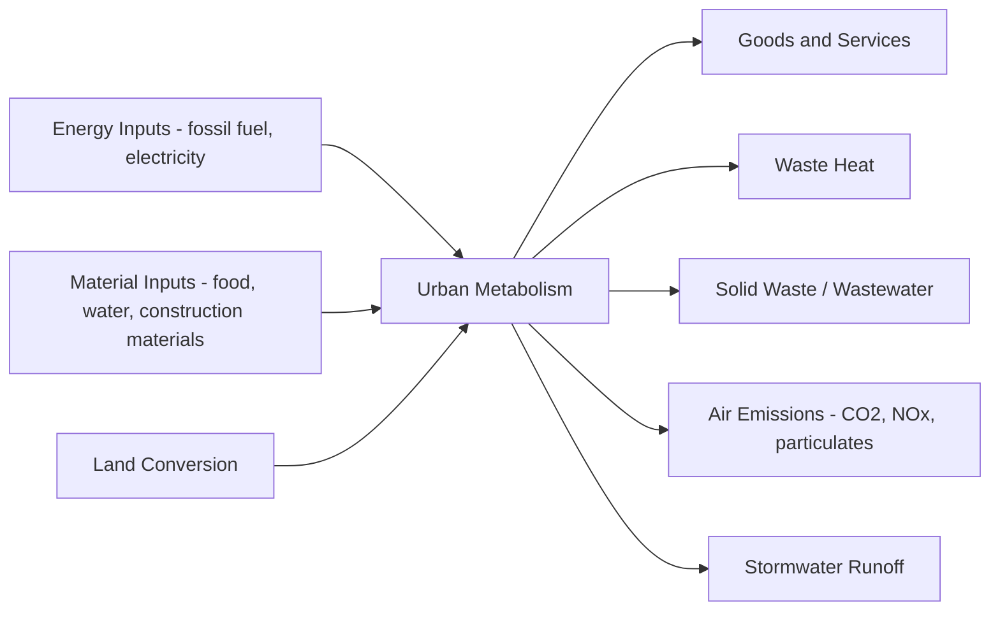
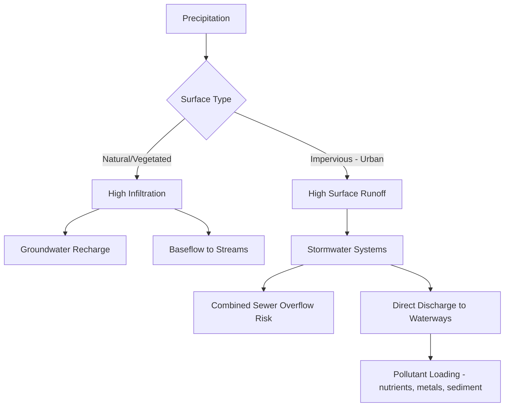

## Urban Ecosystems and Urban Ecology

### Overview

Urban ecology examines the structure, function, and dynamics of ecosystems shaped by dense human habitation. Cities constitute novel ecosystems characterized by fragmented habitats, altered biogeochemical cycles, modified microclimates, and species assemblages shaped by both intentional design and unintentional ecological filtering. Urban ecology integrates landscape ecology, environmental engineering, social science, and planning to understand how cities function as coupled human-natural systems.

### Conceptual Frameworks

**Key Points**

- **Ecology *in* the city:** studies discrete patches of nature within urban areas (parks, remnant forests, street trees) using traditional ecological methods.
- **Ecology *of* the city:** treats the entire urban area, including its built infrastructure and human populations, as a single integrated ecosystem.
- **Ecology *for* the city:** applies ecological knowledge explicitly toward planning and design outcomes (green infrastructure, sustainability targets).

This tripartite framework, widely used since the 1990s expansion of the field, reflects an evolution from studying nature *despite* the city to studying the city itself as an ecological entity, and finally to using ecology in an applied, prescriptive capacity.

### The Urban Ecosystem as a System

Cities can be modeled using standard ecosystem inputs, stocks, and outputs, analogous to natural ecosystems but with substantially higher external subsidies:

The **urban metabolism** concept quantifies the flows of energy, water, materials, and waste through a city, analogous to metabolic flux through an organism. Material Flow Analysis (MFA) is the standard accounting method, tracking inputs and outputs per capita or per unit area.

### Urban Heat Island Effect

**Mechanism**

Impervious surfaces (asphalt, concrete, roofing) have higher thermal admittance and lower albedo than vegetated surfaces, absorbing more solar radiation during the day and releasing it slowly at night. Reduced evapotranspiration (fewer plants, less soil moisture) removes a major cooling pathway, and the complex urban canyon geometry traps longwave radiation through multiple reflections.

The surface energy balance for an urban surface can be expressed as:

$$Q^* + Q_F = Q_H + Q_E + \Delta Q_S$$

where $Q^*$ is net radiation, $Q_F$ is anthropogenic heat flux (from vehicles, buildings, industry), $Q_H$ is sensible heat flux, $Q_E$ is latent heat flux (evapotranspiration), and $\Delta Q_S$ is net heat storage in the urban fabric.

[Inference] Because impervious surfaces suppress $Q_E$ and increase $\Delta Q_S$ storage capacity, more of the daytime energy surplus is re-released as sensible heat ($Q_H$) after sunset, which is the primary physical driver of elevated nighttime urban temperatures relative to surrounding rural areas.

**Mitigation Approaches**

- **Green roofs:** vegetated roofing systems that increase evapotranspiration and insulate the building envelope
- **Cool roofs/pavements:** high-albedo materials that reflect more shortwave radiation
- **Urban tree canopy expansion:** provides shading and transpirational cooling
- **Blue infrastructure:** ponds, constructed wetlands, and daylighted streams that add evaporative cooling capacity

### Habitat Fragmentation and Urban Biodiversity

Urbanization converts contiguous habitat into a mosaic of patches embedded in a hostile matrix, altering species composition through several ecological filters:

1. **Habitat loss filter:** direct removal of native vegetation and soil
2. **Fragmentation filter:** reduced patch size and increased edge-to-area ratio, disadvantaging area-sensitive interior species
3. **Novel disturbance filter:** noise, light, chemical pollution, and human presence select for tolerant, often generalist or synanthropic species

This process typically produces the **biotic homogenization** pattern, where urban areas across different biogeographic regions converge on similar species assemblages (e.g., rock pigeons, house sparrows, Norway rats) dominated by cosmopolitan generalists rather than regionally distinct native fauna.

**Island Biogeography Applied to Urban Patches**

The theory of island biogeography, originally developed for oceanic islands, is applied to urban green space patches, treating them as habitat "islands" within an urban matrix. Species richness $S$ relates to patch area $A$ via the power-law species-area relationship:

$$S = cA^z$$

where $c$ and $z$ are empirically fitted constants; $z$ typically falls between 0.15–0.35 for habitat islands. Larger, better-connected patches support higher species richness, informing green space design standards.

### Landscape Connectivity and Green Infrastructure

**Green infrastructure** refers to a strategically planned network of natural and semi-natural areas designed to deliver ecosystem services and maintain ecological connectivity.

| Component | Function |
| --- | --- |
| Wildlife corridors | Connect fragmented habitat patches, enabling gene flow and range shifts |
| Riparian buffers | Filter runoff, stabilize streambanks, provide movement corridors |
| Urban forests | Carbon sequestration, air quality improvement, canopy cooling |
| Bioswales/rain gardens | Stormwater infiltration and pollutant filtration |
| Constructed wetlands | Wastewater/stormwater treatment, habitat provision |

**Landscape connectivity** is often quantified using graph-theoretic metrics, treating habitat patches as nodes and potential dispersal paths as edges, allowing planners to identify critical "stepping stone" patches whose loss would most reduce overall network connectivity.

### Urban Hydrology and the Water Cycle

Impervious surface cover fundamentally alters the hydrologic cycle:

Increased impervious cover reduces infiltration and increases the volume and velocity of surface runoff, producing "flashier" hydrographs with higher peak discharge and shorter time-to-peak compared to natural catchments. This drives **stream channel erosion**, reduced baseflow, and combined sewer overflow (CSO) events in cities with combined stormwater/sanitary systems.

**Low Impact Development (LID) / Sustainable Urban Drainage Systems (SuDS)** mimic natural hydrology through decentralized infiltration and detention: permeable pavement, bioretention cells, and rainwater harvesting reduce peak runoff volumes and reintroduce infiltration pathways.

### Urban Soils

Urban soils (often classified as **Anthrosols** or **Technosols**) differ substantially from natural soils:

- **Compaction:** construction activity reduces pore space, limiting root penetration and infiltration
- **Contamination:** legacy heavy metals (lead, from historical leaded gasoline and paint), hydrocarbons, and de-icing salts
- **Altered pH and nutrient status:** construction debris (concrete, mortar) frequently raises soil pH; fertilizer runoff can elevate nitrogen and phosphorus
- **Sealed surfaces:** pavement and buildings physically exclude soil-atmosphere gas exchange, altering microbial community composition

[Unverified] Urban soil microbial diversity is generally reported as reduced relative to comparable natural soils, though findings vary by city, land-use history, and specific contamination profile, and some urban soils (e.g., older park soils) can retain substantial microbial diversity.

### Urban Air Quality and Atmospheric Chemistry

Key pollutants in urban atmospheres include tropospheric ozone (a secondary pollutant formed via photochemical reactions), particulate matter (PM2.5, PM10), nitrogen oxides (NOx), and volatile organic compounds (VOCs). Ozone formation follows the simplified photochemical cycle:

$$NO_2 + h\nu \rightarrow NO + O$$

$$O + O_2 \rightarrow O_3$$

In the presence of VOCs, the NO-to-NO₂ conversion pathway is altered such that ozone accumulates rather than being consumed by reaction with NO, a phenomenon central to photochemical smog formation in sunny, high-traffic urban environments.

Urban trees provide measurable air quality regulation through pollutant deposition on leaf surfaces and stomatal uptake, though [Inference] the magnitude of this effect is generally modest at the whole-city scale relative to emissions reductions, and can occasionally be offset by biogenic VOC emissions from certain tree species that contribute to ozone precursor loads.

### Urban Wildlife Adaptation

Species persisting in urban environments frequently exhibit measurable behavioral and physiological adaptations:

- **Vocal adaptation:** urban birds (e.g., great tits, songbirds) often sing at higher minimum frequencies or altered timing to overcome low-frequency traffic noise masking
- **Altered activity patterns:** increased nocturnality in mammals (coyotes, foxes) to avoid daytime human activity
- **Diet shifts:** increased reliance on anthropogenic food sources
- **Reduced predator avoidance / altered flight-initiation distance:** documented in urban-adapted bird and mammal populations

[Inference] These represent behavioral plasticity in most documented cases rather than confirmed evolutionary (genetic) adaptation, although several long-term studies do report heritable trait shifts (e.g., beak morphology in urban finches), so the relative contribution of plasticity versus genetic change is species- and context-dependent.

### Ecosystem Services in Urban Contexts

| Service Category | Example | Mechanism |
| --- | --- | --- |
| Regulating | Air purification | Particulate deposition, pollutant absorption |
| Regulating | Stormwater management | Interception, infiltration, evapotranspiration |
| Regulating | Climate regulation | Shading, evapotranspirative cooling, carbon sequestration |
| Cultural | Recreation, mental health | Access to green space, biophilic design |
| Supporting | Pollination | Urban pollinator corridors supporting food production |
| Provisioning | Urban agriculture | Community gardens, rooftop farms |

**Example**

A single mature street tree can intercept several hundred to over a thousand gallons of stormwater annually through canopy interception, depending on species, canopy size, and local precipitation patterns—illustrating why urban forestry programs are increasingly integrated into municipal stormwater management plans rather than treated as a purely aesthetic amenity.

### Environmental Justice Dimensions

Urban ecological conditions are frequently distributed unevenly across socioeconomic and racial lines, a pattern well-documented in the environmental justice literature:

- **Green space inequity:** lower-income and historically marginalized neighborhoods often have measurably less tree canopy and park access
- **Urban heat disparities:** neighborhoods with historical redlining or disinvestment frequently show measurably higher land surface temperatures due to reduced canopy and vegetation cover
- **Pollution exposure:** industrial siting and major roadway proximity disproportionately affect lower-income communities

[Inference] These patterns are well-established across many studied cities in North America in particular, though the specific magnitude and causal drivers (zoning history, disinvestment, property values) vary by urban context and require local assessment rather than uniform generalization.

### Urban Ecological Design Diagram

<svg xmlns="http://www.w3.org/2000/svg" viewBox="0 0 520 380" font-family="sans-serif">
<text x="260" y="20" text-anchor="middle" font-size="15" font-weight="bold">Urban Green Infrastructure Network (svg_diagram)</text>

<rect x="20" y="40" width="480" height="300" fill="#d9d9d9" />

<line x1="20" y1="190" x2="500" y2="190" stroke="#888" stroke-width="8" />
<line x1="260" y1="40" x2="260" y2="340" stroke="#888" stroke-width="8" />

<circle cx="100" cy="100" r="35" fill="#4caf50" />
<text x="100" y="105" text-anchor="middle" font-size="10" fill="white">Park A</text>
<circle cx="420" cy="100" r="45" fill="#4caf50" />
<text x="420" y="105" text-anchor="middle" font-size="10" fill="white">Forest Preserve</text>
<circle cx="100" cy="280" r="25" fill="#4caf50" />
<text x="100" y="284" text-anchor="middle" font-size="9" fill="white">Pocket Park</text>
<circle cx="420" cy="280" r="30" fill="#4caf50" />
<text x="420" y="284" text-anchor="middle" font-size="9" fill="white">Wetland</text>

<circle cx="260" cy="80" r="12" fill="#81c784" />
<circle cx="180" cy="190" r="10" fill="#81c784" />
<circle cx="340" cy="190" r="10" fill="#81c784" />
<circle cx="260" cy="300" r="12" fill="#81c784" />

<line x1="100" y1="100" x2="260" y2="80" stroke="#2e7d32" stroke-width="2" stroke-dasharray="5,4" />
<line x1="260" y1="80" x2="420" y2="100" stroke="#2e7d32" stroke-width="2" stroke-dasharray="5,4" />
<line x1="100" y1="100" x2="180" y2="190" stroke="#2e7d32" stroke-width="2" stroke-dasharray="5,4" />
<line x1="180" y1="190" x2="100" y2="280" stroke="#2e7d32" stroke-width="2" stroke-dasharray="5,4" />
<line x1="420" y1="100" x2="340" y2="190" stroke="#2e7d32" stroke-width="2" stroke-dasharray="5,4" />
<line x1="340" y1="190" x2="420" y2="280" stroke="#2e7d32" stroke-width="2" stroke-dasharray="5,4" />
<line x1="180" y1="190" x2="260" y2="300" stroke="#2e7d32" stroke-width="2" stroke-dasharray="5,4" />
<line x1="340" y1="190" x2="260" y2="300" stroke="#2e7d32" stroke-width="2" stroke-dasharray="5,4" />

<rect x="30" y="350" width="12" height="12" fill="#4caf50" />
<text x="48" y="360" font-size="10">Core Habitat Patch</text>
<rect x="170" y="350" width="12" height="12" fill="#81c784" />
<text x="188" y="360" font-size="10">Stepping Stone</text>
<line x1="300" y1="356" x2="330" y2="356" stroke="#2e7d32" stroke-width="2" stroke-dasharray="5,4" />
<text x="336" y="360" font-size="10">Corridor</text>
</svg>

### Practical Example: Bioretention Cell Sizing

**Example**

A simplified bioretention cell sizing approach uses the water quality volume ($WQV$) approach:

$$WQV = \frac{P \times R_v \times A}{12}$$

where $P$ is the design storm depth (inches), $R_v$ is the volumetric runoff coefficient ($R_v = 0.05 + 0.9 I_a$, with $I_a$ as the impervious fraction), and $A$ is the contributing drainage area (acres). For a 1-acre commercial parcel with 80% impervious cover and a 1-inch design storm:

1. $R_v = 0.05 + 0.9(0.8) = 0.77$
2. $WQV = (1 \times 0.77 \times 1)/12 = 0.064$ acre-feet ≈ 2,790 ft³

This volume informs the minimum ponding and media storage capacity required in the bioretention cell design. [Inference] Actual design standards vary by jurisdiction, and local stormwater manuals should be consulted for regulatory design storm depths and required treatment volumes.

### Conclusion

Urban ecology reframes cities not as ecological voids but as dynamic, human-dominated ecosystems governed by identifiable biophysical processes: altered energy and water budgets, fragmented habitat networks, modified soil and atmospheric chemistry, and selectively filtered biodiversity. Effective urban environmental planning depends on applying these ecological principles directly to infrastructure and land-use decisions, particularly through green infrastructure networks that restore connectivity and ecosystem function while addressing the uneven distribution of environmental benefits and burdens across urban populations.

**Related Topics**

- Landscape ecology metrics and patch-corridor-matrix models
- Urban forestry management and canopy cover targets
- Green stormwater infrastructure design standards (LID/SuDS)
- Environmental justice and green space equity mapping
- Urban biodiversity monitoring (citizen science, eDNA sampling)
- Climate-resilient urban design and nature-based solutions
- Circular economy approaches to urban material flows