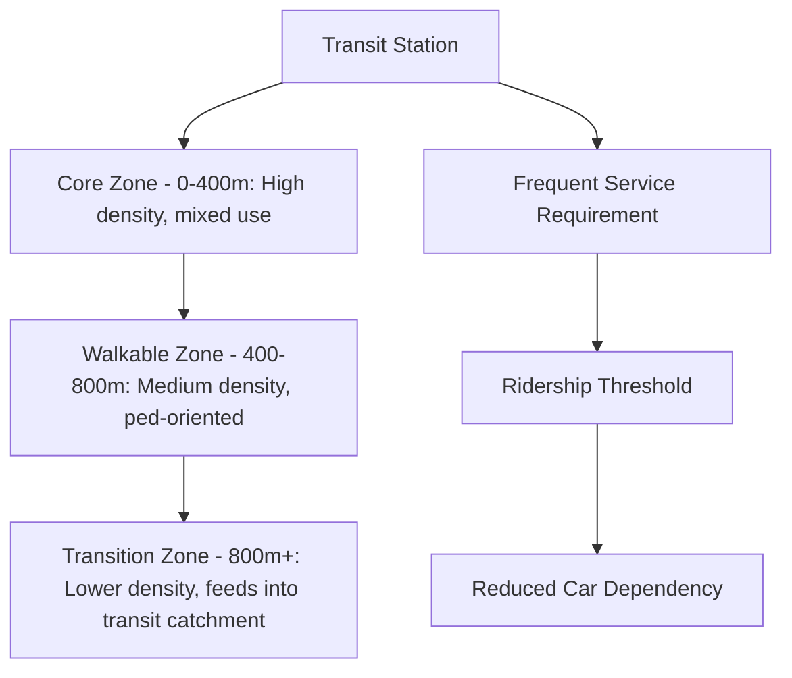
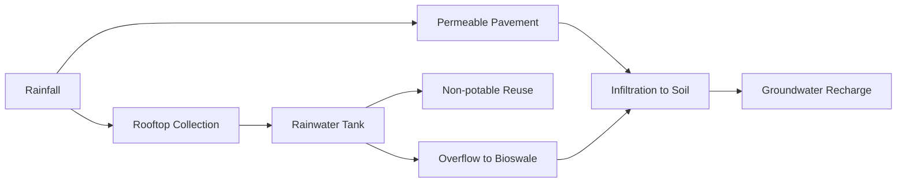

## Principles of Sustainable City Design

### Overview

Sustainable city design integrates land use, infrastructure, energy, mobility, and social systems to minimize environmental impact while maintaining or improving quality of life and economic vitality. It draws on urban planning theory, systems ecology, civil engineering, and social equity frameworks to produce cities that operate within ecological limits across multiple, often interacting, scales — from individual buildings to metropolitan regions.

### Core Conceptual Foundations

**Key Points**

- **The Three Pillars framework** (environmental, economic, social sustainability) provides the foundational lens, though critics note the pillars are frequently treated as separable when they are deeply interdependent.
- **Urban metabolism** models the city as a system processing energy, materials, water, and waste, analogous to biological metabolism, and is used to benchmark resource efficiency.
- **Ecological footprint / planetary boundaries** framing situates city-level resource consumption against finite biophysical limits, informing per-capita consumption targets.

$$\text{Ecological Footprint (city)} = \sum_i \frac{C_i}{Y_i}$$

where $C_i$ is consumption of resource category $i$ and $Y_i$ is the average global yield (productivity) of the land/sea area required to produce or absorb that resource category, summed across all consumption categories and expressed in global hectares.

### Compact City and Density Principles

**Compact city theory** holds that higher-density, mixed-use development reduces per-capita infrastructure costs, shortens travel distances, and preserves peripheral land from conversion. Key design levers include:

- **Density gradients:** concentrating higher density near transit nodes and commercial corridors while stepping down toward residential edges
- **Mixed land use:** co-locating residential, commercial, and light-industrial uses to reduce trip distances and lengths
- **Infill development:** prioritizing underutilized parcels within existing urban boundaries over greenfield (undeveloped land) expansion
- **Urban growth boundaries (UGBs):** legally defined limits constraining outward sprawl, used prominently in cities such as Portland, Oregon

[Inference] Compact development generally correlates with lower per-capita vehicle miles traveled and infrastructure cost, though outcomes depend heavily on complementary transit investment and housing affordability policy; density alone without transit or affordable housing provision does not guarantee reduced automobile dependence.

### Transit-Oriented Development (TOD)

TOD concentrates higher-density, mixed-use development within walking distance (typically a 400–800 m / 5–10 minute walk radius) of transit stations, structured around the **"5 Ds"** framework:

| D | Description |
| --- | --- |
| Density | Sufficient population/employment density to support transit ridership |
| Diversity | Mixed land uses reducing trip generation and lengths |
| Design | Walkable street networks, human-scaled block sizes |
| Destination accessibility | Proximity to jobs, services, and amenities |
| Distance to transit | Physical proximity and quality of pedestrian access to stations |

### Green and Blue Infrastructure Integration

Sustainable city design embeds ecological function directly into the built environment rather than treating nature as external to it:

- **Green roofs and walls:** thermal insulation, stormwater retention, urban heat island mitigation
- **Urban tree canopy targets:** many cities set explicit percentage cover goals (commonly in the 30–40% range for temperate cities) as a planning benchmark
- **Sponge city principles:** a concept (notably formalized in China's national Sponge City program) emphasizing infiltration, retention, and slow release of stormwater using permeable surfaces, wetlands, and bioswales rather than rapid conveyance through pipes
- **Daylighting of waterways:** restoring buried or culverted streams to surface flow, recovering both hydrological function and habitat value

[Unverified] Sponge city and similar green infrastructure retrofit programs have shown measurable reductions in peak stormwater runoff and localized flooding in pilot areas, but performance at full city scale is still an active area of monitoring and varies with local rainfall intensity, soil conditions, and retrofit coverage.

### Energy Systems in Sustainable Cities

**Distributed and renewable generation** shifts cities from centralized fossil-fuel-dependent grids toward localized, diversified sources:

- Building-integrated photovoltaics (BIPV)
- District heating and cooling networks, often coupled with waste heat recovery or geothermal sources
- Microgrids enabling local generation, storage, and islanding during grid outages

**Building energy performance** is central to urban energy demand reduction. The building energy balance can be simplified as:

$$Q_{heating/cooling} = U \cdot A \cdot \Delta T + Q_{infiltration} - Q_{internal} - Q_{solar}$$

where $U$ is the overall heat transfer coefficient of the building envelope, $A$ is exposed surface area, $\Delta T$ is the indoor-outdoor temperature difference, and the remaining terms account for air infiltration losses offset by internal heat gains (occupants, equipment) and passive solar gain. Passive design strategies — building orientation, shading, thermal mass, natural ventilation — reduce the coefficients driving this equation before any active mechanical system is applied, following the standard "load reduction before supply" efficiency hierarchy.

### Water Management Principles

**Water-Sensitive Urban Design (WSUD)**, closely related to Low Impact Development (LID) and Sustainable Urban Drainage Systems (SuDS), integrates the urban water cycle into city form:

- **Decentralized treatment:** localized greywater recycling and constructed wetlands reduce demand on centralized treatment infrastructure
- **Potable water substitution:** rainwater harvesting and treated wastewater reuse for non-potable applications (irrigation, toilet flushing, industrial processes)
- **Permeable surface requirements:** minimum infiltration standards embedded in zoning and building codes

### Mobility and Transportation Planning

Sustainable mobility hierarchies prioritize modes by resource efficiency and space consumption, typically expressed as:

1. Walking
2. Cycling
3. Public transit
4. Shared mobility (carshare, ridepooling)
5. Private motor vehicles (lowest priority)

**Key design tools:**

- **Complete streets policies:** design standards ensuring streets accommodate all users (pedestrians, cyclists, transit, vehicles) rather than prioritizing automobile throughput exclusively
- **Road diets:** reallocating vehicle travel lanes to bike lanes, wider sidewalks, or transit lanes
- **Parking minimums reduction/elimination:** removing mandatory minimum parking requirements to reduce induced vehicle demand and free land for other uses
- **Congestion pricing:** charging vehicles for access to congested zones, internalizing the externality cost of congestion and emissions

[Inference] Congestion pricing programs (e.g., London, Stockholm) have generally demonstrated measurable reductions in traffic volume and improved transit mode share in their study areas, though effect magnitude and public acceptance vary substantially with local context, pricing structure, and availability of transit alternatives.

### Materials, Waste, and Circular Economy

Sustainable city design increasingly incorporates **circular economy** principles, shifting from linear "take-make-dispose" material flows to closed-loop systems:

$$\text{Circularity} \propto \frac{\text{Materials Reused/Recycled/Recovered}}{\text{Total Material Throughput}}$$

Design applications include:

- **Construction and demolition (C&D) waste diversion:** deconstruction practices recovering materials for reuse rather than demolition-and-landfill
- **Industrial symbiosis:** co-locating industries so one facility's waste stream becomes another's input material (exemplified by the Kalundborg, Denmark eco-industrial park)
- **Extended producer responsibility (EPR) policy integration:** shifting end-of-life material management costs to producers, incentivizing design for disassembly and recyclability

### Social Equity and Inclusive Design

Sustainability frameworks that omit social equity risk producing "green gentrification," where environmental improvements raise property values and displace lower-income residents. Core equity-oriented design principles include:

- **Affordable housing integration:** inclusionary zoning requiring a percentage of affordable units within new development, particularly near transit and green amenities
- **Equitable green space distribution:** planning standards (e.g., minimum park access distance per resident) applied consistently across income and demographic lines
- **Community engagement in planning processes:** participatory design processes ensuring affected residents shape outcomes rather than having them imposed
- **Anti-displacement policy pairing:** rent stabilization, community land trusts, and right-to-return policies paired with sustainability investments in vulnerable neighborhoods

[Inference] Green gentrification is a well-documented risk pattern across multiple studied cities where sustainability infrastructure (parks, greenways) was implemented without complementary housing protections, though the extent and inevitability of displacement varies with local housing market conditions, existing tenure protections, and the specific policy pairing implemented.

### Resilience and Adaptive Capacity

Sustainable city design increasingly incorporates **climate resilience** as a parallel design objective to conventional efficiency and equity goals:

| Resilience Strategy | Function |
| --- | --- |
| Redundancy | Multiple pathways for critical services (water, power, transit) to prevent single-point failure |
| Modularity | System components that can fail independently without cascading system-wide collapse |
| Flexibility | Infrastructure designed for adaptive reuse or reconfiguration as conditions change |
| Nature-based solutions | Green infrastructure providing flood, heat, and storm buffering with co-benefits |

### Assessment and Certification Frameworks

Multiple standardized frameworks exist for evaluating sustainable urban design at building and neighborhood scale:

- **LEED for Neighborhood Development (LEED-ND):** integrates smart growth, urbanism, and green building criteria at the neighborhood scale
- **BREEAM Communities:** UK-based sustainability assessment for masterplanning and neighborhood-scale development
- **WELL Community Standard:** focuses on human health outcomes within neighborhood design
- **ISO 37120/37122/37123:** international standards for city services, smart city indicators, and urban resilience indicators respectively

[Unverified] Certification uptake and correlation with actual measured sustainability outcomes (energy use, mode share, health outcomes) vary across studies; certification frameworks are widely used as design and marketing tools, but the strength of the empirical link between certification and long-term operational performance depends on post-occupancy monitoring, which is not consistently conducted across projects.

### Integrated Systems Diagram

<svg xmlns="http://www.w3.org/2000/svg" viewBox="0 0 540 400" font-family="sans-serif">
<text x="270" y="20" text-anchor="middle" font-size="15" font-weight="bold">Sustainable City Design: Integrated Systems (svg_diagram)</text>

<circle cx="270" cy="200" r="55" fill="#4a7c59" />
<text x="270" y="196" text-anchor="middle" font-size="12" fill="white" font-weight="bold">Sustainable</text>
<text x="270" y="212" text-anchor="middle" font-size="12" fill="white" font-weight="bold">City Core</text>

<line x1="270" y1="145" x2="270" y2="70" stroke="#333" stroke-width="2" />
<line x1="325" y1="165" x2="420" y2="110" stroke="#333" stroke-width="2" />
<line x1="325" y1="235" x2="420" y2="290" stroke="#333" stroke-width="2" />
<line x1="270" y1="255" x2="270" y2="330" stroke="#333" stroke-width="2" />
<line x1="215" y1="235" x2="120" y2="290" stroke="#333" stroke-width="2" />
<line x1="215" y1="165" x2="120" y2="110" stroke="#333" stroke-width="2" />

<circle cx="270" cy="55" r="35" fill="#8fbc8f" />
<text x="270" y="50" text-anchor="middle" font-size="10">Land Use &amp;</text>
<text x="270" y="63" text-anchor="middle" font-size="10">Density</text>
<circle cx="440" cy="100" r="35" fill="#8fbc8f" />
<text x="440" y="95" text-anchor="middle" font-size="10">Mobility &amp;</text>
<text x="440" y="108" text-anchor="middle" font-size="10">Transit</text>
<circle cx="440" cy="300" r="35" fill="#8fbc8f" />
<text x="440" y="295" text-anchor="middle" font-size="10">Water</text>
<text x="440" y="308" text-anchor="middle" font-size="10">Systems</text>
<circle cx="270" cy="345" r="35" fill="#8fbc8f" />
<text x="270" y="340" text-anchor="middle" font-size="10">Social</text>
<text x="270" y="353" text-anchor="middle" font-size="10">Equity</text>
<circle cx="100" cy="300" r="35" fill="#8fbc8f" />
<text x="100" y="295" text-anchor="middle" font-size="10">Energy</text>
<text x="100" y="308" text-anchor="middle" font-size="10">Systems</text>
<circle cx="100" cy="100" r="35" fill="#8fbc8f" />
<text x="100" y="95" text-anchor="middle" font-size="10">Green/Blue</text>
<text x="100" y="108" text-anchor="middle" font-size="10">Infrastructure</text>
</svg>

### Practical Example: TOD Density Calculation

**Example**

A city aims to support a light-rail station with a target ridership requiring a minimum residential density. Using a common planning heuristic of 30–50 households per acre within a 400 m radius to sustain frequent rail service:

1. Station catchment area (400 m radius): $A = \pi r^2 = \pi (400)^2 \approx 502{,}655\text{ m}^2 \approx 124.2$ acres
2. At a target density of 40 households/acre: $124.2 \times 40 \approx 4{,}968$ households within the catchment
3. Assuming 2.3 persons/household: $\approx 11{,}426$ residents within walking distance of the station

[Inference] Minimum density thresholds for viable transit service vary by transit mode, service frequency target, and regional context; the 30–50 households/acre range is a commonly cited planning heuristic rather than a universal engineering standard, and local transit ridership models should be used for specific project justification.

### Conclusion

Sustainable city design is not a single technique but an integrated set of principles spanning land use, infrastructure, energy, water, mobility, materials, and social systems. Its effectiveness depends on treating these domains as interdependent rather than siloed — a compact, transit-oriented city with green infrastructure but no housing affordability protections risks displacing the very communities sustainability efforts intend to serve. Robust implementation requires pairing technical design standards with equity safeguards, resilience planning, and rigorous post-implementation performance monitoring.

**Related Topics**

- Smart growth policy and urban growth boundaries
- Building energy codes and net-zero energy districts
- Complete streets and active transportation planning
- Climate adaptation planning and urban resilience frameworks
- Green gentrification and anti-displacement policy
- Industrial ecology and eco-industrial park design
- Urban form metrics (walkability indices, connectivity indices)