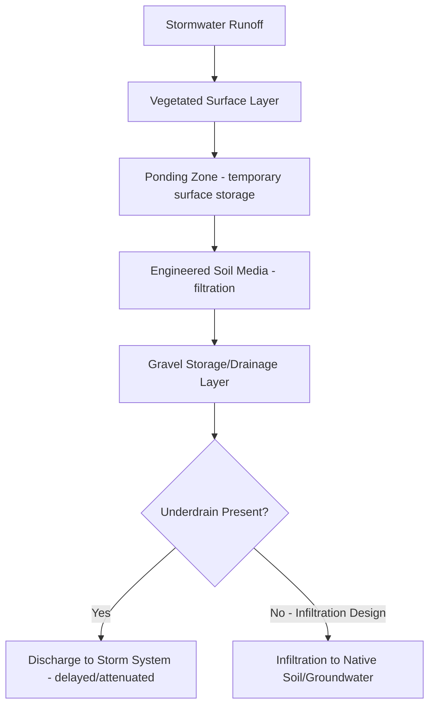
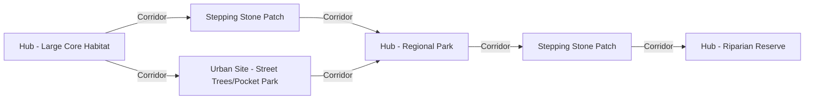

## Green Infrastructure and Urban Green Space

### Overview

Green infrastructure (GI) refers to a strategically planned and managed network of natural, semi-natural, and engineered green/blue elements designed to deliver ecosystem services within the built environment. Unlike conventional "grey" infrastructure, which relies on single-purpose engineered systems (pipes, culverts, HVAC), green infrastructure leverages natural or nature-mimicking processes to provide multiple co-benefits simultaneously — stormwater management, heat mitigation, biodiversity support, air quality improvement, and public health outcomes.

### Defining Green Infrastructure vs. Urban Green Space

**Key Points**

- **Green infrastructure** emphasizes function and network connectivity — how individual elements work together to deliver measurable services at a systems level.
- **Urban green space** more broadly denotes any vegetated land within a city (parks, gardens, cemeteries, street trees), regardless of whether it is engineered for a specific service or planned as part of a connected network.
- Not all green space qualifies as green infrastructure in the technical planning sense; an isolated ornamental garden may offer amenity value without contributing meaningfully to stormwater or connectivity functions.

### Typology of Green Infrastructure Elements

| Category | Elements | Primary Function |
| --- | --- | --- |
| Vegetative | Street trees, urban forests, green roofs, green walls | Shading, cooling, air filtration, carbon sequestration |
| Hydrological | Bioswales, rain gardens, constructed wetlands, permeable pavement | Stormwater infiltration, filtration, peak flow reduction |
| Structural/hybrid | Green roofs, blue roofs, tree pits with structural soil | Combined stormwater retention and thermal performance |
| Landscape-scale | Greenways, riparian buffers, urban forests, regional parks | Habitat connectivity, recreation, large-scale cooling |

### Stormwater Function: Core Design Mechanisms

**Bioretention Cells / Rain Gardens**

Bioretention systems use engineered soil media, plants, and often an underdrain to capture, filter, and infiltrate stormwater runoff.

The **water quality volume (WQV)** a bioretention cell must capture is commonly estimated as:

$$WQV = \frac{P \times R_v \times A}{12}$$

where $P$ is the design storm depth (inches), $R_v = 0.05 + 0.9I_a$ is the volumetric runoff coefficient as a function of impervious fraction $I_a$, and $A$ is contributing drainage area in acres, yielding $WQV$ in acre-feet.

**Permeable Pavement**

Permeable pavement systems (porous asphalt, pervious concrete, permeable interlocking pavers) allow water to infiltrate through the surface into an underlying stone reservoir layer, reducing runoff volume and providing some pollutant filtration through the aggregate base. Infiltration rate is governed by Darcy's Law for flow through porous media:

$$q = -K\frac{dh}{dz}$$

where $q$ is the specific discharge, $K$ is hydraulic conductivity of the media, and $dh/dz$ is the hydraulic gradient. [Inference] Long-term permeable pavement performance depends heavily on maintenance (periodic vacuum sweeping to prevent sediment clogging of surface pores); insufficiently maintained systems can see substantial infiltration capacity loss over several years.

### Green Roofs

Green roofs are classified by substrate depth and maintenance intensity:

| Type | Substrate Depth | Vegetation | Load/Maintenance |
| --- | --- | --- | --- |
| Extensive | 2–6 inches (5–15 cm) | Sedum, drought-tolerant groundcover | Low weight, minimal maintenance |
| Intensive | 6+ inches (15+ cm), often 12+ inches | Shrubs, trees, lawn, gardens | High weight, regular maintenance, often accessible |
| Semi-intensive | Intermediate | Mixed groundcover and small shrubs | Moderate weight and maintenance |

Standard green roof cross-section (from top down): vegetation layer → growing media/substrate → filter fabric → drainage layer → root barrier → waterproofing membrane → structural roof deck.

Green roof stormwater retention is typically expressed as a **retention coefficient**, the fraction of incident precipitation retained rather than discharged as runoff:

$$Retention (\%) = \frac{P_{in} - Q_{out}}{P_{in}} \times 100$$

[Unverified] Reported retention performance for extensive green roofs varies widely across studies and climates, commonly cited in the range of 40–80% of annual precipitation, with substantial dependence on substrate depth, antecedent moisture conditions, and storm event size; retention is typically much lower during large, high-intensity storm events when the substrate is already saturated.

### Urban Tree Canopy and Urban Forestry

Urban trees deliver disproportionately high service value relative to their footprint through combined shading, evapotranspiration, interception, and pollutant deposition functions.

**Canopy Interception**

$$I = S \times LAI \times (1 - e^{-k \cdot P})$$

where $I$ is interception storage, $S$ is storage capacity per unit leaf area, $LAI$ is leaf area index, $k$ is an extinction coefficient, and $P$ is precipitation depth — a simplified form of canopy interception models used in urban forestry hydrology software such as i-Tree Hydro.

**i-Tree Suite**

The USDA Forest Service's **i-Tree** software suite is the standard toolset for quantifying urban forest ecosystem services in the United States and increasingly internationally, including:

- **i-Tree Eco:** structural assessment (species composition, canopy cover, biomass) and service valuation (carbon storage/sequestration, pollution removal, stormwater interception)
- **i-Tree Hydro:** watershed-scale hydrological modeling comparing runoff with and without tree cover
- **i-Tree Canopy:** rapid canopy cover assessment via random point sampling of aerial imagery

[Inference] i-Tree valuations depend on regional environmental and economic parameters (local pollutant deposition velocities, electricity/heating costs, local removal cost benchmarks); results are most defensible when local calibration data is available rather than default national averages.

### Landscape-Scale Connectivity

**Greenways and Corridors**

Linear green infrastructure elements (greenways, riparian buffers, rail-trail conversions) serve dual recreational and ecological connectivity functions, linking otherwise isolated habitat patches.

**Green Infrastructure Network Planning**

Regional GI planning typically follows a hub-and-corridor model:

Connectivity is often quantified using **least-cost path analysis**, in GIS-based modeling, which identifies the lowest-resistance route between habitat patches based on a resistance surface reflecting land cover, road density, and other movement barriers.

### Urban Heat Mitigation Function

Green infrastructure cools urban environments through two primary physical mechanisms:

1. **Shading:** direct reduction of solar radiation reaching impervious surfaces, lowering surface and near-surface air temperatures
2. **Evapotranspiration:** latent heat flux from plant transpiration and soil evaporation converts sensible heat into latent heat, cooling the surrounding air

The relative cooling contribution can be expressed through the surface energy balance introduced in urban ecology:

$$Q^* + Q_F = Q_H + Q_E + \Delta Q_S$$

Green infrastructure interventions primarily act by increasing $Q_E$ (latent heat flux via evapotranspiration) and reducing $Q^*$ absorption at impervious surfaces (via shading), thereby lowering the residual $Q_H$ (sensible heat) driving elevated air temperatures.

### Policy and Regulatory Integration

**Stormwater Utility Fees and Incentives**

Many municipalities use **stormwater utility fees** based on a parcel's impervious area, with fee credits offered for on-site green infrastructure installation — creating a direct financial incentive for private-sector GI adoption.

**Green Infrastructure Ordinances**

- **Minimum green factor / green area ratio (GAR) requirements:** zoning codes requiring a minimum weighted score of green elements (canopy, permeable surface, green roof) per development parcel
- **Tree preservation and replacement ordinances:** mandating tree retention during development or replacement ratios for removed trees
- **Stormwater retention-on-site mandates:** requiring new development to retain a specified volume/depth of runoff on-site rather than discharging to municipal systems

### Green Infrastructure vs. Grey Infrastructure Cost-Effectiveness

| Factor | Green Infrastructure | Grey Infrastructure |
| --- | --- | --- |
| Capital cost | Often lower per unit stormwater managed at appropriate scale | Higher for equivalent capacity |
| Co-benefits | Habitat, cooling, aesthetics, air quality, mental health | Typically single-purpose |
| Lifespan/maintenance | Requires ongoing horticultural maintenance; performance can improve as vegetation matures | Predictable engineering lifespan with periodic replacement |
| Scalability | Distributed, modular, can be retrofit incrementally | Often requires large discrete capital projects |
| Failure mode | Gradual degradation, generally lower catastrophic failure risk | Can fail catastrophically (pipe collapse, overflow) |

[Inference] Life-cycle cost comparisons in the literature frequently favor GI when co-benefits are monetized and included, but comparisons that count only stormwater capture cost per unit volume are more mixed and sensitive to local land costs, since GI often requires more surface area per unit of stormwater managed than centralized grey infrastructure.

### Equity Considerations in Green Space Distribution

Urban green space is frequently distributed unevenly, correlating with income, race, and historical land-use patterns:

- **Park access disparities:** lower-income neighborhoods often have measurably less park acreage per capita and longer walking distances to green space
- **Canopy cover disparities:** historically redlined or disinvested neighborhoods frequently show lower tree canopy cover, compounding urban heat exposure
- **Green gentrification risk:** new GI investment (parks, greenways) in previously underserved neighborhoods can increase property values and displacement pressure absent complementary housing policy

[Inference] These equity patterns are documented across numerous studied cities, though the specific magnitude and underlying drivers (historical zoning, disinvestment, maintenance funding gaps) vary by municipality and require local data assessment rather than uniform assumption.

### Multifunctional Green Infrastructure Diagram

<svg xmlns="http://www.w3.org/2000/svg" viewBox="0 0 520 400" font-family="sans-serif">
<text x="260" y="20" text-anchor="middle" font-size="15" font-weight="bold">Bioswale Cross-Section: Multifunctional Design (svg_diagram)</text>

<rect x="20" y="230" width="480" height="130" fill="#c9a876" />
<rect x="20" y="150" width="150" height="80" fill="#999" />
<text x="95" y="195" text-anchor="middle" font-size="10" fill="white">Street/Sidewalk</text>
<rect x="350" y="150" width="150" height="80" fill="#999" />
<text x="425" y="195" text-anchor="middle" font-size="10" fill="white">Street/Sidewalk</text>

<path d="M 170 230 Q 260 180 350 230 L 350 360 L 170 360 Z" fill="#8d6e4a" />

<path d="M 190 235 Q 260 200 330 235 L 330 250 Q 260 220 190 250 Z" fill="#5fa8d3" opacity="0.7" />
<text x="260" y="245" text-anchor="middle" font-size="9">Ponding Zone</text>

<rect x="180" y="250" width="160" height="60" fill="#6b4f2a" />
<text x="260" y="285" text-anchor="middle" font-size="9" fill="white">Engineered Soil Media</text>

<rect x="180" y="310" width="160" height="30" fill="#a8a8a8" />
<text x="260" y="329" text-anchor="middle" font-size="9">Gravel Storage/Drainage</text>

<ellipse cx="260" cy="340" rx="12" ry="6" fill="none" stroke="black" stroke-width="1.5" />
<text x="260" y="358" text-anchor="middle" font-size="8">Underdrain</text>

<ellipse cx="210" cy="222" rx="8" ry="16" fill="#4caf50" />
<ellipse cx="240" cy="215" rx="8" ry="20" fill="#4caf50" />
<ellipse cx="270" cy="212" rx="8" ry="22" fill="#4caf50" />
<ellipse cx="300" cy="218" rx="8" ry="18" fill="#4caf50" />

<line x1="120" y1="230" x2="185" y2="240" stroke="#2255aa" stroke-width="2" marker-end="url(#arrow)" />
<line x1="400" y1="230" x2="335" y2="240" stroke="#2255aa" stroke-width="2" marker-end="url(#arrow)" />
<text x="260" y="385" text-anchor="middle" font-size="10" font-style="italic">Functions: stormwater capture, pollutant filtration, groundwater recharge, aesthetic/habitat value</text>

</svg>

### Practical Example: Green Infrastructure Retrofit Sizing

**Example**

A city block redevelopment must retain the first 1 inch of rainfall on-site per local ordinance. The site has 0.5 acres of new impervious surface (rooftop and parking).

1. Runoff coefficient for fully impervious surface: $R_v = 0.05 + 0.9(1.0) = 0.95$
2. Required retention volume: $WQV = (1 \times 0.95 \times 0.5)/12 = 0.0396$ acre-feet ≈ 1,725 ft³
3. If using bioretention cells with an assumed effective storage depth (ponding + void space in media/gravel) of 1.5 ft, required surface area: $1{,}725 / 1.5 = 1{,}150$ ft²
4. This could be distributed as multiple smaller cells (e.g., 3 cells of ~385 ft² each) integrated into parking lot islands and streetscape planters rather than a single large facility, improving both distributed hydrologic performance and streetscape amenity value

[Inference] Actual effective storage depth depends on media porosity, ponding depth allowed by curb height, and underdrain configuration; local design manuals typically specify standard media porosity assumptions (often around 0.3–0.4) that should replace this simplified estimate for permitting purposes.

### Conclusion

Green infrastructure operationalizes ecological function within urban form, converting stormwater management, heat mitigation, and habitat connectivity from separate engineering problems into an integrated, multifunctional network. Its effectiveness depends on treating GI elements as interconnected systems rather than isolated amenities, embedding them in binding policy and financing mechanisms (stormwater fees, zoning ratios, tree ordinances), and explicitly addressing the equity dimensions of green space distribution to avoid green infrastructure investment becoming a driver of displacement rather than broadly shared benefit.

**Related Topics**

- Low Impact Development (LID) and Sustainable Urban Drainage Systems (SuDS)
- i-Tree software applications for urban forestry valuation
- Urban heat island mitigation strategy design
- Green infrastructure financing mechanisms (stormwater utility fees, green bonds)
- Landscape connectivity modeling (least-cost path, circuit theory)
- Green gentrification and equitable green space policy
- Constructed wetlands for urban wastewater and stormwater treatment