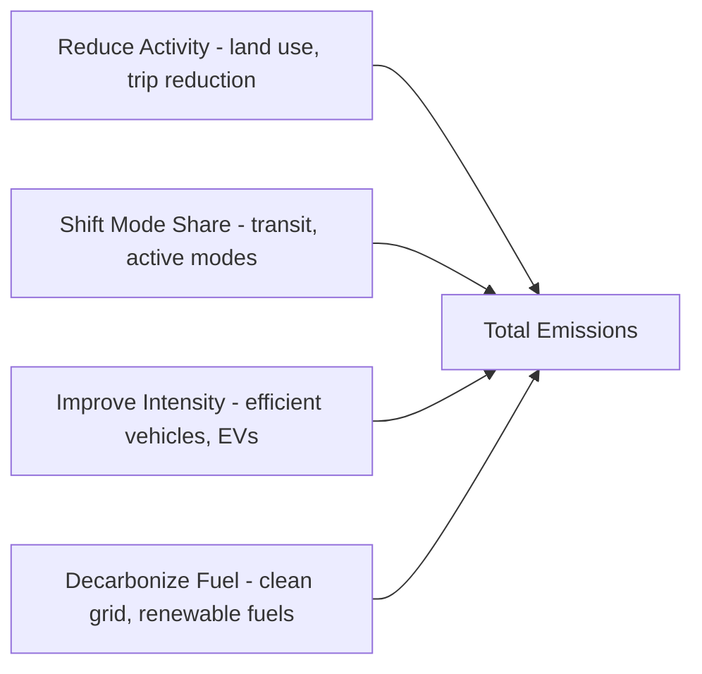
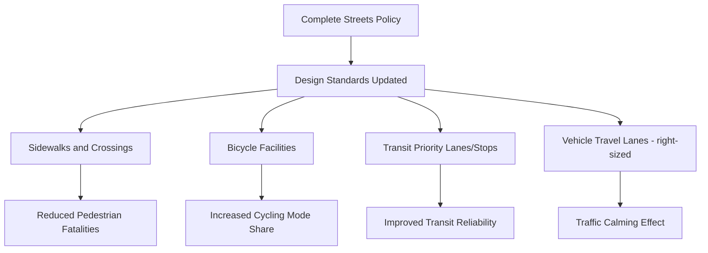

## Sustainable Transportation Planning

### Overview

Sustainable transportation planning designs mobility systems that reduce environmental impact, improve accessibility, and support equitable outcomes while maintaining economic vitality. It shifts planning priorities away from automobile throughput maximization toward multimodal accessibility, emissions reduction, and public health, integrating land use, engineering, behavioral economics, and environmental policy.

### Foundational Concepts

**Key Points**

- **Mobility vs. accessibility:** traditional transportation planning optimized for vehicle *mobility* (speed, throughput); sustainable planning prioritizes *accessibility* — the ease of reaching destinations regardless of mode.
- **Induced demand:** expanding road capacity tends to generate additional vehicle trips that fill the new capacity, a well-documented phenomenon limiting the long-term congestion relief from highway widening.
- **Mode shift hierarchy:** sustainable planning frameworks typically rank active transportation (walking, cycling) and transit above shared and private motorized modes in infrastructure investment priority.

The relationship underlying induced demand is often summarized through the **fundamental law of road congestion**, which observes that vehicle-kilometers traveled tends to increase roughly proportionally with lane-kilometers added, an empirical finding replicated across multiple metropolitan datasets. [Inference] The exact elasticity varies by study and context, but the qualitative direction — added capacity substantially eroding congestion relief over a period of years — is a well-supported finding in the transportation economics literature.

### Transportation Emissions Accounting

Transportation is typically one of the largest sources of urban greenhouse gas emissions. The basic emissions identity used in transportation planning follows the **ASIF framework**:

$$E = A \times S \times I \times F$$

where $E$ is total emissions, $A$ is activity (total travel demand, e.g., vehicle-kilometers traveled), $S$ is modal share (fraction of travel by each mode), $I$ is energy intensity (energy use per vehicle-kilometer by mode), and $F$ is the fuel emissions factor (emissions per unit energy for each fuel/mode).

This "Avoid-Shift-Improve" (ASI) framework structures policy intervention: **Avoid** unnecessary travel through land-use and trip-reduction strategies, **Shift** remaining travel to lower-carbon modes, and **Improve** the efficiency and carbon intensity of vehicles that remain in use.

### Land Use and Transportation Integration

**Transit-Oriented Development (TOD)**

TOD concentrates density, mixed use, and pedestrian-oriented design within walking distance of transit stations (typically 400–800 m), reducing the need for motorized trips and improving transit ridership viability. See the "5 Ds" framework (Density, Diversity, Design, Destination accessibility, Distance to transit).

**Jobs-Housing Balance**

Spatial mismatch between residential and employment locations drives longer commute distances. Planning metrics such as the **jobs-housing ratio** (jobs per employed resident within a defined geography) are used to identify imbalances that generate cross-commuting and induced vehicle travel.

**15-Minute City Concept**

A planning model proposing that residents should be able to meet most daily needs (work, education, healthcare, retail, recreation) within a 15-minute walk or bike ride from home, reducing motorized trip generation at the source. [Inference] Implementation feasibility varies substantially with existing urban density, land-use mix, and transit infrastructure; retrofitting low-density, single-use suburban areas into 15-minute city form typically requires long-term zoning reform rather than short-term infrastructure investment alone.

### Active Transportation Infrastructure

**Design Hierarchy for Cycling Infrastructure**

| Facility Type | Description | Typical Use Context |
| --- | --- | --- |
| Protected bike lane (cycle track) | Physically separated from vehicle traffic | High-speed/high-volume arterials |
| Buffered bike lane | Painted buffer without physical separation | Moderate-volume streets |
| Conventional bike lane | Painted lane, no separation | Lower-volume streets |
| Shared lane / sharrow | Shared vehicle-bicycle lane with markings | Very low-volume, low-speed streets |
| Off-street multi-use path | Fully separated path shared with pedestrians | Greenways, parks, corridors |

**Pedestrian Infrastructure Standards**

Design elements include minimum sidewalk width standards, curb extensions (bulb-outs) reducing crossing distance, pedestrian refuge islands at wide crossings, and leading pedestrian intervals (LPIs) at signalized intersections giving pedestrians a head start before conflicting vehicle turns are permitted.

### Complete Streets Policy Framework

**Complete streets** policies require that street design and operation accommodate all users — pedestrians, cyclists, transit riders, and motorists — rather than defaulting to automobile-centric design standards.

**Road Diets**

A common complete streets implementation tool, converting an oversized vehicle-travel-lane cross-section (e.g., a four-lane undivided road) into a reduced configuration (e.g., two through lanes, a center turn lane, and bike lanes), which typically reduces vehicle speeds and crash severity while adding capacity for other modes without significantly degrading vehicle throughput on moderate-volume corridors.

### Public Transit Planning

**Service Design Fundamentals**

Transit ridership is sensitive to service frequency, reliability, and coverage. The relationship between headway (time between vehicles) and effective wait time is approximated as:

$$W_{avg} = \frac{H}{2}$$

where $W_{avg}$ is average passenger wait time and $H$ is headway, under the simplifying assumption of random (non-scheduled) passenger arrivals — a reasonable approximation for high-frequency service (headways under ~10 minutes) where passengers do not consult schedules.

**Frequency vs. Coverage Trade-off**

Transit agencies typically face an explicit resource allocation trade-off between:

- **Frequency-oriented networks:** concentrating service on high-ridership corridors with short headways, maximizing total ridership
- **Coverage-oriented networks:** spreading service across a wider geographic area with lower frequency per route, maximizing the population within walking distance of some service

[Inference] Most transit agencies operate a blended strategy rather than a pure frequency or coverage model; the optimal balance depends on agency ridership goals, equity mandates, and funding constraints, and is typically a policy decision rather than a purely technical optimization.

**Bus Rapid Transit (BRT)**

BRT systems approximate rail-like service quality using buses through dedicated lanes, off-board fare collection, level boarding, and signal priority, at substantially lower capital cost than rail. Full BRT implementations (per standards such as the ITDP BRT Standard) require most or all of these features to achieve meaningful travel time and reliability gains over mixed-traffic bus service.

### Congestion Pricing and Travel Demand Management (TDM)

**Congestion Pricing**

Charges vehicles for road access in congested zones or times, internalizing the negative externality of congestion. Implemented systems (London's Congestion Charge, Stockholm's congestion tax, Singapore's Electronic Road Pricing) have generally demonstrated measurable reductions in traffic volume within priced zones alongside increased transit mode share.

**Parking Policy**

- **Minimum parking requirement elimination:** removing zoning mandates for minimum off-street parking per development, which otherwise subsidizes automobile use and increases development costs
- **Parking pricing/demand-responsive pricing:** dynamic pricing (e.g., San Francisco's SFpark program) targeting an occupancy rate (often ~85%) to reduce cruising for parking, a meaningful contributor to urban congestion and emissions in dense commercial districts

**Transportation Demand Management (TDM) Programs**

Employer-based and regional programs including transit subsidies, guaranteed ride home programs, carpool/vanpool matching, and telework policies, aimed at reducing single-occupancy vehicle trips without new infrastructure investment.

### Vehicle Electrification and Fuel Transition

**Key Points**

- Vehicle electrification addresses the "Improve" (intensity/fuel) component of the ASI framework but does not by itself reduce vehicle-kilometers traveled, congestion, or the land-use footprint of automobile infrastructure.
- Full lifecycle emissions benefits of electric vehicles depend on the carbon intensity of the electricity grid supplying charging infrastructure.

**Charging Infrastructure Planning**

| Charging Level | Power Range | Typical Use Case |
| --- | --- | --- |
| Level 1 (AC) | ~1.4 kW | Residential overnight charging |
| Level 2 (AC) | 3.3–19 kW | Residential, workplace, public destination charging |
| DC Fast Charging | 50–350+ kW | Highway corridor, rapid public charging |

[Inference] Municipal EV charging infrastructure planning typically prioritizes Level 2 charging at multi-unit residential buildings and workplaces (where vehicles dwell for hours) and DC fast charging along intercity corridors and high-turnover public locations, since charging speed requirements scale inversely with expected dwell time.

**Electrification Equity Considerations**

[Inference] EV adoption incentives (purchase rebates, HOV lane access) have historically skewed toward higher-income vehicle owners with access to home charging and off-street parking; equity-oriented electrification planning increasingly emphasizes public and multi-unit dwelling charging infrastructure and used-EV incentive programs to broaden access.

### Freight and Goods Movement

Urban freight generates a disproportionate share of transportation emissions and congestion relative to vehicle count, due to larger vehicle size and diesel engine emissions profiles.

**Sustainable Freight Strategies**

- **Off-hour delivery programs:** shifting freight deliveries to off-peak hours, reducing daytime congestion interaction
- **Urban consolidation centers (UCCs):** centralized facilities where freight is transferred from large trucks to smaller, often electric, last-mile delivery vehicles
- **Cargo bike delivery:** increasingly used for last-mile delivery in dense urban cores, particularly in European cities
- **Truck electrification and idling restrictions:** reducing point-source emissions concentrated near freight corridors and warehouses, which frequently overlap with environmental justice communities

### Health and Safety Integration: Vision Zero

**Vision Zero** is a road safety strategy, originating in Sweden, premised on the principle that no loss of life from traffic collisions is acceptable, and that road system design — not solely driver behavior — bears primary responsibility for crash outcomes. Core design principles include speed management (lower design speeds reduce both crash frequency and injury severity), physical separation of conflicting road users, and systematic crash data analysis to prioritize high-injury network segments.

The relationship between vehicle speed and pedestrian fatality risk in collisions is a frequently cited nonlinear curve: pedestrian fatality risk increases sharply above approximately 30 km/h (≈19 mph) impact speed. [Unverified] Specific fatality risk percentages at given speeds vary somewhat across studies depending on methodology and vehicle type (particularly with the rise of SUVs, which have different frontal geometry than the passenger vehicles used in older studies), but the qualitative nonlinear relationship — sharply increasing risk above roughly 30 km/h — is a consistent finding across the literature.

### Equity Dimensions in Transportation Planning

- **Transit deserts:** areas with population density sufficient to support transit service but lacking adequate service coverage or frequency
- **Transportation cost burden:** low-income households often face disproportionately high combined housing-plus-transportation cost burdens when affordable housing is located in car-dependent, transit-poor locations
- **Environmental justice and freight corridors:** low-income and minority communities are frequently sited near major freight corridors, ports, and warehousing districts, correlating with elevated air pollution exposure (particulate matter, NOx) from diesel truck traffic

[Inference] These equity patterns are broadly documented across multiple U.S. metropolitan studies in particular; specific magnitude and causal pathways (historical redlining, zoning, transit funding allocation formulas) vary by region and require local data assessment.

### Performance Metrics and Evaluation

| Metric | Definition | Use |
| --- | --- | --- |
| Vehicle Miles/Kilometers Traveled (VMT/VKT) | Total distance traveled by motor vehicles | Tracks overall driving demand and associated emissions |
| Mode share | Percentage of trips by each transportation mode | Tracks progress toward mode-shift goals |
| Level of Traffic Stress (LTS) | Classification of bicycle facility comfort/safety by traffic exposure | Bicycle network gap analysis |
| Transit ridership per revenue hour | Passengers carried per hour of scheduled service | Transit service efficiency and productivity |
| High-injury network | Road segments with disproportionate share of severe/fatal crashes | Prioritizes Vision Zero safety investment |

### Multimodal Corridor Design Diagram

<svg xmlns="http://www.w3.org/2000/svg" viewBox="0 0 560 300" font-family="sans-serif">
<text x="280" y="20" text-anchor="middle" font-size="15" font-weight="bold">Complete Street Cross-Section (svg_diagram)</text>

<rect x="20" y="60" width="520" height="180" fill="#e8e4d8" />

<rect x="20" y="60" width="60" height="180" fill="#b0b0b0" />
<text x="50" y="150" text-anchor="middle" font-size="9" transform="rotate(-90 50 150)">Sidewalk</text>

<rect x="80" y="60" width="25" height="180" fill="#7cb342" />

<rect x="105" y="60" width="35" height="180" fill="#4a90d9" />
<text x="122" y="150" text-anchor="middle" font-size="8" fill="white" transform="rotate(-90 122 150)">Bike Lane</text>

<rect x="140" y="60" width="50" height="180" fill="#d9a441" />
<text x="165" y="150" text-anchor="middle" font-size="8" transform="rotate(-90 165 150)">Transit Lane</text>

<rect x="190" y="60" width="70" height="180" fill="#666" />
<text x="225" y="150" text-anchor="middle" font-size="8" fill="white" transform="rotate(-90 225 150)">Travel Lane</text>

<rect x="260" y="60" width="40" height="180" fill="#8a8a5a" />
<text x="280" y="150" text-anchor="middle" font-size="8" fill="white" transform="rotate(-90 280 150)">Median</text>

<rect x="300" y="60" width="70" height="180" fill="#666" />
<text x="335" y="150" text-anchor="middle" font-size="8" fill="white" transform="rotate(-90 335 150)">Travel Lane</text>

<rect x="370" y="60" width="50" height="180" fill="#d9a441" />
<text x="395" y="150" text-anchor="middle" font-size="8" transform="rotate(-90 395 150)">Transit Lane</text>

<rect x="420" y="60" width="35" height="180" fill="#4a90d9" />
<text x="437" y="150" text-anchor="middle" font-size="8" fill="white" transform="rotate(-90 437 150)">Bike Lane</text>

<rect x="455" y="60" width="25" height="180" fill="#7cb342" />

<rect x="480" y="60" width="60" height="180" fill="#b0b0b0" />
<text x="510" y="150" text-anchor="middle" font-size="9" transform="rotate(-90 510 150)">Sidewalk</text>

<text x="280" y="270" text-anchor="middle" font-size="10" font-style="italic">All modes accommodated within right-of-way</text>

</svg>

### Practical Example: Mode Shift Emissions Calculation

**Example**

A city corridor carries 10,000 daily vehicle trips averaging 8 km each, at an average passenger car emissions factor of 180 g CO₂/km. A planned BRT line and protected bike lane are projected to shift 15% of trips to transit and 10% to cycling.

1. Baseline daily emissions: $10{,}000 \times 8 \times 180 = 14{,}400{,}000$ g CO₂ = 14,400 kg CO₂/day
2. Trips shifted to transit: $10{,}000 \times 0.15 = 1{,}500$ trips; assuming a transit emissions factor of 60 g CO₂/passenger-km (grid/fuel-dependent): $1{,}500 \times 8 \times 60 = 720{,}000$ g = 720 kg CO₂/day
3. Trips shifted to cycling: $10{,}000 \times 0.10 = 1{,}000$ trips at ~0 g CO₂/km direct emissions: 0 kg CO₂/day
4. Remaining vehicle trips: $10{,}000 \times 0.75 = 7{,}500$ trips: $7{,}500 \times 8 \times 180 = 10{,}800{,}000$ g = 10,800 kg CO₂/day
5. New daily total: $10{,}800 + 720 + 0 = 11{,}520$ kg CO₂/day, a reduction of approximately 20% from baseline

[Inference] This simplified calculation excludes induced demand effects (some cyclists/transit users may be new trips rather than diverted vehicle trips), transit vehicle emissions allocated per passenger-km depend heavily on ridership load and grid/fuel mix, and real-world mode shift percentages following infrastructure investment vary substantially by corridor context and are typically derived from travel demand models rather than assumed uniformly.

### Conclusion

Sustainable transportation planning reframes mobility policy around accessibility, emissions reduction, safety, and equity rather than automobile throughput alone. Effective implementation requires integrating land-use policy (reducing trip generation), infrastructure investment (enabling mode shift), pricing mechanisms (internalizing externalities), and vehicle/fuel transition (reducing per-trip emissions) as complementary rather than substitute strategies, while explicitly addressing the uneven distribution of transportation burdens and benefits across income and demographic lines.

**Related Topics**

- Induced demand and traffic evaluation methodology
- Bus Rapid Transit (BRT) system design standards
- Vision Zero road safety implementation
- Electric vehicle charging infrastructure planning
- Transportation equity and transit desert mapping
- Urban freight decarbonization strategies
- Congestion pricing policy design and public acceptance