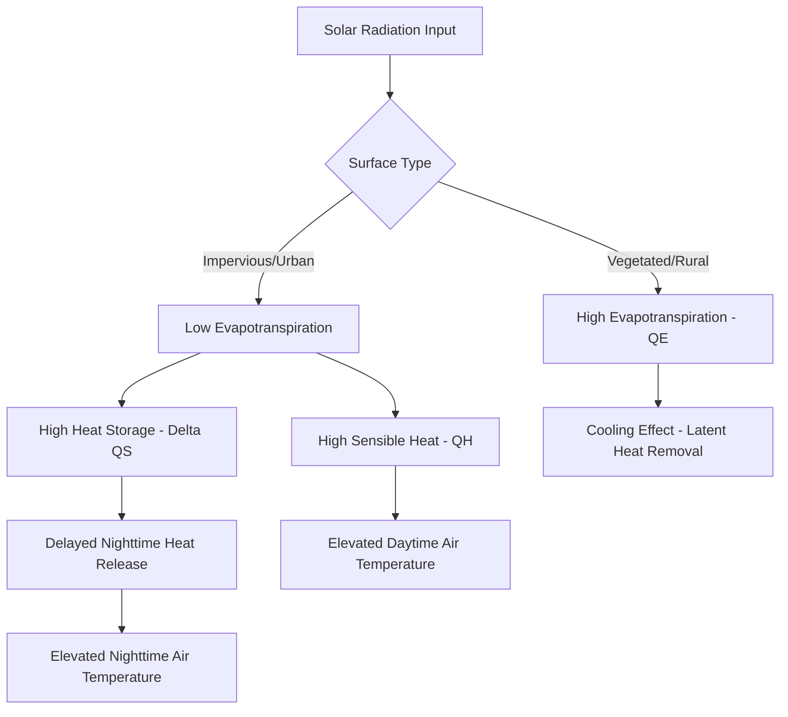
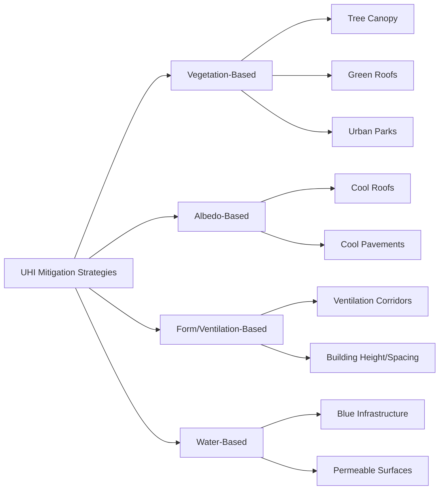

## The Urban Heat Island Effect

### Overview

The urban heat island (UHI) effect describes the phenomenon by which urban areas exhibit measurably higher temperatures than surrounding rural or less-developed areas, driven by land cover conversion, altered surface energy balances, and anthropogenic heat emissions. UHI is one of the most well-documented and spatially consistent forms of anthropogenic climate modification, observable at scales ranging from individual street canyons to entire metropolitan regions.

### Classification of Urban Heat Islands

**Key Points**

- **Surface Urban Heat Island (SUHI):** measured via land surface temperature (LST), typically from satellite thermal infrared sensors; generally strongest during daytime under clear-sky, low-wind conditions.
- **Atmospheric/Canopy-Layer Urban Heat Island (CUHI):** measured via near-surface air temperature (typically ~2 m height) within the urban canopy layer (below roof level); generally strongest at night.
- **Boundary-Layer Urban Heat Island:** occurs in the atmosphere above the urban canopy, extending up to roughly 1 km, typically most pronounced in the afternoon and influenced by regional wind patterns.

These three UHI types have different spatial patterns, timing, and measurement methods, and are frequently conflated in casual discussion despite requiring distinct monitoring approaches.

### Physical Mechanisms

**Surface Energy Balance Framework**

UHI formation is best understood through the urban surface energy balance:

$$Q^* + Q_F = Q_H + Q_E + \Delta Q_S$$

where $Q^*$ is net radiation, $Q_F$ is anthropogenic heat flux, $Q_H$ is sensible heat flux, $Q_E$ is latent heat flux (evapotranspiration), and $\Delta Q_S$ is net heat storage in the urban fabric.

**Contributing Physical Factors**

1. **Albedo reduction:** dark asphalt and roofing materials have lower albedo (reflectivity) than vegetated surfaces, absorbing more incoming shortwave radiation
2. **Thermal admittance and heat storage:** concrete, asphalt, and masonry have higher thermal mass and conductivity than soil and vegetation, storing more daytime heat and releasing it slowly after sunset — the primary driver of nighttime UHI intensity
3. **Reduced evapotranspiration:** impervious surfaces and reduced vegetation cover eliminate the latent heat sink ($Q_E$) that dominates energy dissipation in vegetated landscapes
4. **Urban canyon geometry:** the three-dimensional structure of buildings and streets traps longwave radiation through multiple reflections between building surfaces, reducing the effective **sky view factor** (the fraction of sky visible from a given point) and limiting radiative heat loss to space at night
5. **Anthropogenic heat flux ($Q_F$):** direct waste heat from vehicles, air conditioning systems, industrial processes, and building heating/cooling adds to the surface energy budget independent of solar input

[Inference] Among these factors, reduced nighttime radiative cooling due to urban canyon geometry (reduced sky view factor) and delayed heat release from high thermal mass materials are generally considered the dominant drivers of the canopy-layer UHI's characteristic nighttime intensity peak, though the relative contribution of each factor varies by city morphology, climate zone, and season.

### Measurement Methodologies

| Method | Measures | Resolution | Limitations |
| --- | --- | --- | --- |
| Fixed weather stations | Air temperature (canopy layer) | Point measurement, high temporal resolution | Sparse spatial coverage |
| Mobile transects | Air temperature along a driven/walked route | Moderate spatial, snapshot temporal | Time-of-day dependent, requires repeated sampling |
| Satellite thermal infrared (e.g., Landsat, MODIS) | Land surface temperature (SUHI) | High spatial (30m–1km), low temporal (daily-biweekly overpass) | Cloud-limited, measures surface not air temperature |
| Urban climate networks / crowdsourced sensors | Air temperature | Variable, increasingly dense | Sensor siting/calibration inconsistency |

[Unverified] SUHI intensity (from satellite LST) and CUHI intensity (from air temperature) do not always correlate strongly in magnitude or spatial pattern for a given city; a location with high LST due to exposed dark pavement may not show a correspondingly large air temperature anomaly, since air temperature integrates mixing and advection effects that surface temperature does not capture.

### Quantifying UHI Intensity

UHI intensity ($\Delta T_{u-r}$) is typically defined as the temperature difference between an urban reference point and a comparable rural or reference point:

\Delta T_{u-r} = T_{urban} - T_{rural}$}

**Key Explanatory Framework: Oke's Formula**

A widely cited empirical relationship (Oke, 1973 and subsequent refinements) relates maximum UHI intensity to urban geometry via the sky view factor or its inverse, the **height-to-width (H/W) ratio** of the urban canyon:

$$\Delta T_{max} \propto \ln(H/W)$$

Cities and districts with narrower streets and taller buildings (lower sky view factor, higher H/W ratio) tend to exhibit larger maximum nighttime UHI intensities, all else equal. [Inference] This relationship is a well-established empirical pattern across multiple studied cities, though the specific proportionality constant is city- and climate-dependent, and the relationship represents one contributing factor among several (also including population density, anthropogenic heat, and regional climate) rather than a complete predictive model on its own.

### Local Climate Zones (LCZ) Framework

The **Local Climate Zone (LCZ)** classification system, developed by Stewart and Oke, standardizes urban morphology categories for UHI research, replacing the ambiguous "urban vs. rural" binary with a structured typology based on surface cover, structure, and material properties:

| LCZ Type | Description | Typical Thermal Behavior |
| --- | --- | --- |
| LCZ 1–3 (Compact high/mid/low-rise) | Dense building coverage, minimal vegetation | High daytime and nighttime heat retention |
| LCZ 4–6 (Open high/mid/low-rise) | Moderate building coverage with more open space | Intermediate heat retention |
| LCZ 8 (Large low-rise) | Large footprint commercial/industrial, extensive paving | High daytime surface temperature |
| LCZ 9 (Sparsely built) | Low building density, natural land cover interspersed | Lower heat retention |
| LCZ A–G (Natural land covers) | Dense trees, scattered trees, water, bare soil, etc. | Reference/cooling conditions |

The LCZ framework allows UHI studies to be compared consistently across cities with differing baseline climates and urban forms, since it classifies by physical structure and materials rather than administrative urban/rural boundaries.

### Seasonal and Diurnal Patterns

**Diurnal Cycle**

- **Daytime:** SUHI (surface) intensity often peaks during daytime due to differential solar heating of dark impervious surfaces versus vegetated/moist surfaces; CUHI (air temperature) intensity is often comparatively muted or even reversed in some cities during peak daytime hours due to shading and turbulent mixing effects
- **Nighttime:** CUHI intensity typically peaks several hours after sunset, driven by delayed release of stored daytime heat and reduced radiative cooling under low sky view factor conditions

**Seasonal Variation**

[Inference] UHI intensity in many temperate and continental climate cities tends to be more pronounced during summer months, when anthropogenic heat from air conditioning use, higher solar input, and vegetation phenology (leaf-on canopy providing more differential shading/evapotranspiration relative to urban surfaces) combine; however, some cities exhibit stronger relative UHI signals in winter due to snow-albedo effects (rural snow cover strongly reflects radiation while urban surfaces and traffic keep snow cleared or melted), so seasonal patterns are climate-zone dependent rather than universal.

### Human Health Impacts

UHI compounds heat-related health risks by elevating both daytime peak temperatures and, critically, nighttime minimum temperatures, which limits the physiological recovery period the human body needs after daytime heat exposure.

- **Heat-related morbidity and mortality:** UHI-affected neighborhoods generally show measurably higher rates of heat-related emergency department visits and mortality during heat wave events compared to cooler areas of the same city
- **Compounding vulnerability factors:** elderly populations, individuals with pre-existing cardiovascular or respiratory conditions, and populations lacking access to air conditioning face disproportionate risk
- **Air quality interaction:** elevated urban temperatures accelerate photochemical reactions producing ground-level ozone, compounding respiratory health risks during heat events

[Inference] The specific mortality attribution to UHI versus regional heat wave conditions generally requires careful epidemiological study design (e.g., comparing hospitalization/mortality rates across neighborhoods with differing UHI intensity within the same heat wave event) to isolate the UHI-specific contribution from the broader heat wave signal.

### Environmental Justice Dimensions

UHI intensity is frequently distributed unevenly across socioeconomic and racial lines within cities:

- **Historical redlining correlation:** multiple U.S. studies have found that formerly redlined neighborhoods (historically disinvested through discriminatory 1930s-era mortgage lending maps) show measurably higher land surface temperatures today than formerly favorably-graded neighborhoods in the same city, correlating with lower current tree canopy cover and higher impervious surface fraction
- **Housing quality interaction:** lower-income housing stock often has less energy-efficient building envelopes and lower air conditioning access, compounding UHI exposure into actual indoor heat exposure risk

[Inference] The redlining-UHI correlation has been documented across numerous U.S. cities in peer-reviewed studies, though the specific causal pathway (direct effect of historical disinvestment versus confounding by present-day land use, tree canopy investment, and zoning) is an active area of urban climate justice research, and findings from U.S. cities may not directly generalize to cities with different historical planning and housing policy contexts.

### Mitigation Strategies

**Vegetation-Based Strategies**

- **Urban tree canopy expansion:** provides shading (reducing surface solar absorption) and evapotranspirative cooling; effectiveness depends on canopy density, species selection, and irrigation availability in water-limited climates
- **Green roofs:** reduce roof surface temperature and building cooling loads through combined shading, insulation, and evapotranspiration
- **Urban parks and green space networks:** create localized cooling "oases" with measurable temperature reduction extending into adjacent built areas (park cool island effect)

**Surface Albedo Modification**

- **Cool roofs:** high-solar-reflectance roofing materials or coatings reducing roof surface temperature and associated cooling energy demand
- **Cool/reflective pavements:** lighter-colored or specially engineered pavement coatings reducing pavement surface temperature; [Unverified] some studies note that increased pavement reflectivity can increase pedestrian-level radiant heat exposure by reflecting solar radiation onto nearby surfaces and people rather than absorbing it, making net pedestrian thermal comfort outcomes more complex than surface temperature reduction alone would suggest

**Urban Form and Ventilation**

- **Urban ventilation corridors:** preserving or designing open spaces and street orientations that facilitate airflow through dense urban areas, dispersing accumulated heat and pollutants
- **Sky view factor management:** building height and street width ratios calibrated to balance density goals against nighttime radiative cooling capacity

**Water-Based Cooling**

- **Blue infrastructure:** ponds, fountains, and constructed wetlands provide localized evaporative cooling
- **Permeable pavement with retained soil moisture:** supports evapotranspiration pathways otherwise eliminated by conventional impervious paving

### UHI Cross-Section Diagram

<svg xmlns="http://www.w3.org/2000/svg" viewBox="0 0 560 320" font-family="sans-serif">
<text x="280" y="20" text-anchor="middle" font-size="15" font-weight="bold">Urban Heat Island Temperature Profile (svg_diagram)</text>

<line x1="20" y1="220" x2="540" y2="220" stroke="black" stroke-width="2" />

<rect x="20" y="200" width="80" height="20" fill="#7cb342" />
<text x="60" y="235" text-anchor="middle" font-size="9">Rural</text>
<rect x="100" y="200" width="70" height="20" fill="#a3c957" />
<text x="135" y="235" text-anchor="middle" font-size="9">Suburban</text>
<rect x="170" y="200" width="60" height="20" fill="#c9b458" />
<text x="200" y="235" text-anchor="middle" font-size="8">Residential</text>
<rect x="230" y="200" width="80" height="20" fill="#888" />
<text x="270" y="235" text-anchor="middle" font-size="9">Commercial</text>
<rect x="310" y="200" width="90" height="20" fill="#666" />
<text x="355" y="235" text-anchor="middle" font-size="8">Urban Core/CBD</text>
<rect x="400" y="200" width="70" height="20" fill="#888" />
<text x="435" y="235" text-anchor="middle" font-size="9">Commercial</text>
<rect x="470" y="200" width="70" height="20" fill="#a3c957" />
<text x="505" y="235" text-anchor="middle" font-size="9">Park</text>

<path d="M 20 190 Q 100 185 135 175 Q 180 160 230 130 Q 280 105 355 95 Q 420 105 470 150 Q 505 170 540 195" fill="none" stroke="`#e05c3c`" stroke-width="3" />

<text x="60" y="180" text-anchor="middle" font-size="9" fill="`#e05c3c`">Baseline</text>

<text x="355" y="85" text-anchor="middle" font-size="9" fill="`#e05c3c`" font-weight="bold">Peak Temp (+3-7°C)</text>

<text x="505" y="160" text-anchor="middle" font-size="9" fill="`#e05c3c`">Park Cool Island</text>

<text x="280" y="280" text-anchor="middle" font-size="10" font-style="italic">Temperature profile follows building density and impervious surface fraction, with local dips over vegetated/park areas</text>

</svg>

### Practical Example: Estimating Cool Roof Cooling Load Reduction

**Example**

A commercial building with a 10,000 ft² dark roof (albedo ≈ 0.10) is retrofitted with a cool roof coating (albedo ≈ 0.65) in a hot climate. Using a simplified relationship between roof surface temperature and albedo under peak solar conditions:

1. Reduced solar absorption fraction: $\Delta \alpha = 0.65 - 0.10 = 0.55$
2. At a peak solar irradiance of ~1000 W/m² incident on the roof, the reduction in absorbed radiant heat flux is approximately: $\Delta Q \approx 1000 \times 0.55 = 550$ W/m²
3. Converting to total building-level reduction: $550 \text{ W/m}^2 \times 929 \text{ m}^2 \approx 511{,}000$ W ≈ 511 kW of reduced peak absorbed heat load at solar noon

[Inference] Not all of this reduced absorbed heat translates directly into reduced building cooling energy demand, since roof insulation levels, attic/plenum configuration, and HVAC system efficiency substantially mediate the relationship between reduced roof surface heat gain and actual cooling energy savings; documented cool roof cooling energy savings in the literature vary widely (commonly cited in a range of roughly 10–30% of roof-related cooling load) depending on climate, building type, and baseline roof condition.

### Conclusion

The urban heat island effect is a well-established, physically grounded consequence of land cover conversion, materials selection, and urban form, driven principally by reduced evapotranspiration, increased heat storage, and altered radiative geometry. Its uneven distribution across neighborhoods — closely tied to historical disinvestment patterns in many cities — makes UHI mitigation both a climate adaptation priority and an environmental justice issue. Effective mitigation requires combining vegetation-based, albedo-based, and urban form strategies tailored to local climate and morphology, guided by standardized measurement frameworks such as Local Climate Zones to ensure mitigation investments are targeted and their effectiveness can be rigorously evaluated.

**Related Topics**

- Local Climate Zone (LCZ) classification methodology
- Heat wave early warning systems and public health response
- Cool roof and cool pavement material science
- Urban tree canopy equity and redlining research
- Building energy codes and cooling load reduction strategies
- Urban ventilation corridor planning
- Climate-resilient urban design standards