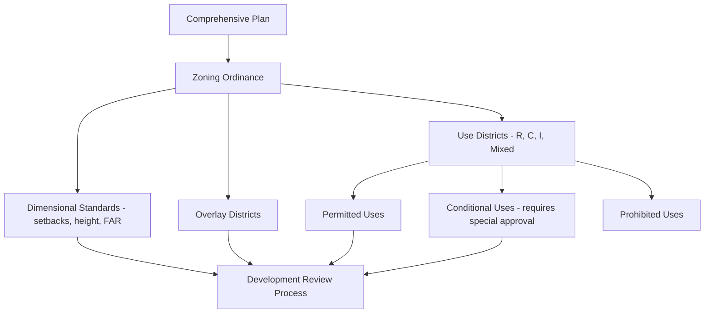

## Smart Growth and Land Use Zoning

### Overview

Smart growth is a land-use planning approach that concentrates development within existing urban footprints to reduce sprawl, preserve open space, and support multimodal transportation, while land use zoning is the regulatory instrument through which municipalities implement such growth patterns. Together they form the primary legal and design framework through which environmental planning goals are translated into enforceable development standards.

### Foundational Principles of Smart Growth

**Key Points**

- Smart growth emerged in the 1990s as a policy response to the environmental, fiscal, and social costs associated with low-density, automobile-dependent suburban sprawl.
- Core smart growth principles, as codified by organizations such as the U.S. EPA and Smart Growth America, include mixed land uses, compact building design, walkability, housing choice, and preservation of open space and critical environmental areas.
- Smart growth is distinct from simple densification; it emphasizes *where* and *how* growth occurs (infill, transit corridors, existing infrastructure) rather than simply increasing density uniformly.

The ten commonly cited smart growth principles include: mixing land uses; taking advantage of compact building design; creating housing opportunities and choices; creating walkable neighborhoods; fostering distinctive, attractive communities with a strong sense of place; preserving open space, farmland, and critical environmental areas; strengthening existing communities and directing development toward them; providing a variety of transportation choices; making development decisions predictable, fair, and cost-effective; and encouraging community and stakeholder collaboration.

### The Zoning System: Historical and Legal Foundation

**Euclidean Zoning**

Conventional zoning, termed **Euclidean zoning** after the 1926 U.S. Supreme Court case *Village of Euclid v. Ambler Realty Co.*, established the constitutional validity of municipal zoning as a legitimate exercise of police power to protect public health, safety, and welfare. Euclidean zoning divides land into use-based districts (residential, commercial, industrial) with associated dimensional standards (setbacks, height limits, lot coverage).

[Inference] Euclidean zoning's rigid separation of uses is widely credited in planning literature as a structural driver of automobile dependency, since single-use districts by design require motorized trips to connect residential areas with commercial, employment, and civic destinations that a mixed-use pattern would place within walking distance.

### Zoning Reform Tools for Smart Growth

**Form-Based Codes**

Form-based codes (FBCs) regulate building form, scale, and street relationship rather than land use category, on the premise that physical form — not use — most directly shapes walkability, character, and public realm quality. FBCs typically specify building placement (build-to lines rather than setbacks), height and massing envelopes, and frontage types (storefront, stoop, porch), while permitting a wide range of uses within a given form district.

**Mixed-Use Zoning**

Mixed-use districts permit residential, commercial, and sometimes light-industrial uses within the same zoning district or even the same building (vertical mixed use, e.g., ground-floor retail with upper-floor residential), reducing trip generation and supporting walkability.

**Overlay Districts**

Overlay zones apply additional regulations on top of an underlying base zoning district without replacing it, commonly used for:

- **Transit-oriented development (TOD) overlays:** density bonuses and reduced parking requirements near transit stations
- **Environmental overlays:** floodplain, wetland buffer, or steep slope protection standards
- **Historic preservation overlays:** design review requirements protecting historic character

**Planned Unit Developments (PUDs)**

PUDs allow developers to propose a customized mix of uses, densities, and site design in exchange for public benefits (open space dedication, affordable housing, infrastructure contributions), offering flexibility beyond rigid Euclidean district standards for larger parcels.

### Density and Intensity Regulation Tools

| Tool | Mechanism | Smart Growth Application |
| --- | --- | --- |
| Floor Area Ratio (FAR) | Ratio of total building floor area to lot area | Controls building bulk/intensity independent of height |
| Minimum density requirements | Mandates a floor on residential units per acre | Prevents underbuilding near transit/infrastructure investment |
| Density bonuses | Additional allowable density in exchange for public benefit | Incentivizes affordable housing, green building, TOD |
| Transfer of Development Rights (TDR) | Allows unused development rights to be sold from a "sending" (preservation) parcel to a "receiving" (growth) parcel | Directs development away from sensitive land toward designated growth areas |
| Urban Growth Boundaries (UGBs) | Legally defined limit on outward urban expansion | Constrains sprawl, focuses investment within the boundary |

**Floor Area Ratio (FAR) Calculation**

$$FAR = \frac{\text{Total Building Floor Area}}{\text{Lot Area}}$$

A FAR of 2.0 on a 10,000 ft² lot permits a maximum total floor area of 20,000 ft², which could be distributed as, for example, a 2-story building covering the full lot or a 4-story building covering half the lot, giving zoning codes flexibility to control bulk without dictating exact building form.

### Parking Reform

Minimum parking requirements embedded in conventional zoning codes have been identified as a significant, if often overlooked, driver of low-density, auto-oriented development patterns, since off-street parking minimums consume land, increase development costs, and can preclude walkable urban form at required ratios.

**Smart Growth Parking Reforms**

- **Parking maximums** replacing minimums in transit-accessible areas
- **Shared parking agreements** allowing adjacent uses with different peak demand periods (e.g., office and residential) to share a single parking facility
- **Unbundling parking costs** from housing costs, allowing residents to opt out of paying for parking they do not need
- **Elimination of minimum parking requirements** entirely, an increasingly adopted reform in cities such as Minneapolis and Buffalo, allowing the market to determine appropriate parking supply

[Inference] Parking minimum elimination has generally been associated in studied cities with reduced per-unit parking construction and modestly increased housing production, though the magnitude of effect depends on complementary transit access, local market conditions, and lending/financing practices that may still require parking regardless of zoning mandate.

### Growth Management Tools

**Urban Growth Boundaries (UGBs)**

UGBs legally delineate the outer limit of urban development, directing growth inward through infill and redevelopment rather than outward conversion of agricultural or natural land. Oregon's statewide UGB requirement (established under Senate Bill 100, 1973) is among the most well-documented long-running implementations, requiring all incorporated cities to maintain a UGB reviewed periodically against projected land need.

**Adequate Public Facilities Ordinances (APFOs) / Concurrency Requirements**

Concurrency management requires that adequate infrastructure capacity (roads, schools, water/sewer, sometimes stormwater) exist or be committed concurrently with new development approval, preventing development from outpacing infrastructure capacity — used prominently in Florida's growth management framework.

**Agricultural and Conservation Easements**

Permanent or long-term legal restrictions on land use, often voluntarily granted by landowners (frequently in exchange for tax benefits or direct payment through Purchase of Development Rights programs), that preclude development to preserve farmland, forest, or other open space in perpetuity.

### Housing Policy Integration

**Inclusionary Zoning**

Requires or incentivizes a percentage of units in new residential development to be affordable to low- or moderate-income households, addressing the risk that smart growth-driven density and transit investment increases land values and displaces existing lower-income residents.

**Accessory Dwelling Units (ADUs)**

Zoning reforms permitting secondary housing units on single-family lots (e.g., garage conversions, backyard cottages) as a "gentle density" tool, increasing housing supply and diversity within existing single-family neighborhoods without wholesale rezoning to higher-density districts.

**Missing Middle Housing**

Refers to housing typologies — duplexes, triplexes, fourplexes, townhouses, small-scale multifamily buildings — that occupy a density range between single-family detached homes and large apartment complexes, historically restricted by single-family exclusive zoning in many North American cities. Zoning reforms eliminating single-family-only districts (e.g., statewide reforms in Oregon and California) aim to legalize this "missing middle" typology.

### Environmental Rationale for Smart Growth

**Reduced Vehicle Miles Traveled (VMT) and Emissions**

Compact, mixed-use development with transit access reduces per-capita VMT relative to comparable low-density sprawl development, directly reducing transportation-sector greenhouse gas emissions — one of the most consistently documented environmental benefits attributed to smart growth land-use patterns across the planning research literature.

**Reduced Land Conversion and Habitat Fragmentation**

Directing growth into existing urban footprints reduces conversion of agricultural land, forest, and wildlife habitat at the urban fringe, preserving landscape-scale ecological connectivity that sprawling development patterns fragment.

**Reduced Impervious Surface Growth**

Infill development on already-impervious parcels generates less net new impervious surface per unit of development than equivalent greenfield construction, reducing incremental stormwater runoff and associated water quality impacts.

**Infrastructure Efficiency**

Compact development reduces the per-capita length of roads, water/sewer lines, and other linear infrastructure required to serve a given population, reducing both capital and long-term maintenance costs alongside the embodied environmental impact of infrastructure construction and materials.

[Inference] These environmental benefits are generally well-supported directionally in the planning and environmental research literature, though the magnitude of benefit for any specific project or region depends on complementary factors — particularly whether transit service, walkability, and mixed-use conditions are genuinely achieved rather than density alone being increased without these supporting elements.

### Critiques and Implementation Challenges

- **Displacement and gentrification risk:** smart growth investment (transit, mixed-use redevelopment) in previously disinvested areas can increase property values and displace existing lower-income residents absent explicit anti-displacement policy pairing
- **NIMBYism and political resistance:** density increases and missing-middle housing reforms frequently face significant local political opposition, particularly in established single-family neighborhoods
- **Implementation gap:** [Inference] jurisdictions may adopt smart growth-labeled comprehensive plans without corresponding zoning code reform, resulting in a persistent mismatch between stated planning goals and actual, legally binding development regulations — a documented pattern in numerous municipal case studies
- **Regional coordination challenges:** smart growth tools implemented at the municipal level can be undermined by neighboring jurisdictions maintaining sprawl-permissive zoning, since metropolitan housing and labor markets typically span multiple municipal boundaries

### Land Use and Zoning Diagram

<svg xmlns="http://www.w3.org/2000/svg" viewBox="0 0 540 360" font-family="sans-serif">
<text x="270" y="20" text-anchor="middle" font-size="15" font-weight="bold">Smart Growth Zoning Pattern (svg_diagram)</text>

<circle cx="270" cy="200" r="150" fill="none" stroke="#d32f2f" stroke-width="3" stroke-dasharray="8,4" />
<text x="270" y="45" text-anchor="middle" font-size="10" fill="#d32f2f">Urban Growth Boundary</text>

<rect x="10" y="40" width="520" height="320" fill="#c8e6c9" opacity="0.3" />
<text x="440" y="345" text-anchor="middle" font-size="9" fill="#2e7d32">Preserved Farmland/Open Space</text>

<line x1="120" y1="200" x2="420" y2="200" stroke="#555" stroke-width="4" />
<text x="270" y="215" text-anchor="middle" font-size="9">Transit Corridor</text>

<circle cx="200" cy="200" r="35" fill="#8d6e63" />
<text x="200" y="195" text-anchor="middle" font-size="8" fill="white">Mixed-Use</text>
<text x="200" y="207" text-anchor="middle" font-size="8" fill="white">TOD Core</text>
<circle cx="340" cy="200" r="35" fill="#8d6e63" />
<text x="340" y="195" text-anchor="middle" font-size="8" fill="white">Mixed-Use</text>
<text x="340" y="207" text-anchor="middle" font-size="8" fill="white">TOD Core</text>

<circle cx="200" cy="200" r="60" fill="none" stroke="#a1887f" stroke-width="18" opacity="0.5" />
<circle cx="340" cy="200" r="60" fill="none" stroke="#a1887f" stroke-width="18" opacity="0.5" />
<text x="200" y="270" text-anchor="middle" font-size="8">Missing Middle</text>
<text x="340" y="270" text-anchor="middle" font-size="8">Missing Middle</text>

<circle cx="270" cy="200" r="145" fill="none" stroke="#c5e1a5" stroke-width="10" opacity="0.6" />
<text x="270" y="335" text-anchor="middle" font-size="8">Lower-Density Residential</text>

<rect x="20" y="60" width="10" height="10" fill="#8d6e63" />
<text x="35" y="69" font-size="8">TOD Core (High Density Mixed-Use)</text>
<rect x="20" y="75" width="10" height="10" fill="#a1887f" opacity="0.5" />
<text x="35" y="84" font-size="8">Missing Middle Transition</text>
</svg>

### Practical Example: TDR Program Calculation

**Example**

A regional TDR program aims to preserve 500 acres of farmland by transferring development rights to a designated urban growth area. The base zoning allows 1 dwelling unit per 5 acres in the agricultural sending area, and the receiving area zoning permits a base density of 10 units/acre with a TDR bonus allowing up to 15 units/acre.

1. Development rights available from sending area: $500 \text{ acres} / 5 \text{ acres per unit} = 100$ development rights (dwelling units)
2. Receiving area base capacity (per acre at base zoning): 10 units/acre
3. With TDR bonus applied, up to 15 units/acre — an increase of 5 units/acre attributable to purchased TDR credits
4. To accommodate all 100 transferred rights at the +5 units/acre bonus increment: $100 / 5 = 20$ acres of receiving-area land needed to fully utilize the transferred development rights

[Inference] Actual TDR program mechanics (credit ratios, sending/receiving area eligibility, banking provisions) vary substantially by jurisdiction; this example illustrates the basic mathematical logic of rights transfer rather than a specific program's binding formula, and local ordinance text should be consulted for actual program implementation.

### Conclusion

Smart growth and land use zoning together constitute the regulatory backbone of environmentally sustainable urban development, translating planning principles (compactness, mixed use, walkability, preservation) into legally enforceable district standards, density controls, and growth management tools. Their environmental effectiveness depends on moving beyond conventional Euclidean separation of uses toward form-based, mixed-use, and density-calibrated frameworks, while explicit anti-displacement and affordable housing policy integration determines whether the resulting environmental and fiscal benefits are equitably distributed rather than concentrated among higher-income residents able to access newly desirable, transit-served neighborhoods.

**Related Topics**

- Form-based codes and design guideline standards
- Transfer of Development Rights (TDR) program design
- Inclusionary zoning and affordable housing policy
- Urban Growth Boundary case studies (Oregon, Portland Metro)
- Missing middle housing and single-family zoning reform
- Transit-oriented development density calculations
- Comprehensive planning and zoning consistency requirements