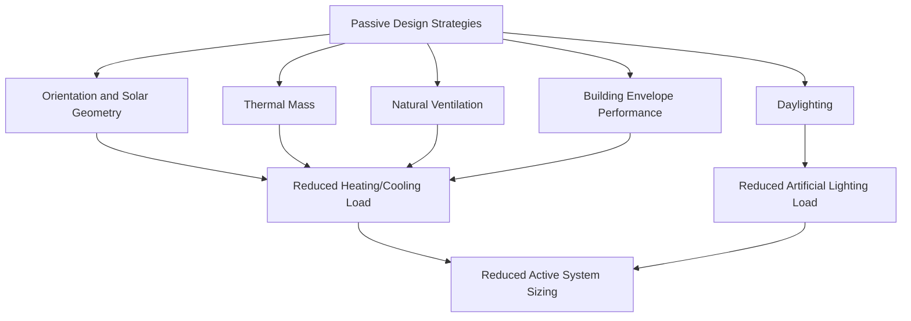
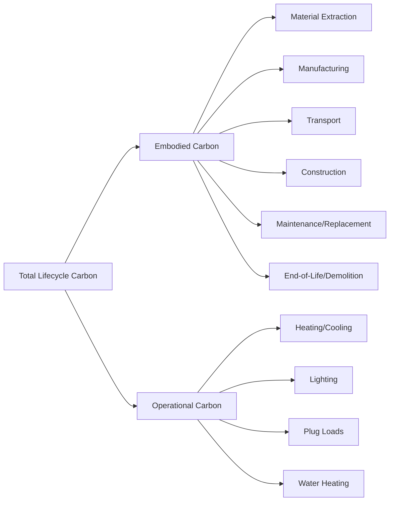

## Green Building and Sustainable Architecture

### Overview

Green building and sustainable architecture integrate environmental performance considerations — energy efficiency, water conservation, material selection, indoor environmental quality, and site ecology — into the design, construction, operation, and eventual deconstruction of buildings. The field applies building science, materials engineering, and environmental design principles to reduce a building's lifecycle environmental footprint while maintaining or improving occupant health, comfort, and productivity.

### Core Design Principles

**Key Points**

- **Whole-building, lifecycle thinking:** sustainable design evaluates a building across its full lifecycle — material extraction, manufacturing, construction, operation, and end-of-life — rather than optimizing a single phase (e.g., operational energy) in isolation.
- **Passive-before-active hierarchy:** design decisions that reduce loads through building form, orientation, and envelope performance are prioritized before relying on mechanical systems to compensate for a poorly designed building.
- **Integrated design process (IDP):** sustainable buildings typically require early collaboration among architects, engineers, and other disciplines, since decisions made early in design (orientation, massing, envelope) constrain the effectiveness of later mechanical and material choices.

### Passive Design Strategies

**Building Orientation and Solar Geometry**

Building orientation relative to solar path is a foundational passive design decision, affecting solar heat gain, daylighting potential, and passive cooling opportunities. In the Northern Hemisphere, south-facing glazing (with appropriate shading) maximizes winter solar heat gain while properly designed overhangs can exclude higher-angle summer sun.

**Solar Heat Gain and Shading Geometry**

The optimal overhang depth for excluding high summer sun while admitting lower-angle winter sun is calculated using solar altitude angles:

$$D = \frac{H}{\tan(\alpha)}$$

where $D$ is the overhang projection depth, $H$ is the height from the window head to the overhang, and $\alpha$ is the solar altitude angle at the design condition (typically calculated for summer solstice at solar noon for the building's latitude).

**Thermal Mass**

High thermal mass materials (concrete, masonry, stone) absorb and store heat during the day and release it during cooler periods, damping indoor temperature swings — particularly effective in climates with large diurnal temperature ranges. The heat storage relationship follows:

$$Q_{stored} = m \cdot c_p \cdot \Delta T$$

where $Q_{stored}$ is stored thermal energy, $m$ is mass, $c_p$ is specific heat capacity of the material, and $\Delta T$ is the temperature change.

**Natural Ventilation**

Passive cooling through natural airflow relies on either **stack ventilation** (buoyancy-driven, warm air rising and exiting through high openings while cooler air enters low openings) or **cross ventilation** (wind-driven, pressure differential between windward and leeward building faces). Stack ventilation flow rate is approximated as:

$$Q = C_d \cdot A \cdot \sqrt{2gh\frac{\Delta T}{T}}$$

where $Q$ is airflow rate, $C_d$ is a discharge coefficient, $A$ is the effective opening area, $g$ is gravitational acceleration, $h$ is the height difference between inlet and outlet openings, $\Delta T$ is the temperature difference between indoor and outdoor air, and $T$ is absolute indoor temperature.

### Building Envelope Performance

**Thermal Transmittance (U-value) and Insulation**

The overall heat transfer coefficient (U-value) of a building envelope assembly is the inverse of total thermal resistance:

$$U = \frac{1}{R_{total}} = \frac{1}{\sum R_i}$$

where $R_i$ is the thermal resistance of each material layer in the assembly (insulation, sheathing, air gaps, finishes). Lower U-values (higher R-values) indicate better insulating performance and reduced conductive heat transfer.

**Air Sealing and Infiltration Control**

Uncontrolled air leakage through envelope gaps and penetrations represents a significant source of heating/cooling load in many buildings, addressed through continuous air barrier systems and building airtightness testing, commonly reported as **air changes per hour at 50 Pascals (ACH50)** via blower door testing.

**High-Performance Glazing**

Modern glazing systems balance three competing performance metrics:

- **U-factor:** overall thermal transmittance of the window assembly
- **Solar Heat Gain Coefficient (SHGC):** fraction of incident solar radiation transmitted through the window as heat, ranging 0–1
- **Visible Transmittance (VT):** fraction of visible light transmitted, affecting daylighting potential

[Inference] Optimal SHGC and VT values are climate- and orientation-specific rather than universal; a high-SHGC glazing beneficial for passive solar heating in a cold, heating-dominated climate would be counterproductive on a south or west-facing façade in a cooling-dominated climate, so glazing specification requires climate-zone-specific analysis rather than a single "best" product.

### Energy Systems and Net-Zero Design

**Load Reduction Before Supply**

Sustainable building energy strategy follows a standard hierarchy: reduce loads through passive design and envelope performance first, then maximize system efficiency, and finally meet remaining demand with on-site or off-site renewable generation.

**Net-Zero Energy Buildings (NZEB)**

A net-zero energy building produces, on an annual basis, as much renewable energy as it consumes:

$$E_{generated} \geq E_{consumed} \text{ (annual basis)}$$

Achieving NZEB status typically requires an aggressive envelope performance target (often approaching Passive House standards) combined with on-site photovoltaic generation sized to match remaining annual demand.

**Passive House (Passivhaus) Standard**

An internationally recognized ultra-low-energy building standard originating in Germany, characterized by extremely low space heating/cooling demand achieved through superinsulation, airtight construction (typically ≤0.6 ACH50), elimination of thermal bridging, high-performance windows, and balanced mechanical ventilation with heat recovery (MVHR/ERV) to maintain indoor air quality without the energy penalty of uncontrolled infiltration.

### Water Efficiency in Building Design

- **Low-flow fixtures:** reduced-flow toilets, faucets, and showerheads reducing potable water demand without compromising function
- **Greywater recycling:** reuse of relatively lightly contaminated wastewater (from sinks, showers, laundry) for non-potable applications such as toilet flushing or irrigation
- **Rainwater harvesting:** collection and storage of roof runoff for non-potable or, with adequate treatment, potable reuse
- **Water-efficient landscaping (xeriscaping):** selection of drought-tolerant, regionally appropriate plant species reducing irrigation demand

### Materials and Embodied Carbon

**Embodied vs. Operational Carbon**

Building lifecycle emissions are typically divided into two categories:

- **Operational carbon:** emissions from energy consumed during building operation (heating, cooling, lighting, plug loads) over its service life
- **Embodied carbon:** emissions associated with material extraction, manufacturing, transport, construction, maintenance, and eventual demolition/disposal

[Inference] As building operational energy efficiency has improved industry-wide, embodied carbon has become a proportionally larger share of total lifecycle emissions for many new high-performance buildings, shifting research and policy attention toward material selection and construction methods; the specific proportional split between embodied and operational carbon varies substantially by building type, service life assumption, and regional grid carbon intensity.

**Life Cycle Assessment (LCA)**

LCA quantifies environmental impacts across a product or building's life stages, standardized under ISO 14040/14044, typically reported through an **Environmental Product Declaration (EPD)** for individual building materials, covering impact categories such as global warming potential (GWP), typically expressed in kg CO₂-equivalent.

**Sustainable Material Selection Criteria**

- **Low embodied carbon materials:** mass timber (cross-laminated timber, glulam) as a substitute for steel/concrete in appropriate structural applications, given wood's carbon sequestration during growth (though full lifecycle accounting must include forestry practices and end-of-life treatment)
- **Recycled content:** materials incorporating post-consumer or post-industrial recycled content, reducing virgin material extraction
- **Regional/local sourcing:** reducing transportation-associated emissions and supporting regional material economies
- **Rapidly renewable materials:** bamboo, cork, and similar materials with short regeneration cycles relative to conventional timber
- **Design for disassembly:** construction detailing (mechanical rather than adhesive fastening, material separation) enabling future material recovery and reuse rather than demolition-and-landfill

### Indoor Environmental Quality (IEQ)

**Ventilation and Indoor Air Quality**

Adequate outdoor air ventilation rates (commonly referenced against ASHRAE Standard 62.1/62.2) dilute indoor-generated pollutants (CO₂, VOCs, particulates) to maintain acceptable indoor air quality, balanced against the energy penalty of conditioning increased outdoor air volumes — a balance increasingly addressed through heat/energy recovery ventilation systems that pre-condition incoming outdoor air using exhaust air energy.

**Low-Emitting Materials**

Selection of adhesives, sealants, paints, and finishes with low or zero volatile organic compound (VOC) content reduces off-gassing that contributes to indoor air pollution and occupant health complaints (sick building syndrome symptoms).

**Daylighting and Circadian Design**

Well-designed daylighting reduces electric lighting energy demand while supporting occupant circadian rhythm regulation and reported wellbeing; design tools include daylight factor calculations, glare analysis, and increasingly, dynamic daylighting simulation software.

### Green Building Certification Systems

| System | Scope | Notable Features |
| --- | --- | --- |
| LEED (Leadership in Energy and Environmental Design) | Widely used internationally, multiple rating systems (New Construction, Existing Buildings, Neighborhood Development) | Points-based credit system across categories (energy, water, materials, IEQ, site) |
| BREEAM | UK-originated, internationally used | Similar points-based structure, strong emphasis on management and ecology credits |
| Living Building Challenge (LBC) | Performance-based, most stringent widely used standard | Requires actual verified performance (net-zero energy/water) over a 12-month operational period rather than modeled compliance |
| WELL Building Standard | Focused specifically on human health and wellness outcomes | Air, water, light, nourishment, fitness, comfort, mind categories |
| Passive House (PHIUS/Passivhaus) | Energy-focused, prescriptive and performance targets | Extremely low space conditioning energy demand |
| EDGE (Excellence in Design for Greater Efficiencies) | IFC/World Bank Group program, emphasis on emerging markets | Streamlined resource efficiency certification |

[Unverified] Certification achievement and actual measured operational performance do not always correlate strongly across studied building portfolios — the "performance gap" between modeled/certified design intent and real-world operational energy use is a documented phenomenon attributed to factors including occupant behavior, commissioning quality, and modeling assumptions, though the magnitude of this gap varies substantially across studies, building types, and certification systems.

### Site and Landscape Integration

- **Site ecology preservation:** minimizing site disturbance, protecting existing mature trees and natural drainage patterns during construction
- **Stormwater management integration:** on-site bioretention, green roofs, and permeable surfaces reducing runoff and supporting groundwater recharge (see Green Infrastructure)
- **Heat island reduction:** high-albedo roofing and paving, shade tree placement, and reduced parking footprint addressing site-level urban heat island contribution
- **Habitat and biodiversity credits:** some certification systems award credit for native landscaping, green roof habitat provision, or bird-safe glazing design

### Building Systems Diagram

<svg xmlns="http://www.w3.org/2000/svg" viewBox="0 0 540 400" font-family="sans-serif">
<text x="270" y="20" text-anchor="middle" font-size="15" font-weight="bold">Integrated Sustainable Building Systems (svg_diagram)</text>

<rect x="120" y="60" width="300" height="280" fill="#eef2ea" stroke="#333" stroke-width="2" />

<polygon points="100,60 270,20 440,60" fill="#8d6e63" />
<rect x="150" y="35" width="30" height="15" fill="#1976d2" />
<rect x="185" y="32" width="30" height="15" fill="#1976d2" />
<rect x="220" y="30" width="30" height="14" fill="#1976d2" />
<text x="270" y="15" text-anchor="middle" font-size="8">PV Array</text>

<rect x="140" y="100" width="60" height="80" fill="#90caf9" />
<rect x="130" y="95" width="80" height="8" fill="#5d4037" />
<text x="170" y="200" text-anchor="middle" font-size="8">South Glazing +</text>
<text x="170" y="211" text-anchor="middle" font-size="8">Overhang Shading</text>

<rect x="120" y="320" width="300" height="20" fill="#795548" />
<text x="270" y="335" text-anchor="middle" font-size="8" fill="white">Thermal Mass Floor Slab</text>

<line x1="240" y1="90" x2="240" y2="60" stroke="#1976d2" stroke-width="2" marker-end="url(#arrowb)" />
<line x1="240" y1="330" x2="240" y2="300" stroke="#1976d2" stroke-width="2" marker-end="url(#arrowb2)" />
<text x="260" y="75" font-size="8" fill="#1976d2">Stack vent (exhaust)</text>
<text x="260" y="290" font-size="8" fill="#1976d2">Cool air intake</text>
<rect x="425" y="150" width="30" height="80" fill="#4a90d9" opacity="0.7" />
<text x="440" y="240" text-anchor="middle" font-size="8">Rainwater</text>
<text x="440" y="250" text-anchor="middle" font-size="8">Cistern</text>
<line x1="420" y1="60" x2="440" y2="150" stroke="#4a90d9" stroke-width="2" />

<rect x="60" y="340" width="420" height="15" fill="#a1887f" />
<text x="270" y="365" text-anchor="middle" font-size="8">Permeable Paving / Bioswale Site Drainage</text>
</svg>

### Practical Example: Envelope U-Value Calculation

**Example**

A wall assembly consists of: exterior siding (negligible R-value), 1 inch rigid foam insulation (R-5), 2×6 wood-frame cavity with fiberglass batt insulation (R-19), and interior gypsum board (R-0.5), plus standard interior/exterior air film resistances (R-0.68 combined).

1. Sum thermal resistances: $R_{total} = 0.68 + 5 + 19 + 0.5 = 25.18 \text{ ft}^2\cdot°\text{F}\cdot\text{h/Btu}$
2. Calculate U-value: $U = 1/R_{total} = 1/25.18 \approx 0.0397 \text{ Btu/(h}\cdot\text{ft}^2\cdot°\text{F)}$
3. This simplified "layer-by-layer" method excludes **thermal bridging** through wood framing members, which have substantially lower R-value than the insulated cavity; a more accurate **parallel path** or **isothermal planes** calculation method (per ASHRAE standard practice) would weight the wall's true effective U-value by the area-weighted average of the framing and cavity paths

[Inference] The simplified series-resistance calculation shown here systematically overstates real-world wall performance by ignoring thermal bridging effects; actual effective assembly U-values in framed construction are typically higher (worse) than a layer-by-layer center-of-cavity calculation suggests, which is why energy codes increasingly require whole-assembly U-factor compliance rather than center-of-cavity R-value alone.

### Conclusion

Green building and sustainable architecture apply an integrated, lifecycle-oriented design methodology spanning passive design, high-performance envelopes, efficient systems, low-impact materials, and indoor environmental quality. Achieving genuinely sustainable outcomes requires moving beyond isolated feature selection (a single green material or system) toward whole-building integration, with growing attention to embodied carbon and measured operational performance as complements to traditional operational energy efficiency and certification-based design targets.

**Related Topics**

- Passive House (Passivhaus) design and certification standards
- Embodied carbon assessment and mass timber construction
- LEED and BREEAM certification credit systems
- Net-zero energy building design methodology
- Building performance simulation and energy modeling tools
- Indoor air quality standards (ASHRAE 62.1/62.2)
- Life cycle assessment (LCA) methodology for building materials