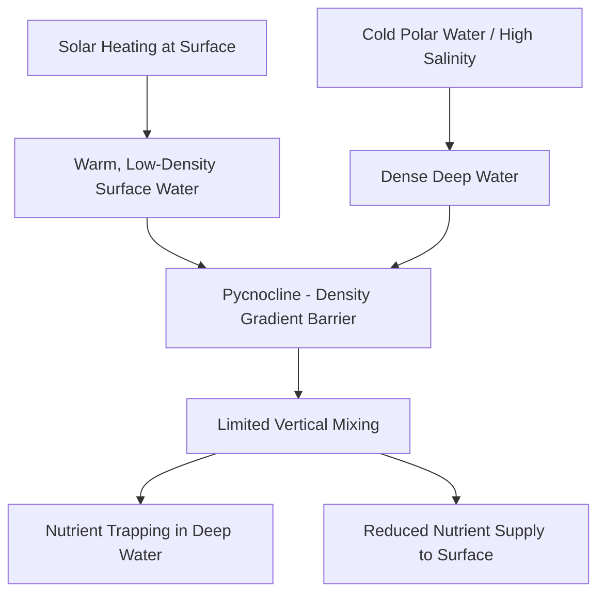
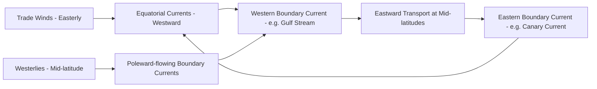

## Ocean Structure and Circulation

### Overview

Ocean structure and circulation describe the physical organization of the world's oceans into layered water masses and the large-scale movement patterns that redistribute heat, salt, nutrients, and dissolved gases across the planet. These processes are governed by fundamental physical principles — density stratification, wind stress, the Coriolis effect, and thermohaline forcing — and constitute the physical foundation underlying marine ecosystem function, climate regulation, and biogeochemical cycling.

### Vertical Ocean Structure

**Key Points**

- The ocean is vertically stratified into distinct layers based on temperature, salinity, and resulting density gradients.
- Density stratification generally suppresses vertical mixing, creating a physical barrier between nutrient-rich deep water and sunlit surface water.

**Layer Structure**

| Layer | Approximate Depth | Characteristics |
| --- | --- | --- |
| Mixed layer (epipelagic) | 0–100–200 m | Wind-mixed, relatively uniform temperature/salinity, sunlit (photic zone) |
| Thermocline | ~200–1000 m | Rapid temperature decrease with depth; primary density gradient zone |
| Deep zone | 1000 m–4000 m | Cold (~2–4°C), relatively uniform temperature, dark (aphotic) |
| Abyssal zone | 4000 m+ | Near-freezing, high pressure, extends to ocean floor |

**Density Stratification**

Seawater density ($\rho$) is a function of temperature ($T$), salinity ($S$), and pressure ($p$), described by the nonlinear **equation of state for seawater**:

$$\rho = f(T, S, p)$$

Density generally increases with decreasing temperature and increasing salinity and pressure, though the relationship is nonlinear (seawater density is most sensitive to temperature changes near freezing and to salinity changes throughout its range). The vertical density gradient created by the thermocline is termed the **pycnocline**, which acts as a physical barrier limiting vertical exchange between surface and deep water.

### Ocean Water Masses

A **water mass** is a body of water with a common formation history and identifiable temperature-salinity (T-S) characteristics, traced across ocean basins using **T-S diagrams**.

**Major Global Water Masses**

- **North Atlantic Deep Water (NADW):** forms via deep convection in the Labrador and Nordic Seas when cold, saline surface water becomes dense enough to sink
- **Antarctic Bottom Water (AABW):** the densest water mass globally, formed primarily in the Weddell and Ross Seas through brine rejection during sea ice formation, sinking to fill the deepest ocean basins
- **Antarctic Intermediate Water (AAIW):** forms at the Antarctic Polar Front, spreading northward at intermediate depths (~800–1000 m)
- **Subtropical Mode Water:** formed through winter convective mixing in subtropical gyres, characterized by a nearly uniform temperature layer

### Wind-Driven Surface Circulation

**Ekman Transport**

Wind blowing across the ocean surface generates a frictional stress that, combined with the Coriolis effect, produces net water transport at approximately 90° to the wind direction (to the right of wind direction in the Northern Hemisphere, left in the Southern Hemisphere) — a phenomenon known as **Ekman transport**. This occurs because successive layers of water are deflected further by the Coriolis force as frictional influence from the layer above diminishes with depth, producing the theoretical **Ekman spiral**.

$$\tau = \rho_a C_D U^2$$

where $\tau$ is wind stress, $\rho_a$ is air density, $C_D$ is a drag coefficient, and $U$ is wind speed — the forcing term driving Ekman transport and, at larger scales, ocean gyre circulation.

**Ocean Gyres**

Wind-driven surface currents organize into large-scale, semi-permanent rotating current systems called **gyres**, generally rotating clockwise in the Northern Hemisphere and counterclockwise in the Southern Hemisphere subtropical basins, driven by the combination of trade winds, westerlies, and Coriolis deflection.

**Western Boundary Intensification**

A well-documented feature of subtropical gyres is **western boundary intensification**: currents on the western side of ocean basins (e.g., the Gulf Stream in the North Atlantic, the Kuroshio in the North Pacific) are markedly narrower, faster, and deeper than their eastern boundary counterparts (e.g., the Canary Current, California Current), a consequence of the conservation of angular momentum combined with the latitudinal variation of the Coriolis parameter (an effect explained formally by **Sverdrup and Stommel dynamics**).

### Thermohaline Circulation

**Mechanism**

Thermohaline circulation (THC) is driven by density differences arising from variations in temperature ("thermo") and salinity ("haline") rather than wind forcing. Dense water formation occurs primarily at high latitudes, where surface cooling and, in some regions, brine rejection during sea ice formation increase surface water density sufficiently to sink and initiate deep water formation.

**The Global Conveyor Belt**

The colloquial "global conveyor belt" model describes an interconnected, basin-spanning circulation pattern linking surface and deep currents: warm surface water flows poleward (e.g., via the Gulf Stream), releases heat to the atmosphere at high latitudes, becomes dense enough to sink (forming NADW), flows as deep water southward and eastward through the Atlantic, Indian, and Pacific basins, gradually upwells, and returns as surface flow to complete the circuit.

$$\text{Time scale for full circuit: approximately 1000 years [Inference: order-of-magnitude estimate from tracer studies]}$$

[Unverified] The specific timescale for complete conveyor belt circulation is estimated through radiocarbon and other chemical tracer studies and varies by ocean basin and pathway; commonly cited figures range from several hundred to over a thousand years depending on the specific water mass and route traced, and should be treated as an order-of-magnitude estimate rather than a precise figure.

### Upwelling and Downwelling

**Coastal Upwelling**

Occurs where wind-driven Ekman transport moves surface water away from a coastline, drawing cold, nutrient-rich deep water upward to replace it. Major coastal upwelling systems (California Current, Humboldt/Peru Current, Benguela Current, Canary Current) support disproportionately high fisheries productivity relative to their area due to nutrient injection into the photic zone.

**Equatorial Upwelling**

Along the equator, easterly trade winds drive Ekman transport away from the equator in both hemispheres (poleward in each), causing divergence and compensating upwelling of cooler, nutrient-rich water directly along the equatorial band.

**Downwelling**

Occurs where surface currents converge or where wind forces surface water toward a coastline, forcing water downward; ecologically associated with lower surface productivity due to nutrient depletion in the sinking surface water column.

### El Niño–Southern Oscillation (ENSO)

ENSO is the dominant interannual mode of climate variability originating in the tropical Pacific Ocean-atmosphere system, alternating between three phases:

| Phase | Pacific SST Pattern | Trade Winds | Typical Impacts |
| --- | --- | --- | --- |
| El Niño | Warmer than average eastern/central tropical Pacific | Weakened | Suppressed upwelling off South America, altered global precipitation patterns |
| Neutral | Near-average conditions | Normal strength | Baseline conditions |
| La Niña | Cooler than average eastern/central tropical Pacific | Strengthened | Enhanced upwelling, intensified trade winds |

**Mechanism**

Under normal (non-El Niño) conditions, trade winds pile up warm surface water in the western Pacific, maintaining a steep thermocline tilt and strong coastal upwelling off South America. During El Niño, weakened trade winds allow warm water to slosh eastward, flattening the thermocline, suppressing upwelling, and disrupting the Peru/Humboldt Current fishery — historically one of the most economically consequential documented ocean-climate teleconnections.

[Inference] ENSO forecasting has improved substantially through coupled ocean-atmosphere models and sustained observation networks (e.g., the TAO/TRITON mooring array), though prediction skill decreases at longer lead times, and the "spring predictability barrier" — reduced forecast skill for events crossing the boreal spring — remains a documented limitation across most ENSO prediction systems.

### Tides

Tidal circulation results from the gravitational interaction between Earth, Moon, and Sun, producing periodic rises and falls in sea level and associated tidal currents. The dominant lunar semidiurnal tidal constituent (M2) produces the characteristic roughly 12.4-hour tidal cycle observed in most semidiurnal tidal regimes, modified locally by coastline geometry, bathymetry, and resonance effects that produce regionally distinct tidal ranges and patterns (diurnal, semidiurnal, or mixed).

### Ocean Circulation and Climate Regulation

**Heat Redistribution**

Ocean circulation transports substantial quantities of heat poleward from the tropics, moderating regional climates; the Gulf Stream/North Atlantic Drift system is frequently cited as contributing to Western Europe's comparatively mild climate relative to other locations at similar latitude, through combined ocean heat transport and subsequent atmospheric circulation effects.

**Carbon Sequestration**

The ocean's **biological pump** and **solubility pump** both depend on circulation patterns: the biological pump exports organic carbon produced by phytoplankton to depth via sinking particles, while the solubility pump relies on CO₂ dissolving more readily in cold, dense surface water that subsequently sinks during deep water formation, sequestering dissolved inorganic carbon in the deep ocean on multi-century to millennial timescales.

### Climate Change Impacts on Ocean Circulation

**Atlantic Meridional Overturning Circulation (AMOC) Concerns**

The AMOC, the Atlantic component of thermohaline circulation encompassing the Gulf Stream and NADW formation, has been the subject of substantial scientific attention regarding potential weakening under climate change. Freshwater input from accelerated Greenland ice sheet melt could reduce surface water salinity and density in North Atlantic deep water formation regions, potentially weakening the overturning circulation.

[Unverified] Direct observational evidence of AMOC weakening trends is actively debated in the scientific literature; some paleoclimate proxy reconstructions and recent direct observation programs (e.g., the RAPID array) suggest a weakening signal, but the magnitude, statistical significance relative to natural variability, and attribution to anthropogenic forcing specifically remain areas of active research rather than settled scientific consensus, and any discussion of current findings should be verified against the most recent IPCC assessment and peer-reviewed literature given the pace of ongoing research in this area.

**Stratification Changes**

Ocean warming increases near-surface stratification (warmer, less dense surface water sitting more persistently atop cooler deep water), which [Inference] is generally expected to reduce vertical nutrient mixing into the photic zone in many regions, potentially reducing marine primary productivity, though regional outcomes vary and some upwelling systems may intensify rather than weaken under certain wind-forcing change scenarios.

### Ocean Circulation Diagram

<svg xmlns="http://www.w3.org/2000/svg" viewBox="0 0 560 380" font-family="sans-serif">
<text x="280" y="20" text-anchor="middle" font-size="15" font-weight="bold">Global Thermohaline Circulation Schematic (svg_diagram)</text>

<rect x="20" y="50" width="520" height="300" fill="#e3f2fd" />

<rect x="20" y="50" width="520" height="60" fill="#ffcc80" opacity="0.5" />
<text x="60" y="70" font-size="9">Warm Surface Flow</text>

<rect x="20" y="250" width="520" height="100" fill="#1565c0" opacity="0.4" />
<text x="60" y="330" font-size="9" fill="white">Cold Deep Water Flow</text>

<path d="M 60 80 Q 200 60 350 75 Q 450 85 520 70" fill="none" stroke="#e65100" stroke-width="3" marker-end="url(#arrowr)" />
<text x="300" y="55" text-anchor="middle" font-size="9" fill="#e65100">Warm Surface Current (e.g. Gulf Stream)</text>

<path d="M 500 90 Q 510 150 500 250" fill="none" stroke="#0d47a1" stroke-width="3" marker-end="url(#arrowd)" />
<text x="520" y="170" font-size="9" fill="#0d47a1" transform="rotate(90 520 170)">Deep Water Formation (sinking)</text>

<path d="M 480 280 Q 300 300 100 290 Q 60 285 50 260" fill="none" stroke="#0d47a1" stroke-width="3" marker-end="url(#arrowl)" />
<text x="280" y="315" text-anchor="middle" font-size="9" fill="#0d47a1">Deep Water Southward/Global Flow</text>

<path d="M 60 260 Q 55 180 65 90" fill="none" stroke="#00838f" stroke-width="3" marker-end="url(#arrowu)" />
<text x="30" y="180" font-size="9" fill="#00838f" transform="rotate(-90 30 180)">Upwelling</text>
</svg>

### Practical Example: Ekman Transport Direction

**Example**

A steady wind blows from the north (southward-directed wind stress) along a coastline running north-south, with the ocean to the west of the coast, in the Northern Hemisphere.

1. Wind stress direction: southward (toward the equator, in this example orientation)
2. In the Northern Hemisphere, net Ekman transport is directed 90° to the right of the wind direction: a southward wind produces net transport toward the west
3. If the coastline lies to the east of this westward-transported water, surface water is transported away from the coast
4. This creates a coastal divergence, drawing deep, nutrient-rich water upward to replace the displaced surface water — coastal upwelling

This is the physical mechanism underlying major eastern boundary upwelling systems such as the California Current, where equatorward (southward) alongshore winds in the Northern Hemisphere drive offshore Ekman transport and consequent upwelling.

### Conclusion

Ocean structure and circulation are governed by an interlocking set of physical processes — density stratification, wind stress, the Coriolis effect, and thermohaline forcing — that together organize the ocean into distinct water masses and drive both surface gyre circulation and deep overturning circulation. These physical dynamics are foundational to marine ecosystem productivity (via upwelling-driven nutrient supply), global climate regulation (via heat and carbon redistribution), and the interannual variability (via ENSO) that shapes global weather and fisheries outcomes, making physical oceanography an essential prerequisite for understanding marine biological and biogeochemical systems.

**Related Topics**

- ENSO forecasting and coupled ocean-atmosphere modeling
- AMOC monitoring and climate change tipping point research
- Coastal upwelling systems and fisheries productivity
- Ocean biogeochemical cycling and the biological carbon pump
- Sea level rise and thermosteric/ocean dynamic contributions
- Tidal energy and coastal engineering applications
- Marine heatwaves and ocean stratification trends