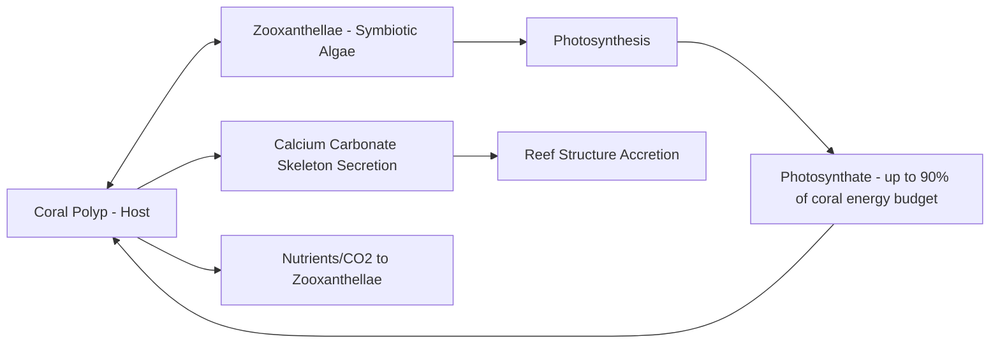
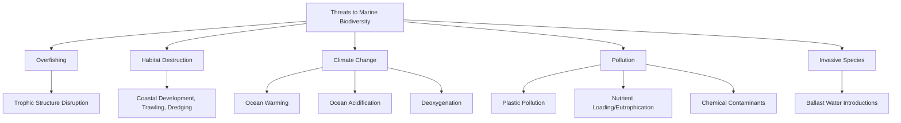

## Marine Biodiversity and Ecosystems

### Overview

Marine biodiversity encompasses the variety of life across all levels of biological organization — genes, species, populations, communities, and ecosystems — within ocean and coastal environments. Marine ecosystems span an extraordinary range of physical conditions, from sunlit coral reefs to permanently dark hydrothermal vents, and support ecological processes fundamental to global biogeochemical cycling, fisheries productivity, and climate regulation.

### Patterns of Marine Biodiversity

**Key Points**

- Marine biodiversity is unevenly distributed globally, generally peaking in the Coral Triangle (Indo-Pacific region encompassing Indonesia, Philippines, Malaysia, and neighboring waters) for many taxonomic groups, particularly reef-associated species.
- Biodiversity also varies strongly with depth and distance from shore, generally declining with increasing depth and distance from continental margins, though deep-sea and hydrothermal vent communities exhibit locally high, highly specialized biodiversity.
- Marine biodiversity is measured at multiple scales: genetic diversity within populations, species richness within habitats, and ecosystem/habitat diversity across regions.

### Major Marine Ecosystem Types

**Coral Reefs**

Coral reefs are constructed by colonial cnidarians (Class Anthozoa) that secrete calcium carbonate skeletons, forming the physical reef structure over geological timescales. Reef-building corals maintain an obligate mutualistic symbiosis with photosynthetic dinoflagellate algae called **zooxanthellae** (genus *Symbiodinium* and related genera), which provide the coral host with the majority of its metabolic energy through photosynthesis in exchange for shelter and access to metabolic waste products (nitrogen, CO₂).

[Inference] The commonly cited figure that zooxanthellae supply up to roughly 90% of a coral's energy budget is a widely referenced estimate in the coral biology literature, though the precise proportion varies by coral species, light availability, and depth, with some species relying more heavily on heterotrophic feeding (capturing zooplankton) than others.

Coral reefs occupy less than 1% of the ocean floor yet are estimated to support a disproportionately large fraction of described marine species, a pattern frequently attributed to the exceptional habitat structural complexity reefs provide relative to surrounding soft-bottom or open-water habitats.

**Mangrove Forests**

Mangroves are salt-tolerant trees and shrubs occupying intertidal zones in tropical and subtropical coastlines, exhibiting specialized physiological adaptations including salt exclusion or excretion mechanisms, viviparous propagules (seeds that germinate while still attached to the parent tree), and specialized root structures (pneumatophores, prop roots) enabling gas exchange in anoxic, waterlogged sediment.

**Seagrass Meadows**

Seagrasses are the only marine flowering plants (angiosperms), forming dense underwater meadows in shallow coastal waters that provide critical nursery habitat, sediment stabilization, and — along with mangroves and salt marshes — constitute one of the primary **blue carbon** ecosystems, sequestering carbon in below-ground biomass and sediment at rates that are, per unit area, [Inference] frequently cited in the literature as exceeding rates observed in many terrestrial forest ecosystems, though blue carbon sequestration rate estimates vary considerably by species, sediment type, and regional condition, and specific numerical comparisons should be checked against current peer-reviewed synthesis studies.

**Kelp Forests**

Large brown macroalgae (order Laminariales) form dense subtidal forests in cold, nutrient-rich temperate and polar waters, providing habitat structure analogous to terrestrial forests. Kelp forest ecosystems are frequently structured by **keystone species** interactions, most famously the sea otter–sea urchin–kelp trophic cascade documented along the North American Pacific coast, in which sea otter predation controls sea urchin grazing pressure, preventing urchin overgrazing from converting kelp forest into a barren, low-diversity "urchin barren" state.

**Open Ocean (Pelagic) Ecosystems**

The pelagic zone, comprising the water column away from the seafloor and shoreline, is structured vertically into the epipelagic (photic, 0–200 m), mesopelagic (twilight zone, 200–1000 m), bathypelagic (1000–4000 m), and abyssopelagic (4000 m+) zones, each characterized by distinct light availability, pressure, temperature, and associated faunal adaptations (e.g., bioluminescence prevalence increasing with depth in the mesopelagic zone).

**Deep-Sea and Hydrothermal Vent Ecosystems**

Hydrothermal vent communities, discovered in 1977 along the Galápagos Rift, represent ecosystems fundamentally independent of photosynthetic primary production, instead relying on **chemosynthesis**: bacteria and archaea oxidize reduced chemical compounds (primarily hydrogen sulfide) emitted from vent fluids to fix carbon, forming the base of a food web supporting specialized fauna (tube worms, vent crabs, vent mussels) found nowhere else.

$$CO_2 + 4H_2S + O_2 \rightarrow CH_2O + 4S + 3H_2O$$

(Simplified chemosynthesis reaction using hydrogen sulfide as the electron donor, analogous in ecological role to the light-driven reactions of photosynthesis.)

### Trophic Structure and Food Web Dynamics

**Primary Production**

Marine primary production is dominated by phytoplankton (diatoms, dinoflagellates, cyanobacteria, and other microalgae), contributing an estimated substantial share of global photosynthetic primary production despite occupying a small fraction of global photosynthetic biomass — a consequence of phytoplankton's rapid turnover rate relative to the larger standing biomass but slower turnover of terrestrial forests.

**Trophic Pyramid and Energy Transfer**

Energy transfer between trophic levels in marine food webs generally follows the **ten percent rule** (approximately 10% of energy at one trophic level is transferred to the next, with the remainder lost as metabolic heat and unassimilated waste), though this figure is a widely used approximation rather than a precise physical constant.

**Trophic Cascades**

A trophic cascade occurs when changes in the abundance of a predator propagate through multiple trophic levels, altering ecosystem structure. Beyond the sea otter–urchin–kelp example, documented marine trophic cascades include shifts following the depletion of large predatory sharks in some coastal ecosystems, associated in some studied systems with mesopredator release and subsequent declines in shared prey populations, though [Inference] the strength and generality of shark-driven trophic cascades across different marine ecosystems remains debated in the ecological literature, with effect size appearing highly context- and system-dependent rather than universal.

### Marine Biogeographic Patterns

**Latitudinal Diversity Gradient**

Marine species richness for many taxonomic groups generally follows a latitudinal diversity gradient, typically peaking in tropical waters and declining toward the poles, though this pattern is not universal across all taxa (for example, some benthic invertebrate groups and certain seabird communities can show different or even inverse latitudinal patterns).

**Biogeographic Provinces**

Ocean regions are classified into biogeographic provinces based on characteristic species assemblages, shaped by historical connectivity, current oceanographic barriers, and temperature regimes. The **Coral Triangle** and broader **Indo-Pacific** region is widely recognized as the global center of marine biodiversity for coral reef-associated taxa, while other regions (Caribbean, Eastern Pacific, temperate zones) support distinct, generally less diverse but often highly endemic assemblages.

### Threats to Marine Biodiversity

**Coral Bleaching**

Elevated sea surface temperatures disrupt the coral-zooxanthellae symbiosis, triggering expulsion of zooxanthellae from coral tissue and loss of the algae's photosynthetic pigments that give healthy coral its color — the visually distinctive "bleaching" phenomenon. Prolonged bleaching, if thermal stress does not subside, leads to coral starvation and mortality, since corals lose their primary energy source. Mass bleaching events have become measurably more frequent and geographically widespread as global ocean temperatures have risen, documented across successive global bleaching events tracked by NOAA's Coral Reef Watch program and independent research groups.

**Ocean Acidification**

Increased atmospheric CO₂ dissolving into seawater lowers ocean pH and reduces carbonate ion availability needed for calcium carbonate shell and skeleton formation in corals, mollusks, and some plankton groups (e.g., pteropods, foraminifera), following the carbonate chemistry equilibrium:

$$CO_2 + H_2O \rightleftharpoons H_2CO_3 \rightleftharpoons H^+ + HCO_3^- \rightleftharpoons 2H^+ + CO_3^{2-}$$

**Marine Debris and Plastic Pollution**

Plastic debris affects marine biodiversity through entanglement, ingestion (both directly by larger organisms and as microplastic ingestion across the food web), and as a vector for transporting invasive species and pollutants across ocean basins.

### Conservation and Management Approaches

**Marine Protected Areas (MPAs)**

MPAs range from multiple-use zones permitting regulated extraction to fully protected **no-take marine reserves**. Well-enforced no-take reserves are associated with measurable increases in fish biomass, size, and species richness within reserve boundaries relative to adjacent unprotected areas, with documented **spillover effects** enhancing adjacent fisheries in some studied systems.

**30x30 and Global Biodiversity Targets**

The **30x30 initiative**, incorporated into the Kunming-Montreal Global Biodiversity Framework adopted under the UN Convention on Biological Diversity, sets a target of conserving 30% of the planet's land and ocean area by 2030. [Unverified] Progress toward marine 30x30 targets varies substantially by region and is subject to ongoing negotiation and implementation debate, particularly regarding high seas governance under the 2023 UN High Seas Treaty (BBNJ Agreement); current status should be checked against the most recent intergovernmental reporting given the pace of ongoing policy development in this area.

**Ecosystem-Based Management**

Increasingly, marine conservation frameworks move beyond single-species or single-threat management toward integrated, ecosystem-based approaches accounting for cumulative and interacting stressors (fishing pressure, habitat loss, climate change) across a defined marine ecosystem or region.

### Marine Ecosystem Structure Diagram

<svg xmlns="http://www.w3.org/2000/svg" viewBox="0 0 560 400" font-family="sans-serif">
<text x="280" y="20" text-anchor="middle" font-size="15" font-weight="bold">Marine Ecosystem Zonation (svg_diagram)</text>

<rect x="20" y="40" width="520" height="70" fill="#81d4fa" />
<text x="30" y="60" font-size="9">Epipelagic (Photic Zone, 0-200m)</text>
<rect x="20" y="110" width="520" height="60" fill="#4fc3f7" opacity="0.8" />
<text x="30" y="130" font-size="9" fill="white">Mesopelagic (Twilight Zone)</text>
<rect x="20" y="170" width="520" height="80" fill="#1976d2" opacity="0.85" />
<text x="30" y="190" font-size="9" fill="white">Bathypelagic</text>
<rect x="20" y="250" width="520" height="80" fill="#0d47a1" />
<text x="30" y="270" font-size="9" fill="white">Abyssopelagic</text>

<path d="M 60 108 Q 70 90 85 100 Q 95 85 105 100 Q 115 90 125 108 Z" fill="#ff7043" />
<text x="90" y="122" text-anchor="middle" font-size="8">Coral Reef</text>

<path d="M 220 108 Q 225 70 220 45" stroke="#4caf50" stroke-width="4" fill="none" />
<path d="M 235 108 Q 240 75 233 45" stroke="#4caf50" stroke-width="4" fill="none" />
<path d="M 250 108 Q 255 70 250 45" stroke="#4caf50" stroke-width="4" fill="none" />
<text x="235" y="122" text-anchor="middle" font-size="8">Kelp Forest</text>

<path d="M 380 108 L 383 95 M 388 108 L 391 90 M 396 108 L 399 96 M 404 108 L 407 92" stroke="#66bb6a" stroke-width="2" />
<text x="395" y="122" text-anchor="middle" font-size="8">Seagrass Meadow</text>

<rect x="470" y="95" width="4" height="15" fill="#5d4037" />
<rect x="480" y="90" width="4" height="20" fill="#5d4037" />
<rect x="490" y="98" width="4" height="12" fill="#5d4037" />
<text x="480" y="122" text-anchor="middle" font-size="8">Mangrove</text>

<path d="M 400 330 L 395 300 L 405 300 Z" fill="#616161" />
<path d="M 400 300 Q 395 285 400 270" stroke="#e0e0e0" stroke-width="2" fill="none" opacity="0.7" />
<text x="400" y="345" text-anchor="middle" font-size="8" fill="white">Hydrothermal Vent</text>

<circle cx="150" cy="320" r="4" fill="#e0e0e0" />
<circle cx="180" cy="310" r="3" fill="#e0e0e0" />
<text x="165" y="340" text-anchor="middle" font-size="8" fill="white">Deep-sea fauna</text>
</svg>

### Practical Example: Trophic Transfer Efficiency Calculation

**Example**

A coastal upwelling ecosystem supports a phytoplankton primary production of 500 g C/m²/year. Using the standard 10% trophic transfer efficiency approximation:

1. Zooplankton (primary consumers): $500 \times 0.10 = 50$ g C/m²/year
2. Small pelagic fish (secondary consumers, e.g., anchovies): $50 \times 0.10 = 5$ g C/m²/year
3. Larger predatory fish (tertiary consumers): $5 \times 0.10 = 0.5$ g C/m²/year
4. Apex predators (quaternary level): $0.5 \times 0.10 = 0.05$ g C/m²/year

This illustrates why upwelling systems, despite very high primary productivity, support finite (though often locally very large in absolute terms) fisheries yields at higher trophic levels, and why fisheries targeting lower trophic levels (e.g., anchoveta, sardine fisheries) can sustain much higher absolute yields per unit primary production than fisheries targeting apex predators.

[Inference] The 10% figure is a widely used simplifying approximation in ecology education and rough ecosystem modeling; actual trophic transfer efficiencies measured in specific marine food webs vary considerably (commonly cited as ranging roughly 5–20% depending on taxa and system), so this calculation should be understood as illustrative of the general order-of-magnitude pattern rather than a precise universal constant.

### Conclusion

Marine biodiversity spans an exceptional range of ecosystem types — from photosynthesis-dependent coral reefs and kelp forests to chemosynthesis-based hydrothermal vent communities — each structured by distinct physical constraints and trophic dynamics. These ecosystems face compounding anthropogenic pressures from overfishing, habitat destruction, pollution, and climate change (warming, acidification, deoxygenation), driving an increasing shift in marine conservation policy toward integrated, ecosystem-based management and expanded protected area coverage, exemplified by international frameworks such as the 30x30 target and the UN High Seas Treaty.

**Related Topics**

- Coral bleaching mechanisms and reef resilience research
- Blue carbon ecosystem valuation and climate policy
- Trophic cascade theory and keystone species management
- Marine Protected Area network design and spillover effects
- Chemosynthetic ecosystems and deep-sea biodiversity discovery
- Ocean acidification impacts on calcifying organisms
- High Seas Treaty (BBNJ Agreement) implementation