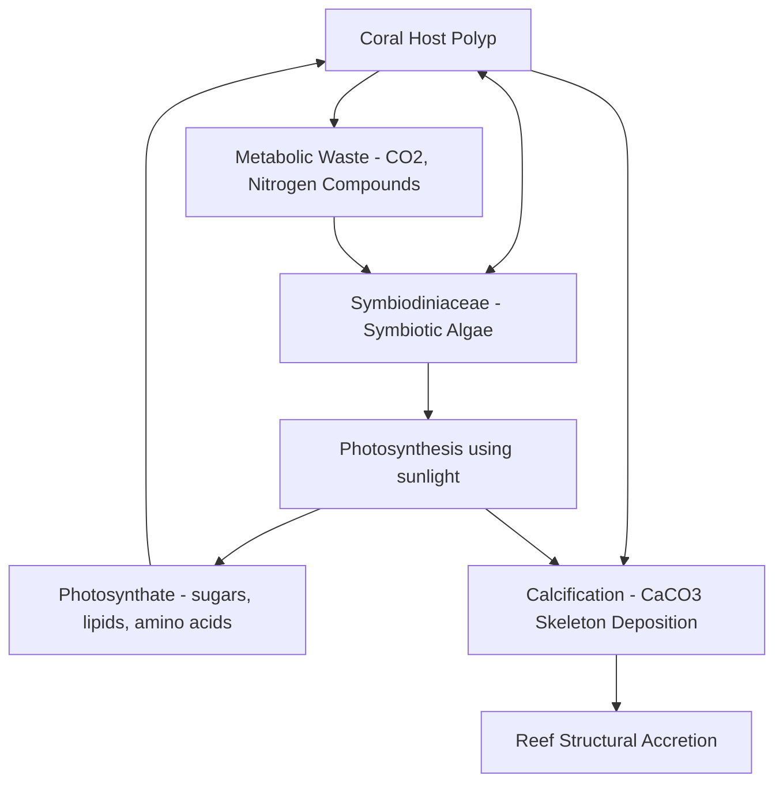
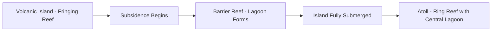
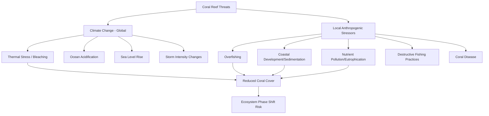

## Coral Reef Ecology and Threats

### Overview

Coral reef ecology examines the biological structure, ecological interactions, and physiological processes that build and sustain one of the most biodiverse and structurally complex ecosystems on Earth. Coral reefs function as foundational habitat engineers, and their ecological stability depends on a finely balanced set of symbiotic, competitive, and trophic relationships now under sustained pressure from a combination of local and global anthropogenic stressors.

### Coral Biology and the Coral-Algal Symbiosis

**Key Points**

- Reef-building (hermatypic) corals are colonial cnidarians in Class Anthozoa, each polyp secreting a calcium carbonate skeleton that accumulates over generations to form the reef's physical structure.
- The obligate mutualistic symbiosis between coral hosts and photosynthetic dinoflagellate algae (family Symbiodiniaceae, historically grouped under the genus *Symbiodinium*, now recognized to include multiple distinct genera) is the biological foundation of reef productivity.
- Coral calcification and photosynthesis are physiologically linked processes, with symbiont photosynthesis enhancing the host's capacity for skeletal calcification.

**Calcification Chemistry**

Coral skeletal growth proceeds through biologically mediated precipitation of calcium carbonate (aragonite form):

$$Ca^{2+} + 2HCO_3^- \rightarrow CaCO_3 + H_2O + CO_2$$

This reaction is sensitive to seawater carbonate chemistry, specifically the **aragonite saturation state** ($\Omega_{arag}$), which declines as ocean acidification progresses, directly constraining the thermodynamic favorability of skeletal accretion.

[Inference] The degree to which photosynthesis enhances calcification (often termed "light-enhanced calcification") is well-documented across multiple coral species, though the precise magnitude of enhancement varies by species, light regime, and symbiont type, and is an active area of coral physiology research.

### Reef Types and Formation

**Darwin's Classification**

Charles Darwin's classical reef formation model, still broadly accepted with modern refinements, describes three sequential reef types forming around a subsiding volcanic island:

1. **Fringing reefs:** grow directly adjacent to the shoreline of a landmass
2. **Barrier reefs:** separated from the shoreline by a lagoon, as the underlying landmass subsides while the reef grows upward to remain in the photic zone
3. **Atolls:** ring-shaped reefs surrounding a central lagoon, formed after the original volcanic island has fully subsided beneath the sea surface, leaving only the reef structure

### Reef Zonation and Habitat Structure

Coral reefs exhibit characteristic zonation driven by gradients in wave energy, light availability, and depth:

| Zone | Characteristics |
| --- | --- |
| Reef flat | Shallow, high light, variable wave exposure, often behind the reef crest |
| Reef crest | Highest wave energy zone, dominated by robust, wave-resistant coral growth forms |
| Fore reef (reef slope) | Seaward-facing slope with the highest coral diversity and structural complexity in many reef systems |
| Reef base/deep reef | Lower light availability, often dominated by plate and encrusting coral morphologies adapted to reduced irradiance |

### Trophic and Ecological Interactions

**Herbivory and Algal Competition**

Herbivorous fish (parrotfish, surgeonfish) and invertebrates (sea urchins) graze algae that would otherwise outcompete corals for substrate space and light, making herbivore abundance a critical structuring factor in reef algal-coral competitive dynamics. Overfishing of herbivorous fish is frequently associated in reef ecology literature with **phase shifts** from coral-dominated to macroalgae-dominated reef states, a well-documented pattern in Caribbean reef systems following historical overfishing combined with a mass mortality event in the sea urchin *Diadema antillarum* in the early 1980s.

**Reef Fish Communities**

Coral reefs support exceptionally high fish species richness relative to their areal extent, structured by habitat complexity (structurally complex reefs generally support higher fish diversity and abundance), resource partitioning among species with differing feeding strategies (herbivores, planktivores, piscivores, corallivores), and complex recruitment dynamics linking larval dispersal to adult population structure.

**Cleaning Symbiosis and Other Mutualisms**

Reef ecosystems host numerous documented mutualistic relationships beyond the coral-algal symbiosis, including cleaning stations where cleaner fish and shrimp remove ectoparasites from client fish, and various obligate associations between invertebrates (e.g., certain shrimp and goby species sharing burrows) that structure microhabitat use on the reef.

### Major Threats to Coral Reefs

**Coral Bleaching**

Thermal stress (sea surface temperatures elevated approximately 1–2°C above the local summer maximum, sustained over days to weeks) disrupts the coral-algal symbiosis at the cellular level, triggering the breakdown of photosynthetic machinery and subsequent expulsion or degradation of symbiotic algae, causing the coral tissue to appear pale or white (the underlying white calcium carbonate skeleton becomes visible through the now-transparent tissue).

**Bleaching thresholds** are commonly monitored using **Degree Heating Weeks (DHW)**, a metric accumulating thermal stress over a 12-week rolling window when sea surface temperature exceeds the local bleaching threshold (typically defined relative to the maximum monthly mean climatological temperature):

$$DHW = \sum_{i=1}^{12 \text{ weeks}} \max(0, SST_i - MMM - 1°C)$$

where $SST_i$ is weekly sea surface temperature and $MMM$ is the maximum monthly mean climatological temperature for that location. DHW values of 4°C-weeks are commonly associated with significant bleaching risk, and 8°C-weeks or higher with risk of substantial coral mortality, per NOAA Coral Reef Watch monitoring standards. [Unverified] Specific numerical DHW thresholds are useful operational risk indicators but represent generalized values; actual bleaching and mortality response varies by coral species, prior thermal history (some reefs show acquired thermal tolerance from repeated past exposure), and local environmental conditions.

**Mass Bleaching Events**

Global mass coral bleaching events, in which thermal stress affects reef systems across multiple ocean basins simultaneously, have been documented with increasing frequency and severity as global ocean temperatures rise, tracked through successive global-scale events recorded by NOAA Coral Reef Watch and independent research networks since the first widely documented global event in 1998.

**Ocean Acidification**

Declining aragonite saturation state reduces the thermodynamic favorability of coral calcification and can, at sufficiently low saturation states, promote dissolution of existing calcium carbonate structure, compounding the effects of thermal stress on overall reef structural integrity.

**Coral Disease**

Multiple coral diseases (white band disease, black band disease, and more recently stony coral tissue loss disease, first documented off Florida in 2014 and subsequently spreading through the Caribbean) have caused substantial documented coral mortality, with disease outbreaks sometimes linked to thermal stress, water quality degradation, and pathogen introduction, though [Inference] the specific causative agents and environmental triggers for several coral diseases, including stony coral tissue loss disease, remain incompletely characterized and are subjects of ongoing research.

**Sedimentation and Coastal Development**

Coastal construction, dredging, and land-based erosion increase sediment loading onto reefs, reducing light availability for symbiont photosynthesis, physically smothering coral tissue, and interfering with larval settlement on reef substrate.

**Nutrient Pollution and Eutrophication**

Excess nutrient input (agricultural runoff, sewage discharge) can shift the competitive balance from coral to macroalgae by fueling algal growth, and is implicated in some studied reef systems as a contributing factor to reduced coral resilience and increased susceptibility to disease.

**Destructive Fishing Practices**

Blast fishing (using explosives to stun or kill fish) and cyanide fishing (used to capture live fish for the aquarium trade) cause direct physical destruction of reef structure and are documented as persistent local threats in parts of Southeast Asia and other regions, alongside the ecological effects of overfishing removing key functional groups such as herbivores and predators.

### Reef Resilience and Recovery

**Resilience Concept**

Coral reef resilience refers to a reef's capacity to resist disturbance and/or recover following a disturbance event (bleaching, storm damage, disease outbreak) while maintaining core ecosystem structure and function. Resilience is influenced by both intrinsic factors (coral species composition, genetic diversity, prior thermal history) and extrinsic factors (local water quality, herbivore abundance, connectivity to larval source reefs).

**Assisted Evolution and Restoration**

Active reef restoration approaches have expanded substantially in response to accelerating reef decline, including:

- **Coral gardening/outplanting:** propagating coral fragments in nurseries before transplanting onto degraded reef substrate
- **Assisted gene flow:** deliberately introducing heat-tolerant coral genotypes or symbiont strains from naturally more thermally tolerant populations
- **Selective breeding for thermal tolerance:** breeding programs targeting coral genotypes and symbiont combinations demonstrating superior bleaching resistance
- **Larval propagation and settlement enhancement:** technologies (e.g., structured settlement substrates) designed to improve natural coral larval recruitment success

[Inference] These restoration approaches show documented localized success in numerous pilot projects, but their capacity to offset reef decline at a scale commensurate with global climate-driven bleaching trends remains a matter of active scientific and policy debate; most coral scientists emphasize that restoration is a complement to, not a substitute for, greenhouse gas emissions reduction as the primary lever determining long-term global reef persistence.

### Reef Ecosystem Services

| Service | Description |
| --- | --- |
| Fisheries support | Nursery and adult habitat for reef and reef-associated fisheries species |
| Coastal protection | Wave energy dissipation reducing coastal erosion and storm surge impact |
| Tourism and recreation | Substantial economic value in dive tourism and recreation-dependent coastal economies |
| Biodiversity/genetic resources | Reservoir of biodiversity with documented pharmaceutical and biotechnological research applications |
| Cultural value | Significant cultural, spiritual, and subsistence importance for many coastal and island communities |

[Unverified] Global economic valuations of coral reef ecosystem services (commonly cited in the tens of billions of dollars annually) vary substantially across studies depending on methodology and included service categories; specific figures should be sourced from current peer-reviewed or institutional (e.g., World Resources Institute, NOAA) valuation studies rather than treated as a single fixed number.

### Coral Reef Zonation Diagram

<svg xmlns="http://www.w3.org/2000/svg" viewBox="0 0 560 340" font-family="sans-serif">
<text x="280" y="20" text-anchor="middle" font-size="15" font-weight="bold">Coral Reef Cross-Section and Zonation (svg_diagram)</text>

<rect x="20" y="40" width="520" height="260" fill="#81d4fa" />

<polygon points="20,60 90,60 60,90 20,90" fill="#a1887f" />
<text x="45" y="105" font-size="8">Land</text>

<rect x="90" y="90" width="140" height="60" fill="#4fc3f7" />
<text x="160" y="125" text-anchor="middle" font-size="9">Lagoon</text>

<rect x="230" y="95" width="80" height="30" fill="#ffab91" />
<text x="270" y="115" text-anchor="middle" font-size="8">Reef Flat</text>

<rect x="310" y="90" width="30" height="40" fill="#ff7043" />
<text x="325" y="145" text-anchor="middle" font-size="8">Crest</text>

<path d="M 340 90 L 480 260" fill="none" stroke="#e64a19" stroke-width="20" stroke-linecap="round" />
<text x="420" y="180" text-anchor="middle" font-size="9" fill="white" transform="rotate(38 420 180)">Fore Reef (highest diversity)</text>

<rect x="470" y="250" width="70" height="50" fill="#5d4037" />
<text x="505" y="280" text-anchor="middle" font-size="8" fill="white">Deep Reef Base</text>

<text x="30" y="55" font-size="8">Sea Surface</text>

<line x1="20" y1="60" x2="540" y2="60" stroke="`#01579b`" stroke-width="1" stroke-dasharray="3,3" />

</svg>

### Practical Example: Degree Heating Weeks Calculation

**Example**

A reef site has a maximum monthly mean (MMM) climatological SST of 29.5°C (bleaching threshold = MMM + 1°C = 30.5°C). Over a 4-week period, weekly average SST readings are: 31.0°C, 31.5°C, 30.8°C, 30.2°C.

1. Week 1: $\max(0, 31.0 - 30.5) = 0.5$
2. Week 2: $\max(0, 31.5 - 30.5) = 1.0$
3. Week 3: $\max(0, 30.8 - 30.5) = 0.3$
4. Week 4: $\max(0, 30.2 - 30.5) = 0$ (below threshold, contributes nothing)
5. Cumulative DHW (partial 4-week window, illustrative): $0.5 + 1.0 + 0.3 + 0 = 1.8$°C-weeks

At this accumulated stress level (below the 4°C-weeks bleaching-risk threshold within the illustrative window shown), significant bleaching would not yet be expected under standard NOAA Coral Reef Watch risk categories, though continued thermal stress accumulating across the full rolling 12-week window would need to be tracked to assess actual bleaching risk.

[Inference] This example uses a shortened 4-week illustrative window rather than the full standard 12-week rolling window used in operational DHW monitoring, for clarity of calculation; operational bleaching risk assessment requires the complete 12-week accumulation per NOAA Coral Reef Watch methodology.

### Conclusion

Coral reef ecology rests on a delicate, thermally sensitive symbiosis between coral hosts and photosynthetic algae, supporting one of Earth's most structurally complex and biodiverse ecosystems. This foundation is increasingly destabilized by the compounding effects of ocean warming (bleaching), ocean acidification (reduced calcification capacity), and local stressors including overfishing, sedimentation, nutrient pollution, and disease — pressures that interact to reduce reef resilience and increase the risk of persistent phase shifts away from coral dominance. While active restoration and assisted evolution approaches offer meaningful local interventions, the scientific consensus emphasizes that long-term global reef persistence depends fundamentally on reducing greenhouse gas emissions to limit the frequency and severity of thermal stress events.

**Related Topics**

- Degree Heating Weeks monitoring and NOAA Coral Reef Watch methodology
- Assisted evolution and coral restoration techniques
- Reef fish community ecology and herbivore management
- Ocean acidification and aragonite saturation state trends
- Coral disease epidemiology (stony coral tissue loss disease)
- Marine Protected Area design for reef resilience
- Blue carbon and coastal ecosystem valuation