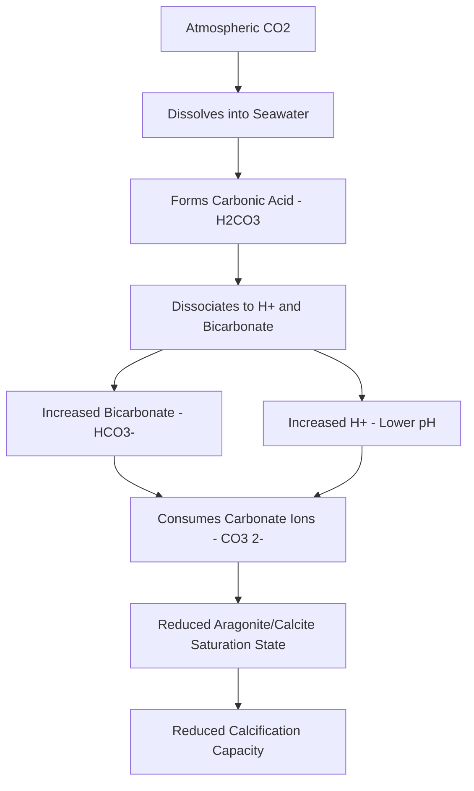
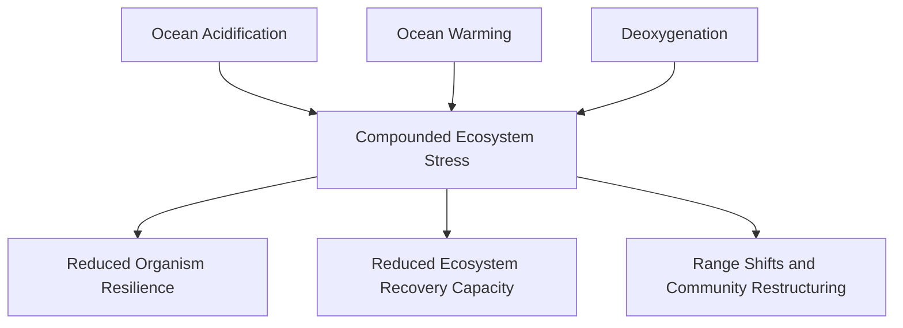

## Ocean Acidification

### Overview

Ocean acidification refers to the ongoing decrease in ocean pH and shift in seawater carbonate chemistry driven primarily by the ocean's absorption of anthropogenic atmospheric carbon dioxide. Often termed "the other CO₂ problem" (distinct from its role as a greenhouse gas), ocean acidification represents a fundamental change in ocean chemistry with direct consequences for calcifying organisms, marine food webs, and biogeochemical cycling.

### Chemical Mechanism

**Key Points**

- Ocean acidification proceeds through a well-established sequence of inorganic carbon chemistry reactions when CO₂ dissolves into seawater.
- The process reduces both pH and the concentration of carbonate ions ($CO_3^{2-}$), the latter being the specific chemical constraint most directly limiting calcification.

**The Carbonate Chemistry Equilibrium**

When atmospheric CO₂ dissolves into seawater, it reacts with water to form carbonic acid, which rapidly dissociates:

$$CO_2 + H_2O \rightleftharpoons H_2CO_3 \rightleftharpoons H^+ + HCO_3^- \rightleftharpoons 2H^+ + CO_3^{2-}$$

The critical consequence of this equilibrium shift is that added CO₂ increases hydrogen ion ($H^+$) concentration (lowering pH) while simultaneously *consuming* carbonate ions ($CO_3^{2-}$) to form additional bicarbonate ($HCO_3^-$), following Le Chatelier's principle applied to the coupled equilibria:

$$CO_2 + CO_3^{2-} + H_2O \rightleftharpoons 2HCO_3^-$$

This means ocean acidification reduces carbonate ion availability through two compounding pathways simultaneously — increased $H^+$ shifting the bicarbonate-carbonate equilibrium, and direct consumption of $CO_3^{2-}$ in the reaction with excess $CO_2$.

### The pH Scale and Measured Change

pH is a logarithmic measure of hydrogen ion concentration:

$$pH = -\log_{10}[H^+]$$

Because the scale is logarithmic, a seemingly modest pH decline represents a substantial proportional increase in $H^+$ concentration. Average global ocean surface pH has declined by approximately 0.1 pH units since the pre-industrial era (from roughly 8.2 to roughly 8.1), which corresponds to approximately a 30% increase in hydrogen ion concentration:

$$\Delta[H^+] \approx 10^{-(pH_2)} - 10^{-(pH_1)}$$

[Inference] The commonly cited approximately 0.1 unit pH decline and approximately 30% increase in H⁺ concentration since pre-industrial times are well-established figures from long-term ocean monitoring programs (e.g., the Hawaii Ocean Time-series/HOT station), though regional rates of change vary, and continued monitoring is needed to track ongoing changes given the pace of atmospheric CO₂ increase.

### Saturation State and Calcification

**Aragonite and Calcite Saturation States**

Calcifying organisms build shells and skeletons from calcium carbonate in one of two crystalline mineral forms — **aragonite** (used by corals, pteropods, and some mollusks) and **calcite** (used by coccolithophores, foraminifera, and many other mollusks) — each with a distinct saturation state:

$$\Omega = \frac{[Ca^{2+}][CO_3^{2-}]}{K_{sp}}$$

where $\Omega$ is the saturation state, $[Ca^{2+}]$ and $[CO_3^{2-}]$ are the respective ion concentrations, and $K_{sp}$ is the mineral-specific solubility product constant. Aragonite has a higher solubility product than calcite, meaning aragonite saturation state ($\Omega_{arag}$) declines to critical thresholds before calcite saturation state ($\Omega_{calc}$) under the same acidification trajectory, making aragonite-forming organisms generally more immediately vulnerable to acidification stress.

**Saturation Horizon**

The **saturation horizon** is the depth at which $\Omega = 1$ (seawater becomes undersaturated below this depth, thermodynamically favoring calcium carbonate dissolution rather than precipitation). Ocean acidification is causing this horizon to shoal (move closer to the surface) in many ocean regions, progressively narrowing the depth range within which calcifying organisms can readily form and maintain shells.

### Biological Impacts

**Coral Reefs**

Reduced aragonite saturation state directly constrains coral calcification rates, compounding thermal stress impacts on reef structural integrity (see Coral Reef Ecology and Threats). [Inference] Multiple experimental and field studies document reduced coral calcification rates under acidified conditions, though the magnitude of impact varies by species and interacts with other stressors (temperature, nutrient availability) in ways that are still being characterized across different reef systems.

**Pteropods and Planktonic Calcifiers**

Pteropods ("sea butterflies," planktonic marine gastropods with aragonite shells) are frequently used as sentinel indicator species for acidification impacts, since their thin aragonite shells are particularly sensitive to undersaturated conditions. Documented shell dissolution in wild pteropod populations in the Southern Ocean and North Pacific has been used as observational evidence linking laboratory acidification experiments to real-world ecosystem effects.

**Shellfish and Aquaculture**

Ocean acidification has caused documented, economically significant impacts on shellfish aquaculture, most notably in the U.S. Pacific Northwest oyster industry, where upwelling of naturally CO₂-enriched deep water (compounded by anthropogenic acidification) caused larval oyster production failures at commercial hatcheries beginning in the mid-2000s, prompting industry-wide water chemistry monitoring adoption.

**Fish and Behavioral Effects**

[Unverified] Some studies report behavioral and sensory impairment in fish exposed to elevated CO₂/reduced pH conditions (e.g., altered predator-avoidance behavior, disrupted olfactory function), though these findings have generated substantial scientific debate regarding replicability and effect size across different research groups and species, and should be treated as an active area of research rather than settled consensus.

**Non-Calcifying Organism Responses**

Not all marine organisms are negatively affected uniformly; some non-calcifying primary producers (certain seagrasses, some phytoplankton species) may experience enhanced photosynthesis under elevated CO₂ conditions in some studied systems, illustrating that acidification impacts are taxon- and process-specific rather than uniformly negative across all marine life.

### Regional Variability

**Upwelling Systems**

Coastal upwelling regions (California Current, Humboldt Current) bring naturally CO₂-enriched, lower-pH deep water to the surface, meaning these systems experience compounded acidification stress — anthropogenic CO₂ uptake superimposed on naturally low-pH upwelled water — making them documented "early warning" regions for acidification impacts on commercial fisheries and aquaculture.

**Polar Oceans**

Colder water holds more dissolved CO₂ at equilibrium (gas solubility generally increases with decreasing temperature), and polar oceans have naturally lower baseline carbonate saturation states, making Arctic and Southern Ocean waters particularly vulnerable to reaching undersaturation thresholds earlier than warmer, lower-latitude waters under a given atmospheric CO₂ trajectory.

**Coastal and Estuarine Acidification**

Coastal and estuarine waters can experience acidification driven by additional local factors beyond atmospheric CO₂ uptake, including nutrient-driven eutrophication (microbial respiration of excess organic matter releases CO₂, locally lowering pH) and freshwater/terrestrial carbon inputs, meaning coastal acidification trends can diverge from open-ocean trends and require locally specific monitoring.

### Monitoring and Measurement

| Parameter | Description | Common Measurement Method |
| --- | --- | --- |
| pH | Hydrogen ion concentration (logarithmic scale) | Spectrophotometric or potentiometric methods |
| Total Alkalinity (TA) | Buffering capacity of seawater | Titration |
| Dissolved Inorganic Carbon (DIC) | Total dissolved CO2, bicarbonate, and carbonate | Coulometric or infrared methods |
| pCO2 | Partial pressure of CO2 in seawater | Equilibrator-based sensors |

Any two of these four parameters, combined with temperature, salinity, and pressure, allow the full seawater carbonate system to be calculated using standard carbonate chemistry software (e.g., CO2SYS), since the parameters are mathematically interrelated through the seawater carbonate equilibrium constants.

**Long-Term Monitoring Programs**

The **Hawaii Ocean Time-series (HOT)** station and the **Bermuda Atlantic Time-series Study (BATS)** provide two of the longest continuous open-ocean carbonate chemistry records globally, foundational to establishing the observed long-term acidification trend alongside atmospheric CO₂ monitoring (e.g., the Mauna Loa Observatory record).

### Interaction with Other Stressors

Ocean acidification rarely acts in isolation; it frequently compounds with other anthropogenic stressors:

This combination — sometimes termed **"the deadly trio"** in marine science literature — of warming, acidification, and deoxygenation is increasingly emphasized as requiring integrated rather than single-stressor research and management approaches, since organisms' physiological tolerance to any one stressor can be reduced when co-occurring with the others.

### Mitigation and Management Responses

**Global Mitigation**

Since ocean acidification is fundamentally driven by atmospheric CO₂ concentration, the primary long-term mitigation lever is greenhouse gas emissions reduction; no regional or local management intervention can reverse the underlying global chemistry trend, though local management can address compounding local stressors.

**Local and Regional Management**

- **Reducing nutrient pollution:** limiting eutrophication-driven local acidification in coastal and estuarine systems
- **Protecting and restoring seagrass and kelp ecosystems:** some evidence suggests dense seagrass and macroalgae beds can locally elevate pH during peak daytime photosynthesis, potentially providing localized refugia, though [Unverified] the reliability, spatial extent, and diel consistency of this buffering effect as a systematic management strategy remains an active area of research with mixed findings across studied systems
- **Selective breeding and hatchery management:** as adopted in the Pacific Northwest oyster industry, monitoring water chemistry and timing larval production to avoid periods of low aragonite saturation

**Ocean Alkalinity Enhancement (Emerging Approach)**

Ocean alkalinity enhancement (OAE) — deliberately adding alkaline minerals to seawater to increase its capacity to buffer added CO₂ — is an emerging area of climate intervention research and a proposed marine carbon dioxide removal (mCDR) approach. [Unverified] OAE remains at an early research and pilot-testing stage as of the current knowledge base; questions regarding measurement/verification of carbon removal, ecological side effects, and scalability are active areas of ongoing scientific and regulatory evaluation, and current status should be checked against recent peer-reviewed literature and regulatory developments given the fast-moving nature of this research field.

### Ocean Acidification Trend Diagram

<svg xmlns="http://www.w3.org/2000/svg" viewBox="0 0 560 340" font-family="sans-serif">
<text x="280" y="20" text-anchor="middle" font-size="15" font-weight="bold">Ocean Acidification: pH and CO2 Trends (svg_diagram)</text>

<line x1="60" y1="280" x2="500" y2="280" stroke="black" stroke-width="2" />
<line x1="60" y1="280" x2="60" y2="50" stroke="black" stroke-width="2" />
<line x1="500" y1="280" x2="500" y2="50" stroke="black" stroke-width="2" />

<text x="280" y="310" text-anchor="middle" font-size="10">Year (1960 - Present)</text>

<text x="30" y="165" text-anchor="middle" font-size="10" transform="rotate(-90 30 165)">Ocean pH</text>

<text x="535" y="165" text-anchor="middle" font-size="10" transform="rotate(90 535 165)">Atmospheric CO2 (ppm)</text>

<path d="M 60 80 Q 200 100 350 150 Q 430 175 500 195" fill="none" stroke="#1976d2" stroke-width="3" />
<text x="150" y="90" font-size="9" fill="#1976d2">Ocean pH (declining)</text>

<path d="M 60 260 Q 200 220 350 140 Q 430 100 500 60" fill="none" stroke="#d32f2f" stroke-width="3" />
<text x="380" y="90" font-size="9" fill="#d32f2f">Atmospheric CO2 (rising)</text>

<text x="45" y="85" text-anchor="end" font-size="8">8.2</text>

<text x="45" y="200" text-anchor="end" font-size="8">8.05</text>

<text x="515" y="65" font-size="8">420+ ppm</text>

<text x="515" y="265" font-size="8">~315 ppm</text>

</svg>

### Practical Example: Estimating Saturation State Change

**Example**

A coastal monitoring station records the following simplified carbonate chemistry parameters at two time points:

- Pre-industrial estimate: $[CO_3^{2-}] \approx 225$ μmol/kg
- Current measurement: $[CO_3^{2-}] \approx 180$ μmol/kg
- Assume $[Ca^{2+}]$ and $K_{sp}$ (aragonite) remain effectively constant over this timescale (calcium concentration in seawater is conservative and changes negligibly on human timescales relative to carbonate ion changes)

1. Since $\Omega \propto [CO_3^{2-}]$ when $[Ca^{2+}]$ and $K_{sp}$ are held constant, the proportional saturation state change tracks the carbonate ion change directly
2. Proportional change: $(180 - 225)/225 = -0.20$, a 20% decline in carbonate ion concentration
3. If pre-industrial $\Omega_{arag} \approx 4.0$ (a typical tropical surface value), the estimated current value would be approximately: $4.0 \times (1 - 0.20) = 3.2$

[Inference] This is a simplified proportional estimate for illustrative purposes; actual saturation state calculations require the full carbonate system (accounting for simultaneous changes in total alkalinity, temperature, and salinity) computed via standard software such as CO2SYS rather than the single-parameter proportional approximation shown here, which is presented only to illustrate the qualitative relationship between carbonate ion decline and saturation state decline.

### Conclusion

Ocean acidification represents a well-characterized, chemically direct consequence of anthropogenic CO₂ emissions, distinct from but compounding the impacts of ocean warming. Its primary ecological significance lies in the reduction of carbonate ion availability, constraining calcification in corals, mollusks, and planktonic organisms that form the structural and trophic foundation of numerous marine ecosystems and fisheries. Because the driving mechanism is fundamentally global and atmospheric, meaningful long-term mitigation depends on greenhouse gas emissions reduction, while regional management, monitoring, and emerging approaches such as ocean alkalinity enhancement offer complementary but currently more limited or experimental avenues for addressing compounding local stressors and building near-term resilience.

**Related Topics**

- Carbonate chemistry and CO2SYS modeling methodology
- Coral reef calcification and the aragonite saturation horizon
- Pacific Northwest oyster aquaculture and acidification adaptation
- Ocean alkalinity enhancement and marine carbon dioxide removal
- The "deadly trio": warming, acidification, and deoxygenation interactions
- Long-term ocean monitoring programs (HOT, BATS)
- Coastal eutrophication and local acidification drivers