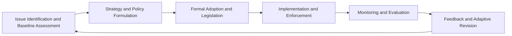
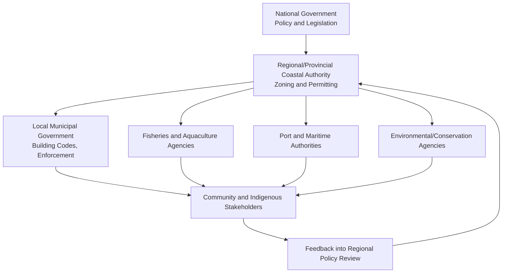

## Coastal Zone Management

### Definition and Scope

Coastal Zone Management (CZM) is the integrated, multidisciplinary process of planning, regulating, and administering the use of coastal resources and space to balance economic development, ecological conservation, and social equity in the land-sea interface. The coastal zone itself is not a fixed geophysical boundary but a functionally defined transition area encompassing terrestrial coastal land, intertidal zones, estuaries, and nearshore marine waters, typically extending some distance inland (influenced by tides, storm surge, and salt spray) and seaward to the edge of a nation's territorial waters or continental shelf.

CZM integrates principles from oceanography, geomorphology, ecology, hydrology, law, economics, and sociology. It differs from single-sector coastal regulation (e.g., fisheries law or shipping regulation alone) because it explicitly attempts cross-sectoral coordination among competing uses: fisheries, aquaculture, tourism, shipping ports, urban development, energy infrastructure, and conservation.

### Integrated Coastal Zone Management (ICZM)

**Key Points**

- ICZM is the internationally recognized operational framework for CZM, formalized through instruments such as the EU Recommendation on ICZM (2002) and UNEP's Mediterranean Action Plan Protocol on ICZM (2008).
- ICZM operates on the premise that coastal problems (erosion, pollution, habitat loss, use conflicts) cannot be solved by any single agency or sector acting alone.
- Core principles include: a broad, holistic perspective; a long-term planning horizon; adaptive management under uncertainty; local specificity respecting ecosystem and cultural context; working with natural processes rather than against them; participatory planning involving all stakeholders; and use of multiple instruments (legal, economic, informational, technical) in combination.

The ICZM cycle is typically modeled as an iterative loop rather than a linear project:

### Coastal Systems and Processes Relevant to Management

**Physical Processes**

- Littoral drift and sediment transport: the alongshore movement of sand and sediment driven by wave energy approaching the shore at an oblique angle, governing beach accretion and erosion patterns.
- Tidal and wave dynamics: tidal range classification (microtidal <2 m, mesotidal 2–4 m, macrotidal >4 m) determines intertidal habitat extent and estuarine flushing rates.
- Sea level rise (SLR): both eustatic (global, thermal expansion and ice melt driven) and isostatic/tectonic (local land subsidence or uplift) components must be disaggregated in relative sea level rise (RSLR) calculations used for planning.
- Storm surge and coastal flooding: atmospheric pressure-driven and wind-driven sea level anomalies superimposed on tides, a principal driver of coastal hazard zoning.

**Ecological Systems**

- Mangroves, salt marshes, seagrass beds, and coral reefs function as "blue carbon" ecosystems and natural coastal defenses, attenuating wave energy and stabilizing sediment.
- Estuaries serve as nursery habitats and biogeochemical processing zones (nutrient cycling, particularly nitrogen and phosphorus transformation).

The relationship between shoreline retreat and sea level rise is commonly approximated for sandy coasts using the Bruun Rule, expressed as:

$$R = \frac{L}{h} \times S$$

where $R$ is horizontal shoreline retreat, $L$ is the length of the active profile, $h$ is the depth of closure, and $S$ is the amount of relative sea level rise. [Inference: the Bruun Rule assumes an idealized equilibrium beach profile and consistent sediment budget; field application typically requires calibration and is considered a first-order approximation rather than a precise predictive tool in most coastal engineering practice.]

### Legal and Institutional Frameworks

**International Instruments**

- United Nations Convention on the Law of the Sea (UNCLOS, 1982): establishes baseline maritime zones — territorial sea (12 nautical miles), Exclusive Economic Zone (200 nautical miles), and continental shelf rights — which underpin national CZM jurisdictional authority.
- Ramsar Convention on Wetlands (1971): obligates signatories to designate and conserve wetlands of international importance, many of which are coastal.
- Convention on Biological Diversity (CBD) and its Aichi/post-2020 targets: influence marine protected area (MPA) coverage commitments (e.g., the "30x30" target for 30% ocean protection by 2030).

**National-Level Approaches (Illustrative)**

- United States: the Coastal Zone Management Act (CZMA) of 1972 establishes a voluntary federal-state partnership; states developing federally approved Coastal Management Programs receive funding and gain "federal consistency" review authority over federal actions affecting their coastal zones.
- Many nations use a tiered zoning system similar to setback-based regulation, defining no-build/no-development buffer zones measured from the high tide line (e.g., India's Coastal Regulation Zone notifications).

### Core CZM Tools and Instruments

**Regulatory Instruments**

- Setback lines and building codes restricting construction proximity to shorelines.
- Environmental Impact Assessment (EIA) requirements for coastal development projects.
- Zoning schemes designating permitted uses (conservation, controlled development, port/industrial, tourism) analogous to terrestrial land-use zoning but extended offshore.

**Economic Instruments**

- Coastal ecosystem service valuation (e.g., valuing mangrove storm protection value in avoided damages) to justify conservation investment.
- Payment for Ecosystem Services (PES) schemes and blue carbon credit markets compensating coastal wetland conservation.
- User fees and licensing for aquaculture, tourism concessions, and marine resource extraction.

**Technical/Planning Instruments**

- Geographic Information Systems (GIS)-based coastal vulnerability mapping.
- Coastal Vulnerability Index (CVI), a composite ranking method combining variables typically including:

$$CVI = \sqrt{\frac{a \times b \times c \times d \times e \times f}{n}}$$

where variables $a$ through $f$ commonly represent geomorphology, shoreline erosion/accretion rate, coastal slope, relative sea level rise rate, mean wave height, and mean tidal range, with $n$ as the number of variables used. [Unverified: exact variable sets and weighting schemes vary substantially across CVI implementations reported in the coastal science literature; there is no single universally standardized formula.]

- Setback distance calculation combining historical erosion rate projections with a storm-induced erosion buffer and a factor of safety.

### Shoreline Management Strategies

**Options Card of Response Strategies**

| Strategy | Description | Example Actions |
| --- | --- | --- |
| Protect (Hold the line) | Hard or soft engineering to fix the shoreline position | Seawalls, revetments, groynes, beach nourishment |
| Accommodate | Adjust human use/infrastructure to tolerate ongoing coastal change | Elevated construction, flood-resistant design, early warning systems |
| Retreat (Managed realignment) | Planned relocation of assets and infrastructure away from the hazard zone | Rolling easements, buyout/relocation programs, de-designation of shoreline armoring |
| Advance | Seaward extension of the coastline through land reclamation | Polders, land reclamation for port expansion |

**Hard vs. Soft Engineering**

- Hard engineering (seawalls, groynes, breakwaters, revetments) provides immediate, high-reliability protection but frequently causes downdrift erosion (terminal groyne effect), disrupts sediment transport, and can eliminate natural intertidal habitat via "coastal squeeze."
- Soft engineering (beach nourishment, dune restoration, living shorelines, mangrove/marsh restoration) works with natural sediment and ecological processes, is generally more adaptable to sea level rise, but often requires more frequent maintenance and can have less predictable short-term performance. [Inference: relative cost-effectiveness between hard and soft approaches is highly site-specific and depends on wave climate, sediment availability, and land value, so general claims of one being universally "cheaper" should be treated cautiously.]

### Diagram: Coastal Squeeze Concept

<svg xmlns="http://www.w3.org/2000/svg" viewBox="0 0 700 320">
<text x="350" y="24" font-size="16" text-anchor="middle" font-weight="bold">Coastal Squeeze from Fixed Defenses and Sea Level Rise (svg_diagram)</text>

<rect x="0" y="200" width="700" height="120" fill="#a3d5ff" />
<text x="60" y="220" font-size="12" fill="#00507a">Sea</text>

<rect x="0" y="170" width="700" height="30" fill="#c9e8b0" />
<text x="10" y="190" font-size="11">Original wide intertidal habitat</text>

<line x1="650" y1="200" x2="650" y2="170" stroke="#00507a" stroke-width="2" marker-end="url(#arrow)" />
<text x="600" y="160" font-size="10">Sea level rise</text>

<rect x="0" y="60" width="700" height="110" fill="#e8dcb8" />
<text x="10" y="80" font-size="12">Land</text>

<rect x="0" y="150" width="700" height="20" fill="#888888" />
<text x="300" y="145" font-size="12" font-weight="bold">Fixed Seawall (hard defense)</text>

<rect x="0" y="170" width="700" height="0" fill="none" />
<line x1="350" y1="170" x2="350" y2="200" stroke="red" stroke-width="3" stroke-dasharray="4,2" />
<text x="360" y="190" font-size="11" fill="red">Squeezed habitat zone</text>
<text x="10" y="300" font-size="11" font-style="italic">As sea level rises against a fixed landward barrier, intertidal habitat is compressed and can be lost entirely.</text>

</svg>

### Stakeholder Governance Structure

### Marine Protected Areas as a CZM Tool

MPAs are spatially defined zones with legally enforced restrictions on extractive or damaging activities, ranging from multiple-use zones (permitting regulated fishing/tourism) to strict no-take zones. Effective MPA design in a CZM context depends on:

- Connectivity: spacing MPAs to allow larval and juvenile dispersal between reserves and adjacent fished areas (spillover effect).
- Representativeness: covering a range of habitat types (reef, seagrass, mangrove, open water) rather than a single ecosystem.
- Enforcement capacity: MPAs lacking consistent monitoring and enforcement (so-called "paper parks") show substantially reduced ecological benefit in comparative studies. [Inference: the magnitude of this reduction varies by region and enforcement metric used across studies, so specific percentage figures should not be treated as universal constants.]

### Climate Change Adaptation in CZM

**Key Points**

- Sea level rise projections (per IPCC AR6 assessment, 2021) indicate continued RSLR through the 21st century under all emissions scenarios, with magnitude strongly dependent on emissions trajectory and ice sheet dynamics.
- Adaptive management and "dynamic adaptive policy pathways" (DAPP) approaches are increasingly favored over static, fixed-design-life infrastructure planning because they allow sequential decision-making as monitoring data updates risk projections.
- Ecosystem-based adaptation (EbA), such as restoring mangrove buffers or living shorelines, is promoted as a lower-cost, self-repairing complement to hard infrastructure, though its protective capacity against extreme storm events (versus moderate wave/storm conditions) remains an area of ongoing research. [Unverified: the degree of protection mangroves/marshes provide against high-intensity cyclones specifically, versus routine wave action, is still debated in the coastal engineering and ecology literature.]

### Example: Applying a Simplified Setback Calculation

**Example**

A coastal planning authority observes a historical shoreline erosion rate of 0.5 m/year over the past 50 years and wants to set a 30-year planning horizon setback line, adding a storm buffer of 15 m and a safety factor of 1.2.

Calculation:

$$Setback = (ErosionRate \times PlanningHorizon + StormBuffer) \times SafetyFactor$$

$$Setback = (0.5 \times 30 + 15) \times 1.2 = (15 + 15) \times 1.2 = 36 \text{ m}$$

The authority would then designate a 36-meter no-build buffer from the current high-tide line. [Inference: this is a simplified illustrative model; operational setback methodologies in practice often incorporate additional variables such as dune elevation, wave runup, and probabilistic storm return periods.]

### Common Conflicts and Trade-offs in CZM

- Tourism development versus habitat conservation: beachfront resort construction can degrade dune systems and turtle nesting habitat.
- Aquaculture expansion versus mangrove conservation: shrimp pond conversion has historically been a major driver of mangrove loss in parts of Southeast Asia and Latin America.
- Port/industrial development versus artisanal fisheries: dredging and land reclamation can disrupt traditional fishing grounds and water quality.
- Private property rights versus managed retreat: relocation or buyout programs frequently face resistance due to loss of property value and cultural/place attachment, a well-documented social barrier to retreat-based adaptation.

### Monitoring and Indicators

Typical CZM monitoring frameworks track:

- Shoreline position change (via aerial photography, satellite imagery, or LiDAR-derived Digital Shoreline Analysis System transects).
- Water quality indicators (nutrient loading, turbidity, fecal coliform counts) in estuaries and nearshore waters.
- Habitat extent change (mangrove/seagrass/coral cover via remote sensing classification).
- Socioeconomic indicators (livelihood dependence on coastal resources, tourism revenue, compliance rates with zoning regulations).

### Conclusion

**Conclusion**

Coastal Zone Management is fundamentally a governance and planning discipline built atop physical and ecological science, requiring the integration of hydrodynamic and geomorphological understanding, ecosystem function, legal jurisdiction, and stakeholder negotiation. Its effectiveness depends less on any single technical tool than on institutional capacity to coordinate across sectors, sustain long-term monitoring, and adapt strategies as coastal risk profiles shift under climate change and sea level rise.

**Related Topics**

- Estuarine ecology and biogeochemistry
- Blue carbon accounting and wetland carbon sequestration
- Marine Protected Area network design and connectivity modeling
- Coastal erosion and sediment budget analysis
- Sea level rise projection methods (IPCC scenario modeling)
- Environmental Impact Assessment methodology for coastal projects
- Managed retreat and climate relocation policy
- Coral reef resilience and restoration techniques
- Fisheries co-management and community-based resource governance
- Remote sensing applications in coastal habitat monitoring