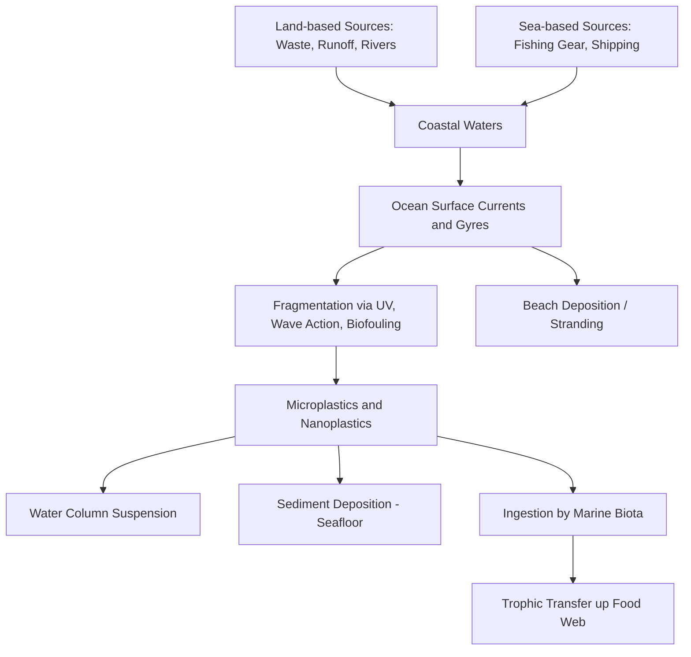

## Marine Plastic Pollution and Debris

### Definition and Scope

Marine plastic pollution refers to the accumulation of synthetic polymer materials — ranging from macroplastics (>25 mm) to microplastics (<5 mm) and nanoplastics (<1 μm) — in ocean and coastal environments, originating from land-based and sea-based sources. It is distinguished from general marine debris (which includes glass, metal, rubber, and derelict fishing gear of any material) by its specific focus on polymer-based waste and the unique environmental persistence, fragmentation behavior, and toxicological pathways associated with plastics.

The issue spans the full plastic lifecycle: production, use, disposal, transport (riverine and atmospheric), degradation, and ecological/human health impact, making it inherently a cross-disciplinary problem involving materials science, oceanography, ecotoxicology, waste management engineering, and policy.

### Sources and Pathways

**Land-Based Sources (approximately 80% of marine plastic input by most widely cited estimates)**

- Mismanaged municipal solid waste, particularly in coastal regions lacking adequate collection/landfill infrastructure.
- Riverine transport: a small number of large rivers, disproportionately in Asia, have been identified in modeling studies as contributing a large share of land-to-ocean plastic flux. [Unverified: exact percentage contributions from specific rivers vary considerably between modeling studies depending on methodology, watershed boundary assumptions, and reference year, so single point-estimate figures should be treated cautiously.]
- Stormwater runoff carrying microplastics from tire wear, synthetic textile fibers (laundry effluent), and personal care product microbeads.
- Industrial plastic pellet ("nurdle") spills during manufacturing and transport.

**Sea-Based Sources**

- Derelict fishing gear (nets, lines, traps) — commonly termed "ghost gear," a major contributor to entanglement mortality.
- Shipping-related losses: cargo container spills, operational waste discharge (regulated under MARPOL Annex V).
- Aquaculture infrastructure (floats, cages, ropes).

**Transport and Distribution Pathways**

### Classification by Size and Origin

| Category | Size Range | Common Examples | Primary Origin |
| --- | --- | --- | --- |
| Megaplastics | >1 m | Derelict nets, large containers | Sea-based, land-based bulk waste |
| Macroplastics | 25 mm – 1 m | Bottles, bags, packaging | Land-based consumer waste |
| Mesoplastics | 5–25 mm | Fragmented debris, pellets | Fragmentation, industrial spills |
| Microplastics | 1 μm – 5 mm | Fibers, fragments, microbeads | Fragmentation, textiles, cosmetics (primary), fragmentation of larger items (secondary) |
| Nanoplastics | <1 μm | Sub-micron particles | Degradation of microplastics |

Primary microplastics are manufactured at microscopic size (e.g., cosmetic microbeads, industrial abrasives, virgin pre-production pellets), while secondary microplastics form through fragmentation of larger plastic items via photodegradation, mechanical abrasion, and biological/chemical weathering.

### Degradation Processes

Unlike organic material, most conventional plastics do not biodegrade at meaningful rates in marine environments; they undergo fragmentation rather than mineralization. Key degradation pathways:

- Photodegradation: UV radiation breaks polymer chains, particularly in polyethylene and polypropylene, causing embrittlement and fragmentation. This process slows substantially once plastic sinks below the photic zone or becomes buried in sediment.
- Mechanical abrasion: wave action and sediment friction physically fracture weakened plastic into smaller pieces.
- Biofouling: microbial biofilm colonization (the "plastisphere") can alter buoyancy, causing formerly floating debris to sink, and may host pathogenic or invasive microbial species.
- Thermal and oxidative degradation: contributes to chain scission, generally at a slower rate than UV-driven photodegradation in surface waters.

[Inference: precise degradation half-lives for specific polymers in marine conditions are difficult to establish experimentally because field degradation rates depend heavily on local UV exposure, temperature, and mechanical energy, so commonly cited "decomposition timeframes" (e.g., "450 years for a plastic bottle") are order-of-magnitude estimates rather than precisely measured constants.]

### Oceanic Accumulation Zones

Surface plastic debris concentrates in subtropical gyres due to convergent surface currents driven by wind-forced Ekman transport, creating five major oceanic garbage patches (North Pacific, South Pacific, North Atlantic, South Atlantic, Indian Ocean). The North Pacific accumulation zone (colloquially the "Great Pacific Garbage Patch") is the most extensively studied.

**Key Points**

- These "patches" are not solid masses of visible trash but diffuse zones of elevated microplastic and mesoplastic concentration, interspersed with larger derelict items and fishing gear.
- Surface accumulation represents only a fraction of total ocean plastic mass; substantial quantities are estimated to reside on the seafloor, within sediments, and suspended through the water column, though total mass-balance estimates carry significant uncertainty. [Unverified: published global plastic mass-balance estimates differ by an order of magnitude across studies due to differing sampling methods (surface trawls vs. sediment cores vs. modeling) and the difficulty of quantifying nanoplastic and deep-sea fractions.]

### Diagram: Gyre-Driven Accumulation Mechanism

<svg xmlns="http://www.w3.org/2000/svg" viewBox="0 0 700 380">
<text x="350" y="24" font-size="16" text-anchor="middle" font-weight="bold">Subtropical Gyre Accumulation Mechanism (svg_diagram)</text>
<circle cx="350" cy="200" r="140" fill="#cdeaff" stroke="#00507a" stroke-width="2" />

<path d="M 350 60 A 140 140 0 0 1 490 200" fill="none" stroke="#005b96" stroke-width="3" marker-end="url(#arrow2)" />
<path d="M 490 200 A 140 140 0 0 1 350 340" fill="none" stroke="#005b96" stroke-width="3" marker-end="url(#arrow2)" />
<path d="M 350 340 A 140 140 0 0 1 210 200" fill="none" stroke="#005b96" stroke-width="3" marker-end="url(#arrow2)" />
<path d="M 210 200 A 140 140 0 0 1 350 60" fill="none" stroke="#005b96" stroke-width="3" marker-end="url(#arrow2)" />

<circle cx="330" cy="190" r="3" fill="#444" />
<circle cx="345" cy="205" r="2.5" fill="#444" />
<circle cx="360" cy="195" r="3" fill="#444" />
<circle cx="355" cy="215" r="2" fill="#444" />
<circle cx="335" cy="215" r="2.5" fill="#444" />
<circle cx="365" cy="210" r="2" fill="#444" />
<circle cx="340" cy="180" r="2" fill="#444" />

<text x="300" y="200" font-size="11" fill="#222">Convergent</text>

<text x="295" y="215" font-size="11" fill="#222">debris zone</text>

<text x="140" y="50" font-size="11">Wind-driven surface currents converge inward via Ekman transport</text>

</svg>

### Ecological Impacts

**Physical Impacts**

- Entanglement: derelict fishing gear and packaging straps cause restriction of movement, feeding impairment, and drowning in marine mammals, sea turtles, and seabirds.
- Ingestion: filter feeders, fish, seabirds, and cetaceans ingest plastic fragments mistaken for prey or incidentally filtered, causing gut impaction, false satiation leading to malnutrition, and internal physical damage.
- Rafting/vector effect: floating debris facilitates the transport of species (including potentially invasive species) across biogeographic barriers they could not otherwise cross.

**Chemical and Toxicological Impacts**

- Plastics can adsorb and concentrate hydrophobic organic pollutants from surrounding seawater (e.g., polychlorinated biphenyls, DDT, polycyclic aromatic hydrocarbons), potentially acting as a vector delivering elevated pollutant doses upon ingestion.
- Leaching of plastic additives (plasticizers such as phthalates, flame retardants, and bisphenol A) into tissue upon ingestion, some of which are documented endocrine disruptors in laboratory studies.
- Microplastic and nanoplastic translocation across biological membranes (e.g., into circulatory systems and tissues) has been documented in laboratory exposure studies in various marine organisms, though the ecological significance and dose-response relationships under field-realistic exposure conditions remain an active area of research. [Inference: findings on toxicological thresholds vary substantially depending on particle size, polymer type, and exposure duration used across studies, so generalized claims of harm severity should be qualified by exposure context.]

### Trophic Transfer and Human Exposure

Microplastics have been documented in a wide range of seafood species, including those consumed by humans (fish, bivalves, crustaceans). Trophic transfer — the movement of ingested microplastics from prey to predator across food web levels — has been demonstrated in controlled studies, though the extent of biomagnification (increasing concentration at higher trophic levels, as occurs with some persistent organic pollutants) versus simple presence without magnification is still debated in the scientific literature. [Unverified: whether microplastics biomagnify analogously to classic persistent bioaccumulative toxins, or whether they are instead egested without significant trophic-level concentration increase, remains contested pending further longitudinal field research.]

### Regulatory and Policy Frameworks

**International Instruments**

- MARPOL Annex V (International Convention for the Prevention of Pollution from Ships): prohibits the discharge of all plastics from ships into the sea.
- Basel Convention Plastic Waste Amendments (2019, effective 2021): brought most plastic waste exports/imports under prior informed consent procedures, restricting transboundary movement of contaminated or non-recyclable plastic waste.
- UN Environment Assembly Resolution 5/14 (2022): mandated negotiation of a legally binding international instrument on plastic pollution (the "Global Plastics Treaty"), covering the full lifecycle of plastics; negotiations have continued through subsequent Intergovernmental Negotiating Committee (INC) sessions. [Note: treaty text finalization status should be verified against current news sources, as negotiations were ongoing as of the most recent INC sessions and outcomes may have changed.]

**National and Subnational Instruments**

- Single-use plastic bans/restrictions (bags, straws, cutlery) enacted in numerous jurisdictions globally.
- Extended Producer Responsibility (EPR) schemes requiring plastic producers to finance collection and recycling infrastructure.
- Microbead bans in cosmetic products (e.g., the U.S. Microbead-Free Waters Act of 2015).

### Monitoring and Sampling Methodologies

**Field Sampling Techniques**

- Neuston/manta trawls: surface-towed fine-mesh nets (commonly 333 μm mesh) used to quantify floating microplastic concentration, typically reported as particles per km².
- Sediment core sampling: quantifies benthic microplastic deposition and historical accumulation trends via depth-stratified analysis.
- Beach transect surveys: standardized quadrat-based counts of stranded macrodebris, following protocols such as NOAA's Marine Debris Monitoring and Assessment Project.
- Biota sampling: digestive tract analysis in fish and seabirds as bioindicators of microplastic ingestion prevalence.

**Laboratory Identification Techniques**

- Visual/microscopic sorting followed by polymer confirmation via Fourier-transform infrared spectroscopy (FTIR) or Raman spectroscopy to distinguish plastic particles from natural organic matter and to identify polymer type.
- Density separation (e.g., using saline or zinc chloride solutions) to isolate plastic particles from denser sediment matrices prior to identification.
- Pyrolysis-gas chromatography-mass spectrometry (Py-GC-MS) for mass-based quantification, particularly useful for nanoplastic-range particles below optical detection limits.

### Mitigation and Management Strategies

**Options: Intervention Points Along the Plastic Lifecycle**

| Strategy | Description | Example |
| --- | --- | --- |
| Source reduction | Reducing plastic production/consumption at the design stage | Bans on unnecessary single-use items, reusable packaging mandates |
| Improved waste management | Strengthening collection and treatment infrastructure, especially in high-leakage regions | Municipal solid waste system investment, informal sector integration |
| Extended Producer Responsibility | Shifting end-of-life cost and responsibility to producers | EPR fees funding recycling infrastructure |
| Downstream capture | Intercepting debris before ocean entry or removing it from aquatic environments | River interceptor systems (e.g., boom and conveyor systems), beach cleanups |
| Material innovation | Substituting conventional polymers with alternatives | Biodegradable/compostable polymers (with caveats on marine biodegradability), reduced-material packaging design |
| Fishing gear management | Reducing ghost gear generation and enabling retrieval | Gear marking/tagging programs, net buy-back and recycling schemes |

[Inference: "biodegradable" plastic alternatives marketed for terrestrial composting conditions do not necessarily degrade at comparable rates under marine conditions, which typically feature lower temperatures and different microbial communities than industrial composting facilities; claims of marine biodegradability for specific products should be evaluated against standardized marine biodegradation testing protocols such as ASTM D6691 rather than assumed.]

### Example: Estimating Relative Contribution via Simple Mass Balance

**Example**

A coastal municipality wants to estimate the annual plastic leakage into the ocean from inadequately managed waste. Given: annual municipal solid waste generation of 50,000 tonnes, a plastic fraction of 12%, and an estimated 20% of that plastic fraction being mismanaged (uncollected or improperly disposed), with a further assumption that 15% of mismanaged plastic ultimately reaches marine waters via runoff and wind transport:

$$Leakage = W \times P \times M \times T$$

where $W$ = total waste generated, $P$ = plastic fraction, $M$ = mismanaged fraction, $T$ = transport-to-ocean fraction.

$$Leakage = 50000 \times 0.12 \times 0.20 \times 0.15 = 180 \text{ tonnes/year}$$

[Inference: this is a simplified illustrative mass-balance model; real-world leakage estimation requires location-specific data on waste composition, collection rates, and hydrological transport pathways, and published national/global leakage models use considerably more complex multi-variable approaches.]

### Emerging Research Areas

- Nanoplastic detection methodology: analytical chemistry techniques for reliably quantifying sub-micron plastic particles remain under active development, as conventional FTIR/Raman methods have detection limits above the nanoplastic size range.
- Plastic-associated microbial communities ("plastisphere") and their role in pathogen transport and potential antimicrobial resistance gene dissemination.
- Atmospheric microplastic transport and deposition into remote marine and polar regions, an increasingly recognized pathway distinct from riverine/surface transport.
- Standardization of global monitoring protocols to enable cross-study comparability, an area actively addressed by UNEP and Group of Experts on Scientific Aspects of Marine Environmental Protection (GESAMP) working groups.

### Conclusion

**Conclusion**

Marine plastic pollution represents a persistent, cross-boundary contamination problem driven primarily by land-based waste mismanagement and compounded by the physical and chemical properties that make plastics durable, fragmentable, and capable of concentrating co-occurring pollutants. Effective management requires coordinated action across the full plastic lifecycle — from upstream production and design choices through waste infrastructure investment to downstream capture and remediation — supported by standardized monitoring to track progress and inform adaptive policy under emerging international frameworks.

**Related Topics**

- Microplastic ecotoxicology and endocrine disruption mechanisms
- Global Plastics Treaty negotiations and international policy design
- Extended Producer Responsibility scheme design and implementation
- River plastic interception technology and engineering
- Ghost fishing gear retrieval and recycling programs
- Plastisphere microbial ecology
- Biodegradable and bio-based polymer alternatives
- Ocean current modeling and Lagrangian particle tracking
- Beach cleanup citizen science and data standardization
- Circular economy approaches to plastic packaging design