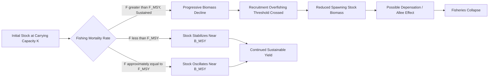

## Overfishing and Fisheries Collapse

### Definition and Scope

Overfishing occurs when fish or other aquatic organisms are harvested from a population at a rate exceeding its capacity for natural replenishment through reproduction and growth, leading to declining stock biomass over time. Fisheries collapse refers to the endpoint of this process: a stock decline severe enough (commonly operationally defined in fisheries science as a decline to below 10% of historical maximum biomass or below a level capable of sustaining commercial harvest) that the fishery becomes economically and/or ecologically non-viable, sometimes for extended periods or permanently.

This topic integrates population biology, fisheries stock assessment science, oceanography, economics (particularly common-pool resource theory), and international governance, as fish stocks are frequently shared or migratory resources spanning multiple jurisdictions.

### Population Dynamics and Sustainable Yield Concepts

**Maximum Sustainable Yield (MSY)**

MSY is the theoretical largest catch that can be harvested indefinitely from a stock without depleting it, historically the central management reference point in fisheries science. It derives from logistic population growth models, most classically the Schaefer surplus production model:

$$\frac{dN}{dt} = rN\left(1 - \frac{N}{K}\right) - H$$

where $N$ is population biomass, $r$ is the intrinsic growth rate, $K$ is carrying capacity, and $H$ is harvest rate. Under this model, MSY occurs at the population size where surplus production is maximized, typically at approximately half of carrying capacity ($N = K/2$) for a simple logistic model:

$$MSY = \frac{rK}{4}$$

[Inference: this formulation assumes a symmetric logistic growth curve; real fish populations often exhibit asymmetric density-dependence, age-structured dynamics, and environmentally driven recruitment variability not captured by the simple Schaefer model, which is why modern stock assessments increasingly use age-structured and statistical catch-at-age models rather than relying solely on surplus production models.]

**Key Reference Points**

- $B_{MSY}$: biomass level that produces MSY.
- $F_{MSY}$: fishing mortality rate that produces MSY.
- $B_{lim}$/$B_{crash}$: biomass threshold below which recruitment becomes severely impaired, often associated with recruitment overfishing.
- Overfished status: stock biomass below a management-defined threshold (commonly a fraction of $B_{MSY}$, such as 0.5 $B_{MSY}$ in many regional frameworks).
- Overfishing status: current fishing mortality rate exceeds $F_{MSY}$, regardless of current biomass level (a stock can be experiencing "overfishing" while not yet classified as "overfished").

### Types of Overfishing

| Type | Mechanism | Primary Consequence |
| --- | --- | --- |
| Growth overfishing | Harvesting individuals before they reach optimal size/growth-weighted value | Reduced yield per recruit, smaller average catch size |
| Recruitment overfishing | Spawning stock biomass reduced below the level needed to produce sufficient offspring | Population decline, risk of stock collapse |
| Ecosystem overfishing | Removal of key species alters trophic structure and ecosystem function | Trophic cascades, altered community composition |
| Malthusian overfishing | Socioeconomic pressure (poverty, population growth) drives continued harvest despite declining catches, often with destructive gear as effort intensifies | Entrenched overexploitation, gear escalation |

### Drivers of Overfishing

**Key Points**

- Open-access resource dynamics: without effective property rights or use restrictions, fisheries exhibit classic "tragedy of the commons" behavior, where individual harvesters lack incentive to conserve a shared, mobile resource.
- Overcapacity: global fishing fleet capacity has been assessed in multiple studies as exceeding what many stocks can sustainably support, partly sustained historically by government fuel and vessel subsidies that lower the effective cost of fishing effort. [Unverified: precise global overcapacity ratios vary across studies depending on methodology and reference year, so specific multiplier figures should be treated as illustrative rather than precise.]
- Illegal, Unreported, and Unregulated (IUU) fishing: undermines quota systems and stock assessments by removing catch data transparency; estimates of global IUU catch volume vary substantially between studies due to the inherent difficulty of quantifying unreported activity. [Unverified: global IUU catch tonnage and value estimates differ considerably across published sources and years.]
- Bycatch and discarding: non-target species mortality (e.g., juvenile fish, non-commercial species, marine mammals, sea turtles) that does not appear in target-stock landings data but contributes to ecosystem-level depletion.
- Destructive fishing practices: bottom trawling, dynamite fishing, and cyanide fishing cause habitat destruction compounding direct population removal.
- Climate-driven range shifts and productivity changes: altering stock distribution and productivity in ways that can outpace management reference point updates, complicating quota-setting under shifting baseline conditions.

### Fisheries Collapse Case Patterns

**Historical Example**

The Northwest Atlantic cod (*Gadus morhua*) fishery, particularly on the Grand Banks off Newfoundland, is among the most frequently cited fisheries collapse case studies. Following decades of intensive harvest — including a substantial expansion in offshore trawling capacity in the mid-20th century — stock biomass declined sharply, precipitating a Canadian government moratorium on cod fishing in 1992. Despite the moratorium substantially reducing fishing mortality, the stock exhibited a prolonged failure to rebound to pre-collapse abundance over subsequent decades in many assessed sub-stocks. [Inference: the exact mechanisms preventing recovery are debated among fisheries scientists, with hypothesized contributing factors including altered predator-prey dynamics (e.g., increased invertebrate or seal predation on juvenile cod), genetic/evolutionary changes toward smaller size at maturity under historical fishing pressure, and shifting ocean temperature regimes; no single factor is universally agreed to fully explain the recovery lag, and recovery trajectories have varied across different cod sub-stocks.]

This case illustrates a broader phenomenon termed "depensation" or an Allee effect in fisheries biology, where per-capita population growth rate declines (rather than remaining stable or increasing) at low population density, potentially due to reduced mate-finding success, altered predator-prey ratios, or disrupted schooling behavior — a dynamic not captured by standard logistic growth models that assume growth rate is always positive below carrying capacity.

### Diagram: Population Trajectory Under Overfishing vs. Sustainable Management

### Ecosystem-Level Consequences

- Trophic cascades: removal of apex or mid-trophic predators can trigger cascading effects through the food web; a frequently cited example is the depletion of large predatory fish and sharks potentially contributing to changes in mesopredator or prey abundance, though the strength and universality of such cascades varies by ecosystem and is subject to ongoing scientific study. [Inference: trophic cascade strength is highly context-dependent on ecosystem structure, so generalized claims of cascade magnitude across all systems should be avoided.]
- Habitat degradation from destructive gear: bottom trawling can physically damage benthic habitats such as cold-water coral and sponge grounds, which often have slow recovery timescales.
- Genetic and phenotypic shifts: fishing pressure selecting disproportionately for larger individuals (common in many gear types) can drive evolutionary shifts toward smaller size and earlier maturation age in exploited populations over successive generations.
- Reduced genetic diversity: population bottlenecks associated with severe stock depletion can reduce genetic diversity, potentially affecting future adaptive capacity, though the demographic and genetic recovery timelines differ across species and case studies.

### Stock Assessment Methodologies

**Data Collection**

- Fishery-dependent data: commercial catch and effort logs, landings records, observer program bycatch data.
- Fishery-independent data: research vessel trawl surveys, acoustic (hydroacoustic) biomass surveys, tagging and recapture studies, egg/larval surveys for spawning stock estimation.

**Modeling Approaches**

- Surplus production models (e.g., Schaefer, Fox models): simplified biomass-dynamics models requiring minimal data, useful for data-limited stocks but less precise than age-structured alternatives.
- Age-structured/statistical catch-at-age models: incorporate cohort-specific growth, mortality, and recruitment, providing more nuanced stock status estimates but requiring detailed age/length composition data.
- Virtual Population Analysis (VPA) and its extensions: reconstruct historical population size from catch-at-age data.
- Management Strategy Evaluation (MSE): simulation-based framework testing how candidate management procedures perform under a range of uncertainty scenarios before real-world implementation.

### Management and Policy Instruments

**Options: Fisheries Management Tool Categories**

| Instrument | Mechanism | Example |
| --- | --- | --- |
| Total Allowable Catch (TAC) / quotas | Caps aggregate harvest per season/stock | Annual TAC set by regional fisheries management organizations |
| Individual Transferable Quotas (ITQs) | Allocates tradeable shares of TAC to individual harvesters, creating property-rights-like incentives | New Zealand and Iceland quota management systems |
| Effort controls | Limits fishing capacity/activity directly | Vessel licensing caps, limited fishing seasons, gear restrictions |
| Marine Protected Areas / no-take zones | Spatially excludes fishing to allow stock recovery and spillover | No-take reserves within larger MPA networks |
| Size and gear regulations | Reduces growth overfishing and bycatch | Minimum mesh size, turtle excluder devices, circle hooks |
| Ecosystem-Based Fisheries Management (EBFM) | Manages multiple interacting stocks and habitat considerations jointly rather than single-species targets | Multispecies quota frameworks accounting for predator-prey interactions |

**International Governance**

- Regional Fisheries Management Organizations (RFMOs) coordinate management of shared and migratory/highly migratory stocks (e.g., International Commission for the Conservation of Atlantic Tunas, various tuna commissions) across national jurisdictions.
- UN Fish Stocks Agreement (1995): implements UNCLOS provisions specifically regarding straddling and highly migratory fish stocks, promoting precautionary and ecosystem approaches.
- FAO Code of Conduct for Responsible Fisheries (1995): a voluntary international framework establishing principles for sustainable fisheries management, widely referenced though non-binding.
- Port State Measures Agreement (2009, entered into force 2016): targets IUU fishing by restricting port access and services to vessels engaged in illegal fishing.

### Example: Simplified MSY Calculation

**Example**

A fisheries scientist estimates a stock's intrinsic growth rate $r = 0.4$ per year and carrying capacity $K = 100,000$ tonnes using historical survey data fit to a Schaefer surplus production model.

$$MSY = \frac{rK}{4} = \frac{0.4 \times 100000}{4} = 10,000 \text{ tonnes/year}$$

Under this simplified model, the biomass level producing this yield would be:

$$B_{MSY} = \frac{K}{2} = 50,000 \text{ tonnes}$$

If current fishing mortality is set to harvest 15,000 tonnes/year while the stock biomass sits at 40,000 tonnes (below $B_{MSY}$), this would indicate the stock is simultaneously overfished (biomass below threshold) and experiencing overfishing (harvest exceeding sustainable level at current biomass), warranting a reduction in TAC under most standard management frameworks. [Inference: this is an illustrative simplified calculation; operational MSY estimates in real assessments incorporate substantially more complex age-structured data and uncertainty bounds rather than a single point estimate from a two-parameter model.]

### Recovery Dynamics and Rebuilding

Fisheries recovery timelines following management intervention (quota reduction, moratorium, or MPA establishment) vary widely by species life history:

- Fast-growing, early-maturing species (e.g., many small pelagic fish such as sardines and anchovies) can rebuild relatively quickly under reduced fishing pressure, though they also remain prone to natural boom-bust cycles driven by oceanographic/climate variability independent of fishing pressure.
- Slow-growing, late-maturing species (e.g., many sharks, rays, and deep-water species such as orange roughy) require substantially longer recovery periods due to low reproductive rates, and are correspondingly more vulnerable to overfishing in the first place.
- Rebuilding plans in frameworks such as the U.S. Magnuson-Stevens Fishery Conservation and Management Act require time-bound biomass recovery targets, typically referencing the time it would take to rebuild a stock to $B_{MSY}$ under zero or minimal fishing mortality as a benchmark, then setting a legally mandated (often somewhat longer) rebuilding timeline.

### Socioeconomic Dimensions

- Fisheries collapse carries substantial livelihood impacts in coastal communities dependent on commercial and artisanal fishing, including employment loss in harvesting, processing, and related supply chains.
- Food security implications are particularly significant in regions where fish protein constitutes a primary dietary protein source, notably in parts of coastal West Africa, Southeast Asia, and Pacific Island nations.
- Transition and adaptation responses include diversification into aquaculture, tourism, or alternative livelihoods, though such transitions often face capital, skill, and cultural barriers that vary significantly by community context.

### Conclusion

**Conclusion**

Overfishing and fisheries collapse arise from the interaction of biological population dynamics with economic incentive structures under open or poorly governed access to a shared, mobile resource. Sustainable management requires accurate stock assessment accounting for uncertainty, enforceable harvest controls calibrated to biological reference points, and governance mechanisms capable of coordinating across the multiple jurisdictions many fish stocks span — with recovery from collapse often proving slower and less certain than the decline that produced it, particularly for slow-growing species and stocks affected by depensation dynamics.

**Related Topics**

- Stock assessment modeling and Management Strategy Evaluation
- Individual Transferable Quota system design and equity considerations
- Bycatch reduction technology and turtle excluder devices
- Regional Fisheries Management Organization governance structures
- Illegal, Unreported, and Unregulated (IUU) fishing detection via satellite monitoring
- Aquaculture as a fisheries substitution strategy
- Marine Protected Area spillover effects on adjacent fisheries
- Climate-driven fish stock distribution shifts
- Trophic cascade theory in marine ecosystems
- Small-scale and artisanal fisheries co-management models