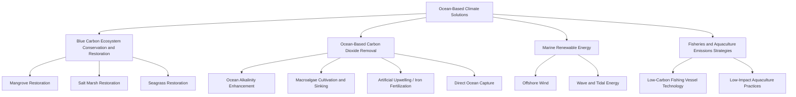

## Blue Carbon and Ocean Based Climate Solutions

### Definition and Scope

Blue carbon refers to carbon captured and stored by coastal and marine ecosystems, most prominently mangroves, salt marshes, and seagrass meadows, which sequester atmospheric and oceanic carbon dioxide into biomass and, critically, into long-term sediment stores below and around their root systems. Ocean-based climate solutions is the broader category encompassing blue carbon ecosystem conservation alongside other marine-mediated climate mitigation and adaptation approaches, including marine renewable energy, ocean-based carbon dioxide removal (CDR) technologies, and fisheries/aquaculture-related emissions strategies.

This topic sits at the intersection of biogeochemistry, coastal ecology, climate science, carbon market economics, and international climate policy.

### Blue Carbon Ecosystems

**The Three Primary Blue Carbon Habitats**

| Ecosystem | Global Extent (approximate, order of magnitude) | Key Carbon Storage Feature |
| --- | --- | --- |
| Mangroves | Tens of millions of hectares globally | High biomass carbon plus deep, anoxic sediment carbon accumulation |
| Salt marshes | Millions of hectares globally | Rapid vertical sediment accretion trapping organic carbon |
| Seagrass meadows | Tens of millions of hectares estimated (large uncertainty due to incomplete mapping) | Extensive belowground root/rhizome carbon storage in anoxic sediment |

[Unverified: precise global extent figures for all three ecosystems carry substantial uncertainty and vary across studies due to differing remote sensing methodologies, historical data gaps, and definitional boundaries between habitat types; cited hectare figures should be treated as order-of-magnitude estimates rather than precise inventories.]

**Why Blue Carbon Ecosystems Store Disproportionately High Carbon**

- Anoxic (oxygen-poor) waterlogged sediments dramatically slow microbial decomposition rates compared to aerobic terrestrial soils, allowing organic carbon to accumulate over centuries to millennia rather than being respired back to CO₂ relatively quickly.
- Continuous sediment accretion (through tidal deposition and organic matter input) allows vertical carbon burial to continue over long timescales, in contrast to many terrestrial forest soils where carbon storage can approach saturation.
- Per-unit-area carbon storage in these coastal ecosystems is frequently cited in the scientific literature as exceeding that of many terrestrial forest types on a soil-carbon basis, though comparative rankings vary depending on which carbon pools (biomass vs. soil) and depth intervals are included in a given study. [Inference: the commonly repeated claim that mangroves store "several times more carbon per hectare than tropical rainforest" is broadly supported when comparing total ecosystem carbon (particularly soil carbon) but depends heavily on methodology and specific site comparisons, so precise multiplier figures cited in popular sources should be treated as approximate.]

### Diagram: Blue Carbon Sequestration Pathway

<svg xmlns="http://www.w3.org/2000/svg" viewBox="0 0 700 380">
<text x="350" y="24" font-size="16" text-anchor="middle" font-weight="bold">Mangrove/Marsh Blue Carbon Sequestration Pathway (svg_diagram)</text>

<rect x="0" y="40" width="700" height="60" fill="#dff0ff" />
<text x="10" y="75" font-size="12">Atmospheric CO2</text>
<line x1="150" y1="95" x2="150" y2="130" stroke="#2b7a2b" stroke-width="3" marker-end="url(#arrow3)" />
<text x="160" y="115" font-size="10">Photosynthesis</text>

<rect x="0" y="100" width="700" height="60" fill="#c9e8b0" />
<text x="10" y="135" font-size="12">Mangrove / Marsh Vegetation (Biomass Carbon Pool)</text>
<line x1="150" y1="155" x2="150" y2="190" stroke="#5c4322" stroke-width="3" marker-end="url(#arrow3)" />
<text x="160" y="175" font-size="10">Litterfall, root deposition</text>

<rect x="0" y="160" width="700" height="140" fill="#8a7654" />
<text x="10" y="185" font-size="12" fill="white">Anoxic Waterlogged Sediment</text>
<text x="10" y="205" font-size="11" fill="white">Slow decomposition rate</text>
<text x="10" y="222" font-size="11" fill="white">Long-term organic carbon burial</text>
<line x1="500" y1="200" x2="500" y2="260" stroke="#333" stroke-width="2" stroke-dasharray="3,2" />
<text x="510" y="230" font-size="10">Centuries to millennia storage</text>

<rect x="0" y="300" width="700" height="60" fill="#f8d7d7" />
<text x="10" y="330" font-size="12" fill="#7a0000">Disturbance (clearing, drainage) exposes sediment to oxygen</text>
<text x="10" y="348" font-size="12" fill="#7a0000">Rapid re-release of stored carbon as CO2</text>
</svg>

### Threats to Blue Carbon Ecosystems and Emission Consequences

- Direct habitat conversion: mangrove clearing for aquaculture (particularly shrimp ponds), agriculture, and coastal development has been a major historical driver of mangrove loss in various regions, notably parts of Southeast Asia.
- Coastal development and dredging degrading salt marsh and seagrass extent.
- Sea level rise causing "coastal squeeze" where landward migration of these ecosystems is blocked by hard infrastructure or steep terrain, potentially resulting in net habitat loss despite the ecosystems' natural capacity for vertical accretion.
- A critical characteristic distinguishing blue carbon from many terrestrial carbon pools: when these ecosystems are disturbed or destroyed, the long-buried sediment carbon becomes exposed to oxygen and can be rapidly oxidized and released as CO₂, meaning degraded blue carbon ecosystems can shift from being net carbon sinks to net emission sources. [Inference: the rate and completeness of this re-release depends on the disturbance type, hydrology, and subsequent land use, so it should not be assumed that all stored carbon is instantaneously released upon disturbance; some sediment carbon may remain stored for a period even after vegetation removal, depending on site-specific conditions.]

### Carbon Accounting Methodologies

**Measurement Approaches**

- Biomass carbon estimation: allometric equations relating tree/plant dimensions (diameter, height) to carbon content, calibrated via destructive or non-destructive sampling.
- Soil/sediment carbon estimation: core sampling to measurable depth (commonly 1 meter as a standardized reference depth in many blue carbon inventories, though deeper cores are used in some studies) combined with bulk density and organic carbon content analysis.
- Remote sensing: satellite and aerial imagery classification for mapping ecosystem extent and change detection over time, increasingly combined with LiDAR for canopy structure and biomass estimation.
- Radiometric dating (e.g., using cesium-137 or lead-210 isotopes) to establish sediment accretion rates and estimate long-term carbon accumulation rates rather than only standing stock.

**Verification Standards for Carbon Markets**

- Verified Carbon Standard (VCS) methodologies for wetland restoration and conservation (e.g., VM0033 for tidal wetland and seagrass restoration).
- Climate, Community and Biodiversity (CCB) Standards providing co-benefit verification alongside carbon accounting.
- These standards generally require establishing an emissions baseline (counterfactual scenario without intervention), demonstrating additionality (that the carbon benefit would not occur without the project), and accounting for permanence risk (the possibility of future disturbance reversing stored carbon).

### Blue Carbon in Climate Policy Frameworks

**Key Points**

- The Paris Agreement's Nationally Determined Contributions (NDCs) framework allows countries to include blue carbon ecosystem conservation and restoration as part of their national greenhouse gas mitigation commitments and inventories.
- The Intergovernmental Panel on Climate Change (IPCC) published a 2013 Wetlands Supplement to its national greenhouse gas inventory guidelines, providing methodological guidance for countries to include coastal wetland carbon stocks and flux in national reporting.
- A growing number of countries have incorporated mangrove and/or other coastal wetland carbon accounting into their national climate inventories and NDCs, though the depth and rigor of inclusion varies substantially by country data capacity. [Unverified: the specific count and identity of countries with fully quantified blue carbon inclusion in NDCs changes as successive NDC update cycles occur, so current status should be verified against the latest UNFCCC NDC registry.]

### Blue Carbon Project Economics and Carbon Credits

Blue carbon restoration and conservation projects can generate tradeable carbon credits in voluntary and, in some jurisdictions, compliance carbon markets. Key economic considerations:

- Cost per tonne of CO₂ sequestered/avoided varies substantially by project type, region, and restoration method (e.g., hydrological restoration is often less costly than active planting-based mangrove restoration), making direct cross-project cost comparisons difficult without controlling for these factors.
- Co-benefits beyond carbon — coastal protection value (storm surge and wave attenuation), fisheries habitat provision (many commercially important species depend on mangrove/seagrass nursery habitat), and biodiversity conservation — are increasingly incorporated into blue carbon project valuation and are a distinguishing feature relative to some terrestrial carbon offset project types.
- Permanence and additionality risk assessment is particularly important for blue carbon credits given vulnerability to sea level rise, storm damage, and land-use pressure reversing restoration gains, requiring buffer pools or insurance-like mechanisms in credible carbon standards.

### Example: Simplified Blue Carbon Sequestration Estimate

**Example**

A restoration project rehabilitates 500 hectares of degraded mangrove habitat. Based on regional reference literature, restored mangrove sediment is estimated to accumulate additional organic carbon at a rate of 5 tonnes of carbon per hectare per year (a representative illustrative figure for sediment accretion-driven sequestration; actual rates vary regionally).

$$AnnualCarbonSequestration = Area \times Rate$$

$$= 500 \text{ ha} \times 5 \text{ tC/ha/yr} = 2,500 \text{ tonnes carbon/year}$$

Converting to CO₂-equivalent using the molecular weight ratio (CO₂ molecular weight 44 divided by carbon atomic weight 12):

$$CO_2\text{-eq} = 2500 \times \frac{44}{12} \approx 9,167 \text{ tonnes CO}_2\text{/year}$$

[Inference: this is a simplified illustrative calculation using an assumed representative sequestration rate; actual project-level carbon accounting requires site-specific measured sequestration rates, baseline correction, and uncertainty bounds per the relevant verification methodology, and rates can vary considerably by mangrove species composition, hydrology, and climate zone.]

### Beyond Blue Carbon: Other Ocean-Based Climate Solutions

**Ocean-Based Carbon Dioxide Removal (CDR) Approaches**

- Ocean alkalinity enhancement: adding alkaline substances to seawater to increase its capacity to absorb and chemically store atmospheric CO₂ as bicarbonate, currently at pilot/research stage with ongoing assessment of ecological effects and monitoring, reporting, and verification (MRV) methodology development.
- Macroalgae (seaweed) cultivation and sinking: growing fast-biomass seaweed with the intent of carbon sequestration via deep-sea sinking or products; scientific and regulatory consensus on verifiable sequestration permanence and ecological impact remains under active development. [Unverified: durable, verified sequestration claims for macroalgae-based CDR are an active area of scientific and methodological debate, with significant uncertainty regarding measurement, reporting, and verification standards as of recent literature.]
- Artificial upwelling and iron fertilization: approaches intended to stimulate phytoplankton-driven carbon export to the deep ocean; iron fertilization field trials have shown mixed and debated efficacy and carry recognized ecological risk concerns, and are subject to restrictions under the London Protocol governing ocean fertilization activities.
- Direct ocean capture: technologies extracting CO₂ directly from seawater (analogous in concept to direct air capture), an emerging engineering approach with several pilot-scale projects in development.

**Marine Renewable Energy**

- Offshore wind: among the most mature ocean-based renewable energy technologies at commercial scale, both fixed-bottom and floating platform designs.
- Wave and tidal energy: less commercially mature than offshore wind, with ongoing technology development addressing durability and cost challenges in the harsh marine environment.

**Ocean-Climate Interaction Considerations**

- The ocean is the planet's largest active carbon sink, having absorbed a substantial share of anthropogenic CO₂ emissions since the industrial era; ocean warming and acidification are direct consequences of this absorption with their own ecological feedback effects on marine carbon cycling (e.g., potential impacts on calcifying organisms and productivity).
- Ocean-based climate solutions are generally understood in the scientific and policy literature as a necessary complement to, rather than substitute for, direct greenhouse gas emissions reduction across all sectors.

### Diagram: Ocean-Based Climate Solutions Taxonomy

### Monitoring, Reporting, and Verification (MRV) Challenges

- Blue carbon MRV faces distinctive challenges compared to terrestrial forest carbon accounting, including the difficulty and cost of subsurface sediment sampling, tidal/hydrological variability affecting measurement consistency, and remote sensing limitations in turbid or submerged (seagrass) environments.
- Emerging ocean-based CDR approaches face even greater MRV uncertainty, as verifying deep-ocean carbon fate (e.g., confirming sunk biomass carbon remains sequestered rather than being remineralized and returned to the atmosphere/ocean surface over time) requires oceanographic tracking methods that are still being standardized. [Inference: the field of ocean-based CDR MRV standardization is evolving rapidly, so specific verification protocols referenced in current literature may be superseded by updated scientific consensus or regulatory guidance.]

### Conclusion

**Conclusion**

Blue carbon ecosystems offer a well-established, ecologically multi-beneficial climate mitigation pathway grounded in decades of coastal biogeochemistry research, distinguished by disproportionately high per-area carbon storage and the risk of rapid carbon re-release upon disturbance. Broader ocean-based climate solutions, particularly emerging CDR approaches, hold significant theoretical potential but generally remain less mature in verification methodology and ecological risk assessment than blue carbon conservation, positioning the field as an active area of both scientific research and international policy development rather than a fully standardized mitigation toolkit.

**Related Topics**

- Mangrove restoration hydrology and site selection criteria
- Seagrass mapping via remote sensing and acoustic survey
- Voluntary carbon market methodology standards (VCS, Gold Standard)
- Ocean acidification chemistry and calcifying organism impacts
- Coastal ecosystem services valuation methods
- IPCC Wetlands Supplement national inventory guidance
- Ocean alkalinity enhancement field trial design and MRV
- Offshore wind farm siting and marine spatial planning
- Nationally Determined Contributions and blue carbon inclusion
- Sediment core dating techniques (cesium-137, lead-210)